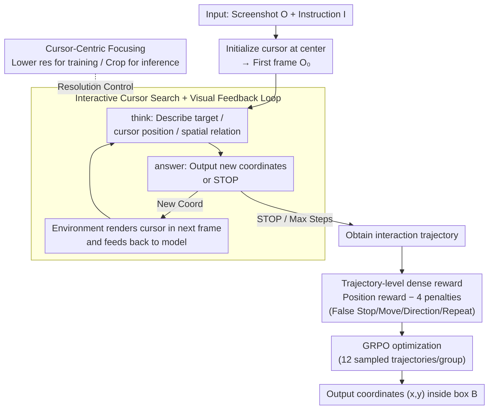

# Learning GUI Grounding with Spatial Reasoning from Visual Feedback

**Conference**: ICML 2026  
**arXiv**: [2509.21552](https://arxiv.org/abs/2509.21552)  
**Code**: None  
**Area**: LLM Agent / GUI Grounding / Multimodal VLM / Reinforcement Learning  
**Keywords**: GUI grounding, virtual cursor, visual feedback, GRPO, spatial reasoning

## TL;DR
Gui-Cursor reformulates GUI grounding from "single-step coordinate prediction" into an interactive search of "moving the cursor to find the target." By utilizing a dense reward function with trajectory penalties and GRPO training, the VLM learns to align numerical coordinates with screen positions via visual feedback from rendered cursors. Using only 8K samples, it improves GPT-4o-level performance on ScreenSpot-Pro from GTA1's 50.1% to 58.1%.

## Background & Motivation

**Background**: GUI agents are typically decomposed into a planner and a grounding module. The latter is responsible for mapping instructions like "click the login button" to pixel coordinates $(x,y)$ on the screen. Current mainstream grounding models (SeeClick, UGround, OS-Atlas, UI-TARS, GUI-Actor, and RL-based methods like GUI-R1, SE-GUI, GUI-G2, GTA1) treat this as **single-step coordinate regression**: given a screenshot, the model directly outputs a pair of numbers.

**Limitations of Prior Work**: VLMs perform poorly in predicting precise numerical coordinates on high-resolution, complex-layout screenshots. Even 7B-scale SOTA models only achieve around 50% accuracy on ScreenSpot-Pro. The authors attribute this to the **spatial semantic alignment** problem—the model must write its semantic understanding of a visual element as a set of discrete coordinate tokens through implicit mapping. During training, it only sees its own numerical output and **never observes where that number actually lands on the screen.**

**Key Challenge**: The training signal covers the "output" but not the "impact." Without a closed visual feedback loop, the alignment between numerical predictions and screen pixels is naturally fragile, failing in OOD or high-resolution scenarios.

**Goal**: Enable the model to see "where my last click landed" during training to stabilize coordinate-pixel alignment and allow the model to "look twice" to confirm during inference, similar to human behavior.

**Key Insight**: Humans do not always hit a target on a screen in one shot; instead, they move the mouse, check the alignment, and adjust. The authors explicitly model this as an interactive environment—at each step, the current prediction is rendered as a **virtual cursor** on the screenshot. The model decides the next move or outputs STOP based on the target's appearance, the current cursor position, and their spatial relationship.

**Core Idea**: Reformulate GUI grounding from "one-step $(x,y)$ regression" to "multi-step search + cursor rendering for visual feedback + trajectory-level RL," optimizing the policy with GRPO and adding cursor-centric focusing for high-resolution screens.

## Method

### Overall Architecture
Input: Screenshot $O$ ($W\times H$) + Natural language instruction $I$. Output: Pixel coordinates $(x,y)$ falling within target box $B$.

Gui-Cursor breaks this into an interactive episode of up to $T$ steps:

1.  **Initialization**: At $t=0$, the cursor is drawn at the center of the screen $(x_0,y_0)$ to obtain $O_0$.
2.  **Multi-step Interaction**: At each step, the model generates $A_t = \langle\text{think}\rangle\ldots\langle/\text{think}\rangle\langle\text{answer}\rangle\ldots\langle/\text{answer}\rangle$ based on the history $(I, O_0, A_0, O_1, \ldots, A_{t-1}, O_t)$. The `<think>` section explicitly describes the target's appearance, current cursor position, and their spatial relationship. The `<answer>` is either new absolute coordinates $(x_t,y_t)$ or `STOP`.
3.  **Visual Feedback**: If new coordinates are provided, the environment renders the cursor at that position in the next frame $O_{t+1}$. If `STOP` is called or the maximum steps are reached, the episode ends, and the last cursor position is the final prediction.

Training uses GRPO with Qwen2.5-VL-7B and UI-TARS-1.5-7B as base models. Max training steps $T=250$, up to 4 moves during training, 12 trajectories sampled per instruction, batch 32, learning rate $10^{-6}$. Data uses a subset of Aria-UI + OS-Atlas (8K samples compared to GTA1's 64K), and online filtering removes "all-success/all-fail" samples.

### Key Designs

**1. Interactive Search + Visual Feedback: Replacing Single-Step Regression**
In traditional training, the model never knows where its predicted coordinates land. Here, the VLM controls a virtual cursor. By describing the target and the cursor's current state in the `<think>` block and receiving a rendered updated image, the model directly observes its previous output. This fixes the missing link in spatial semantic alignment by forcing the model to align coordinates in pixel space rather than pure token space. At inference, step counts are adaptive: simple targets are hit in one step, while difficult small icons naturally trigger multiple moves. On ScreenSpot-Pro, 9.4% of samples use multiple steps, and these targets have an average area of 5024 px, significantly smaller than the 31584 px of single-step samples.

**2. Trajectory-level Dense Rewards: Suppressing Pathological Search Behaviors**
Multi-step interaction is prone to degradation (e.g., immediate STOP or oscillating between two points). The position reward follows SE-GUI: $r_p = 1 + (1 - d_{\text{centre}}/d_{\max})^2$ inside box $B$ and $r_p = 1 - d_{\text{edge}}$ outside, normalized by image dimensions. Four binary penalties are added to suppress bad trajectories: False Stop (STOP outside $B$), False Move (entering $B$ but moving out), False Direction (ending further from $B$ than the start), and Repeated Position (same coordinates $\geq 2$ times). The total reward $R_T = r_p - w_p(r_{\text{FD}} + r_{\text{FS}} + r_{\text{FM}} + r_{\text{RP}})$ plus a format reward is optimized via GRPO.

**3. Cursor-Centric Focusing (CCF): Training with Resolution Efficiency**
Iterative pipelines are computationally expensive as history length × image size grows. CCF decouples training and inference resolutions. During training, images are scaled down to $\leq 1920\times 1080$. During inference, if the original image is larger, the model performs a coarse first step, then crops a $1920\times 1080$ area centered on that prediction. Subsequent moves occur within this crop, and high-resolution history is not stored. CCF itself is a general enhancer; applying it to GTA1 improved ScreenSpot-Pro performance from 50.1% to 54.0%, but Gui-Cursor still leads by 2.5%, proving the independent value of interactive training.

### Loss & Training
GRPO optimizes $R_T$ and format rewards. 12 trajectories are sampled per instruction for group comparison. Online filtering removes instructions where all or no samples succeed to ensure a valid learning signal. Training is conducted with a max of 4 interaction steps and up to 250 gradient steps.

## Key Experimental Results

### Main Results

| Dataset | Metric | GUI-Cursor (UI-TARS-1.5-7B) | Prev. SOTA (7B) | Gain |
|---------|--------|-----------------------------|-----------------|------|
| ScreenSpot-Pro | Avg. Acc | **58.1** | GTA1-7B: 50.1 | **+8.0** |
| ScreenSpot-v2 | Avg. Acc | **93.9** | GUI-G2-7B: 93.3 | +0.6 |
| OSWorld-G | Avg. Acc | 65.6 | GTA1-7B: 67.7 | -2.1 |
| UI-Vision | Avg. Acc | **27.3** | GTA1-7B: 26.2 | +1.1 |
| OSWorld (online, o3 planner) | Success Rate | **57.1** (Qwen2.5-VL) | GTA1-7B: 53.1 | +4.0 (fewer steps) |
| SpatialMQA (OOD Spatial) | Acc | **43.4** | Qwen2.5-VL base: 38.1 | +5.3 |

Highlights: Achieved higher performance than GTA1 using only 8K samples vs. 64K, demonstrating an 8× data efficiency.

### Ablation Study

| Configuration | ScreenSpot-Pro | Note |
|---------------|----------------|------|
| Full Gui-Cursor (w/ CCF) | 56.5 | Qwen2.5-VL-7B base |
| w/o CCF | 45.3 | -11.2 (CCF is critical for high-res) |
| w/o False Stop penalty | Dropped | Model collapses to single-step (9.4% -> 0.1% multi-step) |
| w/o Repeated Position penalty | Unstable | Model oscillates between points |
| w/o thinking tokens | Dropped | Thinking is vital for multi-step feedback |
| Apply CCF to GTA1 | 54.0 | Improves GTA1 from 50.1% |

### Key Findings
- **Visual feedback is effective**: In interactive training, thinking and multi-step feedback become powerful. While thinking tokens are often useless in single-step RL (GTA1), removing them in Gui-Cursor causes significant drops.
- **Zero-shot controls are telling**: Vanilla Qwen2.5-VL-7B accuracy drops from 88.8% (single-step) to 36.3% (multi-step absolute) when asked to move a cursor without tuning. This suggests current models overfit to "guessing coordinates" rather than robust spatial reasoning.
- **Adaptive steps match intuition**: 99.5% of easy tasks (ScreenSpot-v2) use one step. 9.4% of difficult tasks (ScreenSpot-Pro) use multiple steps, usually for targets 6x smaller than the average.
- **Spatial reasoning spillover**: Gui-Cursor maintains high F1 on edge coordinates in a "cursor-in-box" task, whereas the base model has a heavy center bias. It also improves on OOD benchmarks like SpatialMQA, suggesting "cursor moving" captures generalized spatial reasoning.

## Highlights & Insights
- **Paradigm shift provides leverage**: Moving from single-step regression to interactive search with visual feedback fixes a fundamental gap in training signals without needing massive architecture changes.
- **Trajectory rewards are essential**: The design of four specific binary penalties addresses "pathological" behaviors (False Stop/Move/Direction/Repeat), providing a template for multi-step RL.
- **System-level trick (CCF)**: Decoupling training/inference resolution allows for high-res performance with low-res training costs, a classic and effective system optimization.
- **8× Data efficiency**: Beating SOTA with 1/8 of the data suggests that task formulation is often more important than raw data scaling for GUI grounding.

## Limitations & Future Work
- **Reliance on External Planners**: The model acts only as a grounding module (using o3 as a planner in experiments).
- **Multi-step limits**: Training is capped at 4 steps, and most "multi-step" episodes are actually only 1-2 steps, closer to a "verify after move" approach than long-horizon search.
- **Latency**: Each step requires a new forward pass with a rendered image, likely increasing end-to-end inference latency compared to single-step models (latency numbers not provided).
- **Future Directions**: Extend feedback to higher bandwidth signals (area highlights, thumbnails); joint training with high-level planners; migration to medical ROI or robotics.

## Related Work & Insights
- **vs. GTA1**: Both use GRPO. GTA1 uses 64K samples and high-res training. Gui-Cursor uses 8K samples, low-res interactive training + CCF, and outperforms it on hard benchmarks.
- **vs. SE-GUI / GUI-G2**: These are single-step RL. Gui-Cursor inherits the dense reward $r_p$ but adds trajectory penalties for multi-step search.
- **vs. GUI-Actor**: GUI-Actor uses an external verifier and architectural changes; Gui-Cursor achieves alignment within the VLM through RL and rendered feedback.

## Rating
- Novelty: ⭐⭐⭐⭐ (Task reformulation + trajectory reward combination)
- Experimental Thoroughness: ⭐⭐⭐⭐⭐ (Wide range of benchmarks, extensive ablations)
- Writing Quality: ⭐⭐⭐⭐ (Clear ideas/diagrams, though high information density)
- Value: ⭐⭐⭐⭐⭐ (High data efficiency and clear performance gains for practitioners)

<!-- RELATED:START -->

## Related Papers

- [\[ICML 2026\] 3ViewSense: Spatial and Mental Perspective Reasoning from Orthographic Views in Vision-Language Models](3viewsense_spatial_and_mental_perspective_reasoning_from_orthographic_views_in_v.md)
- [\[ICML 2026\] Active Exploring like a Pigeon: Reinforcing Spatial Reasoning via Agentic Vision-Language Models](active_exploring_like_a_pigeon_reinforcing_spatial_reasoning_via_agentic_vision-.md)
- [\[CVPR 2026\] DRS-GUI: Dynamic Region Search for Training-Free GUI Grounding](../../CVPR2026/multimodal_vlm/drs-gui_dynamic_region_search_for_training-free_gui_grounding.md)
- [\[ACL 2025\] Aria-UI: Visual Grounding for GUI Instructions](../../ACL2025/multimodal_vlm/aria-ui_visual_grounding_for_gui_instructions.md)
- [\[ICML 2026\] ReVSI: Rebuilding Visual Spatial Intelligence Evaluation for Accurate Assessment of VLM 3D Reasoning](revsi_rebuilding_visual_spatial_intelligence_evaluation_for_accurate_assessment_.md)

<!-- RELATED:END -->
