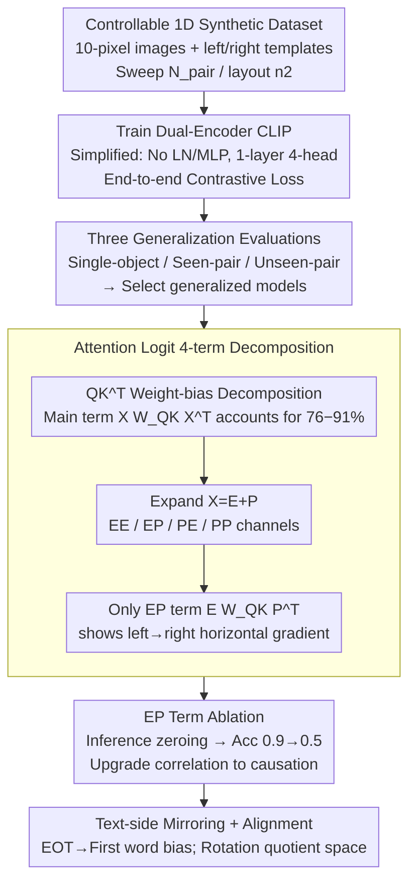

# Left-Right Symmetry Breaking in CLIP-style Vision-Language Models Trained on Synthetic Spatial-Relation Data

**Conference**: ICML 2026  
**arXiv**: [2601.12809](https://arxiv.org/abs/2601.12809)  
**Code**: None (Modified from OpenAI CLIP and Sea-Snell/grokking public code)  
**Area**: Multimodal VLM  
**Keywords**: CLIP, spatial reasoning, mechanistic interpretability, attention decomposition, positional embeddings

## TL;DR
The authors train a CLIP-style Transformer on a 1D synthetic image-text testbed and find that these models learn "left/right" relations and generalize to unseen object pairs. The mechanism is identified as the cross-term of token and positional embeddings $EW_{QK}P^T$ inducing a horizontal gradient in the vision encoder's attention logits, breaking symmetry; ablating this term drops spatial discrimination accuracy to chance levels.

## Background & Motivation

**Background**: CLIP-style VLMs excel at zero-shot retrieval and classification but frequently fail at relational understanding ("who is to the left of whom"), spatial reasoning, and compositional generalization. Benchmarks like ARO, CLEVR, Winoground, and NLVR2 consistently show that large VLMs often degrade to a "bag-of-words" model—recognizing entities but failing to perceive their spatial arrangement.

**Limitations of Prior Work**: While many evaluative studies exist, **mechanistic explanations are scarce**. There is no clear consensus on which specific path VLMs use to perceive "left vs. right," and causality has not been proven by directly disabling this capability through specific component ablation. Recent work has attributed spatial failure to training data or noted that visual tokens suppress positional information in LLMs, but a unified mechanistic picture is missing.

**Key Challenge**: The CLIP training objective does not explicitly require the model to distinguish between "on the left of X" and "on the right of X"; the contrastive loss can be satisfied without utilizing compositional structure. Why do some models learn this while others do not? Which architectural component is responsible?

**Goal**: To answer in a fully controllable minimal setting: (a) Can CLIP-style Transformers learn faithful encodings of relative spatial relations? (b) What mechanism implements this? (c) Which training factors are critical?

**Key Insight**: Following the tradition of mechanistic interpretability (Elhage 2021/2022, Olsson 2022), the authors reverse-engineer attention circuits using a toy task with a small model. They reduce images to 1D (10 pixels) where objects occupy 1 pixel, and use text templates like "[label] is on the left of [label]," paired with a 1-layer/4-head Transformer.

**Core Idea**: First, demonstrate that this minimal version reproduces the "label-diversity driven generalization" phenomenon. Then, perform a four-term decomposition of token-position embeddings in the attention logits to identify the specific term that breaks left-right symmetry, confirming it as a necessary condition through ablation experiments.

## Method

The methodology consists of a four-part framework: **controllable synthetic dataset + simplified Transformer + attention decomposition + ablation**. Synthetic data allows precise control over variables; a simplified Transformer (no LayerNorm/MLP, 1-layer, 4-head) enables analytical tractability; decomposition reveals the asymmetric terms; and ablation upgrades correlation to causation.

### Overall Architecture
(1) **Synthetic 1D Image-Text Data**: Images are 1D sequences of length $D^{\rm image}=10$. Background is 0; objects are IDs $\geq 1$. Captions use the template "[label] is on the left/right of [label]". Training uses all ordered pairs of $N_{\rm pair}=15$ labels, leaving $N_{\rm val}=5$ for unseen pairs.
(2) **Dual-Encoder CLIP**: The vision encoder uses bidirectional self-attention, and the text encoder uses causal masking. Both share $d_{\rm model}=128, d_{\rm head}=32$. CLS/EOT tokens are used for final representations with cosine similarity and standard CLIP contrastive loss.
(3) **Generalization Evaluation**: Measures single-object positional, seen-pair configuration, and unseen-pair generalization.
(4) **Attention Decomposition**: Decompose the pre-softmax logit $QK^T$ into four terms based on $X=E+P$ (token embedding + positional embedding), then visualize and ablate these terms.

### Key Designs

**1. Controllable 1D Synthetic Dataset + Label/Layout Scanning**:
By reducing images to 1D, "left/right" becomes the sole spatial degree of freedom. The authors sweep two axes: label diversity $N_{\rm pair}$ and layout diversity $n_2$. They observe that increasing $N_{\rm pair}$ significantly improves all generalization accuracies, while increasing $n_2$ has almost no effect. **Label diversity, not layout diversity, drives generalization.**

**2. Simplified Transformer + Logit Decomposition**:
To isolate the "left/right" signal, the logit is decomposed into four channels:
$$XW_{QK}X^T = \underbrace{EW_{QK}E^T}_{\rm EE} + \underbrace{EW_{QK}P^T}_{\rm EP} + \underbrace{PW_{QK}E^T}_{\rm PE} + \underbrace{PW_{QK}P^T}_{\rm PP}$$
Visualizations show that **only the EP term $EW_{QK}P^T$ produces a distinct horizontal gradient** on the CLS row, providing a logit bias toward the right. In non-generalizing models, this gradient is entirely absent.

**3. EP Term Ablation**:
To prove causality, the authors set the EP term to zero during inference. **Ablating the EP term drops unseen-pair accuracy from $\approx 0.9$ to $\approx 0.5$ (chance)**, while ablating PP or PE has no effect. This demonstrates that "recognition" (label-set identification) and "spatial encoding" are precisely decoupled.

**4. Text-side and Alignment**:
The text encoder's causal mask inherently encodes order. At least one of the 4 heads biases the EOT attention toward the first mentioned entity. Furthermore, the authors find that image and text embeddings for the same label are not highly similar in the original space but align perfectly after fitting a rotation matrix, suggesting CLIP alignment exists in a **rotation quotient space**.

## Key Experimental Results

### Generalization vs Label Diversity

| $N_{\rm pair}$ (Training Labels) | Single-object positional | Seen-pair configuration | Unseen-pair |
|:---:|:---:|:---:|:---:|
| 5 (Low) | Medium | Medium | Near Chance |
| 15 (High) | High | High | High |
| Change in Layout $n_2$ | No impact | No impact | No impact |

### Impact of Attention Logit Ablation (Unseen-pair Accuracy)

| Ablation Condition | Unseen-pair Accuracy | Explanation |
|:---|:---:|:---|
| Baseline (No ablation) | $\approx 0.9$ | Model generalizes |
| Ablate EP term $EW_{QK}P^T$ | **$\approx 0.5$** | **Drops to chance**, loses spatial logic |
| Ablate PE term $PW_{QK}E^T$ | $\approx 0.9$ | Term does not carry spatial info |
| Ablate PP term $PW_{QK}P^T$ | $\approx 0.9$ | Term is spatially symmetric |
| Ablate EP + Value VP term | $\approx 0.5$ | Attention and values cooperate |

### Key Findings
- **Label Diversity >> Layout Diversity**: Generalization is driven by the number of unique labels used in pairs, not the variety of positions.
- **EP Term is Necessary**: Its ablation specifically kills spatial discrimination while leaving entity recognition intact.
- **Inference of Non-generalization**: Models that fail to generalize lack the horizontal gradient in the EP channel.
- **Text Complexity**: Handling both "left" and "right" templates requires more layers in the text encoder (2 layers) compared to the vision encoder (1 layer).
- **Universality**: The mechanism replicates in 2D settings ($4 \times 4$ grids) and autoregressive VLM paradigms.

## Highlights & Insights
- **Mechanistic Grounding**: Transforms the vague question of "Can CLIP learn spatiality?" into a testable hypothesis of "Which logit term drives it?"
- **The EP Term as a Functional Unit**: The content-position cross-term is precisely where relational signals reside; positional embeddings are not just syntax—they are carriers of compositional generalization.
- **Data Curation Guidance**: To improve relational understanding in VLMs, budget should be spent on increasing label combinations rather than positional augmentations.
- **Geometry of Alignment**: The discovery that alignment requires a rotation matrix suggests that the internal geometry of CLIP is richer than what simple cosine similarity reveals.

## Limitations & Future Work
- The experiments are restricted to 1D/2D toy tasks and small Transformers; validation on web-scale models is required.
- Only "left/right" relations are covered; more complex relations (front/back, inside/outside) may have different mechanistic carriers.
- Deeper models (beyond 1-2 layers) introduce non-linearities (LayerNorm/MLP) that complicate the clean logit decomposition.

## Related Work & Insights
- **Contrast with ARO (Yuksekgonul 2023)**: While ARO highlights "bag-of-words" failure, this work explains the *mechanism* of success—the emergence of the EP gradient.
- **Contrast with Qi 2025**: This work shows that while LLMs might suppress positional info later, the vision encoder relies on it fundamentally for spatial relations.
- **Insight**: Researchers can now perform similar EE/EP/PE/PP decompositions on ViT-CLIP or SigLIP to identify specific "relational heads" in large-scale models.

## Rating
- **Novelty**: ⭐⭐⭐⭐ Uses toy tasks to isolate the first causal mechanistic path for spatial relations in CLIP.
- **Experimental Thoroughness**: ⭐⭐⭐⭐ Includes 2D, 3-object, and autoregressive model replications to support the 1D findings.
- **Writing Quality**: ⭐⭐⭐⭐ Clear conceptualization and excellent alignment between math and visualization.
- **Value**: ⭐⭐⭐⭐ Provides actionable insights for VLM data curation and interpretability.

<!-- RELATED:START -->

## Related Papers

- [\[ICCV 2025\] CLIPSym: Delving into Symmetry Detection with CLIP](../../ICCV2025/multimodal_vlm/clipsym_delving_into_symmetry_detection_with_clip.md)
- [\[ICML 2026\] Hierarchical Synthetic Tabular Data Generation: A Hybrid Top-Down and Bottom-Up Framework](hierarchical_synthetic_tabular_data_generation_a_hybrid_top-down_and_bottom-up_f.md)
- [\[ICML 2026\] ATHA: Improving CLIP Adaptation on Source-Free Cross-Domain Few-Shot Learning by Breaking Tail Alignment](improving_clip_adaptation_by_breaking_tail_alignment_for_source-free_cross-domai.md)
- [\[AAAI 2026\] SafeR-CLIP: Mitigating NSFW Content in Vision-Language Models While Preserving Pre-Trained Knowledge](../../AAAI2026/multimodal_vlm/safer-clip_mitigating_nsfw_content_in_vision-language_models_while_preserving_pr.md)
- [\[CVPR 2025\] Synthetic Data is an Elegant GIFT for Continual Vision-Language Models](../../CVPR2025/multimodal_vlm/synthetic_data_is_an_elegant_gift_for_continual_vision-language_models.md)

<!-- RELATED:END -->
