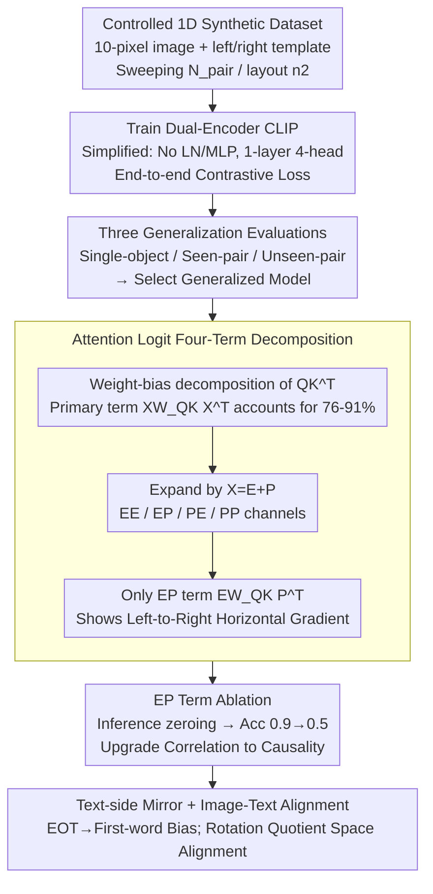

# Left-Right Symmetry Breaking in CLIP-style Vision-Language Models Trained on Synthetic Spatial-Relation Data

**Conference**: ICML 2026  
**arXiv**: [2601.12809](https://arxiv.org/abs/2601.12809)  
**Code**: None (Modified based on OpenAI CLIP and Sea-Snell/grokking public repositories)  
**Area**: Multimodal VLM  
**Keywords**: CLIP, Spatial Reasoning, Mechanistic Interpretability, Attention Decomposition, Positional Embeddings

## TL;DR
The authors train a CLIP-style Transformer end-to-end on a 1D synthetic image-text testbed and find that such models can learn "left/right" relations and generalize to unseen object pairs. The mechanism involves the **cross-term of token and position embeddings $EW_{QK}P^T$ inducing a horizontal gradient** in the vision encoder's attention logits, breaking left-right symmetry; ablating this term drops left-right discrimination accuracy to random levels.

## Background & Motivation

**Background**: CLIP-style VLMs are powerful in zero-shot retrieval and classification but repeatedly fail in relational understanding ("who is to the left of whom"), spatial reasoning, and compositional generalization. Benchmarks like ARO, CLEVR, Winoground, and NLVR2 consistently show that large VLMs often degenerate into "bag-of-words"—recognizing what is present but not its arrangement.

**Limitations of Prior Work**: While evaluation-focused studies are abundant, **mechanistic explanations are scarce**. No work has clearly identified the pathway through which VLMs perceive "left vs right," nor has the capability been proven causal by ablating a specific component. Recent studies suggest visual tokens suppress positional information in LLMs (Qi 2025) or attribute spatial failure to training data (Chen 2024), but a unified picture is missing.

**Key Challenge**: The CLIP training objective itself does not explicitly require the model to distinguish "left of X" from "right of X"; contrastive loss can be satisfied without utilizing compositional structure. Why do some models learn this while others do not? Which part of the architecture makes the difference?

**Goal**: To answer in a fully controlled minimal setting: (a) Can CLIP-style Transformers learn faithful relative spatial relation encodings? (b) By what mechanism? (c) Which training factors are critical?

**Key Insight**: Following the tradition of mechanistic interpretability (Elhage 2021/2022, Olsson 2022, Okawa 2023), the authors reverse-engineer the attention circuit using a minimalist toy task and small models. This involves reducing images to 1D with 10 pixels, objects occupying 1 pixel, and text using templates like "X is on the left of Y," paired with a 1-layer / 4-head Transformer.

**Core Idea**: Demonstrate that this minimal version can reproduce the "label diversity-driven generalization" phenomenon, then perform a four-term decomposition of token-position embeddings in the attention logits to identify the unique term breaking left-right symmetry, confirming it as a necessary condition through ablation.

## Method

The methodology is not a new model but a four-part framework: **controlled synthetic dataset + simplified Transformer + attention decomposition + ablation**. Synthetic data allow precise control of variables; a simplified Transformer (no LayerNorm/MLP, 1 layer, 4 heads, Elhage 2021 style) makes analysis tractable; term-by-term decomposition reveals the source of left-right asymmetry; and ablation upgrades correlation to causality.

### Overall Architecture
(1) Synthetic 1D image-text data: Images are 1D sequences of length $D^{\rm image}=10$ with background 0 and object IDs $\geq 1$ (single or dual objects); captions use templates like "[label] is on the left/right of [label]". Training uses all ordered pairs of $N_{\rm pair}=15$ labels (with $N_{\rm val}=5$ reserved for unseen pairs), with positions randomly sampled.
(2) Dual-encoder CLIP: The vision encoder uses bidirectional self-attention, and the text encoder uses causal masking. Both share $d_{\rm model}=128$, $d_{\rm head}=32$. CLS / EOT serve as final representations for cosine similarity and standard CLIP contrastive loss.
(3) Evaluation of three types of generalization: single-object positional / seen-pair configuration / unseen-pair generalization.
(4) **Attention decomposition** on Generalized 1-layer 4-head models: Perform weight-bias decomposition on pre-softmax logits $QK^T$, then expand the primary term $XW_{QK}X^T$ (where $X=E+P$) into four terms for visualization and ablation.

### Key Designs

**1. Controlled 1D Synthetic Dataset + Label/Layout Dual-Axis Sweep: Turning "Drivers of Spatial Generalization" into Interferable Variables**

Mechanistic studies require comparing "generalizing" and "non-generalizing" models to see differences in attention decomposition—something difficult with real image-text data due to confounding variables. This work reduces images to 1D 10-pixel sequences where "left/right" is the sole spatial degree of freedom. By sweeping two axes—label diversity $N_{\rm pair} \in \{5, ..., 15\}$ and layout diversity $n_2$ (number of position combinations per pair)—the authors test three types of generalization. The key observation is that increasing $N_{\rm pair}$ significantly boosts all generalization accuracies, while increasing $n_2$ has almost no effect—**label diversity, not layout diversity, drives generalization**.

**2. Simplified Transformer + Four-Term Decomposition of Attention Logits: Locating the "Left/Right" Signal Channel**

To identify which component encodes left-right, the attention logit is split into interpretable blocks. Following Elhage 2021, LayerNorm and MLP are removed. Query/Key are written as $Q=XW_Q^T+B_Q^T$ and $K=XW_K^T+B_K^T$, leading to $QK^T = XW_{QK}X^T + XW_Q^TB_K + B_Q^TW_KX^T + B_Q^TB_K$ (where $W_{QK}=W_Q^TW_K$). Since Softmax is insensitive to row-wise constant shifts, only column-wise variations in $XW_{QK}X^T$ and $B_Q^TW_KX^T$ affect the CLS-row attention distribution.

Substituting $X=E+P$ into the primary term yields: $XW_{QK}X^T = \underbrace{EW_{QK}E^T}_{\rm EE} + \underbrace{EW_{QK}P^T}_{\rm EP} + \underbrace{PW_{QK}E^T}_{\rm PE} + \underbrace{PW_{QK}P^T}_{\rm PP}$. Visualization reveals that **only the EP term $EW_{QK}P^T$ shows a clear left-to-right monotonic gradient on the CLS row**, adding logit bias to rightward objects. The EE term is label-specific, and PP is geometrically symmetric. Crucially, this horizontal gradient is **entirely missing** in non-generalizing models.

**3. EP Term Ablation: Upgrading Correlation to Causality**

To prove causality, the authors perform inference-time ablation by zeroing out the EP term in the pre-softmax logits for all 4 heads (using trained baseline weights). Ablating PP / PE / BP ($B_Q^TW_KP^T$) serves as a negative control. Result: **EP ablation drops accuracy from $\approx 0.9$ to $\approx 0.5$ (random)**, while PP/PE ablation has no effect. The model remains able to identify "X and Y are present" but loses the ability to tell who is on the left—accurately decoupling "recognition" from "spatial encoding."

**4. Text-Side Mirroring and Image-Text Alignment: Symmetric Symmetry Breaking**

The text encoder's causal mask inherently encodes sequence order. At least one of the 4 heads strongly biases EOT $\to$ first mentioned entity, independent of the label, mirroring the vision-side "symmetry break." Furthermore, while token embeddings of the same label in visual and text spaces do not have high cosine similarity, fitting a rotation matrix on trained labels enables alignment on unseen labels, suggesting CLIP's alignment exists in a rotation quotient space.

## Key Experimental Results

### Generalization Metrics vs. Label Diversity

| $N_{\rm pair}$ (Training Labels) | Single-object positional | Seen-pair configuration | Unseen-pair |
|---------------------------------|--------------------------|-------------------------|-------------|
| 5 (Low)                         | Moderate                 | Moderate                | Near Random |
| 15 (High)                       | High                     | High                    | High        |
| Layout diversity $n_2$ variation | Almost No Impact         | Almost No Impact        | Almost No Impact |

(Trends summarized from Fig. 3; shows label diversity is the primary driver.)

### Impact of Attention Logit Ablation on Unseen-pair Accuracy

| Ablation Condition (Inference-time) | Unseen-pair Accuracy | Explanation |
|-------------------------------------|----------------------|-------------|
| Baseline (No ablation)              | $\approx 0.9$        | Full model generalizes |
| Ablate EP term $EW_{QK}P^T$         | $\approx 0.5$        | **Drops to random**, loses spatial discrimination |
| Ablate PE term $PW_{QK}E^T$         | Near Baseline        | Not responsible for spatial encoding |
| Ablate PP term $PW_{QK}P^T$         | Near Baseline        | Not responsible for spatial encoding |
| Ablate BP term $B_Q^TW_KP^T$        | Moderate Drop        | Bias-position coupling carries minor signal |
| Concurrent EP + VP ($PW_V^T$) Ablation | $\approx 0.5$     | High impact on recognition too |

(Trends summarized from Fig. 5(e) and App. I.)

### Key Findings
- **Label Diversity >> Layout Diversity**: Increasing the number of labels used in pairs from 5 to 15 raises all generalization types from moderate to near-perfect; increasing layout combinations $n_2$ does not.
- **EP Term is Necessary**: Ablating it drops accuracy to random levels while retaining label-set recognition.
- In models that fail to generalize, the horizontal gradient in the EP term is absent, showing a perfect one-to-one correspondence.
- For "left + right" dual-template captions, a 1-layer text encoder is insufficient; increasing to 2 layers restores generalization.
- The mechanism replicates in 2D settings ($4 \times 4$ grid) and 3-object settings, as well as in autoregressive VLMs (App. O).

## Highlights & Insights
- **Mechanism as an Ablatable Hypothesis**: Translates the vague problem of "CLIP learning spatiality" into a specific checkable hypothesis in the attention logit.
- **EP Term as a Mechanistic Unit**: The content-position cross-term is not just a mathematical split but a circuit carrying the relational signal. Positional embeddings are carriers of compositional generalization.
- **Data Curation Insights**: To train models that understand relations, budgets should be spent on diverse label combinations rather than more positional layouts.
- **Rotation Quotient Space**: The finding that cross-modal alignment requires a rotation matrix fit suggests the underlying geometry is richer than what simple cosine similarity measures.

## Limitations & Future Work
- The study uses 1D/2D toy setups and small Transformers; direct verification on web-scale CLIP is not provided.
- Only left-right relations are covered; more complex relations like before/after or inside/outside may utilize different mechanisms.
- Deepening text encoders to 2 layers makes attention decomposition less clean; text-side mechanisms remain partially open.
- Simplified models lack LayerNorm and MLP; while necessary for analysis, non-linear components may modify the mechanism.

## Related Work & Insights
- **vs. Yuksekgonul 2023 (ARO)**: They empirically noted CLIP's bag-of-words behavior; this work provides the mechanism for why it *doesn't* fail under certain conditions (sufficient label diversity inducing the EP gradient).
- **vs. Qi 2025**: They show visual tokens suppress position in LLMs; this work shows position is crucial inside the vision encoder for relation generalization.
- **vs. Uselis 2025**: They focus on attribute composition (color $\times$ shape); this work shows relational composition (left/right) requires position-dependent attention rather than additive factorization.

## Rating
- Novelty: ⭐⭐⭐⭐ (While toy tasks aren't new, identifying the EP term as a causal path is a significant first for CLIP mechanistic interpretability.)
- Experimental Thoroughness: ⭐⭐⭐⭐ (Includes 3 generalization types, 4-term decomposition, ablations, and 2D/3-object/AR VLM replications.)
- Writing Quality: ⭐⭐⭐⭐ (Clear concepts, though some key data are in appendices.)
- Value: ⭐⭐⭐⭐ (Provides the first mechanistic answer to how CLIP learns spatial relations, with direct implications for training data curation.)

<!-- RELATED:START -->

## Related Papers

- [\[ACL 2025\] SpaRE: Enhancing Spatial Reasoning in Vision-Language Models with Synthetic Data](../../ACL2025/multimodal_vlm/spare_enhancing_spatial_reasoning_in_vision-language_models_with_synthetic_data.md)
- [\[ICCV 2025\] CLIPSym: Delving into Symmetry Detection with CLIP](../../ICCV2025/multimodal_vlm/clipsym_delving_into_symmetry_detection_with_clip.md)
- [\[ICML 2026\] 3ViewSense: Spatial and Mental Perspective Reasoning from Orthographic Views in Vision-Language Models](3viewsense_spatial_and_mental_perspective_reasoning_from_orthographic_views_in_v.md)
- [\[ICML 2026\] Active Exploring like a Pigeon: Reinforcing Spatial Reasoning via Agentic Vision-Language Models](active_exploring_like_a_pigeon_reinforcing_spatial_reasoning_via_agentic_vision-.md)
- [\[ICLR 2026\] Breaking the Limits of Open-Weight CLIP: An Optimization Framework for Self-supervised Fine-tuning of CLIP](../../ICLR2026/multimodal_vlm/breaking_the_limits_of_open-weight_clip_an_optimization_framework_for_self-super.md)

<!-- RELATED:END -->
