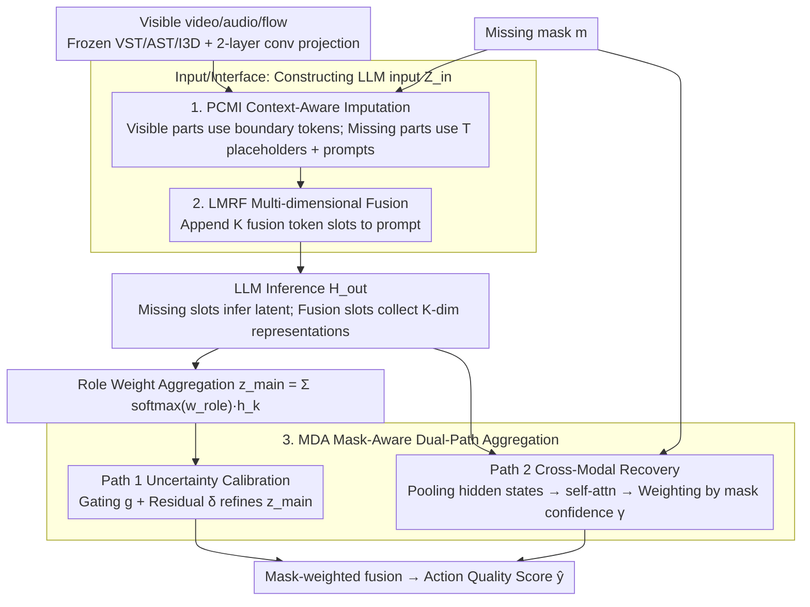

# LIMSSR: LLM-Driven Sequence-to-Score Reasoning under Training-Time Incomplete Multimodal Observations

**Conference**: ICML 2026 Spotlight  
**arXiv**: [2605.00434](https://arxiv.org/abs/2605.00434)  
**Code**: https://github.com/XuHuangbiao/LIMSSR  
**Area**: Multimodal VLM / Incomplete Multimodal Learning / Action Quality Assessment  
**Keywords**: Incomplete Multimodal Learning, LLM Reasoning, Action Quality Assessment, Mask-Aware Fusion, Token-level Regularization

## TL;DR
The authors reformulate multimodal Action Quality Assessment (AQA) with "missing modalities during training" as an "LLM-based conditional sequence-to-score reasoning" problem. By using prompts and special tokens, the LLM completes missing semantics without full data supervision. Combined with mask-aware dual-path fusion to suppress hallucinations, the method outperforms SOTAs that rely on complete training data across three AQA datasets.

## Background & Motivation

**Background**: In real-world scenarios, multimodal data often suffers from missing modalities due to sensor failure, privacy masking, or collection costs, resulting in incomplete video/audio/flow data. Research in Incomplete Multimodal Learning (IML) generally follows two paths: (a) reconstruction-based (ActionMAE, IMDer, GAIN, DMVG), which directly reconstructs missing features; (b) distillation/prior-based (CorrKD, MoMKE, MCMoE), which uses complete modalities as teachers for distillation or priors.

**Limitations of Prior Work**: Both categories implicitly assume a "privileged view"—complete modalities must be available during training as targets or teachers. However, real-world data collection is often inherently incomplete (e.g., some subjects lack audio). If training data itself is incomplete, reconstruction lacks ground truth and distillation lacks teachers, causing the IML framework to collapse.

**Key Challenge**: When modalities are missing during the training phase, how can missing semantics be "imagined"? Traditional reconstruction-distillation pipelines require "complete-incomplete" pairs, which do not exist in this setting. Simply zero-filling causes the model to learn "missingness" as noise, degrading performance. A mechanism is needed to "infer" missing semantics without paired supervision.

**Goal**: (i) Formalize the more realistic setting of "incomplete observations during training"; (ii) Propose a framework to infer missing semantics without relying on complete training data; (iii) Validate this on long-video Action Quality Assessment (AQA), a task highly dependent on multimodality.

**Key Insight**: LLMs are not just sequence models; they possess vast world knowledge and reasoning capabilities. Given observable modalities and a description of the missing structure, an LLM should be able to infer latent semantic representations of missing parts, similar to a "cloze test," without requiring pixel-level reconstruction.

**Core Idea**: Reformulate incomplete multimodal learning as "conditional sequence reasoning"—using prompts to describe the task and missing status, using missing tokens as placeholders, and fusion tokens for collection. This allows the LLM to infer latent semantics despite invisible modalities, while mask-aware gating calibrates reasoning uncertainty.

## Method

### Overall Architecture
For a sample $(\mathbf{X} \odot \boldsymbol{m}, \boldsymbol{m}, y)$ (where $\boldsymbol{m}\in\{0,1\}^M$ is the mask), LIMSSR follows three steps: (1) Context Construction $\Phi_{in}$ merges instruction prompts, visible features $\tilde{\mathbf{X}}^m$, missing token sequences, and fusion tokens into a unified embedding $\mathbf{Z}_{in}$. (2) LLM Reasoning $\mathbf{H}_{out} = \mathrm{LLM}(\mathbf{Z}_{in})$ performs both latent inference and multimodal fusion. (3) Mask-Aware Dual-Path Aggregation $\Psi_{agg}$ merges a high-level semantic path with a low-level cross-modal path using mask weighting to output quality score $\hat{y}$. On the modality side, frozen VST/AST/I3D extract video/audio/flow features, projected to the LLM space via 2-layer convolutions. Three modules (PCMI, LMRF, MDA) address input, interface, and output designs respectively.

### Key Designs

**1. Prompt-guided Context-aware Modality Imputation (PCMI): Promoting missing modalities to "latent variables to be inferred"**

Traditional zero-filling causes missing signals to be treated as noise during attention. PCMI explicitly writes the missing structure into the sequence: each modality $m$ is wrapped in `<m_start>, <m_end>` boundary tokens. Visible modalities contain real features $\tilde{\mathbf{X}}^m$, while missing modalities contain $T$ learnable `<missing_m>` placeholder embeddings. A prompt clarifies the status: "Given the available {avail} features... The {miss} modality is missing. Based on the available modalities, please infer and reconstruct the useful latent representations...". The hidden states $\mathbf{H}_{miss}^m$ at these positions are the inferred representations. This utilizes the LLM's next-token mechanism for semantic inference without pixel-level reconstruction.

**2. LLM-driven Multi-dimensional Representation Fusion (LMRF): Using specialized token slots for cross-modal collection**

Direct mean-pooling of LLM outputs collapses generative structures and loses dimensional information. LMRF appends $K$ special tokens `<emb_dim_1>, ..., <emb_dim_K>` as "information slots" at the end of the prompt, instructing the LLM to "integrate and enhance all multimodal features... Output the fused multi-dimensional feature representations." The outputs $\mathbf{H}_{fusion} = \{\boldsymbol{h}_1, \dots, \boldsymbol{h}_K\}$ are treated as specific assessment dimensions (e.g., difficulty, execution, artistry) and aggregated into a main vector $\boldsymbol{z}_{main} = \sum_k \mathrm{Softmax}(\boldsymbol{w}_{role})_k \cdot \boldsymbol{h}_k$ using learnable role weights.

**3. Mask-Aware Dual-Path Aggregation (MDA): Balancing inference trust and statistical evidence**

LLM reasoning risk hallucinations during severe data loss, while statistical aggregation lacks high-level semantics. MDA executes two paths. Path 1 (Uncertainty-calibrated Reasoning) calculates a gate $\boldsymbol{g} = \sigma(\mathrm{MLP}_{gate}([\boldsymbol{z}_{main}, \boldsymbol{m}]))$ and residual $\boldsymbol{\delta}$ to refine the representation. Path 2 (Cross-modal Pattern Recovery) pools LLM hidden states into $\boldsymbol{h}_v, \boldsymbol{h}_a, \boldsymbol{h}_f$, applies self-attention, and weights them by availability $\alpha_{m_j} = \boldsymbol{m}_j \cdot 1 + (1-\boldsymbol{m}_j)\cdot \gamma_{m_j}$, where $\gamma_m$ is a learnable modality confidence. This forces the model to rely more on visible paths when LLM inference is uncertain.

### Loss & Training
Beyond the primary regression loss, the authors introduce: (1) Consistency Learning to align the two paths; (2) Token-Level Metric Regularization to prevent fusion token collapse by maximizing the distance between non-diagonal elements of the token similarity matrix; (3) LoRA fine-tuning for the LLM backbone to avoid full-parameter training.

## Key Experimental Results

### Main Results (FS1000, 7-class, Spearman ↑ / MSE ↓, T-Miss indicates incomplete training data)

| Method | T-Miss | {v,f} | {v,a} | {v} | {a} | Average | {v,f,a} |
|------|--------|-------|-------|------|------|---------|---------|
| ActionMAE | ✗ | 0.775/24.66 | 0.766/64.13 | 0.761/50.64 | 0.458/41.66 | 0.651/38.18 | 0.809/17.96 |
| MoMKE | ✗ | 0.798/18.86 | 0.805/23.88 | 0.785/37.96 | 0.499/27.53 | 0.668/26.08 | 0.819/16.85 |
| MCMoE | ✗ | 0.845/12.66 | 0.882/11.85 | 0.845/13.64 | 0.615/16.72 | 0.782/15.37 | 0.881/11.53 |
| **Ours** | **✓** | **0.854/12.51** | **0.891/10.54** | **0.853/12.50** | **0.687/15.51** | **0.789/14.08** | **0.891/10.44** |

| Δ vs SOTA | {v,f} | {v,a} | {v} | {a} | Average | {v,f,a} |
|-----------|-------|-------|------|------|---------|---------|
| ΔSpearman | ↑1.1% | ↑1.0% | ↑0.9% | ↑11.7% | ↑0.9% | ↑1.1% |
| ΔMSE | ↓1.2% | ↓11.1% | ↓8.4% | ↓7.2% | ↓8.4% | ↓9.5% |

Note: Ours is the only model trained under **T-Miss ✓**, yet it outperforms all methods trained with complete data (**T-Miss ✗**) across nearly all composite modalities.

### Key Findings
- **Training with incomplete data outperforms complete-data rivals**: In extreme cases (e.g., audio only), the method shows an 11.7% Spearman gain over SOTA, suggesting LLM world knowledge provides a qualitative advantage in imputing missing semantics.
- **Complementarity of Path 1 & 2**: Removing either path degrades performance; MDA's mask-adaptive fusion is critical for anti-hallucination.
- **Optimal Fusion Toekns $K$**: $K=3$ aligns best with the difficulty/execution/artistry structure of AQA.
- **Audio Modality Difficulty**: All methods perform worst on {a}-only settings due to lower correlation with action quality, but LIMSSR shows the highest relative gain, highlighting LLM inference power.

## Highlights & Insights
- **Task Reformulation**: Reframing IML from "reconstruction/distillation" to "conditional sequence reasoning" transforms a supervised-limited problem into a next-token inference problem.
- **Elegant Token Design**: Boundary tokens + missing placeholders + fusion slots treat the LLM as a programmable "semantic calculator" without architectural changes.
- **Uncertainty Calibration**: Encoding confidence through mask-aware paths and learnable $\gamma_m$ provides a robust engineering solution to hallucination.
- **Contextual Superiority**: The finding that LLM priors can outperform paired supervision suggests a paradigm shift: world knowledge may be more valuable than domain-specific paired data in incomplete scenarios.

## Limitations & Future Work
- **Task Specificity**: Validated primarily on AQA; generalizability to medical diagnosis or emotion recognition requires further study.
- **Computational Cost**: LLM inference is expensive, potentially limiting real-time application in live scoring.
- **Hallucination Quantification**: Lacks formal metrics for hallucination, managing it only indirectly through MDA.
- **Scale and Modality Expansion**: Future work should explore larger models and broader modality types (e.g., depth maps, IMU signals).

## Related Work & Insights
- **Comparison with ActionMAE/IMDer**: LIMSSR breaks the dependency on complete training pairs.
- **Comparison with MoMKE/MCMoE**: Instead of using complete modalities as teachers, LIMSSR replaces them with LLM world knowledge.
- **Comparison with MissRAG/TAMML**: Unlike MissRAG (requiring retrieval pools) or TAMML (textualizing all modalities), LIMSSR reasons directly in the embedding space, preserving fine-grained information.

## Rating
- Novelty: ⭐⭐⭐⭐⭐ (Formulating a new "incomplete training" setting via sequence reasoning).
- Experimental Thoroughness: ⭐⭐⭐⭐ (Extensive benchmarks and combinations, though focused on AQA).
- Writing Quality: ⭐⭐⭐⭐ (Clear paradigm comparisons and semantic explanations).
- Value: ⭐⭐⭐⭐ (Establishes a new paradigm for IML and a non-linguistic use case for LLMs).

<!-- RELATED:START -->

1. **ActionMAE**: Multimodal Masked Autoencoders for Action Recognition (CVPR 2023)
2. **MoMKE**: Mixture of Multimodal Knowledge Experts for Incomplete Learning (ICCV 2023)
3. **MCMoE**: Multi-modal Cross-modal Mixture of Experts (AAAI 2024)

<!-- RELATED:END -->

## Related Papers

- [\[ICLR 2026\] Reasoning-Driven Multimodal LLM for Domain Generalization](../../ICLR2026/multimodal_vlm/reasoning-driven_multimodal_llm_for_domain_generalization.md)
- [\[ACL 2026\] STELLA: A Multimodal LLM for Protein Functional Annotation via Unified Sequence-Structure Encoding](../../ACL2026/multimodal_vlm/stella_a_multimodal_llm_for_protein_functional_annotation_via_unified_sequence-s.md)
- [\[CVPR 2026\] Breaking Multimodal LLM Safety via Video-Driven Prompting](../../CVPR2026/multimodal_vlm/breaking_multimodal_llm_safety_via_video-driven_prompting.md)
- [\[CVPR 2026\] MODIX: Training-Free Multimodal Information-Driven Positional Index Scaling for VLMs](../../CVPR2026/multimodal_vlm/modix_positional_index_scaling.md)
- [\[ACL 2026\] TableVista: Benchmarking Multimodal Table Reasoning under Visual and Structural Complexity](../../ACL2026/multimodal_vlm/tablevista_benchmarking_multimodal_table_reasoning_under_visual_and_structural_c.md)

<!-- RELATED:END -->
