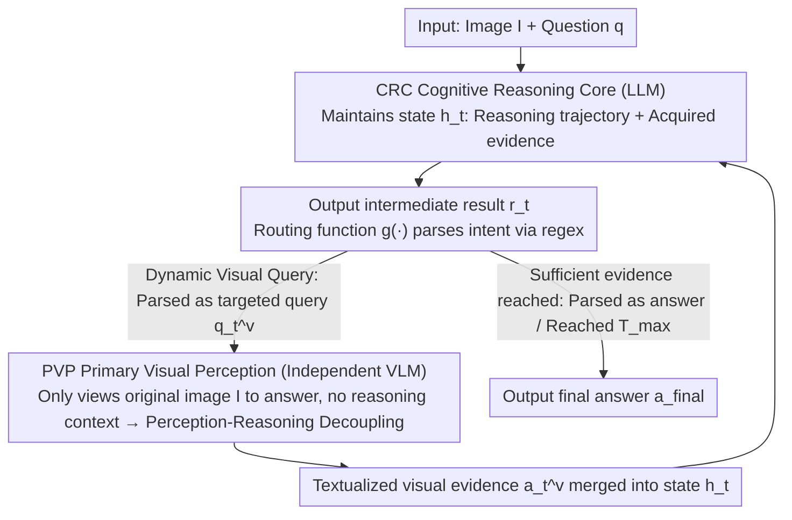

# CSMR (Look on Demand): A Cognitive Scheduling Framework for Visual Evidence Acquisition in Multimodal Reasoning

**Conference**: ICML 2026  
**arXiv**: [2605.28160](https://arxiv.org/abs/2605.28160)  
**Code**: https://github.com/YangZhang2511/CSMR  
**Area**: Multimodal VLM / Multimodal Reasoning / Tool Calling  
**Keywords**: Multimodal Reasoning, Working Memory Theory, Dynamic Visual Evidence Acquisition, Perception-Reasoning Decoupling, Zero-shot

## TL;DR
Inspired by Baddeley's working memory theory, CSMR treats "when to introduce visual evidence into reasoning" as a dynamic decision. The LLM maintains reasoning states and invokes an independent perception module (VLM) to fetch visual evidence on-demand until sufficient; this addresses flaws in two existing paradigms (information loss from static textualization in pre-reasoning and language prior contamination in unified VL spaces), achieving zero-shot superiority over baselines across multiple multimodal reasoning benchmarks.

## Background & Motivation

**Background**: Two major paradigms in multimodal reasoning—(a) pre-reasoning visual-to-text (e.g., DDCoT, which converts images to captions before reasoning), and (b) unified vision-language space (e.g., CCoT, ICoT, AIMCoT, where VLMs perform end-to-end reasoning).

**Limitations of Prior Work**: (a) Static textualization occurs before reasoning begins, making it impossible to foresee details required later; coarse-grained captions irreversibly lose fine-grained information. (b) Visual representations in unified paradigms are contaminated by language priors—extensive evidence (Section 4.2) shows that self-attention systematically assigns higher attention to text tokens (approx. 2.5×), which is further amplified by soft-max, suppressing visual tokens over the long term.

**Key Challenge**: The timing of visual evidence introduction determines reasoning quality—introducing it once too early misses details, while constant unification is dominated by language. An "on-demand evidence" mechanism is required to judge based on the current reasoning state whether to look at the image, where to look, and if enough evidence has been gathered.

**Goal**: (1) Analyze the dominance of language priors in unified paradigms; (2) Enable the LLM to maintain reasoning states and dynamically schedule visual evidence acquisition; (3) Decouple the perception-reasoning structure to prevent visual representation contamination; (4) Outperform baselines in zero-shot settings.

**Key Insight**: Borrowing from Baddeley's working memory theory—the central executive schedules the visuospatial sketchpad and the phonological loop. The LLM acts as the central executive to maintain the reasoning state, while an independent VLM acts as the visuospatial sketchpad to return textualized visual evidence on-demand.

**Core Idea**: A structural decoupling of the CRC (Cognitive Reasoning Core, LLM) and the PVP (Primary Visual Perception, independent VLM). The CRC decides when and what to query, and the PVP independently examines the original image to answer queries; visual evidence is iteratively acquired driven by the reasoning state until it is deemed sufficient.

## Method

### Overall Architecture

The CRC (LLM) maintains a reasoning state (containing the original question + the list of acquired visual evidence). At each step:
1. It decides whether more visual evidence is needed.
2. If needed, it generates a targeted visual query (e.g., "What color is the bottom-right corner of the image?").
3. It invokes the PVP (independent VLM looking at the original image) to return a textualized answer.
4. It incorporates the evidence into the state and updates the reasoning.
5. If reasoning is sufficient, it outputs the final answer directly.

The PVP does not participate in reasoning and only performs QA; its visual representation is not influenced by the linguistic context of the CRC.

### Key Designs

**1. Perception-Reasoning Structural Decoupling: Allowing PVP to view images independently to avoid contamination from reasoning language priors**

A flaw in unified paradigms is that LLM reasoning eventually dominates visual representations—Section 4.2 quantifies that self-attention systematically grants text tokens ~2.5× more attention than visual tokens, which is further compressed by soft-max. CSMR sets PVP as an independent VLM instance that receives only the original image and the visual query, without CRC's reasoning context. After the CRC receives the textualized answer, it is integrated into reasoning, but the query context does not flow back into subsequent PVP calls. This ensures the PVP views the image "freshly" each time, fulfilling the role of the visuospatial sketchpad in Baddeley's theory. This design contributed a 3.7-point improvement in ablation studies, confirming the reality of language contamination.

**2. Reasoning-State-Driven Dynamic Visual Querying: Incremental evidence acquisition based on current state instead of one-time planning**

Pre-reasoning approaches that convert images into captions one-time are "final" and cannot predict details needed for later reasoning stages. CSMR allows the CRC to maintain a reasoning state $h_t$ (= accumulated reasoning trajectory + acquired textualized visual evidence). Each step produces an intermediate result $r_t$, which a deterministic **routing function** $g(\cdot)$ parses into either a new visual query or a final answer. Instead of pre-planning all queries, the CRC generates queries incrementally based on the current state, allowing for a coarse-to-fine granularity (e.g., querying "main content" first, then "detailed regions"). This enables "reasoning-guided perception," fetching only necessary evidence to avoid interference from irrelevant information. Replacing this with one-time planning results in a 5.4-point drop in ablation.

**3. Early Termination: CRC stops when evidence is sufficient, adaptively allocating query count by difficulty**

The difficulty of cases varies significantly—simple questions may require only 1–2 queries, while complex ones require multiple rounds. CSMR does not use a separate confidence threshold but integrates the termination decision into each step of the CRC: when $g(\cdot)$ parses $r_t$ as a "final answer," the loop terminates. Otherwise, querying continues until the CRC deems evidence sufficient or the context reaches $T_{\max}$. This ensures that "when to stop" and "when to query" are two sides of the same decision driven by the reasoning state. Evaluation shows the model adaptively allocates queries: Easy (1.4 avg), Medium (2.7), Hard (4.2).

### Quantitative Evidence of Attention Bias (Figure 2)

Mean attention across 35 layers on Qwen3-VL-8B using the ScienceQA subset:
- Average text token attention is 2.5× higher than visual tokens.
- Visual token proportion is further compressed after soft-max.
- This phenomenon was consistent on LLaVA-1.6-7B, proving it is a systemic issue in VLM paradigms rather than a specific model quirk.

## Key Experimental Results

### Main Results (Zero-shot across benchmarks)

| Benchmark | Pre-reason (DDCoT) | Unified (CCoT) | Unified (AIMCoT) | **CSMR** |
|------|------------|----------|--------|--------|
| ScienceQA | 72.4 | 75.8 | 77.3 | **80.6** |
| A-OKVQA | 56.7 | 58.9 | 60.4 | **63.8** |
| MMStar | 39.5 | 41.2 | 42.8 | **45.7** |
| MMBench-Reasoning | 52.1 | 54.6 | 56.0 | **59.3** |
| RealWorldQA | 45.3 | 47.8 | 49.2 | **52.6** |

CSMR consistently leads by 3-4 points across 5 benchmarks, with significant advantages in tasks requiring fine-grained visual verification (ScienceQA, A-OKVQA).

### Ablation Study

| Configuration | ScienceQA |
|------|---------|
| Full CSMR | 80.6 |
| − Early Termination (Fixed queries) | 78.4 |
| − Perception Decoupling (PVP receives CRC context) | 76.9 |
| − Dynamic Query (One-time planning) | 75.2 |
| Back to pre-reason DDCoT | 72.4 |

All three modules contribute positively; decoupling has the largest impact (−3.7), validating the language contamination issue.

### Early Termination Efficiency

| Difficulty | Avg Queries | Accuracy |
|------|------------|------|
| Easy | 1.4 | 87% |
| Medium | 2.7 | 79% |
| Hard | 4.2 | 64% |

The model successfully identifies difficulty and adaptively allocates the number of queries.

### Key Findings
- **Perception-Reasoning Decoupling is key**: This contributed the most to performance (−3.7), confirming the language contamination problem in unified paradigms.
- **Dynamic querying significantly outperforms pre-planning**: One-time planning for all queries leads to a 5.4-point drop.
- **Early termination saves queries without losing accuracy**: Fixed query counts drop by 2.2 points, proving the effectiveness of adaptive termination.
- **Generalizable across architectures**: CRC can be replaced with GPT-4 / Claude / Qwen-LLM, and PVP can be replaced with LLaVA / Qwen-VL, offering flexible combinations.

## Highlights & Insights
- **Engineering inspired by Cognitive Science**: Baddeley's working memory theory provides a clear role definition (central executive vs visuospatial sketchpad) for LLM-VLM collaboration.
- **"Perception-Reasoning Decoupling" is a genuine paradigm innovation**: Challenging the default assumption that end-to-end unification is always superior, this work proves that decoupling + dynamic invocation is better.
- **Quantitative evidence for 2.5× attention bias**: Transforming the "language prior contamination" from a feeling into a metric, providing a benchmark for future research.
- **Training-free and Modular**: CRC and PVP can be independently upgraded, making it industry-friendly; new LLMs or VLMs can be dropped in directly.

## Limitations & Future Work
- Context grows rapidly during long-chain reasoning due to multiple query cycles; query summarization or graph-based representations could be considered.
- PVP might still lose information during textualization; returning structured outputs (coordinates, bounding boxes) instead of free text is a potential solution.
- The decision to invoke PVP is currently zero-shot prompted; a learned scheduling strategy might be more stable.
- Total latency includes LLM reasoning plus multiple VLM calls, which is less ideal for latency-sensitive scenarios.
- More complex collaboration between CRC and PVP (e.g., PVP proactively suggesting points of interest) has not been explored.

## Related Work & Insights
- **vs DDCoT (pre-reasoning textualization)**: That method performs one-time conversion; CSMR performs multiple dynamic queries.
- **vs CCoT / AIMCoT (unified VL reasoning)**: Those suffer from language contamination; CSMR solves this via decoupling.
- **vs ReAct / Toolformer**: Those treat tools as external APIs; CSMR treats the VLM as a "perception tool," following a similar logic but focusing on visual perception.
- **vs PathCTM**: PathCTM uses multi-scale reasoning + early exit; CSMR uses tool-use + early exit. Both share the "on-demand evidence" philosophy, but via different internal/external mechanisms.
- **Insight**: Re-evaluating "unified end-to-end" paradigms—tasks requiring different capabilities like perception-reasoning, retrieval-generation, or calculation-verification can benefit from decoupling + scheduling modes.

## Rating
- Novelty: ⭐⭐⭐⭐⭐ Perception-reasoning decoupling + dynamic visual querying represents a paradigm-level innovation; the mapping to cognitive science is well-grounded.
- Experimental Thoroughness: ⭐⭐⭐⭐ 5 benchmarks + detailed ablation + attention bias quantification; lacks comparison with ReAct-style tool-use baselines.
- Writing Quality: ⭐⭐⭐⭐⭐ Clear comparison of the three paradigms (Figure 1), with Figure 2 providing decisive evidence of attention bias.
- Value: ⭐⭐⭐⭐ Training-free, modular, and SOTA across benchmarks; beneficial for any task requiring fine-grained visual verification.

<!-- RELATED:START -->

## Related Papers

- [\[CVPR 2026\] Perceptual-Evidence Anchored Reinforced Learning for Multimodal Reasoning](../../CVPR2026/multimodal_vlm/perceptual-evidence_anchored_reinforced_learning_for_multimodal_reasoning.md)
- [\[ICML 2026\] CVSearch: Empowering Multimodal LLMs with Cognitive Visual Search for High-Resolution Image Perception](cvsearch_empowering_multimodal_llms_with_cognitive_visual_search_for_high-resolu.md)
- [\[CVPR 2026\] DocSeeker: Structured Visual Reasoning with Evidence Grounding for Long Document Understanding](../../CVPR2026/multimodal_vlm/docseeker_long_document_understanding.md)
- [\[CVPR 2026\] AdaptVision: Efficient Vision-Language Models via Adaptive Visual Acquisition](../../CVPR2026/multimodal_vlm/adaptvision_efficient_vision-language_models_via_adaptive_visual_acquisition.md)
- [\[CVPR 2026\] LASAR: Towards Spatio-temporal Reasoning with Latent Cognitive Map](../../CVPR2026/multimodal_vlm/lasar_towards_spatio-temporal_reasoning_with_latent_cognitive_map.md)

<!-- RELATED:END -->
