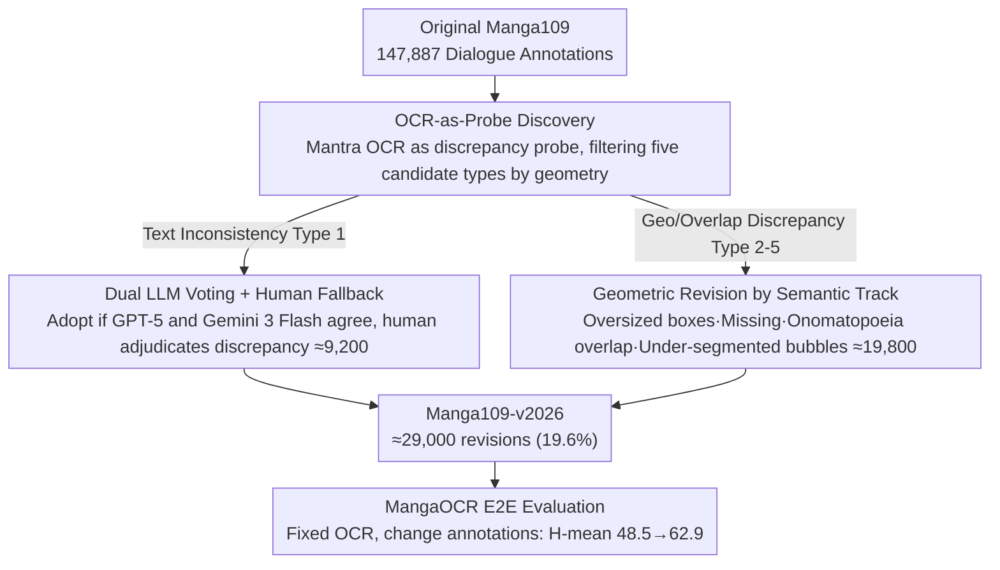

# Manga109-v2026: Revisiting Manga109 Annotations for Modern Manga Understanding

**Conference**: ICML 2026  
**arXiv**: [2605.21182](https://arxiv.org/abs/2605.21182)  
**Code**: None (Project Page: https://manga109.github.io/manga109-project-website/en/ )  
**Area**: Multimodal VLM  
**Keywords**: Manga Understanding, OCR Evaluation, Dataset Revision, Onomatopoeia, Speech Bubble Segmentation

## TL;DR
The authors revisit Manga109, the foundational dataset for manga AI research, identifying five categories of dialogue text annotation issues. By combining commercial OCR + dual LLM voting (GPT-5/Gemini 3 Flash) + human verification, they revised approximately 29,000 annotations (19.6% of the total 147,887 text annotations) to release Manga109-v2026, improving end-to-end OCR evaluation H-mean from 48.5 to 62.9 (+14.4 pp).

## Background & Motivation

**Background**: Japanese manga is a unique multimodal medium blending visual storytelling, stylized typography, speech bubbles, and onomatopoeia. Manga109 (Matsui 2017; Aizawa 2020) serves as the foundational dataset for tasks like manga OCR, translation, transcription, multimodal understanding, and manga-specific large models; almost all manga-AI systems are trained or evaluated on it.

**Limitations of Prior Work**: Dialogue text annotations in Manga109 were created over a decade ago following OCR standards of that time, leading to significant mismatches with modern multimodal systems. Issues such as transcription errors, oversized bounding boxes (encompassing multiple text lines or non-text pixels), missing short emoticons ("!", "..."), overlapping annotations between dialogue and onomatopoeia, and treating multiple connected bubbles as a single text region cause "correct detections" by OCR systems to be penalized as errors and introduce inaccurate transcriptions into training signals.

**Key Challenge**: There is a fundamental representation granularity mismatch between the expressive structure of manga (onomatopoeia, bubble layout, stylized fonts) and the behavior of modern detectors. Old annotations organize "a whole dialogue as one box," whereas modern OCR tends to output each bubble as an independent instance. Furthermore, old annotations mixed onomatopoeia into dialogue boxes, breaking the onomatopoeic rhetoric that should be preserved during translation.

**Goal**: Systematically identify and revise five categories of dialogue annotation issues without changing the overall Manga109 framework, and empirically demonstrate the impact of these revisions on the reliability of OCR evaluation.

**Key Insight**: Instead of treating any single OCR as ground truth, the authors use commercial Mantra OCR outputs as "discrepancy probes." Whenever OCR outputs diverge from the old annotations, the cases are sent to a human/LLM verification pipeline. This transforms the "full audit" problem into "discrepancy-sampled verification," significantly reducing human labor while focusing on locations that truly impact modern systems.

**Core Idea**: Use modern AI (commercial OCR + dual LLM voting) for large-scale "candidate issue discovery," followed by human "final adjudication," applying human-AI collaborative iteration for the intergenerational maintenance of cultural data assets.

## Method

This work does not propose a new model but rather a human-AI collaborative workflow of **issue discovery → categorization → revision → evaluation validation**. It can be viewed as a "code review pipeline" for manga dialogue annotations: OCR acts as the linter, LLMs act as Reviewer 1 and Reviewer 2, and humans act as the maintainer.

### Overall Architecture
The input consists of all 147,887 original Manga109 dialogue text annotations. The process follows four steps:
(1) Retrieve commercial Mantra OCR detection/recognition outputs for all manga pages;
(2) Perform spatial and textual alignment between OCR outputs and original annotations to automatically filter five categories of discrepancy candidates;
(3) Execute different revision sub-pipelines based on the category (LLM voting / region refinement / human supplementary labeling / overlap removal / bubble re-segmentation);
(4) Run the same OCR outputs on both old and new annotations using the MangaOCR protocol to compare E2E precision/recall/H-mean. The final output is Manga109-v2026, covering $\approx 29,000$ revisions, approximately 19.6% of all annotations.

### Key Designs

**1. OCR-as-Probe Discovery Strategy: Using modern OCR to automatically locate labels in need of revision.**

Conducting a full manual audit of 148,000 annotations is impractical. The authors use Mantra OCR as a "discrepancy probe" rather than ground truth: parts where OCR aligns with old annotations are considered credible, while discrepancies enter the review queue. Discrepancies are categorized by geometric relations: completely misaligned bboxes correspond to Type 1 transcription errors; a single bbox containing multiple OCR boxes corresponds to Type 2 oversized boxes or Type 5 under-segmented bubbles; OCR text without old annotations corresponds to Type 3 missing labels; and spatial overlap with onomatopoeia boxes corresponds to Type 4. This compresses a "full audit" into auditing only the subset diverging from modern systems, which is the key to completing the work with reasonable labor while avoiding "evaluating OCR with OCR" circular bias.

**2. Dual LLM Voting + Human Fallback for Transcription Revision (Type 1, $\approx 9,200$ cases): High-throughput AI consensus + high-precision human adjudication.**

Type 1 requires deciding whether to keep the original label or adopt the OCR output. Both candidates are fed to GPT-5 and Gemini 3 Flash for independent selection: if they agree, the choice is adopted (15,359 cases, with 7,156 favoring OCR and 8,203 favoring the original); the 2,051 cases with discrepancy are manually adjudicated by the authors. This achieves an automated decision rate of $15359/17410 \approx 88.2\%$, with humans only processing 11.8%. Using two models from different vendors helps suppress systematic bias that a single model might have toward its own style, while high-discrepancy samples sent to humans maintain the quality ceiling.

**3. Geometric Revision by Semantic Track (Type 2/3/4/5, $\approx 19,800$ cases): Different semantic issues follow distinct sub-pipelines.**

Revision goals for the remaining four geometric issues are inherently different. Type 2 (Oversized Boxes, $\approx 50$) detects bboxes overlapping other text regions and manually splits them. Type 3 (Missing Text, $\approx 800$) adds bboxes and transcriptions for OCR outputs without original labels, focusing on "!" or "..." which are narratively important but visually small. Type 4 (Dialogue-Onomatopoeia Overlap, $\approx 4,300$) preserves onomatopoeia labels added in 2022 and clips overlapping areas from dialogue boxes. Type 5 (Under-segmented Bubbles, $\approx 14,900$, the largest volume) splits one old bbox covering multiple bubbles into one box per bubble. These tracks address different objectives—Type 2/3 improve consistency, Type 1/4 improve compatibility, and Type 5 improves evaluation protocol compatibility.

### Validation Strategy
Instead of introducing new models, the same commercial OCR outputs are compared against the original Manga109 and Manga109-v2026. Precision, recall, and H-mean are calculated according to the MangaOCR (Baek 2026) E2E protocol. This "Fixed OCR, Varied Annotations" design quantifies the impact of annotation quality on OCR evaluation independently of the specific OCR model.

## Key Experimental Results

### Annotation Revision Scale

| Type | Name | Revision Count |
|------|------|--------|
| Type 1 | Transcription Errors | $\approx 9,200$ |
| Type 2 | Oversized Bounding Boxes | $\approx 50$ |
| Type 3 | Missing Text | $\approx 800$ |
| Type 4 | Dialogue-Onomatopoeia Overlap | $\approx 4,300$ |
| Type 5 | Under-segmented Speech Bubbles | $\approx 14,900$ |
| Total | — | $\approx 29,000$ (19.6% of 147,887) |

### OCR Evaluation Results (Same OCR output, different annotations)

| Annotation Version | Precision | Recall | H-mean |
|----------|-----------|--------|--------|
| Original Manga109 | 46.5 | 50.6 | 48.5 |
| Manga109-v2026 | 63.4 | 62.4 | **62.9** |
| Gain | +16.9 | +11.8 | **+14.4 pp** |

### Key Findings
- The +14.4 pp boost in H-mean is not due to improved OCR capability, but rather the alignment of the evaluation protocol with modern OCR behavior, suggesting that the community has likely systematically undervalued manga OCR systems.
- Type 5 (Under-segmented Bubbles) accounts for more than half of the revisions, indicating that "aggregating whole dialogues into one label" is the most severe representation mismatch.
- The dual LLM agreement rate for Type 1 is $\approx 88.2\%$ ($15359/17410$), with 53.4% favoring original labels and 46.6% favoring OCR—showing comparable quality but high divergence on stylized or small text requiring human judgment.

## Highlights & Insights
- **"Repairing a dataset" as an ICML paper**: In the LLM/VLM era, the intergenerational maintenance of benchmark annotations carries methodological value. Reorganizing the same data to align with modern system behavior can lead to order-of-magnitude changes in results.
- **OCR-as-Probe + Dual LLM Voting + Human Fallback**: This three-layer pipeline reduces "full human audit" costs to 11.8%, providing an engineering paradigm transferable to other legacy datasets (e.g., old VQA, RefCOCO, or grounding datasets).
- **Expressive Structures and Evaluation Compatibility**: Treating the compatibility between onomatopoeia/layout and evaluation protocols as a first-class annotation problem reflects a "semantic evolution" of datasets that is more sustainable than fixed-schema paradigms.
- The 88.2% LLM agreement rate is an interesting byproduct: using frontier LLMs from different vendors as weak labeling ensemblers, paired with human fallback for discrepancies, is a pattern worth reusing in more annotation tasks.

## Limitations & Future Work
- The commercial Mantra OCR is closed-source; the paper does not disclose architecture details, making the "discrepancy candidate generator" inaccessible to the community.
- There is no automated, rule-based script for Type 2-5 geometric revisions; they relied on manual execution by the four authors, requiring significant effort for replication. Inter-annotator agreement metrics are not provided.
- Only the "dialogue text" layer was revised; higher-level annotations like panels or characters remain untouched, though manga-specific VLM evaluations (e.g., MangaUB, MangaVQA) rely heavily on these.
- The +14.4 pp gain is relative; comparing with a third-party OCR would better isolate the contributions of "protocol improvement" vs. "OCR adaptation to new labels."

## Related Work & Insights
- **vs. MangaOCR (Baek 2026)**: MangaOCR improved the recognition model; this paper improves the evaluation benchmark. This work uses the MangaOCR E2E protocol to quantify "benchmark-side" contributions.
- **vs. COO (Baek 2022)**: COO introduced onomatopoeia labels to Manga109; this work further resolves spatial conflicts between onomatopoeia and dialogue labels.
- **vs. Transcription Models (Manga Whisperer / Magi series, Sachdeva & Zisserman 2024)**: These generative models rely on Manga109 for training/eval. Annotation quality directly determines their evaluation ceiling; this work is a contribution "upstream."
- **Insight**: Re-evaluating legacy vision datasets every few years to check if benchmarks can still distinguish model differences is a research problem worth systematic attention as multimodal models evolve.

## Rating
- Novelty: ⭐⭐⭐ No new model, but "AI-assisted annotation maintenance" is executed as a rigorous methodology; value exceeds technical novelty.
- Experimental Thoroughness: ⭐⭐⭐ Comparative experiments on a single OCR/benchmark are sufficient to prove the point, but lack third-party OCR verification and agreement metrics.
- Writing Quality: ⭐⭐⭐⭐ Clear categorization of the five issues, with statistics and figures for each; claims are conservative and well-supported.
- Value: ⭐⭐⭐⭐⭐ Manga109 is the de facto benchmark for manga AI; the new version will be widely adopted, upgrading the reliability of the entire manga AI toolchain.

<!-- RELATED:START -->

## Related Papers

- [\[ACL 2026\] Reducing Peak Memory Usage for Modern Multimodal Large Language Model Pipelines](../../ACL2026/multimodal_vlm/reducing_peak_memory_usage_for_modern_multimodal_large_language_model_pipelines.md)
- [\[ICLR 2026\] Revisiting Confidence Calibration for Misclassification Detection in VLMs](../../ICLR2026/multimodal_vlm/revisiting_confidence_calibration_for_misclassification_detection_in_vlms.md)
- [\[CVPR 2026\] Revisiting Model Stitching in the Foundation Model Era](../../CVPR2026/multimodal_vlm/revisiting_model_stitching_in_the_foundation_model.md)
- [\[ICLR 2026\] Revisiting Multimodal Positional Encoding in Vision-Language Models](../../ICLR2026/multimodal_vlm/revisiting_multimodal_positional_encoding_in_visionlanguage_models.md)
- [\[AAAI 2026\] Towards Human-AI Accessibility Mapping in India: VLM-Guided Annotations and POI-Centric Analysis in Chandigarh](../../AAAI2026/multimodal_vlm/towards_human-ai_accessibility_mapping_in_india_vlm-guided_annotations_and_poi-c.md)

<!-- RELATED:END -->
