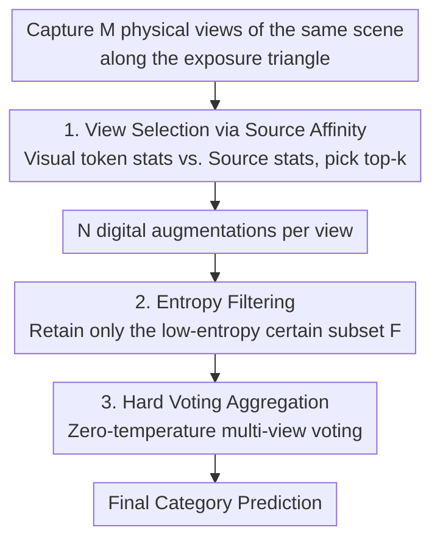

# Measurement Plasticity: Sensor-Level Adaptation for Vision–Language Models

**Conference**: ICML2026  
**arXiv**: [2512.12571](https://arxiv.org/abs/2512.12571)  
**Code**: To be confirmed  
**Area**: Multimodal VLM (Test-time Adaptation / Sensor-level Adaptation)  
**Keywords**: Vision-Language Models, Test-Time Adaptation, Physical Prompting, Exposure Triangle, Source Domain Affinity

## TL;DR
This paper shifts Test-Time Adaptation (TTA) for Vision-Language Models (VLM) from "tuning the model/tokens" to "tuning the camera/photons." By treating the camera's exposure triangle (ISO, shutter speed, aperture) as controllable "physical prompts," it selects multiple physical views based on source domain affinity during the capture stage, followed by entropy filtering and hard voting. Without any gradients or model modifications, this method significantly outperforms digital-only TTA methods under sensor-level distribution shifts.

## Background & Motivation

**Background**: Foundation models (especially VLMs like CLIP) are increasingly deployed in real-world environments with distributions differing from their training corpora, giving rise to "Continuous Test-Time Adaptation." Existing TTA methods mostly intervene within the model—updating weights, adding adapters, tuning prompts, or retrieving memory (e.g., TPT, PromptAlign, TDA)—essentially adjusting how the model interprets a fixed "already captured" image.

**Limitations of Prior Work**: In sensor-mediated real-world environments, VLMs do not receive clean web images but rather live captures. Settings like ISO, shutter speed, and aperture determine which photons reach the encoder. When a scene is underexposed, overexposed, or noisy, information is **irreversibly lost during the measurement stage**. Subsequent model adaptation can only operate on a degraded measurement. Existing benchmarks like ImageNet-ES have demonstrated that purely digital domain adaptation cannot bridge this "sensor-level robustness gap."

**Key Challenge**: The causal chain is "Scene $\to$ Measurement $\to$ Representation." Current TTA methods are stuck in the "Measurement $\to$ Representation" segment, whereas the primary information loss occurs during "Scene $\to$ Measurement." Once photons are not captured, no downstream compensation can recover them. This represents the hard upper bound of digital TTA under Auto-Exposure (AE, which optimizes for human eyes rather than models).

**Goal**: This paper aims to shift the "location of plasticity" for adaptation from inside the model to the sensor-model interface. It asks a complementary question: instead of adapting the model to the input, why not adapt "how the input is measured"? The objectives are: gradient-free, model-agnostic, and controllable capture during the acquisition stage.

**Key Insight**: Prior sensor control work such as Lens (Baek 2025) chooses sensor settings per scene based on model confidence. However, the authors observe that "single-view selection based solely on confidence" is prone to **overconfident errors**—a shifted capture might yield high confidence while inducing unreliable VLM features. Thus, they propose using "source domain affinity" for view selection and replacing single-view gambling with multi-view voting.

**Core Idea**: By treating the exposure triangle as physical prompts, multiple "physical views" with different settings are captured for the same scene. Those most similar to the source domain distribution are selected via source domain affinity, followed by entropy filtering of digital augmentations and final hard voting. Replacing "prompt optimization" with "view selection and voting" places plasticity at the sensor level.

## Method

### Overall Architecture

MVP (Multi-View Physical-prompt for TTA) is a **forward-only** framework. Given a static scene, it first captures $M$ physical views along the exposure triangle (ISO, shutter speed, aperture) as controllable physical prompts. The process follows three steps: (1) Rank each physical view using **source domain affinity** and select the top-$k$ views most similar to source domain statistics; (2) Perform **entropy filtering** on digital augmentations of the selected views to retain only the most certain subset; (3) Aggregate predictions using zero-temperature **hard voting**. The entire pipeline requires no gradients and no changes to CLIP weights, only modifying the "measurement distribution presented to the frozen model" to push inputs back into the reliable representation region. It is particularly suited for static, precision-sensitive scenarios like CCTV surveillance, automated inspection, and computer-assisted surgery.

### Key Designs

**1. View Selection via Source Affinity: Replacing "Confidence" with "Source Similarity"**

The design addresses the failure mode where "confidence-based single view selection" (like Lens) is misled by overconfident errors. Drawing inspiration from PromptAlign, the authors argue that a good view should have visual token statistics **closest to the source domain statistics**, rather than just high model confidence. Specifically, each physical view $v_i$ is expanded into $N$ digital augmentations, and a top-$\alpha$ fraction is selected by confidence to get $N'$ samples. Mean and variance $\mu_{i,l}, \sigma^2_{i,l}$ of image token embeddings are extracted from each layer $l$ of the frozen visual encoder and compared against pre-computed source statistics $(\mu_{s,l}, \sigma^2_{s,l})$. The source domain affinity score is defined as:

$$S_i=-\frac{1}{L}\sum_{l=1}^{L}\Big(\|\mu_{i,l}-\mu_{s,l}\|_2^2+\|\sigma^2_{i,l}-\sigma^2_{s,l}\|_2^2\Big)$$

where $L$ is the number of layers. Selecting top-$k$ settings with the highest $S_i$ ensures "source-aligned" physical views. Since CLIP's training data is private, ImageNet is used as a proxy source domain. This "gradient-free physical prompt selection" replaces "prompt optimization," maintaining gray-box compatibility with low computation. Intuitively, it allows the model to view the scene through "source-like visual evidence."

**2. Entropy Filtering + Hard Voting: Removing Uncertain Augmentations and Avoiding Overconfidence**

Even with top-$k$ physical parameters, digital augmentations may still contain uncertain or noisy samples due to local lighting or visual context. The authors use entropy $H_{i,n}=-\sum_c p_{i,n}(c)\log p_{i,n}(c)$ to measure uncertainty (where $p_{i,n}(c)$ is the prediction probability for category $c$). Across all $k \times N$ augmentations, only the lowest $\gamma\%$ are kept as the certain subset $\mathcal{F}$. Then, **hard voting** is performed on $\mathcal{F}$:

$$\hat{y}=\arg\max_{y\in\mathcal{C}}\sum_{(i,n)\in\mathcal{F}}\mathbf{1}\Big[\arg\max_{c\in\mathcal{C}}p_{i,n}(c)=y\Big]$$

where $\mathcal{C}$ is the set of categories. Hard voting is used instead of "averaging softmax probabilities" because the latter can be dominated by a single overconfident view; hard voting grants one vote per view, mitigating overconfidence while preserving the robustness gained from multiple physical views.

**3. Physical Multi-view as an Irreplaceable Augmentation Axis: Sensor Variance Provides Unique Degrees of Freedom**

This is the foundation of MVP's differentiation from standard multi-view TTA. The authors emphasize that rather than collapsing sensor control into a single capture, voting across top-$k$ source-affinity views is superior because changing ISO, shutter speed, and aperture alters the **measurement itself**. This "physical augmentation axis" **cannot be fully simulated** by post-hoc cropping, flipping, or photometric jittering. Post-processing can only transform captured photons, whereas sensor adjustments change "which photons are captured."

## Key Experimental Results

### Main Results

Evaluated on ImageNet-ES and ImageNet-ES-Diverse (based on Tiny-ImageNet with controlled lighting/sensor changes) using a ViT-B/16 backbone across three sensor protocols (AE / AE + photometric aug / Lens selection then TTA). MVP significantly outperforms all digital TTA methods under AE and provides a further boost on the Lens pipeline.

| Method | Category | ImageNet-ES (AE) | ImageNet-ES-Diverse (AE) |
| :--- | :--- | :--- | :--- |
| CLIP (Zero-shot) | Pre-trained | 48.98 | 37.65 |
| TPT | prompt-TTA | 55.66 | 41.20 |
| PromptAlign | prompt-TTA | 55.45 | 41.51 |
| MTA | Training-free TTA | 56.56 | 41.70 |
| TDA | Training-free TTA | 58.17 | 40.78 |
| ZERO | Training-free TTA | 57.05 | 39.91 |
| **MVP (Ours)** | Physical Multi-view | **87.85** | **67.28** |

Compared to the best digital TTA under AE, MVP improves accuracy by at least 29.68 and 25.58 percentage points on ImageNet-ES and ES-Diverse, respectively. It also outperforms "Lens + TTA" pipelines by up to 3.4 pp, proving that multiple physical parameters are more effective than single-view sensor control.

### Ablation Study (Different Acquisition Budgets CSA)

The Candidate Selection Algorithm (CSA) compresses the sensor parameter space into $M$ discrete grids to reduce acquisition latency. Without CSA, 27 views per scene take ~2.41s; CSA1/2/3 use 12, 6, and 21 views respectively.

| Configuration | Capture Latency | IN-ES | IN-ES-Diverse | Description |
| :--- | :--- | :--- | :--- | :--- |
| Lens (CSA1) | 1.06 s | 84.75 | 61.79 | Single-view sensor control baseline |
| Lens+ZERO (CSA1) | 1.06 s | 85.43 | 61.49 | Best digital TTA on top of Lens |
| **MVP (CSA1)** | 1.06 s | **87.27** | **63.79** | 12 views |
| **MVP (CSA2)** | 0.37 s | **86.65** | **63.79** | Only 6 views, latency near AE |
| **MVP (CSA3)** | 0.91 s | **87.87** | **64.41** | 21 views |

### Key Findings
- **Information loss at the measurement stage is unrecoverable**: CLIP performance degrades severely under AE, and digital TTA offers only marginal gains. This proves the necessity of sensor-level diversity.
- **Source affinity > Confidence**: Using source similarity avoids the failure mode of overconfident incorrect captures, and attention maps align better with source patterns.
- **Robustness with reduced capture**: Even when CSA reduces views to 6 (CSA2, latency $\approx$ AE), MVP maintains high accuracy, making it practical for real-world deployments.
- **Better Latency-Accuracy Trade-off**: While MVP/Lens without CSA trade ~4x latency for $\geq 23.3$ pp accuracy, MVP with CSA leads all Lens+TTA baselines even at lower latencies.

## Highlights & Insights
- **Shifting TTA from "tokens to photons" is a novel perspective**: This is the first work to treat the "measurement process" as a first-class location for plasticity, introducing the concept of "measurement plasticity."
- **The combination of source affinity and hard voting is effective**: The former corrects overconfident selection, while the latter prevents overconfident views from dominating the aggregation.
- **Convincing "Physical Augmentation Axis" argument**: Explicitly demonstrating that sensor adjustments change which photons are captured provides a mathematical distinction from digital augmentations.
- **Gradient-free and gray-box compatible**: Extremely deployment-friendly for static, precision-sensitive domains.

## Limitations & Future Work
- MVP is designed for **static, precision-sensitive** scenes. The premise of "multiple captures of the same scene" may not hold for fast-moving or single-frame real-time scenarios.
- Proxy source domain: Using ImageNet as a proxy for CLIP's private training data may introduce a gap that affects affinity selection.
- Generalization in complex outdoor lighting: Benchmarks are based on controlled variations; real-world complexity requires further validation.
- Future work could focus on **jointly** adapting the model, prompts, memory, and the "controllable process generating the input" rather than treating them as isolated choices.

## Related Work & Insights
- **vs. Lens (Baek 2025, sensor control baseline)**: Lens selects a **single** physical capture based on model confidence; MVP uses source affinity to select top-$k$ multi-views and votes, avoiding Lens's overconfidence errors.
- **vs. PromptAlign**: PromptAlign aligns test token statistics to source statistics in the digital domain; MVP uses the same "source alignment" idea but for **pre-capture physical view selection**.
- **vs. Forward-only TTA (TDA, ZERO, MTA, etc.)**: These methods modify prompts or features post-capture; MVP's differentiator is moving adaptation to the "capture stage" to modify the visual evidence reaching the encoder.

## Rating
- Novelty: ⭐⭐⭐⭐⭐ "Measurement plasticity" is a brand-new concept in TTA.
- Experimental Thoroughness: ⭐⭐⭐⭐ Extensive analysis across benchmarks and latencies, though limited to static scenes.
- Writing Quality: ⭐⭐⭐⭐ Clear causal narrative and well-founded differentiation between physical and digital augmentations.
- Value: ⭐⭐⭐⭐ Significant utility for sensor-mediated, accuracy-critical deployments.

<!-- RELATED:START -->

## Related Papers

- [\[CVPR 2026\] Decoupling Stability and Plasticity for Multi-Modal Test-Time Adaptation](../../CVPR2026/multimodal_vlm/decoupling_stability_and_plasticity_for_multi-modal_test-time_adaptation.md)
- [\[ICLR 2026\] Flatness-Guided Test-Time Adaptation for Vision-Language Models](../../ICLR2026/multimodal_vlm/flatness_guided_test-time_adaptation_for_vision-language_models.md)
- [\[CVPR 2025\] Realistic Test-Time Adaptation of Vision-Language Models](../../CVPR2025/multimodal_vlm/realistic_test-time_adaptation_of_vision-language_models.md)
- [\[CVPR 2026\] PointAlign: Feature-Level Alignment Regularization for 3D Vision-Language Models](../../CVPR2026/multimodal_vlm/pointalign_feature-level_alignment_regularization_for_3d_vision-language_models.md)
- [\[ICLR 2026\] Long-tailed Test-Time Adaptation for Vision-Language Models](../../ICLR2026/multimodal_vlm/long-tailed_test-time_adaptation_for_vision-language_models.md)

<!-- RELATED:END -->
## Related Papers

- [\[CVPR 2026\] Decoupling Stability and Plasticity for Multi-Modal Test-Time Adaptation](../../CVPR2026/multimodal_vlm/decoupling_stability_and_plasticity_for_multi-modal_test-time_adaptation.md)
- [\[CVPR 2026\] Do Vision-Language Models Measure Up? Benchmarking Visual Measurement Reading with MeasureBench](../../CVPR2026/multimodal_vlm/do_vision-language_models_measure_up_benchmarking_visual_measurement_reading_wit.md)
- [\[CVPR 2026\] PointAlign: Feature-Level Alignment Regularization for 3D Vision-Language Models](../../CVPR2026/multimodal_vlm/pointalign_feature-level_alignment_regularization_for_3d_vision-language_models.md)
- [\[ICLR 2026\] Bilateral Information-aware Test-time Adaptation for Vision-Language Models](../../ICLR2026/multimodal_vlm/bilateral_information-aware_test-time_adaptation_for_vision-language_models.md)
- [\[ACL 2026\] Cross-Cultural Expert-Level Art Critique Evaluation with Vision-Language Models](../../ACL2026/multimodal_vlm/cross-cultural_expert-level_art_critique_evaluation_with_vision-language_models.md)

<!-- RELATED:END -->
