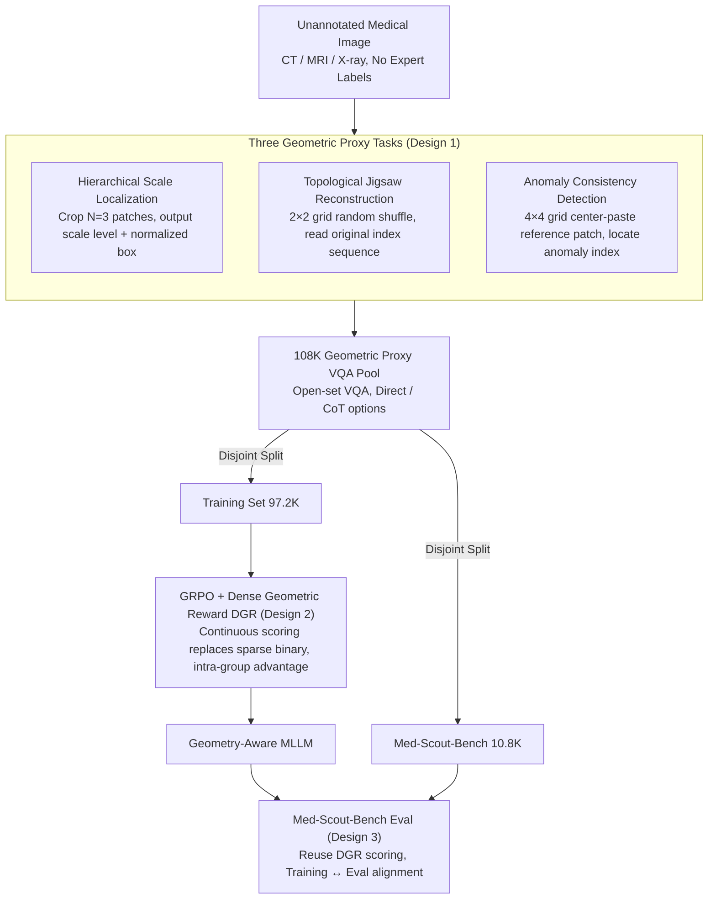

# Med-Scout: Curing MLLMs' Geometric Blindness in Medical Perception via Geometry-Aware RL Post-Training

**Conference**: ICML 2026  
**arXiv**: [2601.23220](https://arxiv.org/abs/2601.23220)  
**Code**: https://github.com/HKUSTGZ-ML4Health-Lab/Med-Scout  
**Area**: Medical Imaging  
**Keywords**: Medical MLLM, GRPO, Geometry-Aware, Proxy Tasks, Dense Reward  

## TL;DR
Med-Scout defines the systematic failure of medical MLLMs to adhere to image geometric constraints during lesion localization as "geometric blindness." It utilizes three geometric proxy tasks (Hierarchical Scale Localization / Topological Jigsaw / Anomaly Consistency) that do not require expert annotation, combined with Dense Geometric Rewards (DGR) under the GRPO framework for post-training. The authors also release Med-Scout-Bench for quantifying geometric blindness, demonstrating consistent improvements across four backbones and eight medical benchmarks, with open-source models even surpassing GPT-5 / Gemini-3-Flash.

## Background & Motivation
**Background**: Medical MLLMs represented by LLaVA-Med, HuatuoGPT-Vision, MedGemma, and Lingshu have approached clinical language styles in terminology generation and symptom description. Mainstream post-training paradigms still rely on SFT or RL with simple rewards, aiming for "semantic alignment"—ensuring generated reports match labels literally.

**Limitations of Prior Work**: The authors conducted three sets of pilot experiments on Qwen3-VL-8B-Instruct and Lingshu-7B, discovering systematic geometric blindness in existing medical MLLMs: (1) Lesions identified in local crops fail in the global view over 20% of the time (Scale blindness); (2) 80% of models fail to update spatial descriptions like "upper/lower" after 180° rotation (Topological blindness); (3) Given a cut-paste anomaly in the center, 90%+ of models fail to perceive it and output standard reports (Anomaly blindness). CoT prompting hardly mitigates these, proving they are perception-layer defects rather than prompt engineering issues.

**Key Challenge**: There is a structural misalignment between clinical AI requirements for "geometric faithfulness" and the goal of "semantic fluency." MLE (Maximum Likelihood Estimation) provides no mechanism to punish "wrong position, wrong scale, or missed anomalies" as long as the terminology is correct. General-domain jigsaw/grounding proxies (Jigsaw-R1, ViCrit, Euclid, GeoPQA) are not tailored to medical anatomical structures, modality specificity, and fine-grained anomalies.

**Goal**: (1) Construct geometric proxy tasks that automatically generate verifiable supervision signals on unannotated medical images; (2) Provide RL with a dense signal that avoids collapse due to sparse binary rewards; (3) Formalize "geometric blindness" into a quantifiable and reproducible benchmark.

**Key Insight**: Medical images inherently contain verifiable geometric facts—different crops of the same image must have consistent IoU, a $2\times 2$ grid jigsaw has a unique correct sequence, and cut-paste intrusion points are exactly known. These geometric constraints offer complete objective verifiability compared to "semantic correctness," making them ideal for RL based on intra-group relative comparison like GRPO.

**Core Idea**: Reformulate "teaching MLLMs to see medical images" as "teaching MLLMs to self-verify image geometric constraints without relying on annotations." Using three types of proxy tasks + Dense Geometric Rewards (DGR) under GRPO post-training builds a foundation for geometric perception, which then generalizes to downstream medical VQA and report generation.

## Method

### Overall Architecture
Med-Scout is a data-centric RL post-training framework. Given an unannotated medical image $I\in\mathbb{R}^{H\times W}$, it is first converted into three types of geometric proxy VQA tasks: scale tasks $\mathcal{T}_{\text{scale}}$, topological tasks $\mathcal{T}_{\text{topo}}$, and anomaly tasks $\mathcal{T}_{\text{anom}}$, all unified in an open-set VQA format. This automated pipeline produces 108K samples, strictly modality-balanced and split into two disjoint subsets: 97.2K for training and 10.8K for Med-Scout-Bench. Training is conducted via GRPO (KL coefficient $\beta=0.04$, group size $G=8$, cosine + warmup scheduler, AdamW, lr $1\times 10^{-6}$, for 7,200 steps). The total reward for each sample is $\mathcal{R}=\mathcal{R}_{\text{acc}}+\mathcal{R}_{\text{fmt}}+\mathbb{I}_{\text{CoT}}\cdot\mathcal{R}_{\text{reason}}$, where $\mathcal{R}_{\text{acc}}$ is the DGR designed per task type. Evaluation on Med-Scout-Bench reuses DGR scoring, ensuring isomorphism between training objectives and evaluation metrics. The entire process requires no expert annotation; all supervision signals are derived from geometric facts of the images themselves.

### Key Designs

**1. Three Geometric Proxy Tasks: Decomposing "Geometric Perception" into automatically constructible VQA with verifiable answers**

Pilot experiments show that geometric blindness is not a single concept but comprises scale, topological, and anomaly blindness. Consequently, proxy tasks are divided into three categories. **Hierarchical Scale Localization** simulates the clinical "magnifying glass" workflow by cropping $N=3$ patches: Level-1 (20% area) and Level-2 (6.25%). Center coordinates are limited to normalized $[0.2, 0.8]$ to avoid background noise. Models must output the scale level and normalized box $b=(x_1, y_1, x_2, y_2)$ for each patch, targeting "local vs. global consistency." **Topological Jigsaw Reconstruction** divides images into a $2\times 2$ grid with a random permutation $\sigma$, requiring the model to sequence the original indices (left-to-right, top-to-bottom), forcing horizontal/vertical spatial reasoning and targeting "anatomical position invariance." **Anomaly Consistency Detection** replaces a center patch in a $4\times 4$ grid with a reference patch (adjacent slice for CT/MRI, top-1 similar image via BiomedCLIP for X-ray). Models output the grid index of the anomaly, targeting "pixel-level structural consistency." All tasks are unified as open-set VQA with Direct or CoT modes. This "problem-oriented geometric decomposition" ensures each reward targets a specific clinical capability.

**2. Dense Geometric Reward (DGR) for GRPO: Continuous scoring to provide gradients in every group**

GRPO estimates relative advantage within a group. Using sparse 0/1 rewards often leads to groups where everyone is "all wrong" or "all right," resulting in zero advantage and uninformative gradients. DGR differentiates "near-miss" samples by their degree of geometric deviation: for scale tasks, rewards are split into value estimation $\mathcal{R}_{\text{val}}=\frac{1}{N}\sum_{i=1}^{N}\mathbb{I}(\hat y_i=y_i^*)$ and box IoU $\mathcal{R}_{\text{box}}=\frac{1}{N}\sum_{i=1}^N\text{IoU}(\hat b_i,b_i^*)$. Topological tasks use element-wise alignment $\mathcal{R}_{\text{topo}}=\frac{1}{N}\sum_{i=1}^N\mathbb{I}(\hat s_i=s_i^*)$. Anomaly tasks map indices to coordinates $(u,v)=(\lfloor k/4\rfloor,k\bmod 4)$ with reward:

$$\mathcal{R}_{\text{anom}}=\exp\!\Big(-\sqrt{(\hat u-u^*)^2+(\hat v-v^*)^2}/\tau\Big),$$

where closer distance yields higher reward. Item-level format rewards $\mathcal{R}_{\text{fmt}}$ and CoT structure rewards $\mathcal{R}_{\text{reason}}$ are also included. Using metrics like IoU and Euclidean distance as rewards ensures stable training without needing a separate reward model, thus avoiding reward hacking.

**3. Med-Scout-Bench: Transforming "Geometric Blindness" into a reproducible medical benchmark**

Previous medical MLLM evaluations used semantic VQA (failing to catch geometric errors) or segmentation/detection (outside the MLLM interface). Med-Scout-Bench maintains geometric scoring within the VQA interface. It draws 10,800 items from a pool of 108,000 VQA pairs (covering anatomy via TotalSegmentor for CT/MRI and MIMIC-CXR for X-ray), strictly modality-balanced and disjoint from the training set. Evaluation is open-set, using LLM-as-a-Judge (Gemini-3-Flash) for semantic correctness to avoid the fragility of string matching. Crucially, it reuses the DGR defined in Section 4.2, aligning training and evaluation. Bench scores correlate strongly with downstream tasks like PMC-VQA, making it a reliable proxy for broad medical perception.

### Loss & Training
GRPO Optimization: Group size $G=8$, KL coefficient $\beta=0.04$, global batch 192, cosine LR decay, warmup 0.01, AdamW, peak lr $1\times 10^{-6}$, 7,200 steps on 6×NVIDIA RTX PRO 6000. Backbones: Qwen3-VL-4B/8B-Instruct, Lingshu-7B, and HuatuoGPT-Vision-7B.

## Key Experimental Results

### Main Results

| Backbone | Med-Scout-Bench Avg | Rad-VQA | VQA-RAD | SLAKE | MIMIC-CXR CIDEr | Meaning |
|---|---|---|---|---|---|---|
| Qwen3-VL-8B-Instruct | 39.7 → **83.6** (+43.9) | 41.6 → 45.3 | 63.2 → 65.8 | 69.6 → 72.0 | 64.8 → 68.1 | General backbone surpasses GPT-5/Gemini-3-Flash |
| Lingshu-7B | 31.9 → **71.9** (+40.0) | 61.2 → 64.0 | 68.9 → 71.0 | 82.8 → 83.0 | 104.9 → 105.2 | Already SOTA still improves |
| HuatuoGPT-Vision-7B | — | 48.8 → 52.1 | 67.0 → 70.1 | 67.8 → 71.0 | 75.6 → 79.0 | PMC-VQA increases by 2.9 |
| Qwen3-VL-4B-Instruct | — | 41.5 → 45.7 | 59.9 → 62.9 | 73.4 → 75.6 | 60.9 → 65.2 | Significant gain for small models |

Reference proprietary model performance: GPT-5 Rad-VQA 59.1 / VQA-RAD 66.4, Gemini-3-Flash 60.7 / 70.2. Open-source Lingshu-7B+Med-Scout achieves 71.0 on VQA-RAD, exceeding Gemini-3-Flash.

### Ablation Study (Comparison with existing visual proxy tasks, using sparse rewards)

| Method | Med (Medical) | Geo (Geometric) | Rad-VQA Avg | Gen. Avg | Description |
|---|---|---|---|---|---|
| Qwen3-VL-4B baseline | - | - | 58.3 | 38.4 | Starting point |
| + Jigsaw-R1 | ✗ | ✓ | 57.6 (−0.7) | 38.3 (−0.1) | General jigsaw drops performance |
| + ViCrit | ✗ | ✗ | 57.7 (−0.6) | 38.4 (=0.0) | General grounding has no gain |
| + **Med-Scout (sparse)** | ✓ | ✓ | **60.8 (+2.5)** | **40.2 (+1.8)** | Stable improvement even without DGR |
| Qwen3-VL-8B + Med-Scout (sparse) | ✓ | ✓ | 60.4 (+2.3) | 40.5 (+1.4) | Similar trend for 8B |

### Key Findings
- Improvements on the Bench exceed +40 percentage points, indicating that the geometric perception gap in existing medical MLLMs was severely underestimated. Bench scores correlate with external benchmarks, verifying geometric perception as a foundational capability.
- General backbones (Qwen3-VL) show larger gains than specialized medical models, suggesting strong vision-language bases absorb geometric signals better, contrasting with SFT-era experiences.
- Performance between Direct and Reasoning Modes is similar; the authors suggest structural rewards $\mathcal{R}_{\text{reason}}$ only constrained templates rather than reasoning logic itself.
- Data scaling: Performance increases monotonically from 20% to 100% of training data without saturation, showing further potential for proxy task development.

## Highlights & Insights
- Decomposing geometric blindness into scale/topo/anomaly blindness and pairing them with specific proxy tasks is intuitive and effective. This "diagnostic-first" methodology is transferable to other perception-critical tasks (e.g., autonomous driving).
- The core insight of DGR is that intra-group RL requires reward variance. Using IoU, Euclidean distance, and element-wise hits directly as continuous rewards avoids the complexity of training separate reward models and prevents reward hacking.
- Using BiomedCLIP for X-ray cut-paste reference retrieval ensures the "anomaly patch" has radiologically plausible textures, preventing shortcut learning from simple noise blocks.

## Limitations & Future Work
- Geometric focus: Neglects modality-specific physics (e.g., CT HU value calibration, MRI multi-sequence comparison). Geometry is just one dimension of medical image constraints.
- LLM-as-a-Judge: Using Gemini-3-Flash for semantic evaluation introduces potential judge bias, especially since it was also used during training evaluation.
- Reasoning Mode: Provides little gain despite higher cost, suggesting CoT rewards in medical geometric tasks need refinement to avoid CoT maturing into simple output padding.
- Proprietary evaluation: Med-Scout cannot be applied to GPT-5 or Gemini-3-Flash (no weight access), so "open-source surpassing proprietary" is strictly valid on Med-Scout-Bench.

## Related Work & Insights
- **vs. Jigsaw-R1 / Visual Jigsaw**: Both use grid reordering, but Jigsaw-R1 is general-domain and focuses on $2\times 2$ puzzles. Med-Scout combines this with scale and anomaly tasks specifically for medical anatomical structures.
- **vs. ViCrit**: ViCrit use executable programs for verification in general contexts; Med-Scout’s metrics (IoU, distance) are intrinsic medical imaging measures requiring no external execution.
- **vs. Euclid / GeoPQA**: These inject geometric priors (points, lines) into general MLLMs. Med-Scout extends "geometry" to scale, topology, and anomalies relevant to clinical settings.
- **vs. LLaVA-Med / Lingshu**: These focus on SFT/semantic alignment. Med-Scout is a post-training framework that can be stacked on top of them, as demonstrated by gains across all four backbones.

## Rating
- Novelty: ⭐⭐⭐⭐ Clear problem naming; well-designed proxy tasks. Innovation lies in "medicalization and densification" of the RL paradigm.
- Experimental Thoroughness: ⭐⭐⭐⭐⭐ 4 backbones × 8 benchmarks + data scaling + CoT comparison + comparison with general proxy tasks and proprietary models.
- Writing Quality: ⭐⭐⭐⭐⭐ Pilot experiments provide strong motivation; methodology, formulas, and algorithm descriptions are clear.
- Value: ⭐⭐⭐⭐⭐ Contributes method, benchmark, and four model weights. Med-Scout-Bench is positioned to become a standard for medical MLLM geometric perception.

<!-- RELATED:START -->

## Related Papers

- [\[CVPR 2026\] Why Does RL Generalize Better Than SFT? A Data-Centric Perspective on VLM Post-Training](../../CVPR2026/multimodal_vlm/why_does_rl_generalize_better_than_sft_a_data-centric_perspective_on_vlm_post-tr.md)
- [\[ICML 2026\] FreeRet: MLLMs as Training-Free Retrievers](freeret_mllms_as_training-free_retrievers.md)
- [\[AAAI 2026\] Revisiting the Data Sampling in Multimodal Post-training from a Difficulty-Distinguish View](../../AAAI2026/multimodal_vlm/revisiting_the_data_sampling_in_multimodal_post-training_from_a_difficulty-disti.md)
- [\[CVPR 2026\] Bias Is a Subspace, Not a Coordinate: A Geometric Rethinking of Post-hoc Debiasing in Vision-Language Models](../../CVPR2026/multimodal_vlm/bias_is_a_subspace_not_a_coordinate_a_geometric_rethinking_of_post-hoc_debiasing.md)
- [\[ICLR 2026\] How Do Medical MLLMs Fail? A Study on Visual Grounding in Medical Images](../../ICLR2026/multimodal_vlm/how_do_medical_mllms_fail_a_study_on_visual_grounding_in_medical_images.md)

<!-- RELATED:END -->
