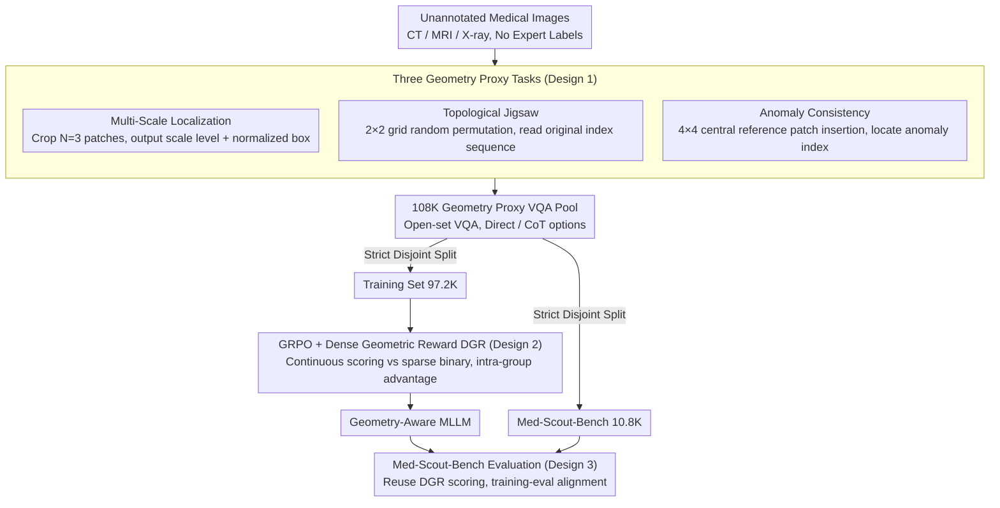

# Med-Scout: Curing MLLMs' Geometric Blindness in Medical Perception via Geometry-Aware RL Post-Training

**Conference**: ICML 2026  
**arXiv**: [2601.23220](https://arxiv.org/abs/2601.23220)  
**Code**: https://github.com/HKUSTGZ-ML4Health-Lab/Med-Scout  
**Area**: Medical Imaging  
**Keywords**: Medical MLLM, GRPO, Geometry-Aware, Proxy Task, Dense Reward

## TL;DR
Med-Scout defines the systemic deficiency where "medical MLLMs fail to follow geometric constraints during lesion localization" as "geometric blindness." It utilizes three geometry proxy tasks (Multi-Scale Localization / Topological Jigsaw / Anomaly Consistency) that require no expert annotation, combined with Dense Geometric Reward (DGR) for post-training under GRPO. The authors release Med-Scout-Bench to quantify geometric blindness, achieving consistent improvements across four backbones and eight medical benchmarks, with open-source models even surpassing GPT-5 / Gemini-3-Flash.

## Background & Motivation
**Background**: Medical MLLMs such as LLaVA-Med, HuatuoGPT-Vision, MedGemma, and Lingshu have approached clinical language styles in terminology generation and symptom description. The dominant post-training paradigm remains SFT or RL with simple rewards, targeting "semantic alignment"—ensuring generated reports match the ground truth labels textually.

**Limitations of Prior Work**: The authors conducted three sets of pilot experiments on Qwen3-VL-8B-Instruct and Lingshu-7B, revealing systemic geometric blindness in existing medical MLLMs: (1) A lesion identified in a local crop fails to be recognized in 20%+ of cases when returned to the global view (scale blindness); (2) After rotating an image by 180°, 80% of models fail to update spatial descriptions like "upper/lower" (topological blindness); (3) When an anomalous region is inserted into the center of an image via cut-paste, 90%+ of models fail to detect it and output standard reports regardless (anomaly blindness). CoT prompting provides almost no relief, proving this is a perception-layer deficiency rather than a prompt engineering issue.

**Key Challenge**: There is a structural misalignment between the requirement for "geometric faithfulness" in clinical AI and the objective of "semantic fluency." MLE-based likelihood maximization lacks mechanisms to penalize "incorrect positioning, wrong scales, or missed anomalies"; as long as the model uses the correct terminology, it receives a high score. Furthermore, general-domain visual jigsaw/grounding proxies (Jigsaw-R1, ViCrit, Euclid, GeoPQA) do not target medical anatomical structures, modality specificity, or fine-grained anomalies.

**Goal**: (1) Construct geometric proxy tasks that automatically generate verifiable supervision signals on unannotated medical images; (2) Provide RL with a dense signal to prevent collapse caused by sparse binary rewards; (3) Formulate the "geometric blindness" deficiency into a quantifiable and reproducible benchmark.

**Key Insight**: Medical images inherently contain verifiable geometric facts—different crops of the same image must have consistent IoU, a $2\times 2$ grid jigsaw has a unique correct sequence, and the location of a cut-paste intrusion is perfectly known. These geometric constraints possess absolute objective verifiability compared to "semantic correctness," making them naturally suitable for GRPO, which is based on intra-group relative comparison.

**Core Idea**: Reformulate "teaching MLLMs to see medical images" as "teaching MLLMs to self-verify image geometric constraints without relying on annotations." By applying three types of proxy tasks + Dense Geometric Reward for post-training under GRPO, the model establishes a foundation of geometric perception, which then generalizes to downstream medical VQA and report generation.

## Method

### Overall Architecture
Med-Scout is a data-centric RL post-training framework. Given an unannotated medical image $I\in\mathbb{R}^{H\times W}$, it is first converted into three types of geometric proxy VQA tasks: Scale task $\mathcal{T}_{\text{scale}}$, Topological task $\mathcal{T}_{\text{topo}}$, and Anomaly task $\mathcal{T}_{\text{anom}}$, all unified in an open-set VQA format. This automated pipeline produces 108K samples, strictly balanced by modality and split into two disjoint subsets: 97.2K for the training set and 10.8K for Med-Scout-Bench. Training is conducted on the training set using GRPO (KL coefficient $\beta=0.04$, group size $G=8$, cosine + warmup, AdamW, lr $1\times 10^{-6}$, 7,200 steps). The total reward for each sample is $\mathcal{R}=\mathcal{R}_{\text{acc}}+\mathcal{R}_{\text{fmt}}+\mathbb{I}_{\text{CoT}}\cdot\mathcal{R}_{\text{reason}}$, where $\mathcal{R}_{\text{acc}}$ is the Dense Geometric Reward (DGR) designed per task type. Evaluation on Med-Scout-Bench directly reuses DGR scoring, ensuring isomorphism between training objectives and evaluation metrics. The entire process requires no expert annotation, as all supervision signals are derived from the geometric facts of the images themselves.

### Key Designs

**1. Three Geometry Proxy Tasks: Decomposing "Geometric Perception" into verifiable VQA categories**

The geometric blindness exposed in pilot experiments is not a single concept but comprises scale, topological, and anomaly blindness. Thus, the proxy tasks are categorized accordingly. **Hierarchical Scale Localization** simulates the clinical "magnifying glass" workflow by cropping $N=3$ patches simultaneously from the original image, belonging to Level-1 (20% area) and Level-2 (6.25%). Center coordinates are restricted to normalized $[0.2, 0.8]$ to avoid background noise. The model must output the scale level and normalized box $b=(x_1, y_1, x_2, y_2)$ for each patch, targeting "local vs. global consistency." **Topological Jigsaw Reconstruction** divides the image into a $2\times 2$ grid and applies a random permutation $\sigma$, requiring the model to read the original index sequence (Left $\rightarrow$ Right, Top $\rightarrow$ Bottom), forcing spatial reasoning across both axes to address "anatomical position invariance." **Anomaly Consistency Detection** replaces one patch in the center of a $4\times 4$ grid with a reference patch (adjacent slices for CT/MRI, top-1 similar images retrieved via BiomedCLIP for X-ray). The model must output the grid index of the anomalous patch, targeting "pixel-level structural consistency." All tasks are unified as open-set VQA with Direct or CoT modes. This problem-oriented decomposition ensures each reward aligns with a specific clinical capability.

**2. Dense Geometric Reward (DGR) Integrated into GRPO: Replacing sparse binary signals with continuous scores**

GRPO performs relative advantage estimation within a group. If sparse 0/1 rewards are used, the probability of "all wrong" in hard groups or "all right" in easy groups is high, making the advantage degenerate to 0 and gradients uninformative. DGR differentiates samples based on geometric deviation: for the scale task, the reward is split into value estimation $\mathcal{R}_{\text{val}}=\frac{1}{N}\sum_{i=1}^{N}\mathbb{I}(\hat y_i=y_i^*)$ and box IoU $\mathcal{R}_{\text{box}}=\frac{1}{N}\sum_{i=1}^N\text{IoU}(\hat b_i, b_i^*)$. The topological task uses element-wise alignment $\mathcal{R}_{\text{topo}}=\frac{1}{N}\sum_{i=1}^N\mathbb{I}(\hat s_i=s_i^*)$, awarding points for correct patches even if the sequence is imperfect. The anomaly task maps the flattened index back to coordinates $(u, v)=(\lfloor k/4\rfloor, k\bmod 4)$, with reward:

$$\mathcal{R}_{\text{anom}}=\exp\!\Big(-\sqrt{(\hat u-u^*)^2+(\hat v-v^*)^2}/\tau\Big),$$

where proximity to the target increases the reward. Additionally, item-level format rewards $\mathcal{R}_{\text{fmt}}=\frac{0.5}{N}\sum_{i=1}^N\mathbb{I}(\hat a_i\in\Phi_{\text{regex}})$ are applied, with structural rewards $\mathcal{R}_{\text{reason}}=0.5$ in CoT mode (validating the `<think>...</think><answer>...</answer>` template). The maximum reward for a perfect CoT response is $\mathcal{R}=2.0$. Using IoU, Euclidean distance, and element-wise hits as rewards ensures informative gradients and stable convergence without the risk of reward hacking.

**3. Med-Scout-Bench: Quantifying "Geometric Blindness" into a repeatable medical benchmark**

Previous medical MLLM evaluations used semantic questions like VQA-RAD (which miss geometric errors) or segmentation/detection (which do not fit the MLLM interface). Med-Scout-Bench maintains geometric scoring within a VQA interface. It draws from a pool of 108,000 VQA items (using TotalSegmentor for CT/MRI to ensure anatomical coverage and MIMIC-CXR for X-ray), with 10,800 items (10%) strictly balanced by modality for the benchmark. Evaluation is open-set without options, utilizing LLM-as-a-Judge (Gemini-3-Flash) for semantic accuracy to avoid the fragility of string matching. Crucially, scoring reuses the DGR defined in the training phase, ensuring strict alignment between training objectives and evaluation metrics. Experiments show that Bench scores correlate strongly with downstream tasks like PMC-VQA and MedXpertQA.

### Loss & Training
GRPO Optimization: Group size $G=8$, KL coefficient $\beta=0.04$, global batch 192, cosine LR decay, warmup 0.01, AdamW, peak lr $1\times 10^{-6}$; trained for 7,200 steps on 6×NVIDIA RTX PRO 6000. Four backbones: general-purpose Qwen3-VL-4B/8B-Instruct, and specialized Lingshu-7B and HuatuoGPT-Vision-7B.

## Key Experimental Results

### Main Results

| Backbone | Med-Scout-Bench Avg | Rad-VQA | VQA-RAD | SLAKE | MIMIC-CXR CIDEr | Significance |
|---|---|---|---|---|---|---|
| Qwen3-VL-8B-Instruct | 39.7 → **83.6** (+43.9) | 41.6 → 45.3 | 63.2 → 65.8 | 69.6 → 72.0 | 64.8 → 68.1 | General backbone surpasses GPT-5/Gemini-3-Flash |
| Lingshu-7B | 31.9 → **71.9** (+40.0) | 61.2 → 64.0 | 68.9 → 71.0 | 82.8 → 83.0 | 104.9 → 105.2 | Already SOTA but still improves |
| HuatuoGPT-Vision-7B | — | 48.8 → 52.1 | 67.0 → 70.1 | 67.8 → 71.0 | 75.6 → 79.0 | PMC-VQA gains 2.9 |
| Qwen3-VL-4B-Instruct | — | 41.5 → 45.7 | 59.9 → 62.9 | 73.4 → 75.6 | 60.9 → 65.2 | Most significant gain in small models |

Proprietary model upper bounds: GPT-5 Rad-VQA 59.1 / VQA-RAD 66.4, Gemini-3-Flash 60.7 / 70.2. Open-source Lingshu-7B+Med-Scout achieves 71.0 on VQA-RAD, exceeding Gemini-3-Flash.

### Ablation Study (Comparison with existing visual proxy tasks; DGR disabled, sparse reward used)

| Method | Med | Geo | Rad-VQA Avg | Gen. Avg | Significance |
|---|---|---|---|---|---|
| Qwen3-VL-4B baseline | - | - | 58.3 | 38.4 | Baseline |
| + Jigsaw-R1 | ✗ | ✓ | 57.6 (−0.7) | 38.3 (−0.1) | General jigsaw causes performance drop |
| + ViCrit | ✗ | ✗ | 57.7 (−0.6) | 38.4 (=0.0) | General grounding yields no gain |
| + **Med-Scout (sparse)** | ✓ | ✓ | **60.8 (+2.5)** | **40.2 (+1.8)** | Consistent gain even with sparse rewards |
| Qwen3-VL-8B + Med-Scout (sparse) | ✓ | ✓ | 60.4 (+2.3) | 40.5 (+1.4) | Similar trend for 8B |

### Key Findings
- Improvements on the Bench exceed +40 percentage points, indicating that the geometric perception gap in existing medical MLLMs was significantly underestimated. Bench scores correlate strongly with average accuracy across six external benchmarks.
- General backbones (Qwen3-VL-4B/8B) show systematically larger improvements than specialized medical models, suggesting strong vision-language bases better absorb geometric supervision signals.
- Direct Mode and Reasoning Mode show similar performance. The authors speculate that $\mathcal{R}_{\text{reason}}$ only constrained the `<think>...</think>` template rather than the logic itself, suggesting room for refinement in CoT supervision.
- Data Scaling: Performance on the Bench increases monotonically from 20% to 100% of training data without saturation, indicating further potential in developing geometric proxy signals.

## Highlights & Insights
- The decomposition of geometric blindness into scale, topological, and anomaly blindness with corresponding proxy tasks is intuitive. This methodology—diagnosing specific blind spots via pilot experiments before designing targeted proxies—is transferable to any perception-critical multimodal task.
- The core insight of DGR is that intra-group RL requires reward variance. Using IoU, Euclidean distance, and element-wise hits as continuous rewards avoids the complexity of training reward models and prevents reward hacking.
- Utilizing BiomedCLIP for X-ray cut-paste reference retrieval ensures that "anomaly patches" possess radiologically plausible textures, avoiding shortcut learning from simple noise blocks.

## Limitations & Future Work
- The proxy tasks focus exclusively on "geometry" and do not model modality-dependent physical quantities (e.g., CT HU value calibration, multi-sequence MRI comparison). Future work should include "physical consistency" and "temporal consistency."
- Med-Scout-Bench relies on LLM-as-a-Judge (Gemini-3-Flash), which bears the risk of evaluator bias, potentially introducing circular bias if the same model was involved in training phases.
- Reasoning Mode provides negligible gains despite higher training costs, suggesting that "CoT template rewards + RL" in medical geometry tasks requires rethinking; CoT may degenerate into output padding without logic constraints.
- Evaluation on proprietary models (GPT-5/Gemini-3-Flash) cannot utilize Med-Scout (due to no weight access). Thus, the "open-source outperforming proprietary" claim strictly applies to Med-Scout-Bench; on general medical VQA, proprietary models still lead slightly (e.g., SLAKE).

## Related Work & Insights
- **vs. Jigsaw-R1 / Visual Jigsaw**: Both use grid rearrangement as a proxy. However, Jigsaw-R1 targets general spatial reasoning with $2\times 2$ jigsaws, while Med-Scout combines this with multi-scale localization and anomaly detection specifically for medical anatomy.
- **vs. ViCrit**: ViCrit uses executable programs for verification but lacks a medical context. Med-Scout uses IoU and Euclidean distance, which are objective metrics inherent to medical imaging.
- **vs. Euclid / GeoPQA / GeoGPT4V**: These works inject geometric priors (points, lines, angles) into general MLLMs. Med-Scout extends "geometry" to scale, topology, and anomaly dimensions relevant to clinical scenarios.
- **vs. LLaVA-Med / HuatuoGPT-Vision / MedGemma / Lingshu**: These models focus on SFT/semantic alignment. Med-Scout is a post-training framework that can be stacked on top of them, as evidenced by gains across four different backbones.

## Rating
- Novelty: ⭐⭐⭐⭐ Clear definition of "geometric blindness" and well-designed proxy tasks; however, the RL + proxy task paradigm exists in the general domain (Jigsaw-R1/ViCrit).
- Experimental Thoroughness: ⭐⭐⭐⭐⭐ Comprehensive coverage across 4 backbones, 8 benchmarks, data scaling, and comparisons with proprietary models.
- Writing Quality: ⭐⭐⭐⭐⭐ Motivations are compellingly explained via pilot experiments, and methodologies are clearly described.
- Value: ⭐⭐⭐⭐⭐ Contributes methods, benchmarks, and model weights; Med-Scout-Bench may become a de facto standard for medical geometric perception.

<!-- RELATED:START -->

## Related Papers

- [\[ICML 2026\] From Seeing to Thinking: Decoupling Perception and Reasoning Improves Post-Training of Vision-Language Models](from_seeing_to_thinking_decoupling_perception_and_reasoning_improves_post-traini.md)
- [\[CVPR 2026\] Why Does RL Generalize Better Than SFT? A Data-Centric Perspective on VLM Post-Training](../../CVPR2026/multimodal_vlm/why_does_rl_generalize_better_than_sft_a_data-centric_perspective_on_vlm_post-tr.md)
- [\[ICML 2026\] FreeRet: MLLMs as Training-Free Retrievers](freeret_mllms_as_training-free_retrievers.md)
- [\[AAAI 2026\] Revisiting the Data Sampling in Multimodal Post-training from a Difficulty-Distinguish View](../../AAAI2026/multimodal_vlm/revisiting_the_data_sampling_in_multimodal_post-training_from_a_difficulty-disti.md)
- [\[NeurIPS 2025\] Enhancing Outcome Reward-Based RL Training of MLLMs with Self-Consistency Sampling](../../NeurIPS2025/multimodal_vlm/enhancing_the_outcome_reward-based_rl_training_of_mllms_with_self-consistency_sa.md)

<!-- RELATED:END -->
