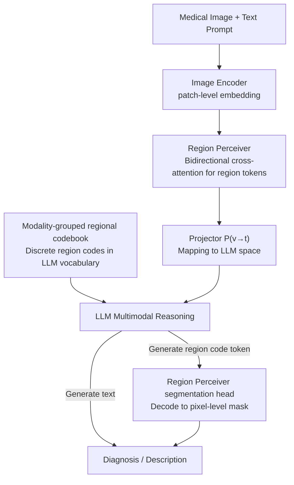

# MedSIGHT: Towards Grounded Visual Comprehension in Medical Large Vision-Language Models

**Conference**: ICML2026  
**arXiv**: [2606.06760](https://arxiv.org/abs/2606.06760)  
**Code**: Public (The paper states "Code and model available at GitHub," please refer to the original text for the specific link)  
**Area**: Multimodal VLM / Medical Imaging  
**Keywords**: Medical Large Vision-Language Models, pixel-level grounding, regional codebook, unified segmentation and understanding, progressive training

## TL;DR
MedSIGHT incorporates a "region perceiver" and a set of "modality-grouped regional codebooks" into a medical LVLM. This allows a single generative model to perform diagnostic reasoning while directly generating discrete region codes that are decoded into segmentation masks. Using only 72K instruction samples, it achieves SOTA performance simultaneously on both understanding and segmentation tasks.

## Background & Motivation
**Background**: Medical Large Vision-Language Models (Med-LVLMs) are capable of localized image-text understanding and medical image segmentation, but understanding and segmentation are often treated as decoupled capabilities. To enable models to both "provide a diagnosis" and "delineate lesions," mainstream approaches (e.g., MedPLIB, following the LISA methodology) attach a large external segmentation model (SAM-Med2D) to the LLM, using a special `[SEG]` token to trigger segmentation.

**Limitations of Prior Work**: This "external segmenter + single-token trigger" design has two major drawbacks. On the input side, existing models only use patch-level features extracted by CLIP. High-level CLIP patch tokens primarily encode high-level semantics, discarding fine-grained spatial information such as lesion boundaries, organ contours, and tissue textures, leading to inconsistencies between diagnostic reasoning and segmentation results. On the output side, compressing all regions into a single `[SEG]` token forces the model to represent vastly different anatomical structures and pathologies with one symbol, severely limiting expressive power and preventing diverse, region-specific outputs.

**Key Challenge**: A truly grounded Med-LVLM requires **detailed perception at the input** and **diverse region-level expression at the output**. Current architectures are bottlenecked by fuzzy patch features and restricted single-token representation.

**Goal**: To unify visual understanding, grounding, and segmentation within a **single generative framework**, enhancing both input perception and output expression.

**Core Idea**: A "region perceiver" is used to upsample patch features and refine them into spatial-rich region tokens for the LLM (input enhancement). Furthermore, "modality-grouped regional codebooks" are used to discretize continuous region embeddings and insert them into the LLM vocabulary, allowing the LLM to generate multiple semantic region codes—like ordinary words—which are then decoded into masks (output enhancement).

## Method

### Overall Architecture
MedSIGHT accepts a medical image $I$ and a text prompt $T$. The image is processed by a pre-trained image encoder $\mathcal{E}$ to obtain patch-level embeddings $\mathbf{I}$, which are then refined by a **region perceiver** $\mathcal{R}$ into region-level embeddings $\mathbf{Q}_r$. The combined $[\mathbf{I};\mathbf{Q}_r]$ are mapped into the LLM space via a projector $\mathcal{P}_{v\to t}$ to obtain visual embeddings $\mathbf{V}$. Simultaneously, the LLM vocabulary is expanded with a set of **modality-grouped regional codebooks** $\mathbf{C}$. $\mathbf{V}$, text embeddings $\mathbf{T}$, and codebook embeddings $\mathbf{C}$ are fed into the LLM for multimodal reasoning. When the model generates a region code token in its response, its hidden state is projected back to the visual space and decoded into pixel-level masks by the region perceiver's segmentation head. This completes the "description-localization-segmentation" loop within a **unified end-to-end generative framework**. Since the three modules (perceiver, codebook, LLM) reside in different representation spaces, they are aligned using a **progressive four-stage training pipeline**.

### Key Designs

**1. Region Perceiver: Refining patch features into detail-rich region tokens**

Addressing the input-side limitation where CLIP patch features lose spatial detail, the region perceiver introduces a set of learnable region query tokens $\mathbf{Q}\in\mathbb{R}^{N\times d}$ as "adaptive anchors," where $N$ is the number of regions and $d$ is the latent dimension. $\mathcal{R}$ consists of $L$ iterative layers. Each layer uses a lightweight convolutional adapter to upsample low-resolution patch embeddings into refined visual features $\mathbf{E}^{l-1}=\text{ConvAdapter}(\mathbf{I}^{l-1})$, followed by **bidirectional cross-attention** between region queries and visual features. Region-to-image attention allows queries to aggregate spatial information from refined features $\mathbf{Q}^{l}=\text{FFN}_r(\text{CrossAtt}_{r\to i}(\mathbf{Q}^{l-1},\mathbf{E}^{l-1}))$, while image-to-region attention updates image representations under region-level semantic supervision $\mathbf{I}^{l}=\text{FFN}_i(\text{CrossAtt}_{i\to r}(\mathbf{E}^{l-1},\mathbf{Q}^{l}))$. After $L$ layers, it outputs region embeddings $\mathbf{Q}_r$ and high-resolution image features $\mathbf{I}_r$, supervised by segmentation and classification heads. Unlike fixed-scale CLIP encoders or Q-Former style perceivers, this progressive upsampling and bidirectional refinement ensures each region token captures both global semantics and fine-grained details while maintaining efficiency by providing few tokens to the LLM.

**2. Modality-grouped regional codebook: Enabling multi-code regional expression in LLM**

To solve the output-side bottleneck of single-token representation, continuous region embeddings $\mathbf{Q}_r$ are discretized into interpretable visual concept codes. Given the significant differences between CT, MRI, and X-ray, the codebook is grouped by modality $\hat{\mathbf{C}}=\{\mathbf{c}_{k,m}\}$, where each modality $k$ maintains $M$ region codes. Each region embedding is projected via $\mathbf{W}_q$ to a quantization space and assigned to the nearest entries $\{k^*,m^*\}=\arg\min_{k,m}\|\mathbf{W}_q\mathbf{Q}_r^i-\mathbf{c}_{k,m}\|_2^2$, then mapped back via $\mathbf{W}_m$. The codebook is optimized using vector quantization loss $\mathcal{L}_\text{VQ}$, $\ell_2$ reconstruction loss $\mathcal{L}_\text{recon}=\|\tilde{\mathbf{Q}_r}-\mathbf{Q}_r\|_2^2$, and region perceiver pre-training loss $\mathcal{L}_\mathcal{R}$ to preserve spatial grounding. These learned discrete codes are initialized in the LLM embedding space via $\mathcal{P}_{v\to t}$ and appended to the vocabulary. This allows the LLM to generate multiple region codes (e.g., `[C2_16]`) corresponding to different anatomical/pathological concepts, offering far greater expressivity than a single `[SEG]` token. Visualizations show that codes learn clear anatomical semantics (e.g., `[C1_16]` consistently focuses on the liver in abdominal CT).

**3. Progressive four-stage training pipeline: Stable alignment of heterogeneous modules**

Direct joint training of the three modules is unstable due to mismatched representation spaces. The authors apply a progressive pipeline: ① **Region Perceiver Pre-training**: Train $\mathcal{R}$ on segmentation/detection data $\mathcal{D}_\text{seg}$ from BiomedParse. Segmentation supervision $\mathcal{L}_\text{seg}$ uses BCE + Dice, and classification uses cross-entropy, with Hungarian matching for one-to-one region assignment. ② **Vision-to-Text Alignment**: Freeze LLM, image encoder, and $\mathcal{R}$, training only the projector $\mathcal{P}_{v\to t}$ to align $[\mathbf{I};\mathbf{Q}_r]$ to the language space. ③ **Codebook Learning + Text-to-Vision Alignment**: After learning the codebook and merging it into the vocabulary, region codes act as "triggers" in LLM responses. When the LLM generates a code, its hidden state $\mathbf{H}_t$ is projected back via $\mathcal{P}_{t\to v}$ and decoded by the segmentation head, supervised by $\mathcal{L}_\text{seg}$. Only $\mathcal{P}_{t\to v}$ and new token embeddings are updated. ④ **Unified Grounded Instruction Tuning**: Unfreeze the LLM and jointly fine-tune the LLM, codebook, and both projectors (freezing $\mathcal{R}$ and the encoder). The objective $\mathcal{L}_\text{final}=\mathcal{L}_\text{LLM}+\mathcal{L}_\text{seg}$ utilizes standard medical instructions $\mathcal{D}_\text{inst}^r$ and grounding instructions $\mathcal{D}_\text{inst}^g$ to achieve the "description-localization-segmentation" loop.

### Loss & Training
- Region Perceiver Pre-training: $\mathcal{L}_\mathcal{R}=\mathcal{L}_\text{seg}+\mathcal{L}_\text{ce}$, where $\mathcal{L}_\text{seg}=\lambda_1\mathcal{L}_\text{BCE}+\lambda_2\mathcal{L}_\text{Dice}$.
- Codebook: $\mathcal{L}_\text{codebook}=\mathcal{L}_\text{VQ}+\mathcal{L}_\text{recon}+\mathcal{L}_\mathcal{R}$.
- Unified Tuning: $\mathcal{L}_\text{final}=\mathcal{L}_\text{LLM}+\mathcal{L}_\text{seg}$.
- Backbone: Qwen3-8B LLM, Unimed-CLIP (ViT-L-14) vision encoder; understanding-side fine-tuning uses only 72K instruction samples.

## Key Experimental Results

### Main Results
Understanding tasks (Table 2, average score across 6 medical VQA benchmarks; Accuracy for closed-ended, Recall for open-ended):

| Model | Base Parameters | Finetuning Data | Avg Score ↑ |
|------|--------|-----------|---------|
| HuatuoGPT-Vision | 7B | 647K | 58.3 |
| InternVL2 | 8B | 7.3M | 51.4 |
| LLaVA-Med | 7B | 60K | 46.2 |
| **MedSIGHT** | 8B | **72K** | **62.3** |

MedSIGHT achieves the highest average score with significantly less fine-tuning data (72K vs 647K for HuatuoGPT-Vision), demonstrating superiority among unified models.

Diagnostic Segmentation (Table 3, self-constructed DiagSeg benchmark, average across 8 modalities):

| Model | Parameters | DiagSeg-Diagnosis Recall ↑ | DiagSeg-Seg Dice ↑ |
|------|------|----------------------|--------------------|
| MedPLIB | 14B/7B | 13.1 | 31.8 |
| OMG-LLaVA | 7B | 18.3 | 11.1 |
| LISA | 7B | 14.1 | 31.8 |
| **MedSIGHT** | 8B | **58.9** | **69.9** |

Text-prompted segmentation (Table 4, MeCoVQA-G cross-modality average Dice): MedSIGHT 42.8 > MedPLIB 40.1 (even though MedPLIB was partially trained on the MeCoVQA-G training set) and BiomedParse 40.3.

### Ablation Study
(Table 5, key columns: DiagSeg-VQA Recall / DiagSeg-Seg Dice / MeCoVQA-G Dice)

| Configuration | DiagSeg-VQA | DiagSeg-Seg | MeCo | Description |
|------|-------------|-------------|------|------|
| Full MedSIGHT | 58.9 | 69.9 | 42.8 | All modules |
| w/o region embedding $\mathbf{Q}_r$ | 54.4 | 59.2 | 37.6 | Removes fine-grained perception, general drop |
| w/o unified instruction tuning | 45.1 | — | — | Understanding collapses; proves E2E tuning necessity |
| w/o codebook (replace with single `[SEG]`) | — | Sig. Drop | — | Segmentation significantly impaired, confirming necessity of diverse codes |

### Key Findings
- **Unified instruction tuning is the linchpin**: Without it, understanding metrics (DiagSeg-VQA) collapse from 58.9 to 45.1, and segmentation becomes untestable. Previous stages only align modules; end-to-end tuning teaches the model how to use them.
- **Complementary roles of Perceiver and Codebook**: Removing region embeddings primarily hurts fine-grained perception (Dice drops from 69.9 to 59.2). Replacing the codebook with a single `[SEG]` token primarily impairs diverse expression.
- **Interpretability**: Each learned region code corresponds to clear anatomical semantics (e.g., a specific code focusing on the liver), providing visualizable and interpretable evidence for the codebook's effectiveness.

## Highlights & Insights
- **Internalizing segmentation into the LLM vocabulary** rather than using an external large model. Region codes are treated as standard generatable tokens, making the reasoning-grounding loop closed-loop within one framework and removing heavy dependencies like SAM-Med2D.
- **Modality-grouped codebook** is a tailored design for medical contexts. Anatomical semantics differ greatly across CT/MRI/X-ray; independent codebooks per modality prevent cross-modality quantization interference. This "sub-domain grouped discrete representation" is transferable to other multi-domain tasks.
- **Impressive data efficiency**: Outperforming HuatuoGPT-Vision (647K) with only 72K samples suggests that structural enhancements at both input and output ends are more cost-effective than simply scaling data.
- The self-built **DiagSeg** makes the "diagnosis before segmentation" clinical workflow explicit, which is more faithful to real-world medical practice than the traditional "segment what I tell you" setting.

## Limitations & Future Work
- The authors acknowledge that performance on US (ultrasound) lags behind MedPLIB, and text-prompted segmentation on some OOD datasets remains weak, indicating room for improvement in cross-modality generalization.
- Codebook size, scalability for new modalities, and coverage of rare lesions were only briefly discussed in the appendix; it remains uncertain if discrete codes can fully capture long-tail anatomical/pathological concepts.
- The progressive four-stage pipeline is engineering-heavy. Reproduction costs and sensitivity to hyperparameters at each stage require attention. The rationale for specific hyperparameters like $N$ and $M$ is primarily detailed in the appendix.

## Related Work & Insights
- **vs MedPLIB / LISA**: These rely on the LLM outputting a single `[SEG]` to trigger an external SAM-Med2D. This work discretizes segmentation into multiple region codes within the LLM vocabulary. While MedSIGHT's DiagSeg Dice (69.9) vastly outperforms MedPLIB (31.8), it requires a more complex multi-stage training process.
- **vs CLIP / Q-Former perceivers**: Prior works depend on fixed-scale image features. MedSIGHT's region perceiver utilizes convolutional upsampling and bidirectional cross-attention for multi-scale refinement, specifically recovering spatial details lost by patch features.
- **vs BiomedParse**: While utilizing similar training data for pre-training, MedSIGHT aims for unified understanding-segmentation rather than pure segmentation, achieving overall leadership on the "diagnosis first" DiagSeg benchmark.

## Rating
- Novelty: ⭐⭐⭐⭐⭐ Internalizing region codes and modality-grouped codebooks into the LLM vocabulary is a highly creative approach to unified understanding-segmentation.
- Experimental Thoroughness: ⭐⭐⭐⭐⭐ Covers understanding, diagnostic segmentation, and text-prompted segmentation across multiple modalities, plus thorough ablations and visualizations.
- Writing Quality: ⭐⭐⭐⭐ Clear structure and complete formulas; some hyperparameter rationales are deferred to the appendix.
- Value: ⭐⭐⭐⭐⭐ High data efficiency and alignment with clinical workflows make it significant for practical medical multimodal deployment.

<!-- RELATED:START -->

## Related Papers

- [\[ICML 2026\] TGV-KV: Text-Grounded KV Eviction for Vision-Language Models](tgv-kv_text-grounded_kv_eviction_for_vision-language_models.md)
- [\[ICML 2026\] Contextualized Visual Personalization in Vision-Language Models](contextualized_visual_personalization_in_vision-language_models.md)
- [\[ACL 2026\] MedLayBench-V: A Large-Scale Benchmark for Expert-Lay Semantic Alignment in Medical Vision Language Models](../../ACL2026/multimodal_vlm/medlaybench-v_a_large-scale_benchmark_for_expert-lay_semantic_alignment_in_medic.md)
- [\[ICML 2026\] Layer-Specific Fine-Tuning for Improved Negation Handling in Medical Vision-Language Models](layer-specific_fine-tuning_for_improved_negation_handling_in_medical_vision-lang.md)
- [\[ACL 2025\] Improving Medical Large Vision-Language Models with Abnormal-Aware Feedback](../../ACL2025/multimodal_vlm/improving_medical_large_vision-language_models_with_abnormal-aware_feedback.md)

<!-- RELATED:END -->
