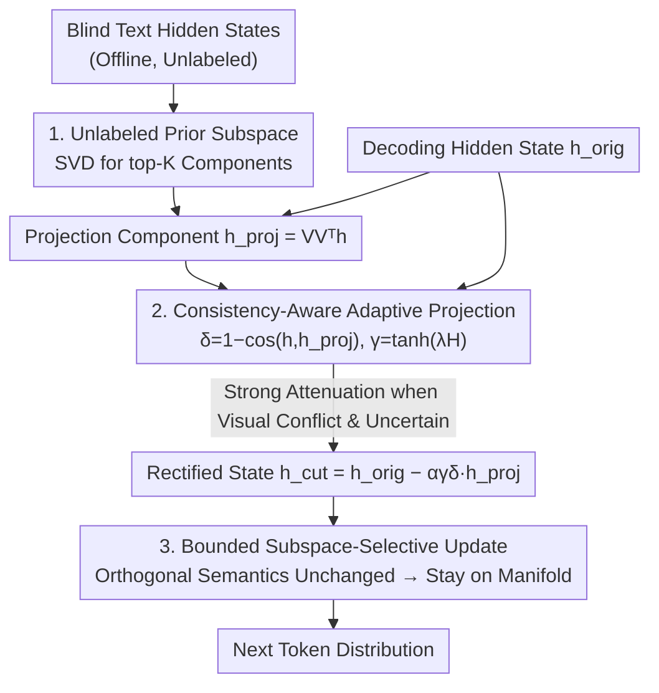

# Mitigating Manifold Departure: Uncertainty-Aware Subspace Rectification for Trustworthy MLLM Decoding

**Conference**: ICML2026  
**arXiv**: [2606.09859](https://arxiv.org/abs/2606.09859)  
**Code**: To be confirmed  
**Area**: Multimodal VLM  
**Keywords**: Hallucination suppression, training-free decoding, language prior subspace, representation geometry, manifold departure

## TL;DR
To address the issue where training-free decoding methods "indiscriminately suppress language priors," pushing hidden states away from the normal decoding manifold (manifold departure) and harming generation, MGAP uses SVD to estimate a low-rank "language prior subspace" from blind text hidden states. During decoding, it adaptively attenuates only the projection components of the hidden states on this subspace based on "visual conflict degree + prediction uncertainty," achieving stronger hallucination suppression and more stable generation fidelity on POPE and CHAIR.

## Background & Motivation
**Background**: Multimodal Large Language Models (MLLMs) suffer from "object hallucinations"—describing things that do not exist in the image. Major training-free mitigation strategies (VCD, ICD, OPERA, etc.) target the "language prior" learned during pre-training by subtracting a bias term (blind branch/contrastive context) in the decoding logits, i.e., $\text{Logits}_{\text{final}}=\text{Logits}_{\text{main}}-\rho\cdot\text{Logits}_{\text{bias}}$, to suppress the prior.

**Limitations of Prior Work**: The authors point out that the language prior has a "dual identity"—when aligned with visual evidence (e.g., "yellow banana"), the prior acts as a confidence anchor, making generation sharper and more stable; it only induces hallucinations when it conflicts with the image (e.g., "blue banana"). Current methods apply global linear translations with the same direction and intensity regardless of alignment, leading to performance degradation on normal samples where the "prior serves as a helper." Experiments with LLaVA-1.5-7B on POPE show that VCD drops performance relative to the vanilla model across all splits, including standard samples where vision and prior are naturally aligned.

**Key Challenge**: This performance drop has a geometric root cause. Projecting the last-layer hidden state $h_t\in\mathbb{R}^d$ into the representation space reveals that legal trajectories of normal decoding are highly concentrated around a low-dimensional manifold $\mathcal{M}$ (semantic manifold). Linear suppression is a "global, geometry-agnostic" translation that pushes hidden states into low-density tail regions rarely visited during normal decoding. This leaves the decoder in a poorly supported state, rendering the token distribution unstable. The authors name this failure mode **Manifold Departure**.

**Goal**: To suppress hallucinations without re-training or altering parameters by "suppressing only when necessary and only in the necessary directions," thereby inhibiting hallucinations without destroying the semantic manifold structure.

**Key Insight**: Since language priors manifest as a set of dominant directions in the representation space, they can be explicitly modeled as a **low-rank subspace**. Intervention then only affects the components of the hidden state residing in this subspace, leaving the orthogonal semantic components intact—preventing manifold departure caused by global translation.

**Core Idea**: Estimate the language prior subspace via SVD from blind text hidden states. During decoding, project hidden states onto this subspace and use a gate dictated by "prior-posterior inconsistency $\times$ prediction uncertainty" to adaptively attenuate only the projected components, resulting in a bounded, subspace-selective update.

## Method

### Overall Architecture
MGAP (Manifold-Guided Adaptive Projection) consists of two phases: **Offline**, it constructs the language prior subspace $V_{\mathrm{prior}}$ using a batch of unlabeled blind text inputs (requires only queries, no images, labels, or parameter updates). **Online**, during decoding, it performs geometry-aware adaptive projection on the hidden state $h_{\mathrm{orig}}$ generated at each step. It decomposes $h_{\mathrm{orig}}$ into a "prior subspace projection $h_{\mathrm{proj}}$" and an orthogonal semantic component. The attenuation of $h_{\mathrm{proj}}$ is determined by visual-prior conflict (inconsistency $\delta$) and model uncertainty (gate $\gamma$ determined by entropy $H$), while the orthogonal component remains untouched. When vision and prior are consistent, $\gamma$ and $\delta$ are small, and the operation regresses to an approximate identity mapping, avoiding the global translation that causes manifold departure.

### Key Designs

**1. Unlabeled Language Prior Subspace Construction: Explicitly Modeling "Prior" as a Low-Rank SVD Subspace**

Existing methods treat the "language prior" as a scalar bias to be subtracted, which the authors argue loses its geometric structure. MGAP instead provides a batch of prompts $\{x^{(i)}\}_{i=1}^N$ to the model to obtain last-layer **blind text hidden states** $\{h_{\mathrm{blind}}^{(i)}\}$ (no images provided). These are centered and stacked into a matrix $\tilde{H}_{\mathrm{blind}}\in\mathbb{R}^{N\times d}$. The top-$K$ principal components are extracted as the prior subspace basis: $\tilde{H}_{\mathrm{blind}}=U\Sigma V^\top$, where $V_{\mathrm{prior}}\triangleq V_{[:,1:K]}\in\mathbb{R}^{d\times K}$. This purely offline step uses zero labels and zero parameter updates. The key concept is that $V_{\mathrm{prior}}$ captures dominant directions of variation from linguistic patterns without assuming they are inherently harmful—their utility depends on the adaptive mechanism that follows.

**2. Consistency-Aware + Uncertainty-Gated Adaptive Projection: Suppressing Only When and Where Necessary**

This is the core intervention of MGAP. For a decoding hidden state $h_{\mathrm{orig}}$, its projection on the prior subspace is $h_{\mathrm{proj}}=V_{\mathrm{prior}}V_{\mathrm{prior}}^\top h_{\mathrm{orig}}$. Simply subtracting $h_{\mathrm{proj}}$ would still cause manifold departure, so two adaptive scalars modulate the attenuation:

First, the **prior-posterior inconsistency** $\delta=1-\cos(h_{\mathrm{orig}},h_{\mathrm{proj}})$. A small $\delta$ indicates high alignment with the prior subspace (suggesting the prior is likely helpful), requiring no extra suppression. A large $\delta$ indicates misalignment (likely a vision-prior conflict), justifying increased attenuation.

Second, the **uncertainty gate** $\gamma=\tanh(\lambda H)$, where $H=-\sum_y p(y)\log p(y)$ is the Shannon entropy of the token distribution. Hallucinations often correlate with higher uncertainty, so intervention is amplified when entropy is high and minimized when the model is confident.

The final rectified state is:

$$h_{\mathrm{cut}}=h_{\mathrm{orig}}-\alpha\cdot\gamma\cdot\delta\cdot h_{\mathrm{proj}},$$

denoted as $h_{\mathrm{cut}}=h_{\mathrm{orig}}-\beta h_{\mathrm{proj}}$ where $\beta=\alpha\gamma\delta$. When vision aligns with the prior, $\gamma,\delta \to \text{small}$ and $\beta\to 0$, regressing to an identity mapping. This is why MGAP does not degrade on normal samples like VCD: while old methods use global extrapolation in a fixed direction $\rho(h_{\mathrm{joint}}-h_{\mathrm{blind}})$, MGAP limits the direction to the prior subspace and dynamically regulates intensity via context-dependent scalars.

**3. Bounded, Subspace-Selective Update: Theoretical Guarantee of Remaining on the Semantic Manifold**

The authors provide three properties (proofs in appendix) to explain why MGAP avoids manifold departure. First (Thm 4.2 Bounded Stepsize): given $\gamma=\tanh(\lambda H)\in[0,1)$ and $\delta\in[0,2]$, the update is strictly upper-bounded by $\|h_{\mathrm{cut}}-h_{\mathrm{orig}}\|\le\alpha\|h_{\mathrm{orig}}\|$, preventing excessive correction. Second (Thm 4.3 Subspace Selectivity): MGAP modifies only the prior components and preserves orthogonal components, formalized as $h_{\mathrm{cut}}-V_{\mathrm{prior}}V_{\mathrm{prior}}^\top h_{\mathrm{cut}}=h_{\mathrm{orig}}-V_{\mathrm{prior}}V_{\mathrm{prior}}^\top h_{\mathrm{orig}}$, meaning no global translation occurs. Third (Thm 4.1 Error Reduction): if the current error component aligns with the prior projection ($\langle h_{\mathrm{orig}}-h_{\mathrm{gt}},h_{\mathrm{proj}}\rangle>0$), subtracting $h_{\mathrm{proj}}$ provably pulls the state closer to the ground truth, $\|h_{\mathrm{cut}}-h_{\mathrm{gt}}\|^2<\|h_{\mathrm{orig}}-h_{\mathrm{gt}}\|^2$. Together, these ensure the state stays within the manifold while correcting prior-driven errors.

## Key Experimental Results

### Main Results
MGAP was compared against training-free methods like VCD, ICD, HalTrapper, DeCo, MoD, and CODE on POPE (discriminative) and CHAIR (descriptive) across two backbones (LLaVA-1.5-7B and Qwen3-VL-8B).

POPE Accuracy (Acc., %) for LLaVA-1.5-7B:

| Method | Random | Popular | Adversarial |
|------|--------|---------|-------------|
| Vanilla | 88.88 | 86.23 | 80.16 |
| VCD | 87.57 | 84.23 | 78.56 |
| DeCo | 89.86 | 87.72 | 83.18 |
| MoD | 89.24 | 87.03 | 82.51 |
| **MGAP (Ours)** | **90.63** | **88.10** | **84.59** |

Notably, VCD scores lower than Vanilla on all splits, confirming that "indiscriminate suppression hurts normal samples." MGAP consistently outperforms Vanilla and all baselines.

CHAIR Hallucination Rate (lower is better):

| Metric | Vanilla | VCD | ICD | CODE | **Ours** |
|------|---------|-----|-----|------|----------|
| CHAIRs↓ (LLaVA-7B) | 47.4 | 52.8 | 51.8 | 49.8 | **26.2** |
| CHAIRi↓ (LLaVA-7B) | 23.5 | 15.8 | 14.7 | 13.8 | **7.6** |
| Precision (LLaVA-7B) | 70.8 | 72.6 | 73.7 | 76.0 | **85.9** |

CHAIRs dropped from 47.4 to 26.2 and CHAIRi from 23.5 to 7.6, while Precision increased to 85.9, indicating reduced hallucination without sacrificing description completeness. Similar trends were observed for Qwen3-VL-8B.

### Ablation Study

| Configuration | POPE Acc. (Random) | Explanation |
|------|------|------|
| Full (Ours) | 90.13 | Complete model |
| w/o Prot (Remove $\delta$) | 87.70 | Precision spikes to 97.24 but F1 drops to 86.32; over-suppression |
| w/o Gate (Remove $\gamma$) | 86.57 | Precision 98.41, F1 only 84.69; trade-off imbalance |

### Key Findings
- Removing the consistency protection or uncertainty gate leads to "excessive conservatism"—Precision becomes abnormally high (97-98%) but Acc./F1 collapse, indicating a regression to "indiscriminate suppression" where useful priors are lost. Both adaptive scalars are essential to regulate "when and how much" to suppress.
- The most stark contrast is in CHAIR: while previous contrastive methods (VCD/ICD/CODE) reduce CHAIRi, they typically increase CHAIRs (even exceeding Vanilla). MGAP achieves significant reductions in both indices while increasing Precision, demonstrating the superior trade-off provided by "subspace selectivity."

## Highlights & Insights
- **Transforming "Manifold Departure" into a Quantifiable Geometric Criterion**: The authors use the kNN average distance $d_k(h;\mathcal{S})=\frac1k\sum_{s\in\mathrm{NN}_k}\|h-s\|_2$ as a proxy for "manifold distance" and define departure as $d_k(\tilde h_t;\mathcal{S})>\tau$. This provides a quantitative tool to analyze why linear suppression fails, which can be transferred to other decoding interventions.
- **Contextual Utility of Priors**: The observation that priors can be helpful or harmful depending on the context is crucial. It elevates hallucination mitigation from a binary "suppression vs. non-suppression" to "adaptive regulation based on alignment," elegantly implemented via $\delta$ and $\gamma$.
- **Reusable Subspace-Selective + Bounded Paradigm**: Converting any "subtraction-based" intervention into one that is bounded by a tanh gate and restricted to a low-rank subspace is a generalizable, plug-and-play paradigm for stabilizing decoding interventions in various scenarios like style control or contrastive decoding.

## Limitations & Future Work
- Hyperparameters such as subspace dimension $K$, scaling $\alpha$, and temperature $\lambda$ require selection; sensitivity analysis across different backbones is not fully explored.
- The prior subspace is estimated from "blind text hidden states," depending on a representative set of prompts; its accuracy may vary if the deployment domain differs significantly from the construction set.
- Evaluation focuses on object-level hallucinations (POPE/CHAIR); effectiveness on attribute, relational, or long-document hallucinations remains unverified.
- Future work could expand $\delta, \gamma$ into fine-grained modulations for different directions within the subspace to further enhance the trade-off.

## Related Work & Insights
- **vs. VCD (Visual Contrastive Decoding)**: VCD performs global linear extrapolation $h_{\mathrm{joint}}+\rho(h_{\mathrm{joint}}-h_{\mathrm{blind}})$ in the logit space. Its fixed direction and disregard for local geometry can push states off the manifold. MGAP performs bounded, selective attenuation within a subspace at the hidden state level, preserving orthogonal semantics.
- **vs. OPERA**: OPERA uses penalty terms and rollback allocation to inhibit overconfidence, which is a heuristic adjustment in the logit/attention layers. MGAP provides geometric intervention with theoretical properties (bounded, selective, error-reducing).
- **vs. DeCo / MoD**: As recent training-free decoding baselines, MGAP achieves the best overall trade-off between hallucination suppression and generation fidelity across two backbones and benchmarks.

## Rating
- Novelty: ⭐⭐⭐⭐⭐ Formulating "manifold departure" as a measurable criterion and proposing subspace-selective geometric intervention is novel and consistent.
- Experimental Thoroughness: ⭐⭐⭐⭐ Extensive testing on two backbones and benchmarks plus ablations; however, more analysis on hyperparameters and hallucination types is needed.
- Writing Quality: ⭐⭐⭐⭐⭐ The logic chain from diagnosis to mechanism to theory to experiment is clear, with convincing geometric illustrations.
- Value: ⭐⭐⭐⭐ Plug-and-play, training-free, and parameter-free with a superior trade-off, making it highly practical for deployment.

<!-- RELATED:START -->

## Related Papers

- [\[ICML 2026\] TUR-DPO: Topology- and Uncertainty-Aware Direct Preference Optimization](tur-dpo_topology-_and_uncertainty-aware_direct_preference_optimization.md)
- [\[NeurIPS 2025\] Enhancing Vision-Language Model Reliability with Uncertainty-Guided Dropout Decoding](../../NeurIPS2025/multimodal_vlm/enhancing_visionlanguage_model_reliability_with_uncertaintyg.md)
- [\[CVPR 2026\] Uncertainty-Aware Knowledge Distillation for Multimodal Large Language Models](../../CVPR2026/multimodal_vlm/uncertainty-aware_knowledge_distillation_for_multimodal_large_language_models.md)
- [\[ACL 2026\] VAUQ: Vision-Aware Uncertainty Quantification for LVLM Self-Evaluation](../../ACL2026/multimodal_vlm/vauq_vision-aware_uncertainty_quantification_for_lvlm_self-evaluation.md)
- [\[ICLR 2026\] Capacity-Aware Inference: Mitigating the Straggler Effect in Mixture of Experts](../../ICLR2026/multimodal_vlm/capacity-aware_inference_mitigating_the_straggler_effect_in_mixture_of_experts.md)

<!-- RELATED:END -->
