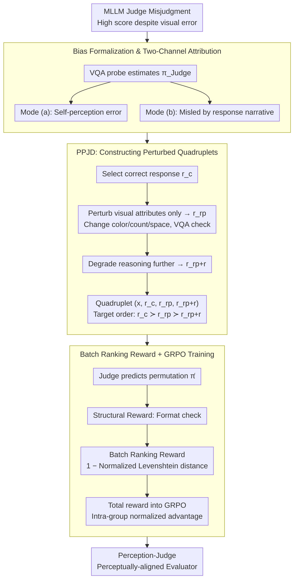

# Mitigating Perceptual Judgment Bias in Multimodal LLM-as-a-Judge via Perceptual Perturbation and Reward Modeling

**Conference**: ICML 2026  
**arXiv**: [2606.02578](https://arxiv.org/abs/2606.02578)  
**Code**: https://perception-judge.github.io/ (Project Page)  
**Area**: Multimodal VLM  
**Keywords**: MLLM Judge, Perceptual Judgment Bias, Visual Perturbation, GRPO, Batch Ranking Reward

## TL;DR
This paper reveals and formalizes "perceptual judgment bias" in MLLM-as-a-Judge—where evaluating models tend to reward linguistically fluent answers even when visual evidence conflicts with the textual narrative. By constructing the Perceptually Perturbed Judgment Dataset (PPJD) and employing GRPO-based batch ranking reward training, a 7B evaluator significantly outperforms same-sized baselines across multimodal consistency, single-score prediction, and batch ranking protocols using only 3k samples.

## Background & Motivation
**Background**: As Multimodal Large Language Models (MLLMs) proliferate in tasks such as visual question answering and image-text generation, "MLLM-as-a-Judge" has become the mainstream paradigm for automatic evaluation as an alternative to human scoring. Representative works include the MLLM-as-a-Judge benchmark, LLaVA-Critic, and Flex-Judge, which primarily follow the "Supervised Fine-Tuning + Preference Pairs" route to output scalar scores, pairwise preferences, or ranking sequences given $(x_i, r_k)$.

**Limitations of Prior Work**: The authors identify a systematic failure in these MLLM evaluators: they often assign high scores to responses that are textually self-consistent but contain visual descriptions inconsistent with the image. For example, if an image shows a red car but the response claims "the blue car reflects a sense of technology," the evaluator may still grant a high score due to the fluent reasoning. This is not isolated: on the MLLM-as-a-Judge benchmark, Qwen2.5-VL-7B exhibits a 30.5% error rate, and Flex-Judge-VL-7B shows 23.5%.

**Key Challenge**: The authors decompose these failures into two independent channels: Mode (a) *insufficient perceptual capability*, where the evaluator itself misinterprets the image (failing a VQA probe); and Mode (b) *response-anchored judgment reasoning*, where the evaluator identifies the image correctly in isolation but is misled by the "visual facts" described in the response during evaluation. Table 1 shows that Mode (b) is comparable to or even larger than Mode (a) in magnitude, implying that stronger visual encoders only solve half the problem. The core conflict is the **decoupling of the perception channel and the judgment channel during evaluation**.

**Goal**: (1) Formally define "perceptual judgment bias" and provide quantifiable diagnostic methods; (2) construct training data that explicitly decouples perceptual errors from reasoning errors; (3) design training objectives that force the evaluator to treat perceptual verification as a high-reward prerequisite rather than relying on textual fluency.

**Key Insight**: Since perception and reasoning errors are mixed in standard (chosen, rejected) preference pairs, the authors **synthesize counterfactual responses that are perturbed only in visual attributes while retaining reasoning fluency** to serve as "traps" during training. Furthermore, pairwise preferences are upgraded to total orderings over quadruplets, shifting the supervision signal from local win-loss to global permutation consistency.

**Core Idea**: Starting from correct responses, counterfactual responses are generated: "perceptually perturbed only" ($r_{r_p}$) and "perceptually + reasoning perturbed" ($r_{r_{p+r}}$), forming a quadruplet $(x_i, r_c, r_{r_p}, r_{r_{p+r}})$. Using a batch ranking reward based on Levenshtein distance within the GRPO framework, the evaluator learns a strict $r_c \succ r_{r_p} \succ r_{r_{p+r}}$ sequence.

## Method

### Overall Architecture
The method proceeds in three steps: (1) Formalizing Perceptual Judgment Bias and attributing failures to Mode (a)/(b) via VQA probes; (2) constructing the *Perceptually Perturbed Judgment Dataset (PPJD)* by extracting 3k high-quality samples from MMPR-v1.2 and generating perturbed versions for each chosen response; (3) training with GRPO using a reward composed of format validation and batch ranking scores. The final models are named Perception-Judge-Flex and Perception-Judge-Qwen3, based on Flex-Judge-VL-7B and Qwen3-VL-4B-Thinking, respectively.

### Key Designs

**1. Formalization and Two-Channel Attribution of Perceptual Judgment Bias**

To move beyond aggregate error rates, the authors quantify the problem. Let $\pi^\star(v_i)$ be the ground-truth visual facts, $\pi_\text{Judge}(v_i)$ be the evaluator's own perception, $\pi_r(v_i)$ be the visual content described in the response, and $s_{(x_i,r)}$ be the judgment score. A perceptual judgment error occurs when a visually incorrect response $r_r$ is not penalized relative to a correct one $r_c$ (i.e., $s_{(x_i,r_r)} \ge s_{(x_i,r_c)}$). Using direct VQA accuracy as a proxy for $\pi_\text{Judge}$, errors are split: Mode (a) where $\pi_\text{Judge}(v_i) \ne \pi^\star(v_i)$ (the judge is inherently "blind"), and Mode (b) where $\pi_\text{Judge}(v_i) = \pi^\star(v_i)$ (the judge is correct in isolation but "blinded" by the text). Table 1 indicates that Mode (b) is equally or more prevalent than Mode (a), necessitating explicit supervision of "perception-judgment coupling."

**2. PPJD: Constructing "Reasoning-Fluent but Visually-Incorrect" Traps**

In standard preference sets, chosen and rejected samples often differ in both perception and reasoning. Models can maximize rewards by learning "poor reasoning = low score" without ever utilizing visual signals. PPJD disrupts this shortcut by taking $r_c$ from MMPR-v1.2 and applying perception-only perturbations—altering color, count, or spatial relations while maintaining syntax and reasoning logic—to obtain $r_{r_p}$. VQA consistency checks filter failed perturbations. A second reasoning degradation yields $r_{r_{p+r}}$. Each sample is a quadruplet $(x_i, r_c, r_{r_p}, r_{r_{p+r}})$ with target order $r_c \succ r_{r_p} \succ r_{r_{p+r}}$. This counters Mode (b) by explicitly penalizing responses that retain high-quality reasoning but contain visual inaccuracies.

**3. Batch Ranking Reward + GRPO: Total Order Constraints as Verifiable Rewards**

Pairwise rewards provide local "win-loss" signals that may lack global consistency. This work upgrades supervision to total orders over quadruplets. The reward comprises two parts: a Structural Reward $\mathcal{R}_\text{Format}(o_i) \in \{0,1\}$ verifying adherence to the `<think>...</think><answer>...</answer>` format; and a Batch Ranking Reward $\mathcal{R}_\text{Batch}(o_i) = 1 - d_\text{Lev}(\hat{\bm{\pi}}_i, \bm{\pi}_i^\star)/\|\bm{\pi}_i^\star\|$ using normalized Levenshtein distance to measure the gap between predicted and target permutations, yielding discrete values $\{1, 2/3, 1/3, 0\}$. Total reward $\mathcal{R}(o_i) = \mathcal{R}_\text{Format}(o_i) \times \mathcal{R}_\text{Batch}(o_i)$ is used in the GRPO objective:

$$\mathcal{J}_\text{GRPO}(\theta) = \mathbb{E}\big[\tfrac{1}{n}\sum_i \min(r_i\hat{\mathcal{A}}_i, \text{clip}(r_i, 1-\epsilon, 1+\epsilon)\hat{\mathcal{A}}_i) - \beta\, \mathbb{D}_\text{KL}(\pi_\theta\|\pi_\text{ref})\big]$$

where $\hat{\mathcal{A}}_i = (R(o_i) - \mu(\mathcal{R})) / \sigma(\mathcal{R})$ is the intra-group normalized advantage. This enforces transitive consistency without requiring explicit scalar scores.

### Loss & Training
Base models: Flex-Judge-VL-7B and Qwen3-VL-4B-Thinking. Training framework: verl. Data: 3k samples from MMPR-v1.2 processed via PPJD, ensuring no overlap with evaluation benchmarks. GRPO hyperparameters follow verl defaults.

## Key Experimental Results

### Main Results (MLLM-as-a-Judge benchmark, average over 14 vision-language tasks)

| Model | Size | Score (↑) | Pair w. Tie (↑) | Pair w.o. Tie (↑) | Batch (↓) |
|------|------|-----------|-----------------|--------------------|-----------|
| GPT-4o | – | 0.439 | 0.538 | 0.736 | 0.361 |
| Gemini-1.0-Pro-Vision | – | 0.304 | 0.509 | 0.615 | 0.432 |
| LLaVA-Critic | 7B | 0.314 | 0.556 | 0.689 | – |
| Qwen2.5-VL-Instruct | 7B | 0.165 | 0.423 | 0.425 | 0.585 |
| Flex-Judge-VL | 7B | 0.404 | 0.514 | 0.623 | 0.517 |
| Qwen3-VL-Thinking | 4B | 0.419 | 0.543 | 0.663 | 0.498 |
| **Perception-Judge-Flex (Ours)** | 7B | **0.466** | 0.520 | 0.645 | 0.505 |
| **Perception-Judge-Qwen3 (Ours)** | 4B | **0.457** | **0.554** | **0.691** | **0.444** |

Key points: Compared to Qwen3-VL-Thinking-4B, ours improves batch evaluation by 11% and score evaluation by 12%. It approaches GPT-4o in single-score mode and surpasses most proprietary models in batch evaluation, demonstrating the strength of global ranking signals. Perception-Judge-Flex-7B reduces the total error rate from 23.5% to 14.3% in bias diagnostics (Table 1), with both Mode (a) and Mode (b) significantly mitigated.

### Ablation Study (10k training samples, Flex-Judge-VL-7B)

| Dataset | Reward Type | Score (↑) | Pair w. Tie (↑) | Pair w.o. Tie (↑) | Batch (↓) |
|--------|---------|-----------|-----------------|--------------------|-----------|
| – (base) | – | 0.404 | 0.514 | 0.623 | 0.517 |
| MMPR-v1.2 | Pairwise | 0.454 | 0.515 | 0.641 | 0.515 |
| PPJD | Pairwise | 0.458 | 0.518 | 0.644 | 0.513 |
| PPJD | **Batch** | **0.476** | **0.518** | **0.648** | **0.500** |

### Key Findings
- *Data over form*: Switching MMPR-v1.2 to PPJD under pairwise rewards improves all metrics, suggesting that explicitly separating perceptual perturbations mitigates bias regardless of the reward format.
- *Batch reward surpasses pairwise*: Relying solely on total ordering rewards without scalar or pairwise labels yields the best single-score predictions, proving that global ranking constraints induce well-calibrated scores.
- *Data Efficiency*: Using only 3k PPJD samples achieves or exceeds results from the 113k-sample LLaVA-Critic corpus, highlighting high information density.
- *Dual-Channel improvement*: Mode (b) error is nearly halved (14.1%→7.6%), showing that forcing perception-judgment coupling provides massive gains even without significantly enhancing the base model's raw perception.

## Highlights & Insights
- Formalizes "why judges are inaccurate" as a scientifically decomposable problem (Mode a/b), which serves as a diagnostic standard for future MLLM-as-a-Judge research.
- The "fluent reasoning but incorrect vision" counterfactual ($r_{r_p}$) is the central innovation, making the implicit language-vision trade-off explicit.
- The combination of batch ranking Levenshtein rewards and GRPO successfully transfers "verifiable RL" from math/code logic to the perception-heavy task of visual evaluation.
- High data efficiency and independence from scalar score supervision make this protocol highly attractive for domains with limited resources or specialized perception needs (e.g., medical, autonomous driving).

## Limitations & Future Work
- PPJD perturbations are synthetic and limited to controllable dimensions (color/count); coverage for fine-grained perceptual errors in complex scenes remains unknown.
- Batch rewards for larger sets ($K \ge 5$) may suffer from coarse reward granularity in the Levenshtein distance, requiring weighted designs.
- Base perception remains tied to the underlying model; if the visual encoder is extremely weak, the headroom for improvement via coupling is limited.
- Generalization to open-ended generation (e.g., long video descriptions) requires further validation.

## Related Work & Insights
- **vs LLaVA-Critic (Xiong et al., 2025)**: LLaVA-Critic relies on large-scale SFT (113k pairs). Ours demonstrates that 3k counterfactuals + ranking RL can outperform SFT with a fraction of the data.
- **vs JudgeLRM / Verifiable RL**: Extends verifiable RL from "textual correctness" to "vision-text consistency," using Levenshtein distance to discretize ranking problems into verifiable signals.
- **Insight**: Any MLLM-as-a-Judge work should report the Mode (a)/(b) decomposition to avoid masking the root cause of errors. The "counterfactual data + ranking RL" pipeline can be generalized to multi-turn dialogues and temporal video scenarios.

## Rating
- Novelty: ⭐⭐⭐⭐ (Formalization of bias + PPJD + Batch GRPO)
- Experimental Thoroughness: ⭐⭐⭐⭐ (14-task benchmark + bias decomposition + ablation)
- Writing Quality: ⭐⭐⭐⭐ (Clear definitions and clean logic chain)
- Value: ⭐⭐⭐⭐⭐ (Directly applicable data/training protocol for building robust evaluators)

<!-- RELATED:START -->

## Related Papers

- [\[CVPR 2026\] Deeper Thought, Weaker Aim: Understanding and Mitigating Perceptual Impairment during Reasoning in Multimodal Large Language Models](../../CVPR2026/multimodal_vlm/deeper_thought_weaker_aim_understanding_and_mitigating_perceptual_impairment_dur.md)
- [\[CVPR 2026\] Perceptual-Evidence Anchored Reinforced Learning for Multimodal Reasoning](../../CVPR2026/multimodal_vlm/perceptual-evidence_anchored_reinforced_learning_for_multimodal_reasoning.md)
- [\[ICML 2026\] The Perceptual Bandwidth Bottleneck in Vision-Language Models: Active Visual Reasoning via Sequential Experimental Design](the_perceptual_bandwidth_bottleneck_in_vision-language_models_active_visual_reas.md)
- [\[ICML 2026\] Beyond VLM-Based Rewards: Diffusion-Native Latent Reward Modeling](beyond_vlm-based_rewards_diffusion-native_latent_reward_modeling.md)
- [\[CVPR 2026\] See Less, See Right: Bi-directional Perceptual Shaping For Multimodal Reasoning](../../CVPR2026/multimodal_vlm/see_less_see_right_bi-directional_perceptual_shaping_for_multimodal_reasoning.md)

<!-- RELATED:END -->
