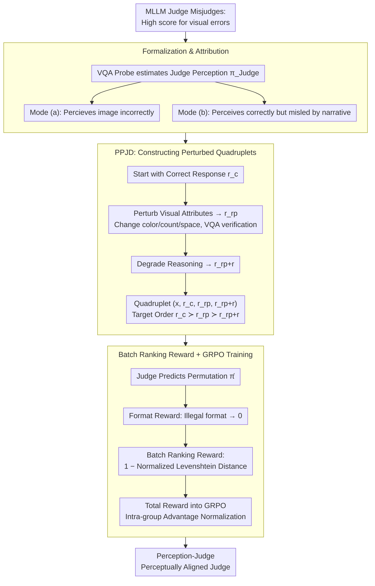

# Mitigating Perceptual Judgment Bias in Multimodal LLM-as-a-Judge via Perceptual Perturbation and Reward Modeling

**Conference**: ICML 2026  
**arXiv**: [2606.02578](https://arxiv.org/abs/2606.02578)  
**Code**: https://perception-judge.github.io/ (Project Page)  
**Area**: Multimodal MLLM  
**Keywords**: MLLM-as-a-Judge, Perceptual Judgment Bias, Visual Perturbation, GRPO, Batch Ranking Reward

## TL;DR
This paper reveals and formalizes the "Perceptual Judgment Bias" in MLLM-as-a-Judge, where judgment models tend to reward linguistically fluent responses even when visual evidence conflicts with the textual narrative. By constructing the Perceptually Perturbed Judgment Dataset (PPJD) and employing GRPO-based batch ranking reward training, the authors enable a 7B judge to significantly outperform baselines of the same size across consistency, single-score prediction, and batch ranking protocols using only 3k samples.

## Background & Motivation
**Background**: As Multimodal Large Language Models (MLLMs) proliferate in tasks such as Visual Question Answering (VQA) and image-text generation, "MLLM-as-a-Judge" has become the mainstream paradigm for automated evaluation as an alternative to human scoring. Representative works include the MLLM-as-a-Judge benchmark, LLaVA-Critic, and Flex-Judge, which primarily follow the "Supervised Fine-Tuning + Preference Pairs" route to output scalar scores, pairwise preferences, or ranking sequences.

**Limitations of Prior Work**: The authors identify a systematic failure in these MLLM judges: they frequently assign high scores to responses that are internally consistent in text but contain visual descriptions inconsistent with the image. For instance, if an image shows a red car and the response claims "the blue car in the image reflects a sense of technology," the judge might still assign a high score due to the fluent reasoning. This is not an isolated corner case: on the MLLM-as-a-Judge benchmark, Qwen2.5-VL-7B reaches an error rate of 30.5%, while Flex-Judge-VL-7B stands at 23.5%.

**Key Challenge**: The authors categorize these failures into two independent channels—Mode (a) *insufficient perceptual capability*: the judge fails to perceive the image correctly (its VQA probe also fails); Mode (b) *response-anchored judgment reasoning*: the judge can perceive the image correctly in isolation but is misled by the "visual facts" described in the response during the judgment process. Table 1 indicates that Mode (b) is comparable to or even more prevalent than Mode (a), implying that stronger visual encoders only solve half the problem. The core contradiction is the **decoupling of the perceptual channel and the judgment channel** during evaluation.

**Goal**: (1) Formally define "Perceptual Judgment Bias" and provide quantifiable diagnostic methods; (2) Construct training data that explicitly decouples perceptual errors from reasoning errors; (3) Design training objectives that force the judge to use perceptual verification as a prerequisite for high rewards rather than relying on textual fluency.

**Key Insight**: Since standard (chosen, rejected) preference pairs conflate perceptual and reasoning errors, the authors **synthesize counterfactual responses that are perturbed only in visual attributes while retaining reasoning fluency** to serve as "traps" during training. Furthermore, they upgrade pairwise preferences to total ordering over quadruplets, shifting the supervision signal from local win-loss to global permutation consistency.

**Core Idea**: Starting from a correct response, counterfactual responses are generated: "perceptually perturbed only $r_{r_p}$" and "perceptually + reasoning perturbed $r_{r_{p+r}}$," forming a quadruplet $(x_i, r_c, r_{r_p}, r_{r_{p+r}})$. Under the GRPO framework, a batch ranking reward based on Levenshtein distance is used to force the judge to learn the strict $r_c \succ r_{r_p} \succ r_{r_{p+r}}$ order.

## Method

### Overall Architecture
The method consists of three steps: (1) Formalizing Perceptual Judgment Bias and attributing failures to Mode (a)/(b) using VQA probes; (2) Constructing the *Perceptually Perturbed Judgment Dataset (PPJD)* by extracting 3k high-quality samples from MMPR-v1.2 and generating perceptually perturbed and dual-perturbed versions for each chosen response; (3) Training with GRPO using a reward function based on format validation and batch ranking scores. The final models are denoted as Perception-Judge-Flex and Perception-Judge-Qwen3.

### Key Designs

**1. Formalization and Two-Channel Attribution: Deconstructing Judgment Inaccuracy**

Relying solely on total error rates often leads researchers to blame "insufficient visual encoders," missing the deeper misalignment. This work quantifies the problem: let $\pi^\star(v_i)$ be the ground-truth visual facts, $\pi_\text{Judge}(v_i)$ be the judge's own perception of the image, $\pi_r(v_i)$ be the visual content described in the response, and $s_{(x_i,r)}$ be the judgment score. A perceptual judgment error occurs when a visually incorrect response $r_r$ is not penalized relative to a correct $r_c$ (i.e., $s_{(x_i,r_r)} \ge s_{(x_i,r_c)}$). Using direct VQA accuracy as a proxy for $\pi_\text{Judge}$, errors are split into two channels: Mode (a) where $\pi_\text{Judge}(v_i) \ne \pi^\star(v_i)$ (the judge misperceives the image itself) and Mode (b) where $\pi_\text{Judge}(v_i) = \pi^\star(v_i)$ (the judge perceives correctly in isolation but is misled by the response narrative). Table 1 shows Mode (b) is comparable to or larger than Mode (a), necessitating explicit supervision of "perception-judgment coupling."

**2. PPJD: Traps of "Fluent Reasoning but Visual Errors"**

In general preference sets, chosen and rejected responses often differ in both perception and reasoning. Models can maximize rewards by simply learning "poor reasoning equals low score" without utilizing visual signals. PPJD disrupts this shortcut: starting from $r_c$ (visually and logically correct reference) in MMPR-v1.2, it applies perceptual perturbations—precisely rewriting colors, counts, or spatial relations while maintaining syntax and reasoning chains—to obtain $r_{r_p}$. VQA consistency checks discard failed perturbations. Further degradation of reasoning produces $r_{r_{p+r}}$. Each sample is a quadruplet $(x_i, r_c, r_{r_p}, r_{r_{p+r}})$ with the target order $r_c \succ r_{r_p} \succ r_{r_{p+r}}$. This works because MLLMs are better at "manufacturing fine-grained perceptual errors" than "detecting" them. $r_{r_p}$ explicitly punishes Mode (b) by assigning low scores to fluent but visually false answers.

**3. Batch Ranking Reward + GRPO: Total Order Constraints as Verifiable Rewards**

Pairwise rewards provide only local signals, potentially leading to global inconsistencies. This work upgrades supervision to total ordering over quadruplets. The reward has two parts: a structural reward $\mathcal{R}_\text{Format}(o_i) \in \{0,1\}$ verifying the `<think>...</think><answer>...</answer>` format and valid value ranges, and a batch ranking reward based on normalized Levenshtein distance $\mathcal{R}_\text{Batch}(o_i) = 1 - d_\text{Lev}(\hat{\bm{\pi}}_i, \bm{\pi}_i^\star)/\|\bm{\pi}_i^\star\|$, taking discrete values in $\{1, 2/3, 1/3, 0\}$. The total reward $\mathcal{R}(o_i) = \mathcal{R}_\text{Format}(o_i) \times \mathcal{R}_\text{Batch}(o_i)$ is used in the GRPO objective:

$$\mathcal{J}_\text{GRPO}(\theta) = \mathbb{E}\big[\tfrac{1}{n}\sum_i \min(r_i\hat{\mathcal{A}}_i, \text{clip}(r_i, 1-\epsilon, 1+\epsilon)\hat{\mathcal{A}}_i) - \beta\, \mathbb{D}_\text{KL}(\pi_\theta\|\pi_\text{ref})\big]$$

where $\hat{\mathcal{A}}_i = (R(o_i) - \mu(\mathcal{R})) / \sigma(\mathcal{R})$ is the intra-group normalized advantage. This forces transitive consistency without explicit score labels and benefits from GRPO's stability with sparse rewards and lack of a value network.

### Loss & Training
Base models: Flex-Judge-VL-7B and Qwen3-VL-4B-Thinking. Framework: verl. Data: 3k quadruplets from PPJD via MMPR-v1.2, with strict removal of overlaps with evaluation benchmarks. GRPO hyperparameters follow verl defaults.

## Key Experimental Results

### Main Results (MLLM-as-a-Judge benchmark, Average across 14 tasks)

| Model | Size | Score (↑) | Pair w. Tie (↑) | Pair w.o. Tie (↑) | Batch (↓) |
|------|------|-----------|-----------------|--------------------|-----------|
| GPT-4o | – | 0.439 | 0.538 | 0.736 | 0.361 |
| Gemini-1.0-Pro-Vision | – | 0.304 | 0.509 | 0.615 | 0.432 |
| LLaVA-Critic | 7B | 0.314 | 0.556 | 0.689 | – |
| Qwen2.5-VL-Instruct | 7B | 0.165 | 0.423 | 0.425 | 0.585 |
| Flex-Judge-VL | 7B | 0.404 | 0.514 | 0.623 | 0.517 |
| Qwen3-VL-Thinking | 4B | 0.419 | 0.543 | 0.663 | 0.498 |
| **Perception-Judge-Flex (Ours)** | 7B | **0.466** | 0.520 | 0.645 | 0.505 |
| **Perception-Judge-Qwen3 (Ours)** | 4B | **0.457** | **0.554** | **0.691** | **0.444** |

Key findings: Compared to Qwen3-VL-Thinking-4B, the proposed method improves batch evaluation by 11% and score evaluation by 12%. It approaches GPT-4o in single-score mode and outperforms most proprietary models in batch evaluation, demonstrating the power of global consistency signals. Perception-Judge-Flex-7B reduces total error rate from 23.5% to 14.3% in bias diagnostics, cutting both Mode (a) and Mode (b) errors.

### Ablation Study (10k training samples, Flex-Judge-VL-7B)

| Dataset | Reward Type | Score (↑) | Pair w. Tie (↑) | Pair w.o. Tie (↑) | Batch (↓) |
|--------|---------|-----------|-----------------|--------------------|-----------|
| – (base) | – | 0.404 | 0.514 | 0.623 | 0.517 |
| MMPR-v1.2 | Pairwise | 0.454 | 0.515 | 0.641 | 0.515 |
| PPJD | Pairwise | 0.458 | 0.518 | 0.644 | 0.513 |
| PPJD | **Batch** | **0.476** | **0.518** | **0.648** | **0.500** |

### Key Findings
- *Data Importance*: Switching from MMPR-v1.2 to PPJD under the same pairwise reward improves all metrics, showing that decoupling perceptual perturbations alleviates bias independently of reward form.
- *Batch Reward Superiority*: Total order ranking rewards alone (without scalar scores) yield the best single-score prediction, proving global ranking constraints effectively induce well-calibrated local preferences.
- *Data Efficiency*: Using only 3k PPJD samples outperforms 7B judges trained on 113k LLaVA-Critic samples, highlighting the "information density" of perceptual perturbations.
- *Dual-Channel Reduction*: Mode (b) error rate is nearly halved (14.1%→7.6%), suggesting that forcing perception-judgment coupling provides massive gains even without largely improving the judge's raw perceptual capability.

## Highlights & Insights
- Transforms "judge inaccuracy" into a formal, scientific problem via Mode (a)/(b) dichotomy—a diagnostic that should be adopted by future MLLM-as-a-Judge research.
- The use of counterfactual responses ($r_{r_p}$) is a creative solution to the implicit "language vs vision" trade-off, forcing the model to rely on visual evidence.
- Migrates verifiable RL from math/code reasoning to the subjective task of "visual evaluation," using Levenshtein distance to bridge the gap.
- High data efficiency (3k vs 113k) makes the approach attractive for resource-constrained domains like medical or autonomous driving.

## Limitations & Future Work
- PPJD perturbations are synthetic and limited to specific attributes; coverage of fine-grained perceptual errors in complex scenes remains unknown.
- Batch rewards for larger sets ($K \ge 5$) may suffer from coarse Levenshtein discretization, requiring refined weight designs.
- Base perceptual capacity still caps performance; if the visual encoder is too weak (Extreme Mode (a)), gains are limited.
- Evaluation is confined to existing benchmarks; generalization to open-ended generation (e.g., long video descriptions) needs verification.

## Related Work & Insights
- **vs LLaVA-Critic**: LLaVA-Critic uses large-scale SFT (113k pairs); this work proves 3k counterfactuals + ranking RL can outperform it, highlighting the value of supervision quality over quantity.
- **vs JudgeLRM / Verifiable RL**: Extends verifiable RL from "textual correctness" to "vision-text consistency," discrete-izing the ranking problem for RL signals.
- **Insights**: All MLLM-as-a-Judge works should report Mode (a)/(b) breakdowns. The "counterfactual data + ranking RL" combination can be generalized to multi-turn dialogues or video scenarios to build more robust judges.

## Rating
- Novelty: ⭐⭐⭐⭐ First combination of perceptual bias formalization, PPJD quadruplets, and batch ranking GRPO.
- Experimental Thoroughness: ⭐⭐⭐⭐ Comprehensive across 14 tasks, bias decomposition, and data efficiency.
- Writing Quality: ⭐⭐⭐⭐ Clear definitions and a cohesive motivation-to-validation logic.
- Value: ⭐⭐⭐⭐⭐ Highly actionable data and training protocol for developers of MLLM judges.
<!-- RELATED:START -->

## Related Papers

- [\[ACL 2026\] MathFlow: Enhancing the Perceptual Flow of MLLMs for Visual Mathematical Problems](../../ACL2026/multimodal_vlm/mathflow_enhancing_the_perceptual_flow_of_mllms_for_visual_mathematical_problems.md)
- [\[ICML 2026\] Beyond VLM-Based Rewards: Diffusion-Native Latent Reward Modeling](beyond_vlm-based_rewards_diffusion-native_latent_reward_modeling.md)
- [\[CVPR 2026\] VLIC: Vision-Language Models As Perceptual Judges for Human-Aligned Image Compression](../../CVPR2026/multimodal_vlm/vlic_vision-language_models_as_perceptual_judges_for_human-aligned_image_compres.md)
- [\[AAAI 2026\] SAGE: Spuriousness-Aware Guided Prompt Exploration for Mitigating Multimodal Bias](../../AAAI2026/multimodal_vlm/sage_spuriousness-aware_guided_prompt_exploration_for_mitigating_multimodal_bias.md)
- [\[CVPR 2026\] Active Perceptual Inference: A Corticothalamic-Inspired Dynamic Nested Recurrent Network for Multimodal Sentiment Analysis with Incomplete Data](../../CVPR2026/multimodal_vlm/active_perceptual_inference_a_corticothalamic-inspired_dynamic_nested_recurrent_.md)

<!-- RELATED:END -->
