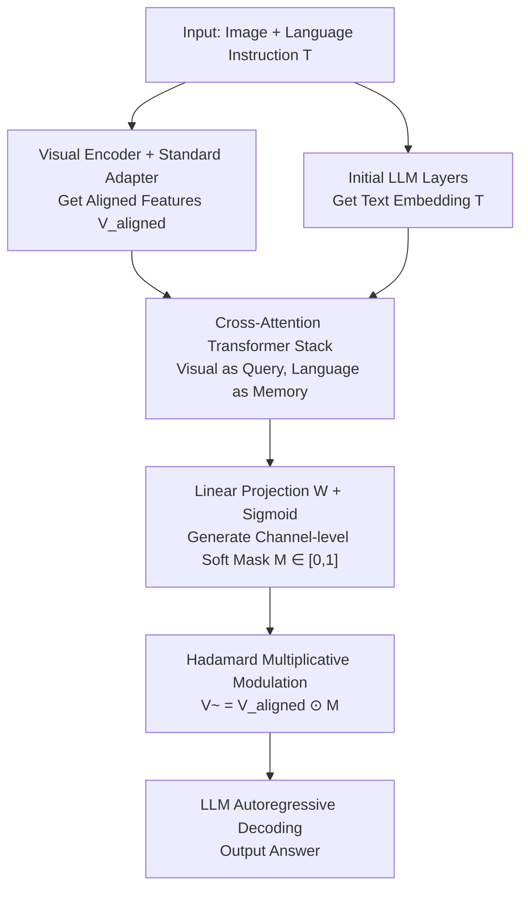

# MoDA: Modulation Adapter for Fine-Grained Visual Grounding in Instructional MLLMs

**Conference**: ICML2026  
**arXiv**: [2506.01850](https://arxiv.org/abs/2506.01850)  
**Code**: https://github.com/waybarrios/MoDA  
**Area**: Multimodal VLM / Visual Grounding / Instruction Tuning  
**Keywords**: Multimodal Large Models, Channel-level Modulation, Cross-Attention, Visual Grounding, Adapter

## TL;DR
Addressing the issue that MLLMs struggle with fine-grained visual grounding because "multiple visual semantics are entangled" within ViT patch representations, this paper proposes MoDA—a lightweight module. On top of aligned visual features, it uses language instructions to generate a $[0,1]$ **channel-level soft mask** via cross-attention, using Hadamard multiplication to amplify instruction-relevant feature dimensions and suppress irrelevant ones. It is plug-and-play, requires no changes to MLLM architecture, needs no extra supervision, and achieves consistent gains across 12 benchmarks and 3 MLLM architectures (e.g., +12.0 on MMVP for LLaVA-1.5) with less than 1% additional FLOPs.

## Background & Motivation

**Background**: The mainstream MLLM paradigm (such as the LLaVA series) utilizes a "pretrained visual encoder (mostly CLIP) + a lightweight adapter to project visual features into language space + an LLM," gaining cross-task generalization through two-stage instruction tuning.

**Limitations of Prior Work**: These models frequently fail at **fine-grained visual understanding**. Queries requiring precise localization or detailed reasoning about specific visual elements often result in errors, manifesting as hallucinations (output contradicting image content). Prior research has identified the CLIP visual encoder as a bottleneck: it divides images into fixed patches, and **a single patch often contains mixed semantic elements**. The paper illustrates this with a 3×3 grid of a sleeping French Bulldog with a plush toy: patch 5 mixes the dog's torso, the toy, and the dog bed, while patch 6 mixes the dog's head, ears, and the wooden floor—thus, each feature dimension encodes multiple unrelated meanings. When faced with queries like "What color is the dog's ear?" or "Is the toy on the bed or the floor?", the model must disentangle relevant signals from compressed representations, which often fails.

**Key Challenge**: Existing mitigation methods either introduce multiple specialized visual encoders or retrain CLIP to better preserve local structures, both of which incur **massive computational overhead or large-scale retraining**. Attention mask methods borrowed from NLP are mostly **token-level sparse** (selecting/dropping entire tokens) or layer-wise adaptive masks (where cost explodes with network depth) and **lack instruction-guided conditioning**—they cannot dynamically adjust visual attention based on specific language queries.

**Goal**: Enable the model to dynamically focus on relevant visual details according to instructions **without altering the MLLM architecture or adding computational overhead**.

**Key Insight**: Instead of "additively" selecting features at the token level (like Q-Former), it is better to **modulate aligned features "multiplicatively" at the channel level**. By calculating a per-channel soft mask from language instructions via cross-attention and performing Hadamard multiplication with visual features, the model can precisely control "which embedding dimensions are relevant to the current instruction."

## Method

### Overall Architecture

MoDA is a lightweight post-processing module inserted "after the pretrained adapter and before the LLM." The MLLM extracts patch features using the visual encoder and projects them into the language space via a standard adapter, obtaining aligned visual features $V_{\text{aligned}}$. MoDA takes $V_{\text{aligned}}$, estimates a set of per-channel modulation weights conditioned on the language query, and sends the re-weighted features to the LLM for autoregressive decoding. The core operation is a single line:

$$\widetilde{V}_{\text{aligned}}=V_{\text{aligned}}\odot\sigma\!\left(W\cdot F(T,V_{\text{aligned}})\right)$$

where $\odot$ denotes the Hadamard product along the embedding dimension, $F(\cdot)$ is the modulation function dependent on the text prompt $T$, and $\sigma$ is the sigmoid function constraining mask values to $[0,1]$. Because this mask varies with the text, different instructions cause the model to shift attention to different, more informative embedding dimensions.

The entire pipeline is essentially a "standard LLaVA path + an instruction-driven channel gate," with a clear diagnostic role:

### Key Designs

**1. Channel-level Multiplicative Modulation: Suppressing Irrelevant Semantics via Hadamard Soft Masks**

This is the fundamental difference between MoDA and methods like Q-Former or InstructBLIP. The latter are **token-level + additive**: selecting or re-weighting entire visual tokens (residual addition). Ours operates **on embedding dimensions (channels) within each token**, using a $[0,1]$ soft mask for **multiplicative** modulation ($\widetilde{V}=V\odot M$). Why do multiplicative + channel-level operations solve "semantic entanglement"? Because entanglement occurs within the feature dimensions of a single patch—different channels of a token encode different meanings like the dog, toy, or floor. Token-level methods can only keep or discard the token as a whole, failing to keep the "dog" while suppressing the "floor." Per-channel multiplicative masks can **independently suppress irrelevant dimensions and amplify relevant ones**, and multiplying by a 0~1 mask naturally achieves "selective suppression" rather than "adding new information." Furthermore, since it acts on already projected features, it preserves the spatial structure of the visual representation.

**2. Instruction-Guided Cross-Attention Mask Generation: Letting Language Decide Which Channels to Watch**

The mask is not fixed but calculated from the current instruction. $F(\cdot)$ is implemented by a **stack of cross-attention Transformer layers**: using aligned visual features $V_{\text{aligned}}\in\mathbb{R}^{B\times N\times E}$ as the target/query sequence and language token embeddings $T\in\mathbb{R}^{B\times M\times E}$ from initial LLM layers as memory input. Each layer includes multi-head cross-attention (allowing each visual token to attend to relevant language parts), feed-forward networks, and residual connections with LayerNorm. The stack output undergoes a linear projection $W\in\mathbb{R}^{E\times E}$ and sigmoid to produce the final channel mask $\mathcal{M}$. This "visual attending to language" step injects information about "whether the current question is about ear color or toy position" into the mask, ensuring that the same image emphasizes different channels under different questions—this is the source of "instruction conditioning" lacks in token-level sparse methods.

**3. Plug-and-Play Post-Alignment Positioning + Two-Stage Training: Zero Extra Supervision, Ultra-low Overhead**

MoDA is deliberately placed **after the adapter and before the LLM**. It assumes that vision-language alignment is already established and only performs "instruction-conditioned refinement," thus **supplementing rather than replacing** the existing adapter, making it fully compatible with standard MLLM designs. Training follows the LLaVA two-stage protocol: **Stage 1** trains only the original visual adapter (visual encoder and LLM are frozen) using the autoregressive language modeling objective for alignment; **Stage 2** introduces MoDA (initialized with Xavier), keeps the Stage 1 weights for the adapter, and jointly fine-tunes MoDA and the LLM. The entire process **does not require any additional supervision or training data**. The two-stage learning objective is always the same cross-entropy:

$$\mathcal{L}_{\text{CE}}=-\sum_{t=1}^{|y|}\log P(y_t\mid y_{<t},\widetilde{V}_{\text{aligned}},T)$$

The cost is extremely low—adding only $<1\%$ FLOPs and $3.7\%$ parameters—yet it yields stable gains, confirming that "the benefit comes from architectural design rather than parameter scaling."

### Loss & Training

Both stages share the standard autoregressive cross-entropy $\mathcal{L}_{\text{CE}}$ (see above), with no auxiliary loss introduced. Ablations show that adding an $L_1$ auxiliary loss is actually harmful (see table below), so MoDA defaults to no auxiliary supervision. Stage 1 freezes the visual encoder and LLM, training only the adapter. Stage 2 jointly fine-tunes MoDA + LLM, using the same hyperparameters and training data as LLaVA-1.5 for a fair comparison.

## Key Experimental Results

Evaluated on 12 benchmarks (VQA: GQA / ScienceQA / MMBench / RealWorldQA / ChartQA; Vision-centric: LLaVA-Wild / MM-Vet / MMStar / V*Bench / CV-Bench; Hallucination: POPE / MMVP) across 3 MLLM architectures (LLaVA-1.5, LLaVA-MoRE, Qwen3-VL). Metrics are percentages (higher is better).

### Main Results

| Base + Encoder | Benchmark | Baseline | +MoDA | Gain |
|------|------|------|------|------|
| LLaVA-1.5 (Vicuna-7B) | MMVP | 24.0 | **36.0** | **+12.0** |
| LLaVA-1.5 (Vicuna-7B) | POPE | 85.6 | 87.1 | +1.5 |
| LLaVA-1.5 (Vicuna-7B) | RealWorldQA | 44.3 | 53.4 | +9.1 |
| LLaVA-MoRE (SigLIP-S2) | ScienceQA | 77.1 | **81.9** | **+4.8** |
| LLaVA-MoRE (SigLIP-S2) | MMVP | 39.3 | 42.7 | +3.4 |
| Qwen3-VL-2B | ScienceQA | 79.3 | **84.2** | **+4.9** |
| Qwen3-VL-2B | RealWorldQA | 64.7 | 68.8 | +4.1 |
| Qwen3-VL-2B | GQA | 59.4 | 63.2 | +3.8 |

All three families show consistent benefits, and **gains are amplified with encoder quality**: the improvement is most significant when using the stronger SigLIP-S2 (ScienceQA +4.8), suggesting that richer representations give MoDA more room for "selective emphasis." It also shows stable gains on the non-CLIP Qwen3-VL (GQA +3.8, ScienceQA +4.9), proving the mechanism is a general post-alignment refinement rather than a CLIP-specific patch.

### Ablation Study

Table 4 systematically compares MoDA structures (Linear MLP / Cross-Attention / Self-Attention) and the use of auxiliary $L_1$ loss (LLaMA 3.1-8B base):

| MoDA Structure | Aux Loss | Visual Encoder | POPE | GQA | SQA | MMVP | Avg. |
|------|------|------|------|------|------|------|------|
| No MoDA (Baseline) | - | CLIP | 85.1 | 63.6 | 76.3 | 27.3 | 63.1 |
| Linear MLP | $L_1$ | CLIP | 87.2 | 64.3 | 76.7 | 28.7 | 64.2 |
| Linear MLP | None | CLIP | 86.6 | 64.4 | 77.8 | 28.1 | 64.2 |
| Cross-Attention | $L_1$ | CLIP | 87.6 | 64.2 | 76.8 | **20.2** | 62.2 |
| Self-Attention | None | CLIP | 86.5 | 64.2 | 77.3 | 27.9 | 64.0 |
| **Cross-Attention** | **None** | CLIP | 86.3 | 64.4 | 77.8 | 28.7 | **64.3** |
| No MoDA (Baseline) | - | SigLIP-S2 | 86.0 | 64.9 | 77.1 | 39.3 | 66.8 |

### Key Findings
- **Cross-Attention + No Aux Loss is Optimal**: Cross-attention (visual attending to language) outperforms self-attention and linear MLPs because only cross-attention truly introduces "instruction conditioning."
- **Adding $L_1$ Auxiliary Loss is Harmful**: With cross-attention and $L_1$, MMVP plummeted from 28.7 to 20.2, indicating that extra constraints interfere with mask learning; MoDA’s default choice of no auxiliary supervision is correct.
- **Gains Stem from Design, Not Capacity**: Adding $<1\%$ FLOPs and $3.7\%$ parameters, the 8B-class model + MoDA matches or exceeds the 13B LLaVA-1.5 on several metrics, proving that "guiding information flow" is more cost-effective than "stacking parameters."
- **When it Fails**: On Qwen3-VL, ChartQA (80.0→79.0) and V*Bench (77.0→74.9) slightly decreased—these encoders are already specialized for chart reading or high-resolution search, leaving little room for channel refinement, consistent with the mechanism that "MoDA yields the most gain when encoders do not fully utilize relevant channels."

## Highlights & Insights
- **Pinpointing "Semantic Entanglement" to the Channel Level**: The biggest insight was the realization that entanglement happens within the single-token feature dimensions; thus, the solution must land on channels rather than tokens. This diagnosis directly dictated the "multiplicative + channel-level + post-alignment" choices.
- **The Choice of Multiplicative vs. Additive is Critical**: Using a $[0,1]$ mask for Hadamard multiplication naturally achieves "selective suppression," which is more suitable for the goal of "removing irrelevant semantics" than Q-Former's additive residuals. This idea can migrate to any feature refinement task requiring "suppression rather than addition."
- **Plug-and-Play, Zero Extra Supervision**: No architecture changes, no extra data, reused LLaVA hyperparameters—the engineering friendliness is extremely high; it can be seamlessly attached to almost any two-stage MLLM.
- **Gains Amplify with Stronger Encoders**: A counter-intuitive but valuable conclusion—stronger encoders do not make MoDA obsolete; instead, they provide more "representation headroom" available for modulation.

## Limitations & Future Work
- **Limited Benefit for Already Specialized Encoders**: Regressions on ChartQA and V*Bench suggest that when an encoder already fully utilizes relevant channels, MoDA has little utility or might even introduce slight interference.
- **Dependency on Good Initial Alignment**: MoDA assumes the adapter output is aligned and only performs refinement; if the alignment itself is poor, the ceiling for channel modulation is limited.
- **Mask Interpretability Not Fully Explored**: While the paper provides a mechanistic narrative, it lacks quantitative analysis of "which specific channels the mask suppresses and whether they correspond to interpretable semantics."
- **Sensitivity to Auxiliary Supervision**: Adding $L_1$ causes performance crashes, suggesting mask training is fragile under extra constraints; robust training strategies still need exploration.

## Related Work & Insights
- **vs Q-Former / InstructBLIP**: These perform **additive** selection/re-weighting by injecting language queries at the **token level**; MoDA performs **multiplicative** modulation at the **channel level** and is inserted **post-alignment** (supplementing rather than replacing the adapter).
- **vs LAM (Layer-wise Adaptive Masking)**: LAM recalculates masks per layer, with costs escalating with depth; MoDA performs modulation **once** after the adapter, avoiding scaling issues.
- **vs EAGLE (Retraining CLIP) / Multi-Encoder Fusion**: Those methods trade heavy overhead for local structure via retraining or additional encoders; MoDA achieves similar gains with a lightweight post-processor without touching the encoder, and is orthogonal/stackable (better encoder features can be fed into MoDA for better channel refinement).

## Rating
- Novelty: ⭐⭐⭐⭐ Advances visual refinement from token-level additive to channel-level multiplicative + instruction conditioning with clear diagnostic support.
- Experimental Thoroughness: ⭐⭐⭐⭐⭐ 12 Benchmarks × 3 Architectures (including non-CLIP) + architectural/loss ablations; comprehensive coverage including failure analysis.
- Writing Quality: ⭐⭐⭐⭐⭐ Uses the bulldog example to make "semantic entanglement" intuitive; logic flows seamlessly from motivation to method.
- Value: ⭐⭐⭐⭐ Plug-and-play, low overhead, cross-architecture generality; high practical value for fine-grained grounding and anti-hallucination.

<!-- RELATED:START -->

## Related Papers

- [\[CVPR 2026\] Hugging Visual Prompt and Segmentation Tokens: Consistency Learning for Fine-Grained Visual Understanding in MLLMs](../../CVPR2026/multimodal_vlm/hugging_visual_prompt_and_segmentation_tokens_consistency_learning_for_fine-grai.md)
- [\[CVPR 2026\] DiG: Differential Grounding for Enhancing Fine-Grained Perception in Multimodal Large Language Models](../../CVPR2026/multimodal_vlm/dig_differential_grounding_for_enhancing_fine-grained_perception_in_multimodal_l.md)
- [\[ICLR 2026\] How Do Medical MLLMs Fail? A Study on Visual Grounding in Medical Images](../../ICLR2026/multimodal_vlm/how_do_medical_mllms_fail_a_study_on_visual_grounding_in_medical_images.md)
- [\[CVPR 2026\] GroundingME: Exposing the Visual Grounding Gap in MLLMs through Multi-Dimensional Evaluation](../../CVPR2026/multimodal_vlm/groundingme_exposing_the_visual_grounding_gap_in_mllms_through_multi-dimensional.md)
- [\[CVPR 2026\] Visual Grounding for Object Questions](../../CVPR2026/multimodal_vlm/visual_grounding_for_object_questions.md)

<!-- RELATED:END -->
