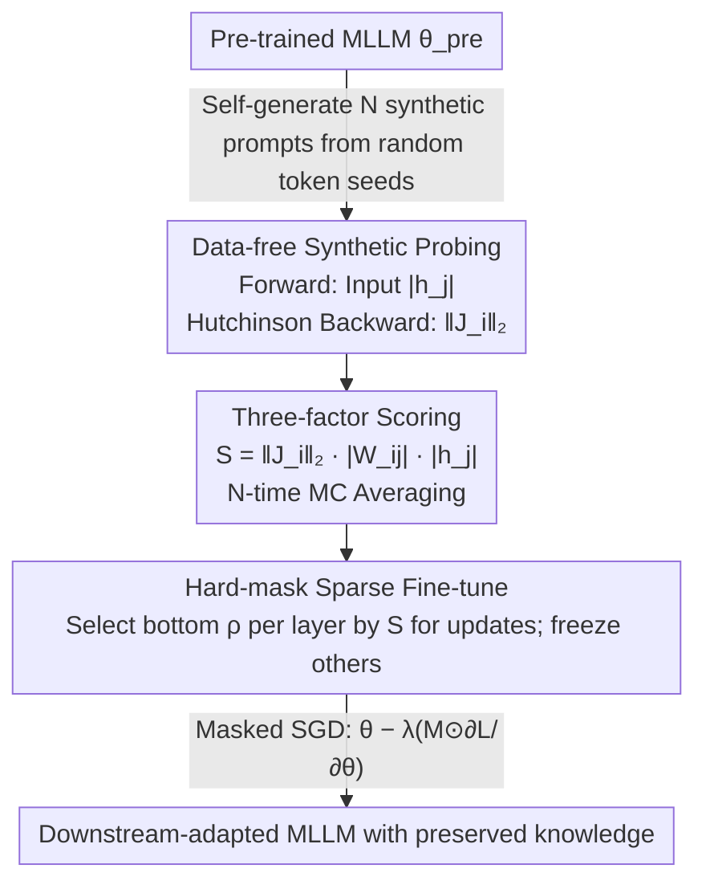

# Model-Dowser: Data-Free Importance Probing to Mitigate Catastrophic Forgetting in Multimodal Large Language Models

**Conference**: ICML 2026  
**arXiv**: [2602.04509](https://arxiv.org/abs/2602.04509)  
**Code**: N/A  
**Area**: Multimodal VLM / Continual Learning / Sparse Fine-tuning  
**Keywords**: MLLM, Catastrophic Forgetting, Sparse Fine-tuning, Parameter Importance, Data-free Probing

## TL;DR
Model-Dowser uses a three-factor scoring system—"weight magnitude × input activation × output Jacobian"—to rate each parameter in an MLLM. By freezing high-score parameters and updating only low-score ones, it enables deep fine-tuning for LLaVA/NVILA that adapts to downstream tasks while preserving pre-trained knowledge, consistently outperforming SPIDER and ModelTailor in H-score.

## Background & Motivation
**Background**: MLLMs (e.g., LLaVA, NVILA) often require further fine-tuning for specialized tasks, but full-tuning severely damages general pre-trained capabilities—a phenomenon known as "catastrophic forgetting." Existing mitigation methods fall into two categories: post-merging (e.g., ModelTailor), which merges weights before and after fine-tuning, and sparse fine-tuning (e.g., SPIDER), which updates only a small subset of weights.

**Limitations of Prior Work**: (1) Post-merging works decently for "last-layer only" fine-tuning but fails when fine-tuning extends to early decoder layers, as deep changes disrupt the latent space beyond repair by merging. (2) Existing sparse methods like SPIDER depend on gradient history and soft masks, requiring the storage of per-parameter accumulated gradients, which is too memory-intensive to scale to dozens of billions of parameters. (3) Traditional magnitude-based importance metrics assume homogeneous activations, which is inaccurate for modern non-linear activations like GELU, SiLU, or GLU.

**Key Challenge**: To simultaneously achieve "zero-forgetting under deep fine-tuning" and "no increase in VRAM/compute costs." The former requires importance evaluation that reflects functional impact under non-linear activations; the latter precludes practices like storing gradient history.

**Goal**: Find a parameter importance measure that is (i) independent of pre-training data, (ii) requires no extra gradient history, and (iii) remains accurate under non-homogeneous activations, using it as a basis for hard-freeze sparse fine-tuning.

**Key Insight**: The authors reframe the question of "which parameters are most important" as "which parameter perturbations most affect model output"—estimating the output shift $\|\Delta f\|_2$ via first-order Taylor expansion to base importance on functional rather than just numerical impact.

**Core Idea**: Use the three-factor product $S_{ij}^{(l)}=\|J_i^{(l)}\|_2\cdot|W_{ij}^{(l)}|\cdot|h_j^{(l-1)}|$ as the importance score. Implement data-free and memory-friendly probing via the Hutchinson estimator and self-generated synthetic prompts, then hard-freeze parameters with high scores.

## Method

### Overall Architecture
Model-Dowser follows a three-stage pipeline: (1) Probing—using synthetic prompts generated by the MLLM itself to perform forward passes for activations and backward passes via the Hutchinson trick for Jacobian L2 norms; (2) Compute Score—scoring each weight by $S=\|J_i\|_2\cdot|W_{ij}|\cdot|h_j|$ with N-time Monte Carlo averaging; (3) Sparse Fine-tune—selecting the top-$(1-\rho)$ highest-scoring weights per layer to freeze, using a binary mask to restrict gradients to the remaining $\rho$ proportion of "non-critical" weights during standard SGD. The entire process requires no original pre-training data and maintains no gradient history.

### Key Designs

**1. Data-free Synthetic Probing: Estimating output sensitivity without pre-training data or explicit Jacobian construction**

The first step is measuring how much a weight perturbation shifts the output, requiring the output Jacobian norm $\|J_i\|_2$ and input activation $|h_j|$. Since pre-training data is often unavailable and explicit Jacobian construction is computationally prohibitive (requiring $d_{\text{final}}$ backward passes), Model-Dowser uses two techniques. First, the Hutchinson Trace Estimator projects output into a random Rademacher vector $\xi\in\{\pm 1\}^{d_{\text{final}}}$, leveraging $\mathbb{E}_\xi[(\partial(\xi^\top f)/\partial z_i)^2]=\|J_i\|_2^2$ to get sensitivity with minimal backward passes. Second, the MLLM generates $N$ synthetic prompts $\hat{x}_n=f(\epsilon;\theta_{\text{pre}})$ from random seeds. Probing these prompts activates "learned" functional structures rather than task-specific distributions, with a total complexity of only $\mathcal{O}(N\cdot R)$ passes where $N,R\ll d_{\text{final}}$.

**2. Three-factor Functional Importance Score: Combing probed sensitivities into a first-order estimate of "output shift"**

Traditional magnitude importance (e.g., Wanda) assumes homogeneous activations, but non-linear activations like SiLU mean "large weight ≠ large impact." Model-Dowser shifts to a functional view. Per Theorem 3.1, under first-order Taylor expansion, the output shift caused by perturbing a weight is $\|\Delta f\|_2\approx\|J_i^{(l)}\|_2\cdot|\Delta W_{ij}^{(l)}|\cdot|h_j^{(l-1)}|$. By substituting the potential perturbation $\Delta W$ with the current magnitude $|W|$, the score becomes:

$$S_{ij}^{(l)}=\|J_i^{(l)}\|_2\cdot|W_{ij}^{(l)}|\cdot|h_j^{(l-1)}|,$$

averaged via Monte Carlo across $N$ synthetic prompts: $\bar S=\frac{1}{N}\sum_n \|J_{i,n}\|_2\cdot|W_{ij}|\cdot|h_{j,n}|$. The three terms capture distinct functional path segments: the Jacobian norm for output sensitivity, weight magnitude for parameter scale, and input activation for signal strength.

**3. Hard Binary Mask Sparse Fine-tuning: Converting "parameter protection" into a one-time pre-training mask**

Unlike post-merging methods (ModelTailor) where latent spaces drift beyond repair, or soft-mask methods (SPIDER) that require heavy memory to maintain cumulative gradients, Model-Dowser uses a simple path. It sorts by $\bar S$ per layer, setting the bottom $\rho$ proportion (e.g., $\rho=0.1$) as updatable (mask=1) and freezing the rest. The update rule is $\theta^*=\theta-\lambda\cdot(M\odot\partial\mathcal{L}/\partial\theta)$. Freezing high $\bar S$ parameters directly suppresses output perturbation; since the mask is computed once before training, its memory footprint is identical to standard fine-tuning and integrates easily with LoRA/full-parameter pipelines.

### Loss & Training
The downstream task uses standard instruction tuning loss, applying the gradient mask. The probing phase requires no loss function, only forward/backward passes to collect activations and Jacobian L2 norms. Experiments used $\rho=0.1$ for NVILA-Lite 2B fine-tuning the last 20 decoder layers and small $\rho$ for LLaVA 1.5 7B to emphasize "minimal update, stable preservation."

## Key Experimental Results

### Main Results

| Method (NVILA-Lite 2B, COCO-Caption, last 20 layers $\rho=0.1$) | $A_{\text{down}}$ ↑ | Pre-trained Mean ↑ | H-Score ↑ |
|---|---|---|---|
| Zero-shot | 36.8 (Ref) | 62.3 | — |
| Full-FT | 98.5 | 24.0 | 39.7 |
| Grafting | 115.7 | 38.7 | 49.2 |
| DARE | 96.8 | 24.9 | 39.1 |
| ModelTailor | 105.6 | 18.9 | 44.7 |
| SPIDER | 115.4 | 59.6 | 78.3 |
| **Model-Dowser** | Comparable to top | **68.8 (Best/Second in COCO)** | **Significant Lead over SPIDER** |

Based on Table 1, while maintaining downstream performance ($A_{\text{down}}$) near the strongest baselines, Model-Dowser pulls the average of 6 upstream tasks above all other methods, ranking first in H-Score.

### Ablation Study

| Dimension | Observation |
|------|------|
| Fine-tuning Depth (Last 5 / 10 / 20 / 32 layers) | Post-merging (DARE, ModelTailor) fails quickly as depth increases. Model-Dowser and SPIDER are stable, but SPIDER has higher VRAM overhead. |
| Synthetic vs. Real Prompts | Masks from synthetic prompts are nearly equivalent to those from real data, suggesting synthetic prompts effectively activate functional structures (Appendix G). |
| Hyperparameters $R$ and $N$ | Small values (tens) for $N$ and $R$ suffice for stable ranking; probing cost is far less than a full fine-tuning session. |
| Different Backbones | Consistent H-Score lead on LLaVA 1.5 7B vs NVILA-Lite 2B, showing robustness to scale/architecture. |

### Key Findings
- Deep fine-tuning (extending to early decoder layers) is the "death zone" for post-merging methods but is critical for MLLM multimodal understanding. Model-Dowser's stability here is its major advantage over ModelTailor and DARE.
- Importance is primarily driven by "Output Jacobian × Input Activation" rather than pure weight magnitude—explaining why magnitude-only methods (Wanda style) provide distorted rankings in SiLU/GLU architectures.
- The data-free path via synthetic prompts allows the method to scale naturally to massive MLLMs, as it neither requires pre-training data nor persistent gradient history.

## Highlights & Insights
- Entirely shifts "parameter importance" from weight values to "functional output sensitivity," providing a rigorous bound via first-order Taylor expansion—an elegant transfer of Optimal Brain concepts to continual learning.
- Compressing what seems like a full Jacobian computation into a few backward passes using the Hutchinson trick is a highly reusable tactic for any scenario requiring $\|J\|_2$ without the full gradient cost.
- Synthetic prompts decouple importance probing from data dependencies, meaning the model can perform a "self-checkup" upon delivery, making it ideal for deployment scenarios where fine-tuning decisions are made after delivery.

## Limitations & Future Work
- First-order Taylor expansion is an approximation; for large learning rates or severely shifted downstream distributions, the score might underestimate certain non-linear impacts.
- The mask is a "static" one-time calculation; periodic recalculation might be necessary during long training or sequential multi-task fine-tuning.
- Experiments focused on vision-language benchmarks like ImageNet-R and COCO; verification is still needed for long-context, video, or agentic multimodal tasks.
- The tradeoff between downstream performance and upstream preservation still relies on a manually tuned hyperparameter $\rho$, with no theoretical selection method provided yet.

## Related Work & Insights
- **vs SPIDER**: Both utilize sparse fine-tuning, but SPIDER dynamically maintains soft masks and accumulated gradients, whereas Model-Dowser uses one-time hard masks and Hutchinson Jacobians for standard VRAM footprints.
- **vs ModelTailor / DARE**: These rely on post-merging; Model-Dowser freezes functional anchors before training to prevent drift at the source.
- **vs Wanda / Magnitude Pruning**: Belongs to the "Weight × Activation" family, but Wanda lacks the Jacobian term, leading to inaccurate rankings under non-homogeneous activations.

## Rating
- Novelty: ⭐⭐⭐⭐ Combines Optimal Brain theory, Hutchinson trick, and synthetic prompts into a data-free MLLM forgetting solution; novelty lies in the composition of established tools.
- Experimental Thoroughness: ⭐⭐⭐⭐ Covers two backbones (LLaVA, NVILA), multiple depths, and multiple tasks, though lacks long-context/video task verification.
- Writing Quality: ⭐⭐⭐⭐ Clear theorems and module breakdowns; pipeline diagrams are intuitive.
- Value: ⭐⭐⭐⭐⭐ Provides a plug-and-play MLLM anti-forgetting tool that is memory-friendly, data-agnostic, and scalable, offering high industrial deployment value.

<!-- RELATED:START -->

## Related Papers

- [\[ICCV 2025\] SMoLoRA: Exploring and Defying Dual Catastrophic Forgetting in Continual Visual Instruction Tuning](../../ICCV2025/multimodal_vlm/smolora_exploring_and_defying_dual_catastrophic_forgetting_in_continual_visual_i.md)
- [\[ICML 2026\] Vision-aligned Latent Reasoning for Multi-modal Large Language Model](vision-aligned_latent_reasoning_for_multi-modal_large_language_model.md)
- [\[NeurIPS 2025\] ACT as Human: Multimodal Large Language Model Data Annotation with Critical Thinking](../../NeurIPS2025/multimodal_vlm/act_as_human_multimodal_large_language_model_data_annotation.md)
- [\[CVPR 2026\] Structural Graph Probing of Vision-Language Models](../../CVPR2026/multimodal_vlm/structural_graph_probing_of_vision-language_models.md)
- [\[ICML 2026\] Dimension-Free Multimodal Sampling via Preconditioned Annealed Langevin Dynamics](dimension-free_multimodal_sampling_via_preconditioned_annealed_langevin_dynamics.md)

<!-- RELATED:END -->
