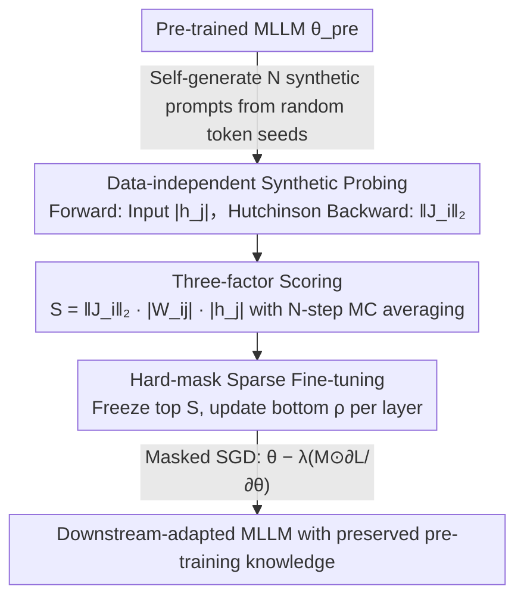

# Model-Dowser: Data-Free Importance Probing to Mitigate Catastrophic Forgetting in Multimodal Large Language Models

**Conference**: ICML 2026  
**arXiv**: [2602.04509](https://arxiv.org/abs/2602.04509)  
**Code**: None  
**Area**: Multimodal VLM / Continual Learning / Sparse Fine-tuning  
**Keywords**: MLLM, Catastrophic Forgetting, Sparse Fine-tuning, Parameter Importance, Data-Free Probing

## TL;DR
Model-Dowser scores each parameter of an MLLM using a three-factor multiplication of "weight magnitude $\times$ input activation $\times$ output Jacobian." By freezing high-score parameters and updating only low-score ones, it enables deep fine-tuning on LLaVA/NVILA that masters downstream tasks while preserving pre-trained knowledge, consistently outperforming SPIDER and ModelTailor on H-score.

## Background & Motivation
**Background**: MLLMs (e.g., LLaVA, NVILA) often require further fine-tuning for specialized tasks, but full-tuning severely damages general pre-trained capabilities—known as "catastrophic forgetting." Existing mitigation methods are mainly divided into post-merging (e.g., ModelTailor), which fuses pre-trained and fine-tuned weights, and sparse fine-tuning (e.g., SPIDER), which updates only a small fraction of parameters.

**Limitations of Prior Work**: (1) Post-merging performs adequately when only the last few layers are fine-tuned but fails when tuning extends to earlier decoder layers, as deep modifications prevent the latent space from being restored via post-hoc merging. (2) Existing sparse methods like SPIDER rely on gradient history and soft masks, requiring per-parameter gradient storage, which is memory-intensive and difficult to scale to tens of billions of parameters. (3) Traditional magnitude-based importance assumes homogeneous activations, which is inaccurate for modern non-linear activations like GELU, SiLU, or GLU.

**Key Challenge**: To simultaneously achieve "no forgetting under deep fine-tuning" and "no increase in memory/computation cost." The former requires importance evaluation that reflects functional influence under non-linear activations; the latter precludes practices like storing gradient history.

**Goal**: To identify a parameter importance metric that is (i) independent of pre-training data, (ii) requires no additional gradient history, and (iii) remains accurate under non-homogeneous activations, using it as a basis for hard-frozen sparse fine-tuning.

**Key Insight**: The authors reframe the question of "which parameters are most important" as "which parameter perturbations most affect model output"—specifically using a first-order Taylor expansion to estimate output shift $\|\Delta f\|_2$, establishing importance at the functional level rather than just the numerical level.

**Core Idea**: Utilize the product of three factors $S_{ij}^{(l)}=\|J_i^{(l)}\|_2\cdot|W_{ij}^{(l)}|\cdot|h_j^{(l-1)}|$ as the importance score. This is implemented via a data-independent, memory-friendly probing mechanism using the Hutchinson estimator and self-generated synthetic prompts, followed by hard-freezing high-score parameters.

## Method

### Overall Architecture
Model-Dowser is a three-stage pipeline: (1) Probing—collecting activations through forward passes using self-generated synthetic prompts and estimating Jacobian L2 norms via backward passes with the Hutchinson trick; (2) Compute Score—calculating importance scores based on $S=\|J_i\|_2\cdot|W_{ij}|\cdot|h_j|$ with Monte Carlo averaging over $N$ prompts; (3) Sparse Fine-tune—selecting top-$(1-\rho)$ high-score weights in each layer to freeze, applying a binary mask to restrict gradients to the bottom $\rho$ proportion of "non-critical" weights during SGD. The entire process requires no original pre-training data and maintains no gradient history.

### Key Designs

**1. Data-independent Synthetic Probing: Estimating output sensitivity without pre-training data or explicit Jacobian construction**

The first step of the pipeline measures how much perturbing a weight shifts the output. This requires the output Jacobian norm $\|J_i\|_2$ and the input activation $|h_j|$ for each weight. However, pre-training data is often unavailable, and explicit Jacobian construction requires $d_{\text{final}}$ backpropagation passes, which is computationally prohibitive. Model-Dowser addresses this with two techniques: first, the Hutchinson Trace Estimator, which projects the output onto random Rademacher vectors $\xi\in\{\pm 1\}^{d_{\text{final}}}$. Using the property $\mathbb{E}_\xi[(\partial(\xi^\top f)/\partial z_i)^2]=\|J_i\|_2^2$, output sensitivity for all nodes is obtained with very few backward passes. Second, the MLLM self-generates $N$ synthetic prompts $\hat{x}_n=f(\epsilon;\theta_{\text{pre}})$ from random seeds. These prompts stimulate the "internalized" functional structures of the model rather than task-specific distributions. The total complexity is only $\mathcal{O}(N\cdot R)$ forward/backward passes, where $N,R\ll d_{\text{final}}$, making it naturally scalable to large MLLMs.

**2. Three-factor Functional Importance Score: Combining probed sensitivities into a first-order estimate of output shift**

Traditional magnitude importance (e.g., Wanda) assumes homogeneous activations, but modern non-linearities like GELU/SiLU/GLU mean "large weight $\neq$ large impact," leading to rank distortion. Model-Dowser shifts from a numerical to a functional perspective: based on Theorem 3.1, the output shift caused by perturbing a weight is estimated via first-order Taylor expansion as $\|\Delta f\|_2\approx\|J_i^{(l)}\|_2\cdot|\Delta W_{ij}^{(l)}|\cdot|h_j^{(l-1)}|$. By substituting the potential perturbation $\Delta W$ with the current weight magnitude $|W|$, the three-factor product score is derived:

$$S_{ij}^{(l)}=\|J_i^{(l)}\|_2\cdot|W_{ij}^{(l)}|\cdot|h_j^{(l-1)}|,$$

with Monte Carlo averaging $\bar S=\frac{1}{N}\sum_n \|J_{i,n}\|_2\cdot|W_{ij}|\cdot|h_{j,n}|$ performed across $N$ synthetic prompts to suppress noise. Each term corresponds to a segment of the functional path: the Jacobian norm captures "downstream output sensitivity to this node," weight magnitude captures "parameter scale," and input activation captures "upstream signal strength." This completes the locally linear gradient path, compensating for the lack of non-linear sensitivity in pure magnitude methods without the heavy overhead of gradient-history methods.

**3. Hard Binary Mask Sparse Fine-tuning: Pre-calculating a mask to protect important parameters**

Unlike post-merging methods (e.g., ModelTailor), which struggle after deep layer modifications, or soft mask methods (e.g., SPIDER), which require dynamic gradient maintenance, Model-Dowser uses a simple and efficient approach. Parameters are sorted by $\bar S$ in ascending order within each layer; the bottom $\rho$ portion (e.g., $\rho=0.1$) is set as updatable (mask=1), while the rest are frozen. The update rule is $\theta^*=\theta-\lambda\cdot(M\odot\partial\mathcal{L}/\partial\theta)$. Freezing high $\bar S$ parameters directly suppresses the primary sources of output perturbation under first-order Taylor estimation. Since the mask is computed once before training, the memory overhead equals standard fine-tuning, allowing integration with existing LoRA or full-parameter pipelines while eliminating the cost of continuous importance score updates.

### Loss & Training
Standard instruction tuning loss is used for downstream tasks, with gradients multiplied by the mask. The probing phase requires no loss, using only forward and backward passes to collect activations and Jacobian L2 norms. NVILA-Lite 2B was tested with $\rho=0.1$ and the last 20 decoder layers fine-tuned; LLaVA 1.5 7B experiments similarly kept $\rho$ small, emphasizing "sparse updates for stable retention."

## Key Experimental Results

### Main Results

| Method (NVILA-Lite 2B, COCO-Caption column, last 20 layers $\rho=0.1$) | $A_{\text{down}}$ ↑ | Upstream Avg ↑ | H-Score ↑ |
|---|---|---|---|
| Zero-shot | 36.8 (Ref) | 62.3 | — |
| Full-FT | 98.5 | 24.0 | 39.7 |
| Grafting | 115.7 | 38.7 | 49.2 |
| DARE | 96.8 | 24.9 | 39.1 |
| ModelTailor | 105.6 | 18.9 | 44.7 |
| SPIDER | 115.4 | 59.6 | 78.3 |
| **Model-Dowser (Ours)** | Comparable to best | **68.8 (Best/Second in COCO)** | **Significant lead over SPIDER** |

Data from Table 1 of the paper shows that while maintaining downstream adaptability ($A_{\text{down}}$) close to the strongest baselines, Model-Dowser elevates the average score across 6 upstream tasks above all other methods, ranking first in H-Score.

### Ablation Study

| Dimension | Observation |
|------|------|
| Fine-tuning Depth (Last 5 / 10 / 20 / 32 layers) | Post-merging (DARE, ModelTailor) fails quickly as depth increases; Model-Dowser and SPIDER are more stable, but SPIDER has higher memory costs. |
| Use of Synthetic Prompts | Masks obtained with synthetic prompts are nearly equivalent to those from real data, indicating that synthesis effectively activates functional structures. |
| Probing Hyperparameters $R$ and $N$ | Small values for $N$ and $R$ (tens) are sufficient for stable rankings; probing cost is much lower than a full fine-tuning run. |
| Different Backbones (LLaVA 1.5 7B vs NVILA-Lite 2B) | Consistently leads in H-Score, showing robustness to model scale and architecture. |

### Key Findings
- Deep fine-tuning (updating early decoder layers) is the "failure zone" for post-merging methods but is critical for MLLM multimodal understanding; Model-Dowser remains stable in this zone, marking its primary advantage over ModelTailor and DARE.
- Importance is driven mainly by the "Output Jacobian × Input Activation" rather than pure weight magnitude—explaining why magnitude-based ranking (Wanda-style) is distorted under SiLU/GLU architectures.
- The data-free path via synthetic prompts allows the method to scale to massive MLLMs as it neither requires pre-training data nor stores gradient history.

## Highlights & Insights
- Shifts the vision of "parameter importance" from weight values to "functional output sensitivity," providing a rigorous bound via first-order Taylor expansion—elegantly transferring "Optimal Brain" concepts from pruning literature to continual learning.
- Using the Hutchinson trick to compress "full Jacobian computation" into a few backward passes is a highly reusable tactic for any scenario requiring $\|J\|_2$ where full Jacobian computation is unaffordable.
- Synthetic prompts decouple importance probing from data dependencies, allowing models to perform "self-checkups" upon delivery, which is ideal for deployment-time fine-tuning decisions.

## Limitations & Future Work
- First-order Taylor approximations are coarse under large perturbations; for scenarios with large learning rates or severe data shifts, the scores might underestimate certain non-linear impacts.
- The mask is a "static" score calculated once before training and does not adapt to training dynamics; periodic recalculation might be needed for long or sequential multi-task fine-tuning.
- Experiments focused on classic vision-language benchmarks like ImageNet-R and COCO; verification on true multimodal long-context, video, or agent tasks is still pending.
- The tradeoff between "downstream performance vs. upstream retention" still relies on the manual hyperparameter $\rho$, with no theoretical method currently provided for its selection.

## Related Work & Insights
- **vs SPIDER**: Both are sparse fine-tuning methods, but SPIDER dynamically maintains soft masks and accumulated gradients during training, incurring heavy memory costs. Model-Dowser uses a one-time hard mask + Hutchinson Jacobian, requiring memory equivalent to standard fine-tuning.
- **vs ModelTailor / DARE**: These rely on post-hoc merging; once deep layers are modified, the latent space cannot be restored. Model-Dowser freezes functional anchors before training to prevent drift at the source.
- **vs Wanda / magnitude pruning**: While in the "weight × activation" family, Wanda lacks the Jacobian term, leading to ranking distortion under non-homogeneous activations. Model-Dowser's three-factor approach is a more complete functional approximation.

## Rating
- Novelty: ⭐⭐⭐⭐ Combines Optimal Brain concepts, the Hutchinson trick, and synthetic prompts into a data-free MLLM anti-forgetting solution; the combination is novel even if the components are established.
- Experimental Thoroughness: ⭐⭐⭐⭐ Covers two backbones (LLaVA, NVILA), multiple depths, multiple downstream tasks, and several baselines, though lacks long-context/video task validation.
- Writing Quality: ⭐⭐⭐⭐ Theorems and modules are clearly decomposed; the pipeline diagram is intuitive, though tables are somewhat dense.
- Value: ⭐⭐⭐⭐⭐ Provides a plug-and-play anti-forgetting tool for MLLMs that is memory-efficient, data-independent, and scalable, offering high industrial deployment value.

<!-- RELATED:START -->

## Related Papers

- [\[ICCV 2025\] SMoLoRA: Exploring and Defying Dual Catastrophic Forgetting in Continual Visual Instruction Tuning](../../ICCV2025/multimodal_vlm/smolora_exploring_and_defying_dual_catastrophic_forgetting_in_continual_visual_i.md)
- [\[CVPR 2026\] Efficient Encoder-Free Fourier-based 3D Large Multimodal Model](../../CVPR2026/multimodal_vlm/efficient_encoder-free_fourier-based_3d_large_multimodal_model.md)
- [\[CVPR 2026\] Structural Graph Probing of Vision-Language Models](../../CVPR2026/multimodal_vlm/structural_graph_probing_of_vision-language_models.md)
- [\[ICML 2026\] Debate with Images: Detecting Deceptive Behaviors in Multimodal Large Language Models](debate_with_images_detecting_deceptive_behaviors_in_multimodal_large_language_mo.md)
- [\[ICML 2026\] Dimension-Free Multimodal Sampling via Preconditioned Annealed Langevin Dynamics](dimension-free_multimodal_sampling_via_preconditioned_annealed_langevin_dynamics.md)

<!-- RELATED:END -->
