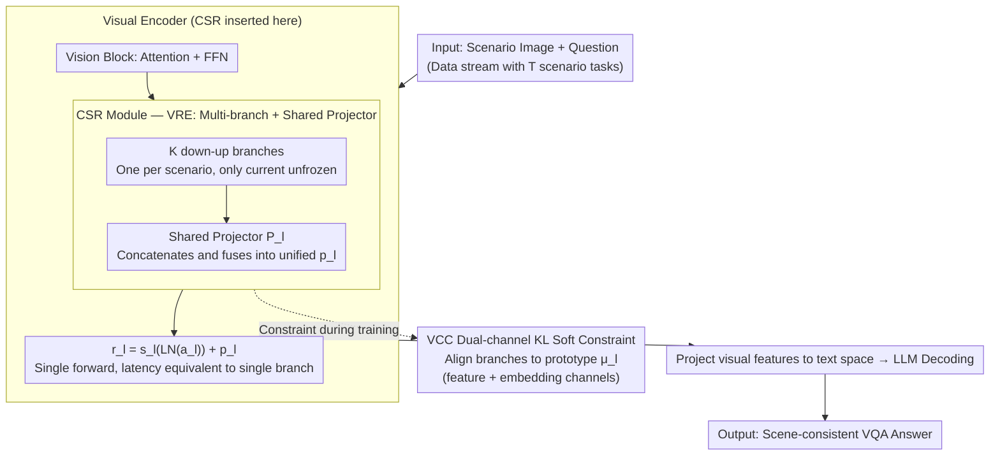

# Multimodal Continual Learning with MLLMs from Multi-scenario Perspectives

**Conference**: ICML 2026  
**arXiv**: [2511.18507](https://arxiv.org/abs/2511.18507)  
**Code**: Dataset released at [huggingface.co/datasets/Kaij00/MSVQA](https://huggingface.co/datasets/Kaij00/MSVQA)  
**Area**: Multimodal VLM / Continual Learning  
**Keywords**: Multimodal Continual Learning, Catastrophic Forgetting, Multi-branch LoRA, Visual Consistency, Multi-scenario VQA

## TL;DR
To address visual forgetting in MLLMs across scenarios, this paper constructs the MSVQA benchmark (covering high-altitude, underwater, low-altitude, and indoor scenarios) and proposes the Unifier framework. By integrating a CSR multi-branch structure with a shared projector (VRE) in vision blocks for parameter isolation, and applying dual-channel KL soft constraints (VCC) to align representations, the method improves VQA scores by 2.70-10.62% and F1 by 3.40-7.69% across 20-step continual learning with single-inference latency.

## Background & Motivation

**Background**: MLLMs (e.g., QwenVL, LLaVA) effectively solve VQA tasks in fixed scenarios. However, edge deployment involves continuously changing data streams, such as day/night cycles, indoor/outdoor transitions, and varying camera perspectives. Existing CL research (e.g., EWC, Tailor, PODNet, VQACL, QUAD) focuses primarily on textual forgetting in the LLM, often neglecting catastrophic forgetting in the visual components.

**Limitations of Prior Work**: Classical VQA benchmarks (e.g., VQAv2) feature simple questions (color, count) and uniform backgrounds, emphasizing text intent parsing. In real-world deployment, images have complex backgrounds with small, dense targets. Scenario switching causes visual representation overlap or drift, significantly increasing missed and false detections of small objects. Existing CL benchmarks lack multi-scenario and multi-perspective visual evaluation sets.

**Key Challenge**: The goal is to (a) accumulate knowledge within the same scenario for progressive performance gains; (b) adapt to new scenarios quickly without forgetting old ones; and (c) maintain low latency during single inference. While multi-branch LoRA provides isolation, it requires complex routing; pure distillation alleviates forgetting but strict intermediate alignment can stifle plasticity in new scenarios.

**Goal**: (1) Provide a multi-scenario VQA dataset reflecting "scenario/perspective switching $\rightarrow$ visual forgetting"; (2) Isolate visual representations of different scenarios without increasing inference overhead; (3) Align representations of different branches using soft constraints to prevent drift while maintaining plasticity.

**Key Insight**: The visual encoder is the first component to drift during scenario transitions. Rather than isolating parameters in the LLM, it is more effective to add scalable projection modules within ViT blocks to learn scenario-specific "worldviews" independently and project them into a unified space, eliminating the need for routing.

**Core Idea**: Insert Cross-Scenario Representation (CSR) modules into vision blocks. Each scenario utilizes a dedicated down-up branch. The concatenated outputs of all branches are fused into the original dimension via a shared projector $\mathcal P_l$. Bidirectional KL soft constraints (VCC) between individual branches and scenario prototypes maintain representation consistency.

## Method

### Overall Architecture
Given a data stream $\mathcal D = \{\mathcal D_1, \ldots, \mathcal D_T\}$, each task $\mathcal D_t = \{(x_i^t, q_i^t, y_i^t)\}_{i=1}^{n_t}$ originates from a different scenario. Unifier parallels a CSR module output $p_l$ with the FFN in each vision block $f_l$, resulting in $r_l = s_l(\text{LN}(a_l)) + p_l$. During training, only the branch corresponding to the current scenario and the projector are unfrozen. During inference, all branches are computed in parallel and fused without routing, achieving latency equivalent to a single-branch model. Visual Consistency Constraints (VCC) are applied within CSR to prevent representation drift.

### Key Designs

**1. Vision Representation Expansion (VRE) + Single Inference Fusion: Isolation without Routing**

The dilemma in cross-scenario CL is that single-branch LoRA risks overwriting old scenarios (forgetting), while multi-branch modules typically require a router that is itself prone to forgetting and increases forward passes. VRE bypasses this using "multi-branch + shared projector." The CSR module consists of $K$ down-up branches $\varphi_l^k = \phi_{up}(o(\phi_{down}(\cdot)))$ and a shared projector $\mathcal P_l \in \mathbb R^{K\times d_1 \to d_1}$. The output is $p_l = \mathcal P_l(\varphi_l^1(a_l) \oplus \cdots \oplus \varphi_l^K(a_l))$. During training for scenario $t$, only $\varphi_l^t$ and $\mathcal P_l$ are updated. 

The projector fuses multi-branch outputs into a "unified representation," acting as an implicit attention router. All branches are computed once in parallel during inference, ensuring the same latency as a single-branch model without needing a separate router.

**2. Vision Consistency Constraint (VCC) Dual-channel Soft Constraint: Stability without Sacrificing Plasticity**

Backpropagation during new scenario learning can contaminate other branches. While $\ell_2$ hard constraints lock representations, they destroy plasticity. VCC uses relative entropy (KL) for balance. A scenario prototype is calculated for each batch: $\mu_l = \frac{1}{K}\sum_k \varphi_l^k(a_l)$. Mean representations across feature and embedding channels are computed as $\bar\varphi_l^{k,\text{fe}} \in \mathbb R^{d_1}$ and $\bar\varphi_l^{k,\text{em}} \in \mathbb R^{\text{seq}}$, respectively, and aligned via KL divergence:

$$\mathcal{L}_c^{l,k} = \text{KL}(\bar\varphi_l^{k,\text{fe}}/\tau \mid \bar\mu_l^{\text{fe}}/\tau) + \text{KL}(\bar\varphi_l^{k,\text{em}}/\tau \mid \bar\mu_l^{\text{em}}/\tau)$$

The projector output $p_l$ is similarly aligned. By penalizing global distribution drift rather than local details, this allows for internal restructuring required for new knowledge.

**3. CSR Insertion in Visual Encoder Only: Targeting the Epicenter of Drift**

Visualizations show that after learning new scenarios, models fail primarily on small object detection in old scenarios, indicating that drift occurs mainly in the visual encoder. Semantic decoding in the LLM remains relatively robust. Thus, CSR is only inserted into vision blocks, significantly reducing the growth of trainable parameters.

### Loss & Training
The total loss is $\mathcal L = \mathcal L_{\text{task}} + \lambda \mathcal L_{vcc}$. A distillation temperature $\tau$ controls the soft constraint. During new scenario training, other branch parameters are frozen while the projector $\mathcal P_l$ is updated. Consistent with QUAD, images are not stored, but text questions may be kept as exemplars.

## Key Experimental Results

### Main Results
Evaluated on MSVQA 4 scenarios (High altitude / Underwater / Low altitude / Indoor) using VQA score and F1 for $T=5$ and $T=20$ step settings.

| Methods | High alt. VQA $A_T$ | Underwater VQA $A_T$ | Low alt. VQA $A_T$ | Indoor VQA $A_T$ |
|---------|---------------------|----------------------|---------------------|---------------------|
| Zero-shot | 20.55 | 19.30 | 14.94 | 52.40 |
| Joint (Upper Bound) | 64.97 | 84.27 | 59.80 | 87.20 |
| Finetune | 30.09 | 74.98 | 32.27 | 51.40 |
| EWC | 31.70 | 76.14 | 35.27 | 55.00 |
| ER | 43.64 | 78.16 | 48.12 | 61.40 |
| PODNet | 52.95 | 79.38 | 52.87 | 81.20 |
| QUAD (Prev. SOTA) | 56.59 | 79.62 | – | – |
| **Unifier (Ours)** | **Significant Improvement** | **Near Joint Bound** | **Significant Improvement** | **Near Joint Bound** |

In the 20-step setting: Compared to QUAD, last-step VQA increases by +2.70 ~ +10.62%, and F1 by +3.40 ~ +7.69%.

### Ablation Study

| Configuration | Key Metrics | Note |
|------|---------|------|
| Full Unifier | Best | VRE + VCC + Dual-channel KL |
| w/o VRE (Single-branch LoRA) | Significant degradation | Overlap between new and old scenarios |
| Multi-branch with routing | Router forgetting | Routing accuracy decays rapidly as scenarios increase |
| w/o VCC | Drift in old scenarios | Good plasticity but poor stability |
| VCC using $\ell_2$ instead of KL | Poor plasticity | New scenarios show minimal learning |
| VCC feature-channel only | Intermediate | Dual-channel (fe + em) is significantly better |

### Key Findings
- The visual encoder is the "epicenter" of forgetting in cross-scenario CL; placing CSR in vision blocks addresses most issues.
- KL dual-channel soft constraints provide a superior trade-off between plasticity and stability compared to $\ell_2$.
- Replacing an explicit router with a shared projector $\mathcal P_l$ simplifies the inference path and avoids the "chicken-and-egg" problem of training a router via CL.

## Highlights & Insights
- **Accurate Diagnosis**: The authors identify "visual encoder drift" as the primary cause of forgetting through visualization of false positives/negatives, modeling a "diagnose then design" research paradigm.
- **Bypassing Routing**: Using a shared projector is an elegant engineering trade-off that yields isolation benefits without the overhead or fragility of a router.
- **KL Dual-channel Mechanism**: Penalizing global distribution drift while allowing local freedom is a promising adaptation of knowledge distillation for CL.

## Limitations & Future Work
- Parameters grow linearly with the number of scenarios $K$; if $K$ is very large, the projector $\mathcal P_l$ size may become a bottleneck.
- Evaluated on only 4 scenarios; generalizability to "open-world" settings with hundreds of scenarios is unverified.
- MSVQA scenarios are highly distinct; benefits of VRE might diminish in sub-domains with higher visual similarity.
- Textual forgetting in the LLM (e.g., new vocabulary or instruction styles) was not investigated.

## Related Work & Insights
- **vs QUAD (Marouf 2025)**: QUAD focuses on the LLM side using attention distillation on historical text. Ours focuses on visual drift, making the two complementary.
- **vs PODNet / VQACL**: These traditional CL methods usually require image rehearsal; Unifier achieves superior results without storing images.
- **vs Dynamic Architectures (e.g., DER)**: DER expands the backbone, which is impractical for MLLMs. CSR limits expansion to small vision block modules.
- **vs Multi-LoRA + Router**: Unifier replaces the explicit router with a projector, eliminating router-specific CL hurdles.

## Rating
- Novelty: ⭐⭐⭐⭐ MLLM visual drift is often overlooked; VRE + projector is a novel combination.
- Experimental Thoroughness: ⭐⭐⭐⭐ Extensive cross-comparison with CL baselines, though scenario count is limited.
- Writing Quality: ⭐⭐⭐⭐ Diagrams are very clear; notation is complex but readable.
- Value: ⭐⭐⭐⭐ Useful for edge deployment; KL dual-channel constraint is broadly applicable.

<!-- RELATED:START -->

## Related Papers

- [\[CVPR 2026\] Towards Dynamic Modality Alignment in Multimodal Continual Learning](../../CVPR2026/multimodal_vlm/towards_dynamic_modality_alignment_in_multimodal_continual_learning.md)
- [\[NeurIPS 2025\] Continual Multimodal Contrastive Learning](../../NeurIPS2025/multimodal_vlm/continual_multimodal_contrastive_learning.md)
- [\[CVPR 2026\] Re-evaluating Continual VQA: Toward Fair and Robust Evaluation for Multimodal Continual Learning](../../CVPR2026/multimodal_vlm/re-evaluating_continual_vqa_toward_fair_and_robust_evaluation_for_multimodal_con.md)
- [\[ICML 2026\] Injecting Distributional Awareness into MLLMs via Reinforcement Learning for Deep Imbalanced Regression](injecting_distributional_awareness_into_mllms_via_reinforcement_learning_for_dee.md)
- [\[ICML 2026\] ACTIVE-o3: Empowering MLLMs with Active Perception via Pure Reinforcement Learning](active-o3_empowering_mllms_with_active_perception_via_pure_reinforcement_learnin.md)

<!-- RELATED:END -->
