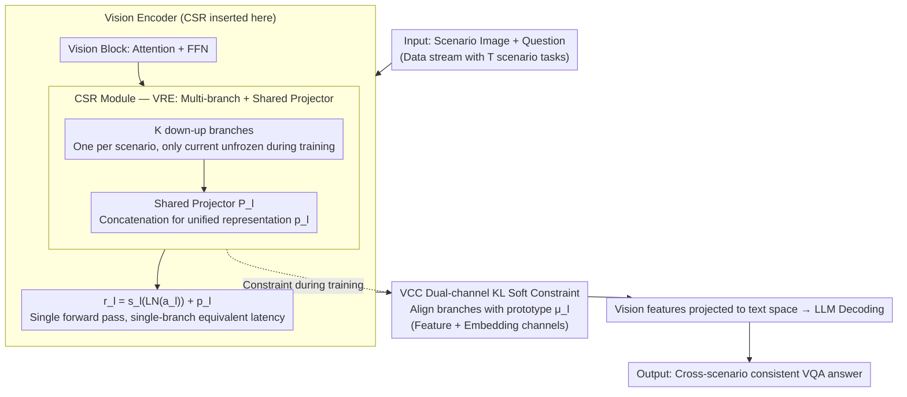

# Multimodal Continual Learning with MLLMs from Multi-scenario Perspectives

**Conference**: ICML 2026  
**arXiv**: [2511.18507](https://arxiv.org/abs/2511.18507)  
**Code**: Dataset released at [huggingface.co/datasets/Kaij00/MSVQA](https://huggingface.co/datasets/Kaij00/MSVQA)  
**Area**: Multimodal VLM / Continual Learning  
**Keywords**: Multimodal Continual Learning, Catastrophic Forgetting, Multi-branch LoRA, Visual Consistency, Multi-scenario VQA

## TL;DR
Addressing the visual forgetting problem in MLLMs during cross-scenario VQA, this paper constructs the MSVQA benchmark (covering 4 scenarios: high-altitude, underwater, low-altitude, and indoor) and proposes the Unifier framework. By integrating a CSR multi-branch structure with a projector (VRE) into vision blocks for parameter isolation, and employing a KL-based soft constraint (VCC) to align representations across branches, the method achieves single-inference efficiency. In a 20-step continual learning setting, it improves VQA scores by 2.70-10.62% and F1 scores by 3.40-7.69%.

## Background & Motivation

**Background**: MLLMs (e.g., QwenVL, LLaVA) can solve VQA tasks in fixed scenarios, but edge deployment involves continuously changing data streams—day/night, indoor/outdoor, and various device perspectives. Existing CL research predominantly focuses on textual forgetting in LLMs (e.g., EWC, Tailor, PODNet, VQACL, QUAD), while neglecting catastrophic forgetting in the vision components.

**Limitations of Prior Work**: Classic VQA benchmarks (e.g., VQAv2) feature simple questions (color, count) and focus on parsing user intent within single backgrounds. Real-world deployments involve complex backgrounds with small, dense targets; scenario transitions cause visual representation overlap or drift, leading to significantly increased missed or false detections of small objects (Figure 1). Existing CL benchmarks lack multi-scenario and multi-perspective visual evaluation sets.

**Key Challenge**: The need to (a) continuously accumulate knowledge within the same scenario for progressive performance gain; (b) adapt rapidly to new scenarios without forgetting old ones; and (c) maintain low latency for single-inference passes. While multi-LoRA branches provide parameter isolation, they require routing; pure distillation alleviates forgetting, but strict intermediate-layer alignment suppresses the plasticity needed for new scenarios.

**Goal**: (1) Provide a multi-scenario VQA dataset reflecting "scenario/perspective switching → visual forgetting"; (2) Isolate visual representations of different scenarios without increasing inference overhead; (3) Align representations of different branches using soft constraints to prevent drift while maintaining plasticity.

**Key Insight**: The vision encoder is the first component to drift during scenario transitions. Instead of parameter isolation on the LLM side, it is more effective to add small, expandable projection modules within ViT blocks to learn each scenario's "way of seeing" independently, while projecting them into a unified space to eliminate the need for routing.

**Core Idea**: Insert a CSR (Cross-Scenario Representation) module into vision blocks—comprising one down-up branch per scenario. The outputs of all branches are concatenated and fused into the original dimension via a shared projector $\mathcal P_l$, combined with a bidirectional KL soft constraint (VCC) against scenario prototypes to maintain representation consistency.

## Method

### Overall Architecture
The data stream $\mathcal D = \{\mathcal D_1, \ldots, \mathcal D_T\}$ consists of tasks where each $\mathcal D_t = \{(x_i^t, q_i^t, y_i^t)\}_{i=1}^{n_t}$ originates from a different scenario. Unifier parallels a CSR module output $p_l$ next to the FFN of each vision block $f_l$, and sums it with the FFN output: $r_l = s_l(\text{LN}(a_l)) + p_l$. During training, only the current scenario's branch and the projector are unfrozen. During inference, all branches are computed in parallel and fused once without routing, achieving latency equivalent to a single-branch model. Visual Consistency Constraint (VCC) is applied within CSR to prevent representation drift.

### Key Designs

**1. Vision Representation Expansion (VRE) + Single-inference Fusion: Isolation without Routing**

The dilemma in cross-scenario continual learning is that pure single-branch LoRA leads to new scenarios overwriting old ones (forgetting), while multi-branch approaches require training a router—which itself suffers from forgetting and increases forward pass overhead. VRE bypasses this by using "multi-branches + a shared projector." The CSR module consists of $K$ down-up branches $\varphi_l^k = \phi_{up}(o(\phi_{down}(\cdot)))$ and a shared projector $\mathcal P_l \in \mathbb R^{K\times d_1 \to d_1}$, where $p_l = \mathcal P_l(\varphi_l^1(a_l) \oplus \cdots \oplus \varphi_l^K(a_l))$. Each branch manages one scenario with a bottleneck dimension $d_2 \ll d_1$, ensuring modest parameter growth. During task $t$, only $\varphi_l^t$ and $\mathcal P_l$ are updated.

The shared projector integrates multi-branch outputs into a "unified representation," acting as an implicit attention router. All branches are computed once in parallel during inference, leading to latency identical to a single-branch model without needing a separate router.

**2. Vision Consistency Constraint (VCC) Dual-channel Soft Constraint: Stability without Sacrificing Plasticity**

When learning new scenarios, gradient backpropagation can indirectly contaminate other branches' representations, causing drift. Conversely, $\ell_2$ hard constraints can stifle plasticity, preventing the model from learning new details. VCC utilizes relative entropy soft constraints for balance. Scenario prototypes are calculated per batch as $\mu_l = \frac{1}{K}\sum_k \varphi_l^k(a_l)$. Branch representation means $\bar\varphi_l^{k,\text{fe}} \in \mathbb R^{d_1}$ and $\bar\varphi_l^{k,\text{em}} \in \mathbb R^{\text{seq}}$ are computed across feature and embedding channels, respectively, and aligned to prototypes via KL divergence:

$$\mathcal{L}_c^{l,k} = \text{KL}(\bar\varphi_l^{k,\text{fe}}/\tau \mid \bar\mu_l^{\text{fe}}/\tau) + \text{KL}(\bar\varphi_l^{k,\text{em}}/\tau \mid \bar\mu_l^{\text{em}}/\tau)$$

The projector output $p_l$ also uses a similar KL alignment $\mathcal L_p^l$, resulting in $\mathcal L_{vcc} = \frac{1}{L}\sum_l (\mathcal L_p^l + \sum_k \mathcal L_c^{l,k})$. Applying KL on channel-wise means punishes global distribution drift while allowing flexibility for local detail reorganization—a key adaptation of knowledge distillation for CL.

**3. CSR Target Vision Encoder: Allocating Capacity where Drift Occurs**

The authors identified the "epicenter" of forgetting through visualization in Figure 1: after learning new scenarios, old scenarios exhibited severe false negatives/positives for small objects. This indicates that cross-scenario drift occurs primarily in the vision encoder, while LLM-side semantic decoding remains relatively robust. Consequently, CSR is only inserted into vision blocks, keeping additional trainable parameters per scenario at the $K \cdot L \cdot 2d_1 d_2$ scale.

### Loss & Training
The total loss is $\mathcal L = \mathcal L_{\text{task}} + \lambda \mathcal L_{vcc}$. Distillation temperature $\tau$ controls the strength of the soft constraint. When training a new scenario, parameters of other branches are frozen while the projector $\mathcal P_l$ is shared and updated. Similar to QUAD, no images are stored, but textual questions can be retained as exemplars.

## Key Experimental Results

### Main Results
Evaluated on MSVQA 4 scenarios (High altitude / Underwater / Low altitude / Indoor) using VQA score and F1, with $T=5$ and $T=20$ step CL settings.

| Methods | High alt. VQA $A_T$ | Underwater VQA $A_T$ | Low alt. VQA $A_T$ | Indoor VQA $A_T$ |
|---------|---------------------|----------------------|---------------------|---------------------|
| Zero-shot | 20.55 | 19.30 | 14.94 | 52.40 |
| Joint (Upper Bound) | 64.97 | 84.27 | 59.80 | 87.20 |
| Finetune | 30.09 | 74.98 | 32.27 | 51.40 |
| EWC | 31.70 | 76.14 | 35.27 | 55.00 |
| ER | 43.64 | 78.16 | 48.12 | 61.40 |
| PODNet | 52.95 | 79.38 | 52.87 | 81.20 |
| QUAD (Prev. SOTA) | 56.59 | 79.62 | – | – |
| **Unifier (Ours)** | **Sig. Better** | **Near Joint** | **Sig. Better** | **Near Joint** |

In the 20-step setting: Compared to QUAD, last-step VQA increased by +2.70 ~ +10.62%, and F1 by +3.40 ~ +7.69%.

### Ablation Study

| Configuration | Key Metric | Description |
|------|---------|------|
| Full Unifier | Best | VRE + VCC + Dual-channel KL |
| w/o VRE (Single branch LoRA) | Significant degradation | No scenario isolation; scenarios overwrite each other |
| Multi-branch with routing | Router forgets | Routing accuracy decays rapidly as scenarios increase |
| w/o VCC | Old scenario drift | Good plasticity but poor stability |
| VCC with $\ell_2$ instead of KL | Poor plasticity | New scenarios learn almost no new content |
| VCC feature channel only | Intermediate | Dual-channel exceeds single-channel significantly |

### Key Findings
- The vision encoder is the "epicenter" of forgetting in cross-scenario CL for MLLMs; placing CSR solely in vision blocks addresses most issues.
- KL dual-channel soft constraints achieve a better trade-off between plasticity and stability than $\ell_2$ hard constraints.
- Replacing the explicit router with a shared projector $\mathcal P_l$ is key to simplifying the inference path, avoiding the "chicken-and-egg" problem of training a router via CL.

## Highlights & Insights
- **Accurate Diagnosis**: The authors localized "vision encoder drift" by visualizing failures (FP/FN in old scenarios after learning new ones). This "falsify then design" research paradigm is exemplary.
- **Routing-free Multi-branch**: An elegant engineering trade-off that gains the benefits of parameter isolation without the overhead or forgetting issues of an explicit router. This approach is transferable to any multi-task/multi-domain PEFT scenario.
- **Dual-channel KL Soft Constraint**: By penalizing global distribution drift across both feature and sequence dimensions, it leaves room for detail "re-composition," providing a robust method for managing the plasticity-stability trade-off in CL.

## Limitations & Future Work
- Parameters grow linearly with the number of scenarios $K$. As $K$ becomes very large, the size of projector $\mathcal P_l$ increases, posing challenges for long-horizon CL.
- Experiments were conducted on 4 scenarios with 20 steps; extensibility to "open-world + hundreds of scenarios" remains unproven.
- The 4 scenarios in MSVQA are distinct (e.g., underwater vs. indoor); the isolation benefits of VRE might diminish in sub-domains with smaller visual variances.
- Forgetting on the LLM side was not explored—e.g., whether the LLM backbone requires similar mechanisms when new vocabulary or instruction styles emerge.

## Related Work & Insights
- **vs QUAD (Marouf 2025)**: QUAD focuses on the LLM side using historical text exemplars and cross-question attention distillation. Ours focuses on visual drift, making the two approaches complementary.
- **vs PODNet / VQACL**: Traditional CL methods rely on intermediate layer distillation or invariant features, often requiring image rehearsal. Ours achieves superior performance without storing images through branch isolation and KL soft constraints.
- **vs Dynamic Architecture (e.g., DER)**: Methods like DER expand the backbone, which is impractical for large MLLMs. CSR limits expansion to small down-up branches within vision blocks.
- **vs Multi-LoRA + Router**: Replacing the router with a projector is a consistently better engineering choice that avoids the inherent difficulties of training routers in a continual learning manner.

## Rating
- Novelty: ⭐⭐⭐⭐ The focus on the visual aspect of multi-scenario MLLM CL is rare; the VRE + projector combination is a novel alternative to routing.
- Experimental Thoroughness: ⭐⭐⭐⭐ Comprehensive evaluation across 4 scenarios with 5/20 steps and multiple baselines, though scenario diversity could be higher.
- Writing Quality: ⭐⭐⭐⭐ Visualizations (Fig 1) and architecture diagrams (Fig 4) are very clear.
- Value: ⭐⭐⭐⭐ The dataset and framework are directly useful for edge MLLM deployment; the KL dual-channel constraint is highly generalizable.

<!-- RELATED:START -->

## Related Papers

- [\[CVPR 2026\] Towards Dynamic Modality Alignment in Multimodal Continual Learning](../../CVPR2026/multimodal_vlm/towards_dynamic_modality_alignment_in_multimodal_continual_learning.md)
- [\[NeurIPS 2025\] Continual Multimodal Contrastive Learning](../../NeurIPS2025/multimodal_vlm/continual_multimodal_contrastive_learning.md)
- [\[CVPR 2026\] Re-evaluating Continual VQA: Toward Fair and Robust Evaluation for Multimodal Continual Learning](../../CVPR2026/multimodal_vlm/re-evaluating_continual_vqa_toward_fair_and_robust_evaluation_for_multimodal_con.md)
- [\[AAAI 2026\] FinMMDocR: Benchmarking Financial Multimodal Reasoning with Scenario Awareness, Document Understanding, and Multi-Step Computation](../../AAAI2026/multimodal_vlm/finmmdocr_benchmarking_financial_multimodal_reasoning_with_scenario_awareness_do.md)
- [\[ICML 2026\] iVGR: Internalizing Visually Grounded Reasoning for MLLMs with Reinforcement Learning](ivgr_internalizing_visually_grounded_reasoning_for_mllms_with_reinforcement_lear.md)

<!-- RELATED:END -->
