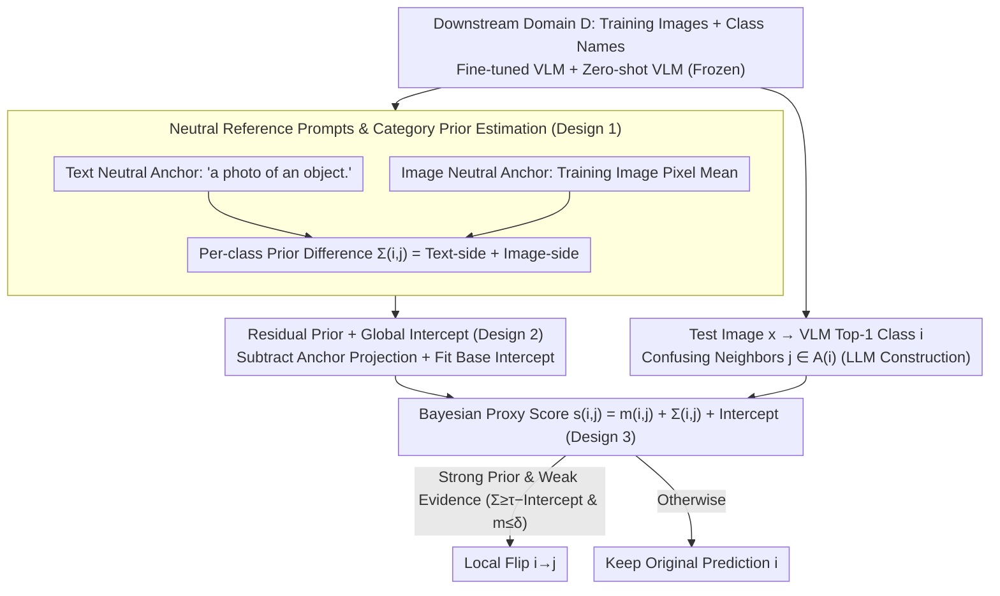

# Neutral-Reference Prompting for Vision-Language Models

**Conference**: ICML 2026  
**arXiv**: [2605.15615](https://arxiv.org/abs/2605.15615)  
**Code**: https://github.com/Sheldon04/NeRP (Available)  
**Area**: Multimodal VLM / Prompt Tuning / Efficient Transfer  
**Keywords**: Base-Novel Trade-off, Asymmetric Confusion, Neutral-Reference Prompt, Bayesian Prior, Plug-and-play Bias Correction

## TL;DR
This paper re-attributes the Base-New Trade-off (BNT) in VLM efficient transfer to "uneliminated asymmetric category preferences from pre-training on unseen classes." It proposes NeRP: using a semantically neutral text prompt and the "training image mean" as reference inputs to estimate per-class prior shifts on a pre-trained VLM with zero parameters. It then applies a Bayesian-style proxy score to perform local flips between confusing class pairs, improving novel class accuracy while maintaining base class performance without altering model parameters.

## Background & Motivation

**Background**: Efficient transfer for VLMs in the CLIP era (CoOp, CoCoOp, MaPLe, PromptSRC, TCP, MMA, etc.) typically relies on "learning a set of prompts/adapters on base classes" for downstream adaptation. While base class accuracy improves, novel (zero-shot) class accuracy often declines, constituting the Base-New Trade-off.

**Limitations of Prior Work**: Mainstream explanations attribute BNT to "overfitting on base classes," leading various methods to focus on "anti-overfitting"—adding regularization, constraining prompt drift, introducing external knowledge, or sharing representations. However, the authors point out this is only half the story: novel class inaccuracy also stems from an independent, more hidden source—**asymmetric confusion**. This is characterized by samples of class A being systematically misjudged as class B, while class B is rarely misjudged as A, which differs from conventional "symmetric difficulty" between classes.

**Key Challenge**: Asymmetric confusion originates from imbalances in pre-training data, forming implicit preferences for certain classes in both image and text modalities. During fine-tuning, cross-entropy on base classes can suppress these preferences (as ground-truth labels correct the decision boundaries), but novel class predictions rely entirely on zero-shot geometry, leaving pre-training preferences intact.

**Goal**: (1) Verify that asymmetric confusion exists and is distinct from overfitting; (2) Identify the shift direction of each novel class and correct it without modifying model parameters or retraining; (3) Avoid harming samples that are already correctly predicted.

**Key Insight**: The authors ask—"If a semantically empty image is fed into a VLM, which class will it select?"—The answer reveals implicit category preferences. Using the "class scores corresponding to meaningless inputs" as a prior allows for measuring the intensity and direction of shifts between class pairs.

**Core Idea**: Construct "neutral reference prompts" (class-agnostic text like "a photo of an object." and the training image pixel mean as neutral image input) and use their per-class scores in the VLM as category priors. Perform post-hoc bias correction in a Bayesian $\text{posterior}=\text{evidence}+\text{prior}$ fashion, triggering local flips only on "strong prior but weak evidence" samples to avoid damaging correct predictions.

## Method

### Overall Architecture
NeRP is a plug-and-play post-hoc correction module that does not modify any VLM parameters. Pipeline: (1) Given a downstream domain $D$, construct the text neutral anchor $u_{\mathrm{txt}}^0(D)=\text{norm}(g_{\mathrm{txt}}^0(\tau(D)))$ and image neutral anchor $u_{\mathrm{img}}(D)=f_{\mathrm{img}}(\bar{x}^D)$ (where $\bar{x}^D$ is the pre-processed training image pixel mean); (2) Calculate per-class prior logits $\pi_{\mathrm{txt}}(c;D), \pi_{\mathrm{img}}(c;D)$ using (fine-tuned) class prototypes $t(c)$ or zero-shot prototypes $t^0(c)$, and construct class-pair prior differences $\Sigma_{i,j}(D)$ (replaced by a residual version $\tilde{\Sigma}$ and a fitted global intercept $\hat{\beta}$ on base pairs for semantically diverse datasets); (3) Offline, use an LLM to query several "most confusing" candidate classes for each class to construct a symmetric confusing neighbor graph $\mathcal{A}(i)$; (4) For a test image $x$ and its top-1 class $i$, calculate a Bayesian proxy score $s_{ij}(x)=m_{ij}(x)+\Sigma_{i,j}(D)+\hat{\beta}(D)$ across neighbors $j\in\mathcal{A}(i)$; (5) If the prior is strong ($\Sigma_{i,j}\ge\tau-\hat{\beta}$) and evidence is weak ($m_{ij}(x)\le\delta$), flip $i$ to $j$; otherwise, retain the original prediction.

### Key Designs

**1. Neutral Reference Prompt & Category Prior Estimation: Measuring hidden VLM category preferences from "semantically empty inputs"**

The starting point of NeRP is a question: if a semantically empty image is fed into a VLM, which class will it favor? This bias is the category prior left by pre-training. On the text side, a class-agnostic prompt $\tau(D)$ (e.g., "a photo of an object.") is passed through the zero-shot encoder to get the neutral vector $u_{\mathrm{txt}}^0(D)$, which is inner-producted with each (fine-tuned) class prototype $t(c)$ to obtain $\pi_{\mathrm{txt}}(c;D)=\langle t(c),u_{\mathrm{txt}}^0(D)\rangle$. On the image side, the training set pixel mean $\bar{x}^D$ is passed through the image encoder to get $u_{\mathrm{img}}(D)$, which is inner-producted with the zero-shot class prototypes to obtain $\pi_{\mathrm{img}}(c;D)$. The resulting class-pair differences $\Delta\pi_{\mathrm{txt}}(i,j)$ and $\Delta\pi_{\mathrm{img}}(i,j)$ serve as two scales measuring the same pre-trained inter-class direction $\Delta_{ij}^0=t^0(i)-t^0(j)$.

This estimation works due to a low-rank deformation observation: the authors define fine-tuning as $g=g^0+Ub$, proving that fine-tuning primarily reshapes the low-dimensional subspace $S$ spanned by base prototypes, while the zero-shot geometry between novel classes remains mostly unchanged (Assumption 3.1+3.2). Thus, for novel class pairs, $t(i)-t(j)\approx \Delta_{ij}^0$, and the prior difference $\Delta\pi$ shares the same sign as the expected logit difference $\mu_{ij}(D)$ (Prop. 3.5). Conversely, directions of base class pairs $\Delta_{ij}^0$ fall within $S$, where the anchor energy is small, naturally minimizing base priors (Lemma 3.4). Therefore, correction rarely affects the already trained base decisions—the root of NeRP’s ability to "preserve base while boosting novel."

**2. Residual Prior + Global Intercept: Handling semantically diverse datasets**

On datasets like ImageNet with high inter-class semantic variance, raw priors have excessive variance because different anchors share a common class-agnostic bias for each category. The authors residualize the prior: the text residual prior is $\tilde{\pi}_{\mathrm{txt}}(c;D)=\langle t(c),u_{\mathrm{txt}}^0(D)\rangle-\langle t(c),u_{\mathrm{txt}}(D)\rangle$ (fine-tuned neutral anchor minus zero-shot neutral anchor). The class-pair residual $\Delta\tilde{\pi}\approx\langle\Delta_{ij}^0,u_{\mathrm{txt}}^0-u_{\mathrm{txt}}\rangle$ directly measures the projection of the "pre-training inter-class direction" onto the anchor shift, canceling out the common parts of the two anchors. A global intercept $\hat{\beta}(D)$ is then fitted on base pairs using least squares to absorb common drift, which is combined with threshold $\tau$ in practice.

**3. Bayesian Proxy Score + Local Flip Gating: Flipping only where "prior is strong, evidence is weak"**

The greatest risk of integrating priors into decision-making is damaging samples with strong, correct evidence. NeRP only operates in regions dominated by the prior. For a sample $x$, top-1 class $i$, and confusing neighbor $j\in\mathcal{A}(i)$, the proxy score is $s_{ij}(x)\approx m_{ij}(x)+\Sigma_{i,j}(D)+\hat{\beta}(D)$, where $m_{ij}(x)=\ell_i(x)-\ell_j(x)$ is the observed logit difference (interpretable as a log-approximation of the vMF likelihood ratio). Flips are triggered only within the "prior-dominant region" $\mathcal{R}_{i\to j}=\{\Sigma_{i,j}(D)\ge\tau-\hat{\beta}(D)\wedge m_{ij}(x)\le\delta\}$—where the prior is strong enough (gate $\tau$) but sample evidence is weak enough (gate $\delta$). The comparison is restricted to the confusing neighbor graph $\mathcal{A}(i)$, constructed offline via an LLM to further reduce accidental flips between semantically distant classes.

### Loss & Training
NeRP requires **absolutely no training**. All quantities are calculated one-time on domain $D$ using existing pre-trained and fine-tuned VLMs (including class prototypes, neutral anchors, $\hat{\beta}(D)$, and the neighbor graph). During inference, the overhead is negligible, involving only additional anchor encoding and a few inner products.

## Key Experimental Results

### Main Results
On 11 standard base-to-novel downstream datasets (ImageNet, Caltech101, Flowers, etc.), NeRP was combined with 5 mainstream baselines (CoOp, MaPLe, PromptSRC, etc.), reporting Average Base/Novel/HM (Harmonic Mean).

| Method | Average Base | Average Novel | Average HM | Note |
|------|--------------|---------------|------------|------|
| CoOp (IJCV 22) | 82.69 | 63.22 | 71.66 | Single prompt baseline |
| MaPLe (CVPR 23) | 82.28 | 75.14 | 78.55 | Deep multimodal prompt |
| MaPLe + NeRP | Stable | Significant ↑ | ↑ | Base maintained, Novel gains |

When NeRP is added to each baseline, Novel accuracy and HM increase across almost all datasets, while Base accuracy remains nearly identical, consistent with the theoretical guarantee in Lemma 3.4.

### Ablation Study
| Configuration | Behavior | Conclusion |
|------|------|------|
| $\pi_{\mathrm{txt}}$ only | Text-side prior alone | Substantial novel gains |
| $\pi_{\mathrm{img}}$ only | Image-side prior alone | Complementary to $\pi_{\mathrm{txt}}$ |
| $\pi_{\mathrm{txt}}+\pi_{\mathrm{img}}$ | Both sides combined | Better than either alone |
| Residual Prior $\tilde{\Sigma}$ | Subtracting anchor projection | More stable on diverse datasets |
| Remove evidence gate $\delta$ | Flip based on prior alone | Base classes harmed; HM decreases |
| Remove neighbor graph $\mathcal{A}(i)$ | Candidate flips from all $C-1$ classes | Mis-flip rate increases |

### Key Findings
- **Asymmetric confusion is an independent cause of BNT**: t-SNE and logit variance analysis show that novel class asymmetric shifts and base class overfitting are independent degradation paths; regularization methods like PromptSRC cannot solve the former.
- **The "training mean image" as a neutral anchor is surprisingly effective**: It retains domain style while stripping semantics, exposing VLM preferences in the image modality as an orthogonal complement to text priors.
- **Gating thresholds $(\tau,\delta)$ are harmless to base classes**: Lemma 3.4 states that prior differences on base classes are naturally suppressed, so flips are rarely triggered under default thresholds.

## Highlights & Insights
- **Re-attributing BNT**: Shifting the narrative from "overfitting" to "pre-training asymmetric preference + lack of novel-side correction" provides measurable and correctable quantities.
- **Transferable "Neutral Input" Probe**: Any vision-language retrieval or classification system can adopt this—using a class-agnostic template for text and domain means for images to instantly obtain category priors.
- **Theory-Engineering Synergie**: The low-rank deformation model, base subspaces, and vMF log-likelihood ratio form a complete chain, ensuring gates are grounded in theoretical high-probability bounds.

## Limitations & Future Work
- Primarily validated on base-to-novel splits; scalability to thousands of novel classes for neighbor graph construction and threshold selection requires further verification.
- Neutral anchor construction is sensitive to domain distribution: training image means are strong for consistent styles (EuroSAT) but might be diluted in highly heterogeneous datasets.
- Thresholds and neighbor graphs still require selection on val sets; exploring adaptive thresholds would move closer to a true "zero-parameter" ideal.
- Currently relies on cosine+vMF approximations; assessments on other VLM styles (BLIP, Flamingo) or after temperature scaling are needed.

## Related Work & Insights
- **vs. CoOp / MaPLe / PromptSRC**: These work on "training-stage prompt design" against overfitting. NeRP is orthogonal, performing post-hoc correction at inference.
- **vs. ProGrad / DPC**: These focus on "not washing away zero-shot knowledge" during training via gradient or decoupling; NeRP does this via inference-side direction probing.
- **vs. CLIP Bias Studies**: These often audit or debias training data. NeRP converts "known existing biases" into usable priors, turning "diagnosis" into "utilization."

## Rating
- Novelty: ⭐⭐⭐⭐⭐ The combination of asymmetric confusion, neutral anchor probes, and Bayesian gating is unique in BNT literature.
- Experimental Thoroughness: ⭐⭐⭐⭐ Extensive coverage across 11 datasets and 5 baselines, though cross-domain evaluation is relatively brief.
- Writing Quality: ⭐⭐⭐⭐ Clear theoretical chain (Assumptions → Lemmas → Props) with explicit mappings to engineering gates.
- Value: ⭐⭐⭐⭐⭐ Zero training parameters, low inference overhead, and compatibility with any prompt tuning method make it highly valuable for industrial deployment.

<!-- RELATED:START -->

## Related Papers

- [\[ECCV 2024\] Attention Prompting on Image for Large Vision-Language Models](../../ECCV2024/multimodal_vlm/attention_prompting_on_image_for_large_visionlanguage_models.md)
- [\[AAAI 2026\] VP-Bench: A Comprehensive Benchmark for Visual Prompting in Multimodal Large Language Models](../../AAAI2026/multimodal_vlm/vp-bench_a_comprehensive_benchmark_for_visual_prompting_in_m.md)
- [\[ICML 2026\] Vision Language Models 无法推理物理变换](vision_language_models_cannot_reason_about_physical_transformation.md)
- [\[AAAI 2026\] Graph-of-Mark: Promote Spatial Reasoning in Multimodal Language Models with Graph-Based Visual Prompting](../../AAAI2026/multimodal_vlm/graph-of-mark_promote_spatial_reasoning_in_multimodal_langua.md)
- [\[CVPR 2026\] Illusion-Aware Visual Preprocessing and Anti-Illusion Prompting for Classic Illusion Understanding in Vision-Language Models](../../CVPR2026/multimodal_vlm/illusion-aware_visual_preprocessing_and_anti-illusion_prompting_for_classic_illu.md)

<!-- RELATED:END -->
