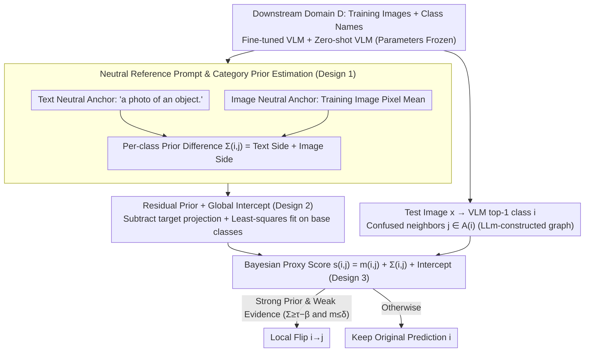

# Neutral-Reference Prompting for Vision-Language Models

**Conference**: ICML 2026  
**arXiv**: [2605.15615](https://arxiv.org/abs/2605.15615)  
**Code**: https://github.com/Sheldon04/NeRP (Available)  
**Area**: Multimodal VLM / Prompt Tuning / Efficient Transfer  
**Keywords**: Base-Novel Trade-off, Asymmetric Confusion, Neutral Reference Prompt, Bayesian Prior, Plug-and-play Bias Correction

## TL;DR
This paper re-attributes the Base-New Trade-off (BNT) in VLM efficient transfer to "unremoved asymmetric category preferences from pre-training in novel classes." It proposes NeRP: using a semantically neutral text prompt and the "training image mean" as reference inputs to estimate zero-parameter prior shifts for each category on a trained VLM. A Bayesian-style proxy score is then used to perform local flips between confused category pairs, improving novel class accuracy while preserving base class accuracy without modifying model parameters.

## Background & Motivation

**Background**: Efficient transfer for VLMs in the CLIP era (CoOp, CoCoOp, MaPLe, PromptSRC, TCP, MMA, etc.) typically relies on "learning a set of prompts/adapters on base classes" for downstream adaptation. While base class accuracy increases, novel (zero-shot unseen) class accuracy often drops, forming the Base-New Trade-off.

**Limitations of Prior Work**: Mainstream explanations attribute BNT to "overfitting on base classes," leading various methods to focus on "anti-overfitting"—adding regularization, constraining prompt drift, introducing external knowledge, or sharing representations. However, the authors point out this is only half the story: poor novel class accuracy also stems from a separate, more subtle source—**asymmetric confusion**. This manifests as samples of class A being systematically misclassified as B, while B is rarely misclassified as A, which differs from standard "symmetrical" confusion.

**Key Challenge**: Asymmetric confusion arises from imbalances in pre-training data, forming implicit preferences for certain classes in both image and text branches. During fine-tuning, cross-entropy on base classes can suppress these preferences (as ground-truth labels correct the decision boundaries), but novel class predictions rely entirely on zero-shot geometry, leaving pre-training preferences intact.

**Goal**: (1) Verify that asymmetric confusion exists and is distinct from overfitting; (2) Identify and correct the shift direction for each novel class without modifying parameters or re-training; (3) Avoid damaging originally correct predictions.

**Key Insight**: The authors ask: "If a semantically empty image is fed into the VLM, which class would it choose?" The answer reveals implicit category preferences. Using "class scores corresponding to meaningless inputs" as a prior allows measuring the strength and direction of shifts between class pairs.

**Core Idea**: Construct "neutral reference prompts" (class-agnostic text like "a photo of an object" and the pixel mean of training images as neutral inputs). Use the resulting per-class VLM scores as category priors; perform post-hoc correction using a Bayesian $\text{posterior}=\text{evidence}+\text{prior}$ format, triggering local flips only on samples with "strong priors but weak evidence" to avoid disrupting correct predictions.

## Method

### Overall Architecture
NeRP is a plug-and-play post-hoc correction module that does not modify any VLM parameters. Pipeline: (1) Given a downstream domain $D$, construct a text neutral anchor $u_{\mathrm{txt}}^0(D)=\text{norm}(g_{\mathrm{txt}}^0(\tau(D)))$ and an image neutral anchor $u_{\mathrm{img}}(D)=f_{\mathrm{img}}(\bar{x}^D)$ (where $\bar{x}^D$ is the pre-processed pixel mean of training images); (2) Calculate per-class prior logits $\pi_{\mathrm{txt}}(c;D)$ and $\pi_{\mathrm{img}}(c;D)$ against (fine-tuned) class prototypes $t(c)$ or zero-shot prototypes $t^0(c)$, and construct the class-pair prior difference $\Sigma_{i,j}(D)$ (for semantically diverse datasets, use the residual version $\tilde{\Sigma}$ and fit a global intercept $\hat{\beta}$ on base class pairs); (3) Use an LLM offline to query "most confusing" candidate classes for each category to construct a symmetric confusion neighbor graph $\mathcal{A}(i)$; (4) For a test image $x$ and its top-1 class $i$, compute the Bayesian proxy score $s_{ij}(x)=m_{ij}(x)+\Sigma_{i,j}(D)+\hat{\beta}(D)$ over neighbors $j\in\mathcal{A}(i)$; (5) If the prior is strong ($\Sigma_{i,j}\ge\tau-\hat{\beta}$) and evidence is weak ($m_{ij}(x)\le\delta$), flip $i$ to $j$; otherwise, keep the original prediction.

### Key Designs

**1. Neutral Reference Prompt and Category Prior Estimation: Measuring Implicit Preferences via "Semantically Empty Inputs"**

The starting point of NeRP is a question: If an empty input is fed to the VLM, which class does it prefer? This bias is the category prior left by pre-training. For the text side, a class-agnostic prompt $\tau(D)$ (e.g., "a photo of an object.") is passed through the zero-shot encoder to get anchor $u_{\mathrm{txt}}^0(D)$. The inner product with each (fine-tuned) prototype $t(c)$ yields $\pi_{\mathrm{txt}}(c;D)=\langle t(c),u_{\mathrm{txt}}^0(D)\rangle$. For the image side, the training set pixel mean $\bar{x}^D$ is passed through the image encoder to get $u_{\mathrm{img}}(D)$, and its inner product with zero-shot prototypes yields $\pi_{\mathrm{img}}(c;D)$. The differences $\Delta\pi_{\mathrm{txt}}(i,j)$ and $\Delta\pi_{\mathrm{img}}(i,j)$ serve as two rulers measuring the same pre-training inter-class direction $\Delta_{ij}^0=t^0(i)-t^0(j)$.

This estimation works due to a low-rank deformation observation: fine-tuning can be written as $g=g^0+Ub$. Fine-tuning primarily reshapes the low-dimensional subspace $S$ spanned by base prototypes, while the zero-shot geometry between novel classes remains mostly unchanged (Assumption 3.1+3.2). Thus, for novel class pairs $t(i)-t(j)\approx \Delta_{ij}^0$, the prior difference $\Delta\pi$ has the same sign as the expected logit difference $\mu_{ij}(D)$ (Prop. 3.5). For base class pairs, the direction $\Delta_{ij}^0$ falls within $S$ where the anchor energy is small (Lemma 3.4), making the prior naturally smaller. Thus, correction rarely affects trained base decisions—the core of NeRP’s "preserve base, improve novel" capability.

**2. Residual Prior + Global Intercept: Handling Highly Diverse Datasets**

On datasets like ImageNet with massive inter-class semantic variance, raw priors exhibit high variance because different anchors share a common, class-agnostic bias. This paper residualizes the prior: text residual prior $\tilde{\pi}_{\mathrm{txt}}(c;D)=\langle t(c),u_{\mathrm{txt}}^0(D)\rangle-\langle t(c),u_{\mathrm{txt}}(D)\rangle$ (fine-tuned neutral anchor minus zero-shot neutral anchor). The class-pair residual $\Delta\tilde{\pi}\approx\langle\Delta_{ij}^0,u_{\mathrm{txt}}^0-u_{\mathrm{txt}}\rangle$ directly measures the projection of the "pre-training inter-class direction" onto the anchor shift, canceling out the common part and reducing variance. A global intercept $\hat{\beta}(D)=\arg\min_\beta\sum_{\mathcal{B}\times\mathcal{B}}(\hat{\mu}_{ij}-\Sigma_{i,j}-\beta)^2$ is then fitted using least squares on base pairs to absorb common drift, which is merged into the threshold $\tau$ during use.

**3. Bayesian-style Proxy Score + Local Flip Gating: Flipping Only at "Strong Prior, Weak Evidence"**

Integrating priors into decisions risks damaging correct samples with strong evidence. NeRP only acts in prior-dominated regions. For sample $x$, top-1 class $i$, and neighbor $j\in\mathcal{A}(i)$, the proxy score $s_{ij}(x)\approx m_{ij}(x)+\Sigma_{i,j}(D)+\hat{\beta}(D)$ is defined, where $m_{ij}(x)=\ell_i(x)-\ell_j(x)$ is the observed logit difference (interpretable as a log-posterior odds approximation under vMF). A flip is triggered only within the "prior-dominated region" $\mathcal{R}_{i\to j}=\{\Sigma_{i,j}(D)\ge\tau-\hat{\beta}(D)\wedge m_{ij}(x)\le\delta\}$. Comparisons are restricted to the neighbor graph $\mathcal{A}(i)$, constructed using a local LLM (Qwen2.5-72B-Instruct) for each class. This ensures flips only occur between semantically similar and truly confused pairs, further reducing false flips.

### Loss & Training
NeRP is **training-free**: all values are calculated once using the existing pre-trained and fine-tuned VLM on domain $D$ (including prototypes, neutral anchors, $\hat{\beta}(D)$, and the neighbor graph). At inference, it adds only two anchor encodings, a few inner products, and top-1 neighbor enumeration, with negligible overhead.

## Key Experimental Results

### Main Results
On 11 standard base-to-novel datasets (ImageNet, Caltech101, OxfordPets, StanfordCars, Flowers, Food101, Aircraft, SUN397, DTD, EuroSAT, UCF101), NeRP is combined with 5 mainstream baselines (CoOp, CoCoOp, MaPLe, PromptSRC, etc.). Average Base/Novel/HM (Harmonic Mean) values are reported.

| Method | Average Base | Average Novel | Average HM | Note |
|------|--------------|---------------|------------|------|
| CoOp (IJCV 22) | 82.69 | 63.22 | 71.66 | Single prompt baseline |
| MaPLe (CVPR 23) | 82.28 | 75.14 | 78.55 | Multi-modal deep prompt |
| MaPLe + NeRP | Stable | Significant ↑ | ↑ | Base preserved, Novel improved |

When combined with any baseline, NeRP improves Novel accuracy on almost all datasets, increasing HM while keeping Base accuracy nearly identical (guaranteed by Lemma 3.4).

### Ablation Study

| Configuration | Behavior | Conclusion |
|------|------|------|
| Only $\pi_{\mathrm{txt}}$ | Text prior only | Significant novel gains |
| Only $\pi_{\mathrm{img}}$ | Image prior only | Complementary to text prior |
| $\pi_{\mathrm{txt}}+\pi_{\mathrm{img}}$ | Both priors | Better than either alone |
| Residual $\tilde{\Sigma}$ | Subtract anchor projection | More stable on diverse data like ImageNet |
| Remove evidence gate $\delta$ | Flip based on prior only | Damages base classes; HM decreases |
| Remove graph $\mathcal{A}(i)$ | Flip among all $C-1$ classes | False flip rate increases |

### Key Findings
- **Asymmetric confusion is an independent cause of BNT**: t-SNE and per-class mean logit variance plots show that asymmetric shifts in novel classes and overfitting in base classes are two independent degradation paths.
- **Image-side "Training Mean Image" is surprisingly effective**: It preserves domain style while erasing semantics, exposing the VLM's domain-specific image preference as an orthogonal complement to the text prior.
- **Gating thresholds $(\tau,\delta)$ are safe for base classes**: Lemma 3.4 shows that prior differences are naturally suppressed in base classes, making flips highly unlikely under default thresholds.

## Highlights & Insights
- **Heuristic re-attribution of BNT**: Shifts the narrative from "overfitting" to "pre-training asymmetric preference without novel-side correction," providing measurable and correctable quantities.
- **Migratable "Neutral Input" prior probe**: Applicable to any vision-language retrieval/classification system by using class-agnostic templates and training set means as prior detectors.
- **Theory-driven engineering**: The model links low-rank deformation, base subspaces, and vMF log-likelihood ratios into a coherent chain where thresholds are derived from high-probability bounds (Cor. 3.6).

## Limitations & Future Work
- Primarily validated on base-to-novel splits; scalability of neighbor graph construction and threshold selection for real open-vocabulary/long-tail settings (thousands of classes) needs further study.
- Neutral anchor construction is domain-sensitive: training means are strong for consistent styles (EuroSAT) but might be diluted in highly heterogeneous datasets.
- Thresholds $(\tau,\delta)$ and the graph $\mathcal{A}(i)$ still require validation on a val set, slightly relaxing the "zero-parameter" claim.
- Current approximations use cosine/vMF; adaptability to temperature scaling or non-CLIP architectures (e.g., BLIP, Flamingo) should be assessed.

## Related Work & Insights
- **vs CoOp / MaPLe / PromptSRC**: These focus on "training-stage prompt design" to fight overfitting. NeRP is orthogonal—performing post-hoc correction at inference—and can be layered on top of them.
- **vs ProGrad / DPC**: Also concerned with preserving zero-shot knowledge, but these use gradient/training-side control, while NeRP uses inference-side detection and correction.
- **vs CLIP Bias Studies**: While prior work audits and debiases data/representations, NeRP transforms these biases into usable priors, treating them as tools for correction.

## Rating
- Novelty: ⭐⭐⭐⭐⭐ Asymmetric confusion + neutral anchor probes + Bayesian gating is unique in BNT literature.
- Experimental Thoroughness: ⭐⭐⭐⭐ Extensive 11-dataset evaluation across 5 baselines, though cross-domain evaluation is relatively brief.
- Writing Quality: ⭐⭐⭐⭐ Clear theoretical chain (Assumptions to Corollaries) with explicit mapping to engineering components.
- Value: ⭐⭐⭐⭐⭐ Zero training parameters, low inference overhead, and compatibility with any prompt tuning method offer high industrial deployment value.

<!-- RELATED:START -->

## Related Papers

- [\[ECCV 2024\] Attention Prompting on Image for Large Vision-Language Models](../../ECCV2024/multimodal_vlm/attention_prompting_on_image_for_large_visionlanguage_models.md)
- [\[ICML 2026\] Vision Language Models 无法推理物理变换](vision_language_models_cannot_reason_about_physical_transformation.md)
- [\[AAAI 2026\] VP-Bench: A Comprehensive Benchmark for Visual Prompting in Multimodal Large Language Models](../../AAAI2026/multimodal_vlm/vp-bench_a_comprehensive_benchmark_for_visual_prompting_in_m.md)
- [\[CVPR 2026\] P-Flow: Prompting Visual Effects Generation](../../CVPR2026/multimodal_vlm/p-flow_prompting_visual_effects_generation.md)
- [\[ICML 2026\] Large Vision-Language Models Get Lost in Attention](large_vision-language_models_get_lost_in_attention.md)

<!-- RELATED:END -->
