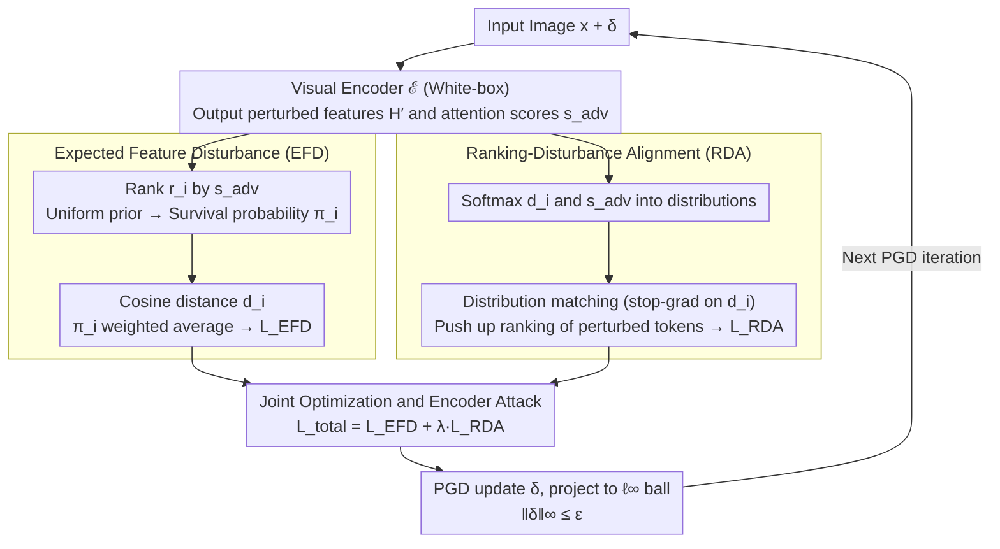

# On the Adversarial Robustness of Large Vision-Language Models under Visual Token Compression

**Conference**: ICML 2026  
**arXiv**: [2601.21531](https://arxiv.org/abs/2601.21531)  
**Code**: https://github.com/XinweiZhang1998/CAGE (Available)  
**Area**: Multimodal VLM / AI Safety / Adversarial Robustness  
**Keywords**: Visual Token Compression, Adversarial Attack, Robustness Evaluation, LVLM, Encoder Attack

## TL;DR
This paper provides the first systematic study of the adversarial robustness of Large Vision-Language Models (LVLMs) with visual token compression. It identifies the "optimization-inference space mismatch" in existing encoder attacks and proposes the CAGE attack. By utilizing Expected Feature Disturbance (EFD) and Ranking-Disturbance Alignment (RDA), CAGE significantly reduces the robust accuracy of compressed LVLMs under conditions where the compression mechanism and token budget are unknown.

## Background & Motivation

**Background**: Leading LVLMs like LLaVA-NeXT and InternVL process hundreds to thousands of visual tokens per image, leading to high deployment costs. Consequently, "plug-and-play" visual token compression methods (e.g., VisionZip, VisPruner, DivPrune, FlowCut, PruMerge) have become standard for deployment. These methods select Top-K informative tokens based on attention scores and optionally merge minor tokens, reducing the visual sequence length from $N=576$ to $K \ll N$ to accelerate inference with minimal performance loss.

**Limitations of Prior Work**: While compressed LVLMs are increasingly deployed in safety-critical scenarios like autonomous driving and robotics, their adversarial robustness after compression remains largely unevaluated. Current evaluations typically employ encoder attacks (e.g., VEAttack) that optimize perturbations in the full $N$ token representation space. Applying these perturbations to compressed models can result in severely distorted evaluations.

**Key Challenge**: Perturbations are optimized on "full token representations," but inference occurs only on "compressed representations." This leads to two failure paths: (i) **Budget Dilution**: A significant portion of the optimization signal is allocated to tokens that are pruned and do not participate in inference. (ii) **Dependence Break**: Compression removes context/background tokens, breaking the cross-token interactions that the attack relied on during global optimization. Combined, these factors lead to a significant overestimation of robust accuracy.

**Goal**: (1) Establish the robustness of compressed LVLMs as an independent research problem. (2) Design a grey-box attack that aligns with the compression bottleneck even when the deployment budget $K_{\text{model}}$ and specific compression mechanism $\mathcal{C}$ are unknown.

**Key Insight**: The authors observe two complementary phenomena: ① After sorting tokens by attention, the cosine shift of perturbed features monotonically decreases as $K$ increases—indicating that perturbations naturally concentrate on high-importance tokens that are likely to "survive" compression. ② The attack is strongest when $K_{\text{attack}} = K_{\text{model}}$ (e.g., for a 16-token deployment, a full-token attack yields 49.7% robust accuracy, while aligning to 16 tokens reduces it to 44.4%).

**Core Idea**: Instead of distributing perturbations across all tokens, CAGE uses a probabilistic framework to concentrate perturbation energy on tokens likely to survive across various possible budgets. Simultaneously, it actively pushes the attention scores of these tokens higher to ensure they are selected.

## Method

### Overall Architecture
CAGE maintains a grey-box assumption for encoder attacks (white-box access to the visual encoder $\mathcal{E}$, black-box access to the compression module $\mathcal{C}$ and LLM $\mathcal{F}$, with $K_{\text{model}}$ unknown). A single PGD iteration in the optimization pipeline is as follows: (1) The input image $\mathbf{x}+\boldsymbol{\delta}$ passes through the encoder to obtain perturbed features $\mathbf{H}'$ and perturbed attention scores $s_i^{\mathrm{adv}}$. (2) Survival probabilities $\pi_i$ for each token are calculated based on the ranking $r_i$ of $s_i^{\mathrm{adv}}$ and a prior distribution $P(K_{\text{model}})$. (3) EFD loss is calculated via a $\pi_i$-weighted cosine distance $d_i$. (4) RDA alignment is maximized by treating $d_i$ and $s_i^{\mathrm{adv}}$ as softmax distributions. (5) The perturbation $\boldsymbol{\delta}$ is updated via joint backpropagation and projected onto the $\ell_\infty$ sphere $\|\boldsymbol{\delta}\|_\infty \le \epsilon$. The attack targets the encoder and does not rely on text prompts or knowledge of $K_{\text{model}}$ or $\mathcal{C}$.

### Key Designs

**1. Expected Feature Disturbance (EFD): Concentrating perturbation energy on tokens likely to survive across multiple budgets.**

Budget dilution and dependence breaks stem from the attacker's ignorance of which tokens are retained. EFD addresses this by treating the deployment budget $K_{\text{model}}$ as an unknown discrete random variable with a uniform prior $K_{\text{model}} \sim \mathcal{U}[K_{\min}, K_{\max}]$. The survival probability of token $i$ is $\pi_i = P(K_{\text{model}} > r_i)$, acting as a soft mask that decays with rank. The loss is the weighted average perturbation: $\mathcal{L}_{\text{EFD}} = \sum_i \pi_i d_i / \sum_i \pi_i$, where $d_i = 1 - \mathcal{S}(\mathbf{z}_i^{\mathrm{adv}}, \mathbf{z}_i^{\mathrm{cln}})$. Unlike using raw attention scores $s_i$, which are often too sparse due to softmax, $\pi_i$ provides a stable weight that aligns with the compression bottleneck.

**2. Ranking-Disturbance Alignment (RDA): Restoring the missing gradient path.**

Concentrating perturbations is insufficient if the heavily perturbed tokens are not selected by the compression module. The gradient of $\mathcal{L}_{\text{EFD}}$ effectively splits into "perturbing already selected tokens" ($\sum_i \pi_i \nabla d_i$) and "pushing perturbed tokens into the selection" ($\sum_i d_i \nabla \pi_i$). The latter is often ineffective because the Top-K selection is a piecewise constant function with sparse gradients. RDA explicitly restores this path using differentiable distribution matching: $\mathcal{L}_{\text{RDA}} = \sum_i p_i^{(d)} \log p_i^{(s)}$, where $p_i^{(d)}$ and $p_i^{(s)}$ are softmax distributions of $d_i$ and $s_i^{\mathrm{adv}}$. By applying a stop-gradient to $p^{(d)}$, the model forces the attention scores to align with high-perturbation tokens.

**3. Joint Optimization and Encoder Attack: Targeting the Universal Top-K Interface.**

The total loss $\mathcal{L}_{\text{total}} = \mathcal{L}_{\text{EFD}} + \lambda \cdot \mathcal{L}_{\text{RDA}}$ ensures that EFD creates the "payload" within the survival set, while RDA handles the "delivery." This approach decouples the attack from specific compression mechanisms because almost all leading methods rely on Top-K selection as their initial step.

### Loss & Training
The attack remains an encoder-only attack (no text, no LLM forward pass), utilizing PGD iterations with $\ell_\infty$ projection. Survival probabilities $\pi_i$ are recalculated at each step. A uniform prior $[K_{\min}, K_{\max}]$ is chosen to cover a reasonable range without needing the exact deployment budget.

## Key Experimental Results

### Main Results
Evaluations were conducted using LLaVA across 5 compression methods and 3 datasets. Average robust accuracy at $K_{\text{model}}=192$ is shown below (lower is stronger).

| Dataset | Clean | Robust (Base) | Robust (CAGE) | Gain |
|--------|-------|------------------------|----------------|--------------|
| GQA | 56.1 | 40.8 | 36.2 | ↓11.3% |
| TextVQA | 56.7 | 33.5 | 23.4 | ↓30.1% |
| VQA-v2 | 73.4 | 55.4 | 47.2 | ↓14.8% |
| Upper Bound (576 Tokens) | 60.3 / 57.5 / 74.5 | 42.3 / 34.7 / 55.8 | 39.4 / 26.5 / 49.4 | ↓6.9 / 23.6 / 11.4% |

CAGE consistently outperforms the baseline, particularly on TextVQA, which is more sensitive to token loss. Even in the uncompressed "Upper Bound" setting, CAGE is superior, showing that its mechanism is a fundamentally stronger encoder attack.

### Ablation Study
| Configuration | Robust Acc at $K_{\text{model}}=16$ (%, ↓) | Conclusion |
|------|-----------------------------------------------|------|
| $K_{\text{attack}}=576$ (Default VEAttack) | 49.7 | Mismatch leads to weak attack |
| $K_{\text{attack}}=192$ | 45.3 | Strengthening via approximation |
| $K_{\text{attack}}=16$ (Exact alignment) | 44.4 | Strongest, but requires $K_{\text{model}}$ |
| CAGE (Full) | Better than fixed $K_{\text{attack}}$ | Robust across budgets |

### Key Findings
- **Compression "Retains" Perturbations**: Since compression typically preserves Top tokens and perturbations naturally focus on them, compression does not provide "automatic immunity."
- **Budget Alignment Effect**: Attacks are most effective when the attack budget aligns with the deployment budget; traditional full-token attacks overestimate robustness.

## Highlights & Insights
- **Compression as an Attack Surface**: Successfully identifies a standard engineering trick as a security vulnerability.
- **Probabilistic Handling of Unknowns**: The use of a uniform prior to marginalize $K_{\text{model}}$ is a practical solution for grey-box environments.
- **Gradient-Driven RDA**: Deriving the RDA from the failure of $\nabla \pi_i$ provides a strong theoretical basis for the distribution matching approach.

## Limitations & Future Work
- The scope is limited to plug-and-play compression; it does not cover training-time merging or cross-modal compression.
- As an encoder attack, it does not utilize text prompt-specific cues for fine-grained attacks.
- Defense strategies require more depth, specifically focusing on "compression-aware" defenses like randomized budgets or robust training.

## Related Work & Insights
- **vs VEAttack**: Highlights the systemic underestimation of attack strength in compressed LVLMs.
- **vs Compression Methods**: Suggests that future compression research must include compression-aware robustness evaluations.

## Rating
- **Novelty**: ⭐⭐⭐⭐⭐ First work to define the "Token Compression vs Robustness Evaluation" mismatch.
- **Experimental Thoroughness**: ⭐⭐⭐⭐ Solid coverage of methods and datasets, though limited to one LVLM backbone.
- **Writing Quality**: ⭐⭐⭐⭐ Clear narrative driven by gradient analysis.
- **Value**: ⭐⭐⭐⭐⭐ Directly impacts industrial deployment strategies for LVLMs.

<!-- RELATED:START -->

## Related Papers

- [\[CVPR 2026\] EvoComp: Learning Visual Token Compression for Multimodal Large Language Models via Semantic-Guided Evolutionary Labeling](../../CVPR2026/multimodal_vlm/evocomp_learning_visual_token_compression_for_multimodal_large_language_models_v.md)
- [\[ICML 2026\] Certified Robustness under Heterogeneous Perturbations via Hybrid Randomized Smoothing](certified_robustness_under_heterogeneous_perturbations_via_hybrid_randomized_smo.md)
- [\[CVPR 2026\] UniCompress: Token Compression for Unified Vision-Language Understanding and Generation](../../CVPR2026/multimodal_vlm/unicompress_token_compression_for_unified_vision-language_understanding_and_gene.md)
- [\[CVPR 2026\] AGFT: Alignment-Guided Fine-Tuning for Zero-Shot Adversarial Robustness of Vision-Language Models](../../CVPR2026/multimodal_vlm/agft_alignment-guided_fine-tuning_for_zero-shot_adversarial_robustness_of_vision.md)
- [\[ICLR 2026\] PPE: Positional Preservation Embedding for Token Compression in Multimodal Large Language Models](../../ICLR2026/multimodal_vlm/ppe_positional_preservation_embedding_for_token_compression_in_multimodal_large_.md)

<!-- RELATED:END -->
