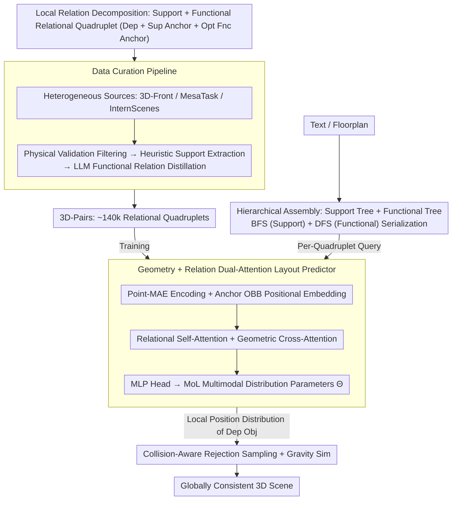

# Pair2Scene: Learning Local Object Relations for Procedural Scene Generation

**Conference**: ICML 2026  
**arXiv**: [2604.11808](https://arxiv.org/abs/2604.11808)  
**Code**: None (Project Page only)  
**Area**: 3D Scene Generation / Procedural Generation  
**Keywords**: 3D Scene Generation, Local Object Relations, Support Relations, Functional Relations, MoL Distribution, Rejection Sampling  

## TL;DR
Pair2Scene reformulates 3D indoor scene generation from "directly fitting a global joint distribution" to "learning one-to-one local object relations (support + functional) and recursively assembling them via a scene hierarchy tree." Combined with point cloud geometric encoding, Mixture-of-Logistics probability heads, and collision-aware rejection sampling, it enables complex scene generation—increasing object counts from ~4 to ~14 when trained only on 3D-Front—outperforming baselines like ATISS, DiffuScene, and LayoutVLM in FID and user studies.

## Background & Motivation

**Background**: High-fidelity 3D indoor scene generation follows two main trajectories: (i) **Learning-based** (ATISS, DiffuScene, LayoutVLM, FactoredScenes), which fits the joint distribution of scenes end-to-end on a single dataset; (ii) **LLM/VLM-based** (GALA3D, I-Design, HoloDeck, HSM), which leverages common-sense knowledge from language models for global layout reasoning.

**Limitations of Prior Work**: Learning-based methods are severely constrained by the upper bound of training set capacity—3D-Front averages only 4.07 furniture items per scene. Consequently, the learned distributions cannot reach the density of "dozens of items in a real apartment." As the number of objects increases, modeling $O(N^2)$ pairwise global dependencies becomes computationally intractable. LLM/VLM methods provide rich semantics but lack spatial reasoning, often leading to physically infeasible layouts with penetrations and floating objects.

**Key Challenge**: The "global joint distribution" assumes every object's position depends on all other objects in the scene. However, the authors observe that **real-world object placement is primarily influenced by a few proximal support or functional partners**, making most global dependencies redundant. Forcing the model to learn a global joint distribution with scarce data necessitates fitting an ultra-high-dimensional manifold, leading to inevitable underfitting.

**Goal**: (a) Reconstruct the problem through a **local relations** lens to allow "relation samples" to be aggregated across multiple datasets, bypassing single-dataset capacity limits; (b) Ensure physical stability for support relations and semantic rationality for functional relations; (c) Enable generated complexity to exceed the training distribution.

**Key Insight**: Decompose scenes into relational quadruplets $\mathcal{T}_i = \langle\mathcal{O}_{dep,i}, \mathcal{O}_{sup,i}, \{\mathcal{O}_{fnc,i}\}_{opt}\rangle$ (dependent object + mandatory support anchor + optional functional anchor). Learn the conditional density of the dependent object's position given the anchor's geometry and location, then assemble local rules into global scenes using hierarchical trees and rejection sampling.

**Core Idea**: Replace global joint distribution modeling with "local relation learning + procedural hierarchical assembly."

## Method

### Overall Architecture
Pair2Scene operates through three collaborative modules: (1) **Data curation pipeline**—extracting approximately 140k relational quadruplets from heterogeneous sources (3D-Front, MesaTask, InternScenes) using physical simulation, geometric heuristics, and LLM distillation to form the 3D-Pairs dataset; (2) **Pair2Scene model**—encoding object point clouds into geometric features $z^{geo}$ via Point-MAE and anchor OBBs $B$ into spatial embeddings $e^{bbox}$, fusing them with cascaded Transformer blocks (relational self-attention + geometric cross-attention), and outputting Mixture-of-Logistics (MoL) parameters $\Theta$ via an MLP to define a multimodal conditional density $P(B_{dep}\mid\Theta)$ for the 12-dimensional OBB; (3) **Procedural assembly**—automatically constructing a support tree $\mathbb{T}_s$ and a functional tree $\mathbb{T}_f$ based on text or floorplans, traversing them via a BFS (Support) + DFS (Functional) hybrid sequence, sampling positions from the model, and applying collision-aware rejection sampling and gravity simulation.

### Key Designs

**1. Support/Functional Relations + Mixture-of-Logistics Multimodal Distribution**

The core of scene generation is formalized as a conditional density: predicting the dependent object's OBB given anchor information. To handle naturally multi-modal solutions (e.g., a chair can be placed on any side of a table), the model categorizes relations into support ($R_s$, gravity-driven) and functional ($R_f$, semantic-driven). It predicts a mixture of $K$ Logistic components for the 12D OBB (center + size + 6D rotation): $P(B_{dep}\mid\Theta) = \sum_{k=1}^K \pi_k\prod_{d=1}^{12} L(B_{dep,d}\mid\mu_{k,d}, s_{k,d})$. Training employs NLL with entropy regularization $\mathcal{L}_{total} = \mathcal{L}_{nll} + \lambda\mathcal{L}_{ent}$ to prevent mode collapse. MoL is chosen for its closed-form CDF and efficient sampling.

**2. Data Curation Pipeline: Converting Heterogeneous Data into 3D-Pairs**

To enable local relation learning, "one-to-one relations" must be extracted from noisy raw data. The three-stage pipeline processes 3D-Front, MesaTask, and InternScenes. **Stage 1: Physical Validation** filters unstable layouts using rigid-body simulation. **Stage 2: Heuristic Support Extraction** identifies $R_s$ pairs using geometric rules of vertical proximity and horizontal containment. **Stage 3: LLM Functional Distillation** uses LLMs to identify functional relations $R_f$ among objects sharing a support surface, validated by geometric proximity. This allows the aggregation of local relation samples across datasets, bypassing the capacity ceiling of individual datasets.

**3. Geometry + Relation Dual-Attention Layout Predictor**

Since semantic categories alone cannot identify uneven support surfaces (e.g., chairs with curved backs), the model must perceive both real geometry and relational topology. Each role $m\in\{dep, sup, fnc\}$ is represented by a learnable query token $x_m$. Anchor positional embeddings $e_m^{bbox}$ are added only to the key/value of Relational Self-Attention. Geometry-Aware Cross-Attention allows each role token to interact specifically with its Point-MAE features $z_m^{geo}$ to prevent geometric information leakage.

**4. Hierarchical Assembly + Rejection Sampling**

Global consistency is ensured via procedural assembly. A scene is represented by a support tree $\mathbb{T}_s$ (rooting at the floor) and functional trees $\mathbb{T}_f$. Generation follows a BFS on $\mathbb{T}_s$ to ensure base surfaces are placed first, followed by DFS on $\mathbb{T}_f$. For each step, a candidate is sampled from the local distribution $p_{\text{local}}(x)$. The global distribution is then $p_{\text{global}}(x) = p_{\text{local}}(x)/Z$ if $x \in \mathcal{F}$ (the collision-free set), approximated by rejection sampling.

### Loss & Training
The training objective is $\mathcal{L}_{total} = \mathcal{L}_{nll} + \lambda\mathcal{L}_{ent}$. The Point-MAE encoder is pre-trained on a consolidated 3D asset library. The training set consists of the 140k relational quadruplets from 3D-Pairs.

## Key Experimental Results

### Main Results
Two evaluation settings: (A) **3D-Front only**; (B) **multi-source** (all 3D-Pairs).

| Method (3D-Front only) | FID ↓ | KID×1e-3 ↓ | Avg. Objects |
|---|---|---|---|
| ATISS | 71.24 | 42.18 | 7.65 |
| DiffuScene | 67.45 | 31.72 | 6.75 |
| LayoutVLM | 120.87 | 138.54 | -- |
| FactoredScenes | 104.12 | 129.45 | 8.53 |
| **Ours-Fit** | **65.92** | **22.14** | 6.98 |
| **Ours-Beyond** | 75.88 | 69.05 | **14.15** |

In a 22-person user study, Ours-Beyond ranked first in nearly all metrics (SA, PP, SC, MQ). In the multi-source setting, Ours achieved a CFS of 4.20, significantly outperforming LayoutVLM (1.72).

### Ablation Study

| Variant | FID ↓ | KID×1e-3 ↓ | Description |
|---|---|---|---|
| w/o relation | 92.34 | 82.74 | Necessity of relation decomposition |
| w/o pretrain | 81.14 | 73.91 | Importance of geometric priors |
| Full Model (Ours-Fit) | 65.92 | 22.14 | Proposed design |

### Key Findings
- **Ours-Fit** significantly surpasses DiffuScene in KID, while **Ours-Beyond** successfully doubles the object density relative to the training distribution.
- **LayoutVLM** scores well on Complexity but fails on Physical Plausibility (2.14); Pair2Scene excels in both, demonstrating its structural advantage.
- Relation decomposition is the most critical inductive bias for performance.

## Highlights & Insights
- The observation that global joint distributions are redundant and object placement is locally dependent challenges mainstream modeling assumptions.
- By using "relational quadruplets" as a unified interface, the authors design an extensible protocol for heterogeneous 3D datasets.
- The division of labor—LLM for structure and geometric model for execution—serves as an elegant paradigm for LLM-integrated generation.

## Limitations & Future Work
- Relational quadruplets are limited to single support and optional functional anchors, which may struggle with complex multi-party constraints.
- Rejection sampling efficiency may decrease in ultra-dense scenes and does not explicitly account for global aesthetics (symmetry, style).
- Tree construction still relies on dataset statistics or LLM common sense, which may have blind spots.

## Related Work & Insights
- **vs ATISS / DiffuScene**: These methods treat scenes as sequences to fit global distributions; Pair2Scene uses local learning + procedural assembly to aggregate samples across datasets.
- **vs HoloDeck / GALA3D / HSM**: LLM-based systems lack spatial precision; Pair2Scene uses LLMs only for structure, leaving coordinate prediction to the geometric model.
- **vs Infinigen-Indoors**: Purely procedural methods rely on manual rules, whereas Pair2Scene learns these rules from data.

## Rating
- Novelty: ⭐⭐⭐⭐⭐ 
- Experimental Thoroughness: ⭐⭐⭐⭐ 
- Writing Quality: ⭐⭐⭐⭐ 
- Value: ⭐⭐⭐⭐⭐ 

<!-- RELATED:START -->

## Related Papers

- [\[CVPR 2025\] Global-Local Tree Search in VLMs for 3D Indoor Scene Generation](../../CVPR2025/multimodal_vlm/global-local_tree_search_in_vlms_for_3d_indoor_scene_generation.md)
- [\[CVPR 2026\] HOG-Layout: Hierarchical 3D Scene Generation, Optimization and Editing via Vision-Language Models](../../CVPR2026/multimodal_vlm/hog_layout_hierarchical_3d_scene_generation_optimization_and_editing.md)
- [\[CVPR 2026\] Can We Build Scene Graphs, Not Classify Them? FlowSG: Progressive Image-Conditioned Scene Graph Generation with Flow Matching](../../CVPR2026/multimodal_vlm/can_we_build_scene_graphs_not_classify_them_flowsg_progressive_image-conditioned.md)
- [\[ICLR 2026\] Procedural Mistake Detection via Action Effect Modeling](../../ICLR2026/multimodal_vlm/procedural_mistake_detection_via_action_effect_modeling.md)
- [\[ICCV 2025\] Global and Local Entailment Learning for Natural World Imagery](../../ICCV2025/multimodal_vlm/global_and_local_entailment_learning_for_natural_world_imagery.md)

<!-- RELATED:END -->
