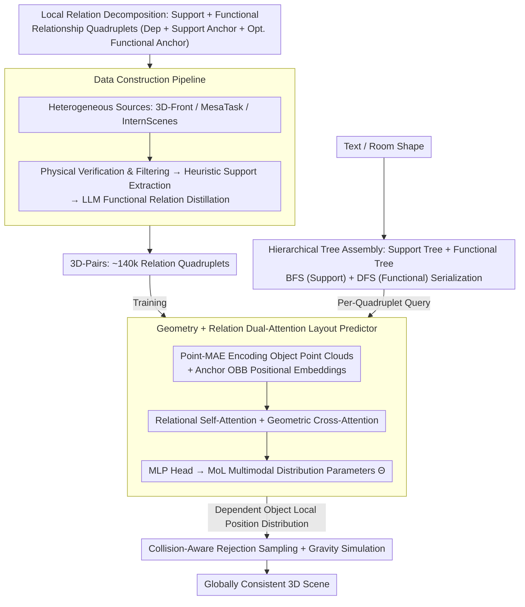

# Pair2Scene: Learning Local Object Relations for Procedural Scene Generation

**Conference**: ICML 2026  
**arXiv**: [2604.11808](https://arxiv.org/abs/2604.11808)  
**Code**: None (Project Page only)  
**Area**: 3D Scene Generation / Procedural Generation  
**Keywords**: 3D Scene Generation, Local Object Relations, Support Relations, Functional Relations, MoL Distribution, Rejection Sampling  

## TL;DR
Pair2Scene reformulates 3D indoor scene generation from "directly fitting a global joint distribution" to "learning one-to-one local object relations (support + functional) and recursively assembling them via a hierarchical scene tree." Combined with point cloud geometric encoding, a Mixture-of-Logistics probability head, and collision-aware rejection sampling, it empowers complex scene generation where the object count jumps from approximately 4 (as seen in 3D-Front training data) to around 14. FID and user studies demonstrate its superiority over baselines such as ATISS, DiffuScene, and LayoutVLM.

## Background & Motivation

**Background**: High-fidelity 3D indoor scene generation primarily follows two trajectories: (i) **Learning-based methods** (ATISS, DiffuScene, LayoutVLM, FactoredScenes) that end-to-end fit the joint distribution of scenes on single datasets; (ii) **LLM/VLM-based methods** (GALA3D, I-Design, HoloDeck, HSM) that utilize the common-sense knowledge of language models for global layout reasoning.

**Limitations of Prior Work**: Learning-based methods are severely constrained by the capacity of training sets—3D-Front averages only 4.07 furniture items per scene. Consequently, the learned distribution never reaches the density of "dozens of items in a real apartment." As the number of objects increases, modeling global dependencies between every pair of objects leads to an $O(N^2)$ complexity explosion, making effective learning impossible. LLM/VLM-based methods offer rich semantics but possess poor spatial reasoning, often resulting in physically implausible layouts with interpenetrations or floating objects.

**Key Challenge**: The "global joint distribution" assumes every object's position depends on all other objects in the scene. However, the authors observe that **the placement of real-world objects is almost exclusively influenced by a few proximal support or functional partners**; global dependencies are largely redundant. Forcing the model to learn global relations under data scarcity requires fitting an ultra-high-dimensional manifold, which inevitably leads to underfitting.

**Goal**: (a) Reconstruct the problem from a **local relationship** perspective to allow the "number of relation samples" to accumulate across multiple datasets, bypassing single-scene capacity limits; (b) ensure physical stability of support relations and semantic rationality of functional relations; (c) enable generated complexity to exceed the training distribution.

**Key Insight**: Decompose scenes into relationship quadruplets $\mathcal{T}_i = \langle\mathcal{O}_{dep,i}, \mathcal{O}_{sup,i}, \{\mathcal{O}_{fnc,i}\}_{opt}\rangle$ (dependent object + mandatory support anchor + optional functional anchor). The model learns the conditional density of the dependent object's position given the anchor's geometry and location, then assembles global scenes using hierarchical trees and rejection sampling.

**Core Idea**: Replace global joint distribution modeling with "local relationship learning + procedural hierarchical assembly."

## Method

### Overall Architecture
Pair2Scene operates through three collaborative modules: (1) **Data Construction Pipeline**—Extracts approximately 140k relationship quadruplets from heterogeneous sources (3D-Front, MesaTask, InternScenes) via physical simulation, geometric heuristics, and LLM distillation to form the 3D-Pairs dataset; (2) **Pair2Scene Model**—Encodes geometric features $z^{geo}$ using Point-MAE and spatial embeddings $e^{bbox}$ of anchor OBBs $B$ via MLPs. These are fused through cascaded Transformer blocks (relational self-attention + geometric cross-attention). Finally, an MLP outputs Mixture-of-Logistics (MoL) distribution parameters $\Theta$ to provide a multimodal conditional density $P(B_{dep}\mid\Theta)$ for the 12D OBB of the dependent object; (3) **Procedural Assembly**—Automatically constructs a support tree $\mathbb{T}_s$ and functional tree $\mathbb{T}_f$ based on text or floor plans. It traverses these using a hybrid BFS (support) + DFS (functional) approach to obtain a relationship sequence, sampling positions from the model's distribution at each step while applying collision-aware rejection sampling and minor gravity simulation.

### Key Designs

**1. Support/Functional Relations + Mixture-of-Logistics Distribution**

The core of scene generation is formalized as a conditional density: predicting the OBB of a dependent object given anchor information. A critical detail is handling natural multi-modality (e.g., "a chair can be placed on any side of a table"), which unimodal regression cannot express. The model categorizes relations into two types: support relations $R_s$ (governed by gravity, e.g., a laptop on a desk) and functional relations $R_f$ (governed by semantic proximity, e.g., a keyboard paired with a mouse). It predicts a mixture of $K$ Logistic components for the 12D OBB (center + size + 6D rotation):
$$P(B_{dep}\mid\Theta) = \sum_{k=1}^K \pi_k\prod_{d=1}^{12} L(B_{dep,d}\mid\mu_{k,d}, s_{k,d})$$
Training uses NLL plus an entropy regularization term $\mathcal{L}_{total} = \mathcal{L}_{nll} + \lambda\mathcal{L}_{ent}$, where $\mathcal{L}_{ent} = \sum_k \hat\pi_k\log\hat\pi_k$ encourages higher entropy in mixture coefficients to prevent collapse to a single mode. MoL is chosen over Gaussian mixtures because its CDF is closed-form, sampling is efficient, and it effectively captures multimodal structural distributions.

**2. Data Construction Pipeline: Refining Heterogeneous Data into 3D-Pairs**

To enable local relationship learning, "one-to-one relations" must be extracted from noisy raw data. The authors designed a three-stage pipeline to unify 3D-Front (large furniture), MesaTask (tabletops), and InternScenes Real-to-Sim (open scenes). Stage one is **Physical Verification**: running rigid-body simulations with gravity to discard unstable layouts. Stage two is **Heuristic Support Extraction**: using geometric rules to identify $R_s$—checking if the bottom OBB provides a stable surface or horizontally encloses the top object. It intentionally excludes "floor-only anchors" to avoid scale contamination from noisy datasets. Stage three is **LLM Functional Distillation**: for objects sharing a support surface, an LLM determines $R_f$ and provides a proximity coefficient $k$. The anchor OBB is expanded by $k$, and the relation is recorded only if the dependent object's centroid falls within the expanded volume. This allows local relations to be aggregated across datasets, bypassing the ceiling of single-dataset capacities.

**3. Geometry + Relation Dual-Attention Layout Predictor**

Relying solely on semantic categories for support surfaces is insufficient as many surfaces (e.g., curved chair backs) are irregular. The model must perceive both true geometry and relational topology. Each role $m\in\{dep, sup, fnc\}$ is represented by a learnable query token $x_m$. Anchor positional embeddings $e_m^{bbox} = \mathrm{MLP}_{pos}(B_m)$ are added only to the self-attention keys/values. Relational Self-Attention is formulated as $X = \mathrm{SelfAttn}(X, X+E^{bbox}, X+E^{bbox})$, allowing the dependent token to attend to the spatial presence of anchors. Geometry-Aware Cross-Attention is $x_m = \mathrm{CrossAttn}(x_m, z_m^{geo}, z_m^{geo})$, where each role token interacts only with its own Point-MAE features to prevent geometric "leakage." Notably, the dependent token does not receive a positional embedding to avoid leaking ground-truth coordinates.

**4. Tree Assembly + Rejection Sampling: Scaling Local Rules to Global Scenes**

To ensure the global scene is collision-free and physically sound, the authors use procedural assembly. The scene is represented as a support tree $\mathbb{T}_s$ (root is the floor), with functional trees $\mathbb{T}_f$ branching from non-leaf nodes. Generation follows BFS on $\mathbb{T}_s$ to ensure support surfaces are placed first, followed by DFS on $\mathbb{T}_f$. At each step, a candidate position is sampled from $p_{\text{local}}(x)$. The feasible set $\mathcal{F}$ is defined by non-collision with existing objects or boundaries. The global distribution becomes $p_{\text{global}}(x) = p_{\text{local}}(x)/Z$ for $x\in\mathcal{F}$, approximated via rejection sampling. This causal ordering (BFS+DFS) ensures that when a dependent object is predicted, its anchors already exist.

### Loss & Training
The objective is $\mathcal{L}_{total} = \mathcal{L}_{nll} + \lambda\mathcal{L}_{ent}$. Point-MAE is pre-trained on a synthesized 3D asset library. The training set consists of the 140k relation quadruplets in 3D-Pairs.

## Key Experimental Results

### Main Results
Two evaluation settings: (A) **3D-Front only**—Trained only on 3D-Front; (B) **Multi-source**—Trained on the full 3D-Pairs dataset.

| Method (3D-Front only) | FID ↓ | KID×1e-3 ↓ | Avg. Object Count |
|---|---|---|---|
| ATISS | 71.24 | 42.18 | 7.65 |
| DiffuScene | 67.45 | 31.72 | 6.75 |
| LayoutVLM | 120.87 | 138.54 | -- |
| FactoredScenes | 104.12 | 129.45 | 8.53 |
| **Ours-Fit** | **65.92** | **22.14** | 6.98 |
| **Ours-Beyond** | 75.88 | 69.05 | **14.15** |

In a user study with 22 participants, Ours-Beyond ranked first in almost all categories (SA 5.23, PP 5.00). In the multi-source setting, Ours achieved a CFS of 4.20, significantly outperforming LayoutVLM's 1.72.

### Ablation Study

| Variant | FID ↓ | KID×1e-3 ↓ | Description |
|---|---|---|---|
| w/o relation | 92.34 | 82.74 | Necessity of decomposition |
| w/o pretrain | 81.14 | 73.91 | Importance of geometric priors |
| Full Model (Ours-Fit) | 65.92 | 22.14 | Complete design |

### Key Findings
- Ours-Fit achieves a KID of 22.14, significantly lower than DiffuScene's 31.72, showing superior performance within the dataset distribution. Ours-Beyond pushes the object count to 14.15, proving the ability to exceed the training density.
- While LayoutVLM scores high on Scene Complexity, its Physical Plausibility is poor (2.14). Pair2Scene scores high on both, demonstrating a structural advantage.
- Relational decomposition is the most critical inductive bias; removing it leads to the largest performance drop.

## Highlights & Insights
- The observation that "global joint distribution is redundant" directly challenges the mainstream modeling assumption of the past few years, proving that local learning is more scalable.
- The use of "relationship quadruplets" as a unified interface for heterogeneous data sources acts as a scalable protocol for 3D scene datasets.
- The division of labor—LLM for tree generation and the geometric model for coordinate prediction—is an elegant example of the "LLM-as-controller, model-as-executor" paradigm.

## Limitations & Future Work
- The relationship quadruplet is limited to "single support + single optional functional anchor," which may limit expressiveness for complex multi-party dependencies (e.g., triangular geometric constraints).
- Rejection sampling efficiency may decrease in ultra-dense scenes and does not currently account for global aesthetics like symmetry.
- Tree construction (statistical synthesis) still relies on dataset statistics; its ability to generate entirely unseen room types (e.g., circular rooms) remains unverified.

## Related Work & Insights
- **vs. ATISS / DiffuScene**: These methods treat scenes as sequences for global distribution fitting, constrained by dataset size. Pair2Scene uses local learning + procedural assembly, allowing cross-dataset sample accumulation.
- **vs. HoloDeck / GALA3D**: LLM-based methods lack spatial precision. Pair2Scene uses LLMs only for hierarchy, letting the geometric model handle precision, which significantly improves physical feasibility.

## Rating
- Novelty: ⭐⭐⭐⭐⭐ (Rejection of global distribution + Relation quadruplet protocol)
- Experimental Thoroughness: ⭐⭐⭐⭐ (Dual settings + user study + ablations)
- Writing Quality: ⭐⭐⭐⭐ (Clear definitions and intuitive pipeline)
- Value: ⭐⭐⭐⭐⭐ (Address both data scarcity and complexity explosion)

<!-- RELATED:START -->

## Related Papers

- [\[CVPR 2025\] Global-Local Tree Search in VLMs for 3D Indoor Scene Generation](../../CVPR2025/multimodal_vlm/global-local_tree_search_in_vlms_for_3d_indoor_scene_generation.md)
- [\[ICML 2026\] R$^3$L: Reasoning 3D Layouts from Relative Spatial Relations](r3l_reasoning_3d_layouts_from_relative_spatial_relations.md)
- [\[CVPR 2026\] Can We Build Scene Graphs, Not Classify Them? FlowSG: Progressive Image-Conditioned Scene Graph Generation with Flow Matching](../../CVPR2026/multimodal_vlm/can_we_build_scene_graphs_not_classify_them_flowsg_progressive_image-conditioned.md)
- [\[CVPR 2026\] HOG-Layout: Hierarchical 3D Scene Generation, Optimization and Editing via Vision-Language Models](../../CVPR2026/multimodal_vlm/hog_layout_hierarchical_3d_scene_generation_optimization_and_editing.md)
- [\[ICML 2026\] WeatherSyn: An Instruction Tuning MLLM For Weather Forecasting Report Generation](weathersyn_an_instruction_tuning_mllm_for_weather_forecasting_report_generation.md)

<!-- RELATED:END -->
