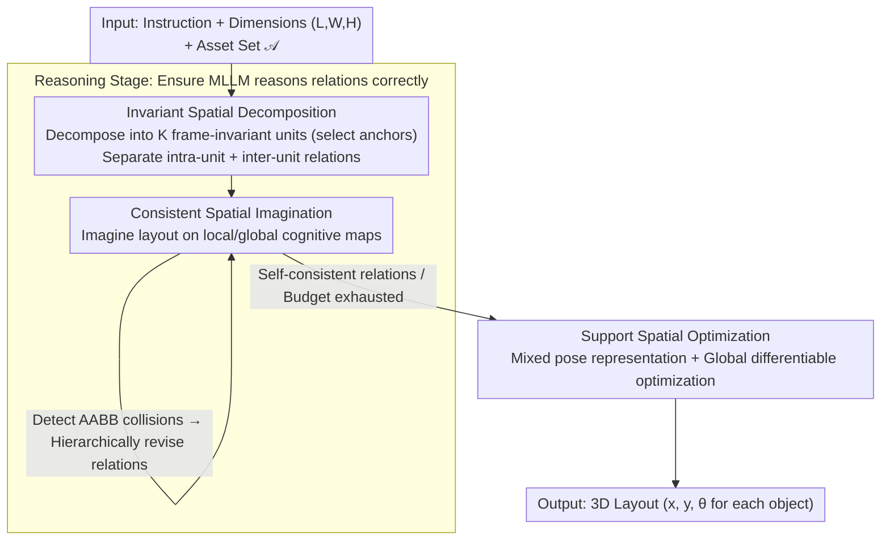

# R$^3$L: Reasoning 3D Layouts from Relative Spatial Relations

**Conference**: ICML 2026  
**arXiv**: [2605.06758](https://arxiv.org/abs/2605.06758)  
**Code**: Yes (github.com/Neal2020GitHub/R3L)  
**Area**: Multimodal VLM / 3D Scene Generation / Spatial Reasoning  
**Keywords**: 3D Layout Generation, MLLM, Relation Reasoning, Frame Transformation, Self-consistency

## TL;DR
R³L attributes two types of systematic errors (semantic drift and metric drift) in MLLM multi-hop "relative spatial relation" reasoning to "repeated frame transformations." By implementing Invariant Spatial Decomposition (shortening relation chains), Consistent Spatial Imagination (an imagine-and-revise loop for conflict elimination), and Support Spatial Optimization (global-to-local pose reparameterization), it enables GPT-5 to generate open-vocabulary 3D scenes across 9 categories with collision and out-of-bounds rates near zero, significantly outperforming LayoutVLM/Holodeck/LayoutGPT in semantic metrics.

## Background & Motivation

**Background**: Generating 3D scene layouts from natural language follows two main paradigms: (1) Direct route—MLLMs directly output the pose of each asset (LayoutGPT / 3D-FRONT fine-tuning), which suffers from narrow data coverage and poor extrapolation; (2) Relation-solver route—MLLMs reason relative spatial relations between objects (e.g., "chair 0.5m left of the table"), followed by a DFS solver or differentiable optimization to instantiate poses (Holodeck, LayoutVLM).

**Limitations of Prior Work**: The bottleneck of the relation-solver route is that **relative relations reasoned by MLLMs are often unreliable**—they are frequently semantically inconsistent or physically unsolvable. Existing pipelines employ post-hoc heuristics (grid discretization, conflict relation pruning) to "force" a solution, often at the expense of semantic fidelity. These heuristics avoid the fundamental question: Why can MLLMs handle 2-object relations reasonably well but fail consistently at **multi-hop reasoning across multiple objects**?

**Key Challenge**: Multi-hop spatial reasoning requires **repeatedly alternating between object-centric reference frames**—each link in the relation chain is expressed in a new local frame, requiring the MLLM to constantly "re-project" intermediate conclusions. This produces two systematic errors: (a) **Semantic Drift**: Directional relations are misinterpreted across frames, where a local axis swap can flip "left/right" into "up/down"; (b) **Metric Drift**: Metric displacements accumulate through changing frames, compounding small errors into collisions, inconsistent spacing, and physical infeasibility.

**Goal**: (i) Reduce the frequency of frame transformations during multi-hop reasoning; (ii) Enable MLLMs to self-detect and correct metric conflicts; (iii) Feed the reasoning outputs into a pose optimizer that is **more robust to initialization**.

**Key Insight**: Spatial reasoning is analogized to "mental rotation" in cognitive science (Shepard & Metzler 1971)—humans also accumulate errors during multi-step spatial tasks. The solution lies in **minimizing frame switches** or **externalizing intermediate representations to verify consistency**. R³L introduces these principles into the MLLM reasoning pipeline.

**Core Idea**: By using a triad of **frame-invariant unit decomposition**, an **imagine-and-revise self-consistency loop**, and **global-to-local pose reparameterization**, the focus shifts from "how to fix things post-hoc" to "ensuring relations are correct during the reasoning phase."

## Method

### Overall Architecture
Given a natural language instruction $I$, spatial dimensions $(L,W,H)$, and a set of 3D assets $\mathcal A=\{a_i\}_{i=1}^N$, R³L follows a two-stage "reason-then-solve" process: (1) In the reasoning stage, the MLLM decomposes $\mathcal A$ into $K$ frame-invariant units $\{U_k\}$, generating two levels of relations—intra-unit relations $\mathcal R^{\text{intra}}_k$ and inter-unit relations $\mathcal R^{\text{inter}}$. Simultaneously, the MLLM performs an "imagine-and-revise" loop over local and global cognitive maps to eliminate conflicts. (2) In the solving stage, all relations are translated into differentiable constraints to jointly optimize a mixed pose representation (independent objects / unit poses / intra-unit local poses), outputting final poses $p_i=(x_i,y_i,\theta_i)$.

### Key Designs

**1. Invariant Spatial Decomposition: Structurally shortening relation chains via frame-invariant units**

The root cause of error accumulation is the excessive number of frame transformations. R³L reduces this count by using an assignment function $\pi:\{1,\dots,N\}\to\{0,1,\dots,K\}$ to group assets into $K$ units or an independent class ($\pi(i)=0$). Each unit $U_k$ selects an anchor $a_k^{\text{anchor}}$, and member global poses are synthesized as $p_i=P_{\pi(i)}\oplus p_{i,\pi(i)}$ (where $\oplus$ represents planar rigid body synthesis). Relation generation is split into two independent levels—intra-unit relations $\mathcal R^{\text{intra}}_k$ reasoned in unit-local frames, and inter-unit relations $\mathcal R^{\text{inter}}$ reasoned in the global frame. Graph-theoretically, this is equivalent to a vertex cut at the anchors, factorizing the relation graph $G=(V,E)$ into $K$ local subgraphs and one inter-unit graph. Consequently, the number of frame transformations $\mathcal T_{\text{path}}(\gamma)=m-1$ along a multi-hop path $\gamma$ decreases significantly. Unlike prior semantic grouping, R³L directly attacks the root cause: once an anchor is fixed, members are rigid-invariant within the unit-local frame, so global rotations cannot disturb intra-unit configurations.

**2. Consistent Spatial Imagination: Externalizing spatial hypotheses to cognitive maps for conflict self-revision**

Shortening chains does not fully prevent metric drift—text-only MLLM reasoning often produces metric displacements that are "locally plausible but globally unverified." This module requires the MLLM to explicitly maintain two sets of maps: local maps $\mathcal M^{\text{local}}_k=\{q_{i,k}\}$ and a global map $\mathcal M^{\text{global}}=\{Q_k\}\cup\{q_i\}$. For each object, yaw-rotated planar footprint extents $e_i^x(\theta_i)=|l_i\cos\theta_i|+|w_i\sin\theta_i|$ and $e_i^y(\theta_i)=|l_i\sin\theta_i|+|w_i\cos\theta_i|$ are computed to derive axis-aligned boundaries $B_i^x=[x_i-\tfrac12 e_i^x, x_i+\tfrac12 e_i^x]$ (similarly for $B_i^y$). Collision is defined by AABB overlap on both axes: $\text{Collide}(i,j)\Longleftrightarrow|B_i^x\cap B_j^x|>0\wedge|B_i^y\cap B_j^y|>0$. At each iteration $t$, the MLLM instantiates maps from relations $\mathcal R^{(t)}$, detects collisions, and revises hierarchically—intra-unit collisions trigger intra-relation changes, and inter-unit collisions trigger inter-relation changes—until consistency is reached or the budget is exhausted. Using simple AABB overlap as a reasoning proxy inside the prompt provides the MLLM with a lightweight self-checker without requiring an expensive 3D simulator.

**3. Support Spatial Optimization: Stabilizing differentiable solving with mixed pose representation**

When reasoning outputs enter the solving stage, a common issue is oscillation: an object with many constraints triggers multiple penalties simultaneously when moved. R³L resolves this with a mixed pose representation $\tilde p$: independent assets use global $p_i=(x_i,y_i,\theta_i)$, while units use a global unit pose $P_k$ and members use unit-local $p_i^\ell$. All relations are translated into differentiable penalties $\ell(r;\tilde p)$ (zero when satisfied), minimizing a two-level objective $\mathcal L(\tilde p)=\mathcal L_{\text{global}}(\tilde p)+\sum_k\mathcal L_{\text{local}}^k(\tilde p)$, covering boundary, collision, and relational losses. Crucially, the unit-local coordinate system decouples intra-unit gradients from the unit pose (Proposition B.1), allowing the entire unit to translate or rotate without disrupting internal relations, resulting in faster and more stable convergence.

### Loss & Training
The method is entirely inference-time and training-free. The solving stage uses a gradient optimizer (e.g., Adam) to minimize $\mathcal L(\tilde p)$, with penalties weighted by $\lambda_{\text{col}}/\lambda_{\text{rel}}/\lambda_{\text{bd}}$. GPT-5 is used as the MLLM throughout, and Gemini 3 Flash serves as the evaluator.

## Key Experimental Results

### Main Results
Evaluation across 9 scene categories (bathroom, bedroom, bookstore, game room, gym, etc.) × 3 scenes/category × 3 difficulty levels, with up to 40 floor-standing assets per case. Physical metrics: %CR (Collision Rate) and %OR (Out-of-bounds Rate) (lower is better). Semantic metrics: Realism, Functionality, and Instruction-following (1-10, higher is better).

| Scene | Method | %CR↓ | %OR↓ | Real.↑ | Func.↑ | Instr.↑ |
|---|---|---|---|---|---|---|
| Bathroom | LayoutGPT | 7.6 | 12.1 | 5.9 | 5.3 | 7.9 |
| Bathroom | Holodeck | 4.0 | 0.0 | 2.9 | 2.3 | 1.9 |
| Bathroom | LayoutVLM | 3.0 | 13.2 | 3.5 | 3.5 | 4.7 |
| Bathroom | **R³L** | **0.0** | **0.0** | **7.5** | **7.5** | **9.4** |
| Bedroom | LayoutVLM | 0.3 | 6.8 | 6.4 | 5.9 | 7.3 |
| Bedroom | **R³L** | **0.0** | **0.0** | **6.9** | **6.5** | **7.9** |
| Bookstore | LayoutVLM | 1.1 | 7.3 | 3.4 | 4.3 | 5.5 |
| Bookstore | **R³L** | **0.0** | **0.0** | **8.9** | **8.9** | **8.9** |
| Game Room | LayoutVLM | 0.1 | 7.7 | 6.3 | 5.4 | 8.7 |
| Game Room | **R³L** | **0.0** | **0.0** | **7.3** | — | — |
| Gym | LayoutGPT | 7.4 | 25.0 | 6.5 | 6.3 | 7.3 |
| Gym | **R³L** | **0.0** | **0.0** | High | High | High |

R³L achieves %CR=%OR=0 across all categories while significantly outperforming others in semantic scores—proving that ensuring correct relations during reasoning is superior to post-hoc heuristic fixes.

### Ablation Study

| Configuration | Description | Effect |
|---|---|---|
| Full R³L | All three modules enabled | Optimal performance |
| w/o Decomposition | Single-layer relation graph | Longer multi-hop paths, significant semantic drift |
| w/o Imagination | No imagine-and-revise loop | Metric drift causes resurging collision rates |
| w/o Support Opt. | Single-layer global pose optimization | Slow convergence, prone to oscillation |
| Decomposition only | Shortens chains but no self-check | Moderate |
| Imagination only | Self-checks but chains remain long | Moderate |

### Key Findings
- **Frame-induced errors are the primary bottleneck in MLLM multi-hop spatial reasoning**: Addressing them as explicit design targets yields performance gains far exceeding those from post-hoc repairs.
- **AABB collisions are sufficient as a reasoning proxy**: Sophisticated 3D simulation is unnecessary; simple boundary checks effectively guide MLLM self-revision.
- **Mixed pose representation offers superior convergence speed**: Gradient decoupling in unit-local coordinates results in smoother optimization curves compared to global-only approaches.

## Highlights & Insights
- **Quantifying reasoning error via the "number of frame transformations"**: Explicitly defining $\mathcal T_{\text{path}}(\gamma)=m-1$ allows for a measurable diagnosis of spatial reasoning pipelines. Translating cognitive "mental rotation" into graph-theoretic parameters is highly insightful for future spatial reasoning research.
- **Relation decomposition via graph vertex cuts**: Using unit anchors as vertex cuts naturally splits the relation graph into local subgraphs and a global graph. This is theoretically clean and structurally more beneficial than simple semantic grouping.
- **"Reasoning proxy + self-revise" as a lightweight self-consistency paradigm**: By embedding AABB overlap checks into prompts, the MLLM acts as its own spatial auditor without requiring external physics engines. This paradigm is highly transferable to other spatial tasks like robotics path planning.
- **Optimization-friendliness as a design goal**: While researchers often focus on loss functions or prompt engineering, this work demonstrates that "performing surgery at the pose representation level" can stabilize the same loss function significantly.

## Limitations & Future Work
- The current pipeline only handles floor objects; wall-mounted or desktop-attached items require additional support/attachment relation extensions.
- The imagine-and-revise loop might be constrained by MLLM context windows when the number of units is large; chunking strategies were not detailed.
- Heavy reliance on high-performance MLLMs (GPT-5); performance on open-source models (e.g., Qwen-VL, InternVL) remains untested.
- Evaluation relies on LLM-as-judge (Gemini 3 Flash), which may harbor preference biases; human evaluation comparison is lacking.
- Physical metrics are limited to AABB collisions, ignoring finer constraints like surface alignment or physical stability.

## Related Work & Insights
- **vs LayoutGPT**: LayoutGPT predicts absolute poses directly, which are often physically invalid. R³L uses a relation-solver route with reasoning-time consistency guarantees.
- **vs Holodeck**: Holodeck uses a DFS solver for grid-discretized relations, sacrificing semantic fidelity. R³L preserves continuous semantics via differentiable optimization.
- **vs LayoutVLM**: LayoutVLM also uses MLLM relations and differentiable optimization but is sensitive to initialization and relies on post-hoc heuristics. R³L eliminates relation conflicts during reasoning.
- **vs Multi-agent frameworks (Çelen et al.)**: These rely on multi-agent trial-and-error with external feedback. R³L internalizes the feedback mechanism in a single-instance reasoning loop, making it more stable and lightweight.

## Rating
- Novelty: ⭐⭐⭐⭐⭐ The attribution of error to frame transformation root causes and the vertex-cut decomposition are highly original.
- Experimental Thoroughness: ⭐⭐⭐⭐ Coverage across 9 scene categories is broad, though LLM-as-judge lacks human baseline data.
- Writing Quality: ⭐⭐⭐⭐⭐ Excellent grounding in cognitive science with clean graph-theoretic formalization.
- Value: ⭐⭐⭐⭐ High transferability to embodied AI and robotics tasks where open-vocabulary and physical feasibility must coexist.

<!-- RELATED:START -->

<!-- RELATED:END -->

## Related Papers

- [\[ICML 2026\] ReVSI: Rebuilding Visual Spatial Intelligence Evaluation for Accurate Assessment of VLM 3D Reasoning](revsi_rebuilding_visual_spatial_intelligence_evaluation_for_accurate_assessment_.md)
- [\[ACL 2025\] Can Multimodal Large Language Models Understand Spatial Relations?](../../ACL2025/multimodal_vlm/spatialmqa_mllm_spatial_relations.md)
- [\[ICML 2026\] Pair2Scene: Learning Local Object Relations for Procedural Scene Generation](pair2scene_learning_local_object_relations_for_procedural_scene_generation.md)
- [\[CVPR 2026\] Beyond 3D VQAs: Injecting 3D Spatial Priors into Vision-Language Models for Enhanced Geometric Reasoning](../../CVPR2026/multimodal_vlm/beyond_3d_vqas_injecting_3d_spatial_priors_into_vision-language_models_for_enhan.md)
- [\[CVPR 2026\] SpatialStack: Layered Geometry-Language Fusion for 3D VLM Spatial Reasoning](../../CVPR2026/multimodal_vlm/spatialstack_layered_geometry-language_fusion_for_3d_vlm_spatial_reasoning.md)

<!-- RELATED:END -->
