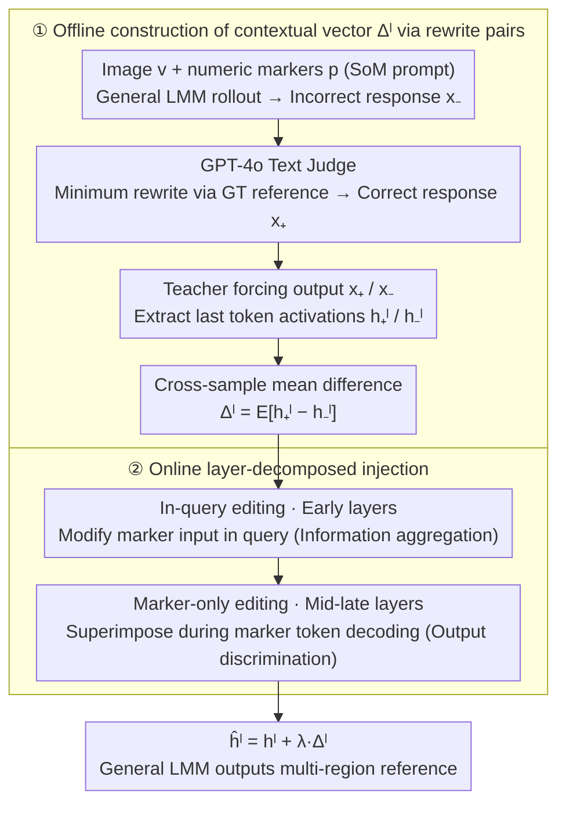

# Referring Multiple Regions with Large Multimodal Models via Contextual Latent Steering

**Conference**: ICML 2026  
**arXiv**: [2605.01827](https://arxiv.org/abs/2605.01827)  
**Code**: https://github.com/xing0047/csteer.git (Available)  
**Area**: Multimodal VLM / Representation Editing / Visual Grounding  
**Keywords**: Multi-region referring, latent steering, training-free, contextual vector, LMM

## TL;DR
CSteer proposes a training-free latent steering method that constructs "contextual vectors" based on the hidden activation differences between incorrect and correct referring responses. These vectors are injected into early query layers and mid-to-late decoding layers, enabling general LMMs (e.g., Qwen3-VL, InternVL-3.5) to outperform specialized fine-tuned region LMMs on multi-region visual referring tasks.

## Background & Motivation

**Background**: General LMMs (LLaVA, Qwen-VL, InternVL series) excel at whole-image understanding but struggle when required to answer questions for multiple marked regions (e.g., "[1][2][3]") simultaneously. Existing region LMMs (GAR, INST-IT-Qwen, DAM, Sa2VA, etc.) typically follow a path of "specialized region encoders + large-scale referring data fine-tuning," which is costly and often specialized for single-region descriptions.

**Limitations of Prior Work**: While single-region Set-of-Mark (SoM) prompting works on general LMMs, the visual attention becomes "scattered and unfaithful" once the number of regions $m>1$. Models often mix semantics of multiple regions, misalign IDs like [1] and [2] with objects, or ignore global contexts such as counting or depth/reflectance comparisons.

**Key Challenge**: Instance-level fine-grained perception requires the model to "distinguish by ID while maintaining global focus." However, pre-training objectives for general LMMs only optimize for whole-image understanding. This hybrid behavior of "partitioning + context" has neither explicit supervision nor explicit representation pathways, and attempting to "train it in" via SFT/RL is expensive and lacks scalability.

**Goal**: To trigger multi-region and context-sensitive referring behavior in general LMMs during inference by intervening in hidden activations without changing the architecture or performing supervised fine-tuning.

**Key Insight**: Drawing inspiration from the work of Rimsky et al. on LLM behavior editing, specific behaviors (such as refusal or sycophancy) can often be extracted as an "activation direction vector" in the hidden space of certain layers. Superimposing this vector during inference can toggle the behavior. The authors hypothesize that "multi-region referring" is also a linearly editable behavioral pattern.

**Core Idea**: Use LLM-as-judge to rewrite incorrect referring descriptions generated by the general LMM into correct ones. Construct a contextual vector $\Delta^l$ using the "rewritten vs. original incorrect" pairs as positive-negative samples, then perform layer-decomposed injection—early layers for query-side "information aggregation" and mid-to-late layers for decoding-side "output discrimination."

## Method

### Overall Architecture
Given an image $v$, visual prompts $p=\{p_1,...,p_m\}$ (numeric markers) overlaid on the image, and a text query $q$, a general LMM $\mathcal{F}$ encodes them as $\textbf{X}_c=\text{concat}(\mathcal{F}_{visual}(v,p), \textbf{X}_q)$. The language model $\mathcal{F}_L$ then autoregressively decodes the answer. CSteer does not modify this main flow but adds a pre-computed contextual vector $\Delta^l$ to the hidden states $h^l$ of specific layers in $\mathcal{F}_L$: $\hat{h}^l = h^l + \lambda \cdot \Delta^l$. The entire pipeline consists of two serial modules: **1) Offline construction of contextual vectors**—running the LMM on a small batch of GT-annotated samples to obtain incorrect responses (negative samples), using a text-only judge (e.g., GPT-4o) to minimally rewrite them into correct versions (positive samples) based on GT, then using teacher forcing to record hidden activations of the last token for both, and finally averaging the differences across samples to get $\Delta^l$ for each layer. **2) Online layer-decomposed injection**—superimposing $\Delta^l$ during inference using a strategy that modifies the query in early layers and the decoding process in mid-to-late layers, requiring no structural changes or parameter updates.

### Key Designs

The paper explicitly decouples CSteer into two serial modules: **how to create a clean contextual vector** and **how to inject it into the correct layers**. These steps result in a training-free, plug-and-play solution.

**1. Rewrite positive-negative pair construction: Purifying "referring correction" signals**

**Design Motivation**: To ensure $\Delta^l$ only encodes the "multi-region referring" behavior without noise like writing style. While subtracting "correct/incorrect" pairs is intuitive, sample selection is critical. The authors compared four schemes: "Refer vs No Refer" (Eq. 5), "Exact Matching vs Marker Shuffle" (Eq. 6), "GT vs Rollout" (Eq. 7), and the final "Rewrite vs Rollout" (Eq. 8).

**Mechanism**: Negative samples $\hat{x}_-$ are **actual incorrect rollouts** from the LMM under SoM prompting (e.g., describing region [2] as [1]). Positive samples $\mathcal{F}_{rewrite}(\hat{x})_+$ are generated by a text-only LLM (GPT-4o), which **minimally rewrites** the incorrect response into a correct version using the GT caption as a reference. This corrects only the misaligned referring relationships while maintaining sentence length, vocabulary, and style. Thus, $\Delta^l = f_+(v,p,\mathcal{F}_{rewrite}(\hat{x})_+) - f_-(v,p,\hat{x}_-)$. This ensures the differential direction carries almost exclusively the "referring correction" signal, outperforming other construction methods in ablation studies.

**2. Layer-decomposed steering: Early layers for aggregation, late layers for output**

**Mechanism**: This addresses which layers and tokens should receive the injection. The authors observe that "multi-region referring" involves two tasks: **Reading in** (binding IDs [1][2] in the query to corresponding regions) and **Writing out** (preventing description leakage between [1] and [2] during decoding).

**Function**: Injection is split into two paths: **in-query editing** modifies only the hidden states of marker tokens in the user query (affecting "input"), and **marker-only editing** superimposes $\Delta^l$ only when decoding numeric tokens $h^l_{t\in\mathcal{P}}$ (affecting "output"). Empirically, **in-query editing** yields the highest gains in **early layers** (information aggregation phase), while **marker-only editing** is most effective in **mid-to-late layers** (output prediction phase). Combining these effectively treats both "ignoring the target during input" and "mixing descriptions during output." This division aligns with findings (Wang et al., 2023) that early layers perform semantic aggregation while late layers handle next-token prediction.

### Loss & Training
CSteer involves no training loss. The primary step is SVD-free mean difference: $\Delta^l = \mathbb{E}_{(x_+, x_-)}\left[h^l_+ - h^l_-\right]$. The only hyperparameters are the injection strength $\lambda$ and the layer range, determined via grid search on a small validation set.

## Key Experimental Results

### Main Results

| Base LMM | Method | GAR-Bench ALL | INST-IT (Img) AVG |
|---|---|---|---|
| Qwen3-VL-8B | w/o refer | 39.3 | 31.8 |
| Qwen3-VL-8B | SoM (Yang 2023) | 63.9 | 52.5 |
| Qwen3-VL-8B | **CSteer** | **65.8** | **57.4** |
| InternVL-3.5-8B | SoM | 50.9 | 39.2 |
| InternVL-3.5-8B | **CSteer** | **53.1** | **43.1** |
| GAR-8B (region LMM) | tailored SFT | 59.9 | 62.2 |
| Gemini-2.5-Pro | proprietary | 64.2 | 59.3 |

| Dataset | Qwen3-VL SoM | Qwen3-VL CSteer | Gain | Note |
|---|---|---|---|---|
| VIP-Bench AVG | 70.8 | 71.0 | +0.2 | Primarily single-region |
| BLINK ALL | 47.9 | (See Paper) | +3-5 | Multi-region comparison |
| GAR-Bench (contextual)| 58.9 | 66.4 | **+7.5** | Largest gain in contextual scenes |

### Ablation Study

| Design Component | GAR-Bench AVG | Explanation |
|---|---|---|
| Full CSteer | 57.4 | Qwen3-VL-8B + rewrite + decomposition |
| w/o Rewrite (GT vs Rollout) | ~54 | Style noise reduces gains |
| w/o Decomposition (marker-only only) | ~55 | Lacks information aggregation phase |
| w/o Decomposition (in-query only) | ~54 | Output remains confused during decoding |

### Key Findings
- **Contextual gains > Region-centric gains**: The contextual subset of GAR-Bench improved by +7.5%, while BLINK (relative depth/reflectance) improved by +3-5%, suggesting $\Delta^l$ excels at "correcting global neglect."
- **Layer decomposition is critical**: Using in-query or marker-only editing separately provides minimal gains (+1-2%) over SoM. Their combination yields a +5-7% increase, validating the "early aggregation / late output" hypothesis.
- **Outperforming SFT without training**: Qwen3-VL-8B+CSteer reached 65.8 on GAR-Bench, surpassing the 59.9 of GAR-8B, which was specifically fine-tuned for that benchmark. This suggests general LMMs possess latent multi-region capabilities that simply need the right "activation."

## Highlights & Insights
- **Visual expansion of "linearly editable behavior"**: Previously validated for text-only behaviors like refusal, this work successfully applies the steering vector paradigm to multimodal referring tasks. It demonstrates that highly localized behaviors (like visual markers) are also susceptible to representation editing.
- **Pure behavior signals via rewrite pairs**: Instead of using GT directly, "minimally rewriting" negative samples ensures the differential direction captures the intended behavior rather than stylistic differences. This "differential matching" approach is transferable to other tasks requiring pure behavioral vectors.
- **Functional mapping of layered injection**: Mapping "information aggregation" to early layers and "output generation" to late layers allows for precise intervention. This is more stable and robust than a one-size-fits-all approach across all layers.

## Limitations & Future Work
- Contextual vectors are dataset-dependent. While cross-benchmark reuse was shown, robustness across vastly different modalities (e.g., medical or remote sensing) remains unverified.
- Injection strength $\lambda$ and layer range require grid search on a small annotated set, posing a "cold start" challenge for deployment. Unsupervised $\lambda$ adaptation is an open problem.
- Experiments focused on 8B-scale open-source LMMs. The effectiveness of representation editing on 70B+ or closed-source models (like GPT-4o) remains to be explored.
- The upper bound of multi-region performance is still limited by the visual token count and attention width of the general LMM.

## Related Work & Insights
- **Vs. Region LMMs (GAR / INST-IT-Qwen)**: These require expensive "region encoder + SFT" pipelines. CSteer achieves superior performance without architectural changes or training by moving "behavior acquisition" from weight space to activation space.
- **Vs. SoM (Set-of-Mark)**: SoM is a black-box prompting method. CSteer adds latent intervention on top of SoM, validating the "prompt + activation editing" synergy.
- **Vs. CAA (Rimsky 2024)**: While CAA targeted text LLMs with single-direction steering, this work extends the paradigm to multimodality, layer decomposition, and rewrite-based pair construction.

## Rating
- **Novelty**: ⭐⭐⭐⭐ Successful migration of latent steering to multimodal referring with innovative rewrite and decomposition strategies.
- **Experimental Thoroughness**: ⭐⭐⭐⭐ Covers 4+ benchmarks and multiple base LMMs; however, lacks cross-domain (medical/satellite) validation.
- **Writing Quality**: ⭐⭐⭐⭐ Clear pipeline diagrams, consistent notation, and informative comparison of vector construction schemes.
- **Value**: ⭐⭐⭐⭐⭐ Provides a low-cost path to extract region-level capabilities from general models, highly relevant for industrial LMM deployment.

<!-- RELATED:START -->

## Related Papers

- [\[ICLR 2026\] Investigating Redundancy in Multimodal Large Language Models with Multiple Vision Encoders](../../ICLR2026/multimodal_vlm/investigating_redundancy_in_multimodal_large_language_models_with_multiple_visio.md)
- [\[NeurIPS 2025\] Test-Time Spectrum-Aware Latent Steering for Zero-Shot Generalization in Vision-Language Models](../../NeurIPS2025/multimodal_vlm/test-time_spectrum-aware_latent_steering_for_zero-shot_generalization_in_vision-.md)
- [\[CVPR 2026\] ORIC: Benchmarking Object Recognition under Contextual Incongruity in Large Vision-Language Models](../../CVPR2026/multimodal_vlm/oric_benchmarking_object_recognition_under_contextual_incongruity_in_large_visio.md)
- [\[ICML 2026\] SLQ: Bridging Modalities via Shared Latent Queries for Retrieval with Frozen MLLMs](slq_bridging_modalities_via_shared_latent_queries_for_retrieval_with_frozen_mllm.md)
- [\[ICML 2026\] Debate with Images: Detecting Deceptive Behaviors in Multimodal Large Language Models](debate_with_images_detecting_deceptive_behaviors_in_multimodal_large_language_mo.md)

<!-- RELATED:END -->
