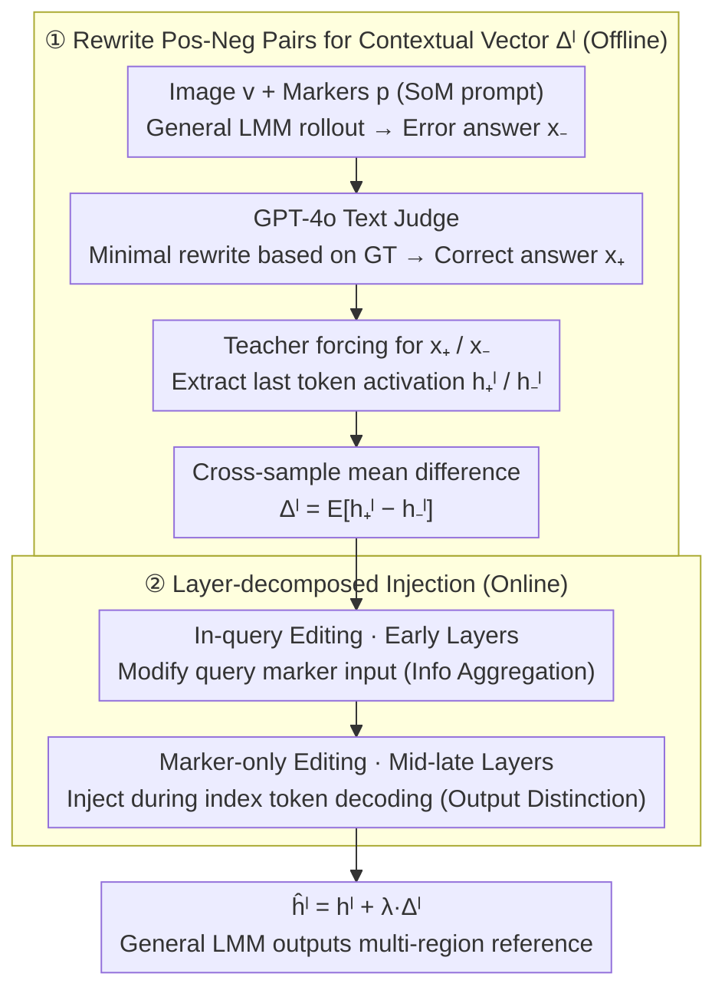

# Referring Multiple Regions with Large Multimodal Models via Contextual Latent Steering

**Conference**: ICML 2026  
**arXiv**: [2605.01827](https://arxiv.org/abs/2605.01827)  
**Code**: https://github.com/xing0047/csteer.git (Available)  
**Area**: Multimodal VLM / Representation Editing / Visual Grounding  
**Keywords**: Multi-region referring, latent steering, training-free, contextual vector, LMM

## TL;DR
CSteer proposes a training-free latent steering method. By constructing "contextual vectors" from the hidden activation differences between incorrect and correct referential responses and injecting them into early query layers and mid-to-late decoding layers, general LMMs (Qwen3-VL, InternVL-3.5) outperform specially fine-tuned region LMMs on multi-region visual referring tasks.

## Background & Motivation

**Background**: General LMMs (LLaVA, Qwen-VL, InternVL series) are proficient at whole-image understanding but struggle when required to answer for multiple regions labeled as [1][2][3] individually. Existing region LMMs (GAR, INST-IT-Qwen, DAM, Sa2VA, etc.) mostly follow the "specialized region encoder + large-scale referring data fine-tuning" route, which is costly and primarily excels at single-region descriptions.

**Limitations of Prior Work**: Single-region Set-of-Mark (SoM) prompting works on general LMMs, but once the number of regions $m>1$, the model's visual attention becomes "scattered and disloyal"—either mixing semantics of multiple regions, mispairing indices like [1] and [2] with objects, or ignoring global context (e.g., counting, comparing depth/reflectance).

**Key Challenge**: Instance-level fine-grained perception requires the model to "distinguish by index + attend to global context simultaneously." However, the pre-training objectives of general LMMs only optimize for whole-image understanding. This hybrid behavior of "partitioning + contextuality" has neither explicit supervision nor an explicit representation pathway. Attempting to "train it in" via SFT/RL is expensive and lacks scalability.

**Goal**: To trigger multi-region and context-sensitive referring behavior in general LMMs during inference only, interfering with hidden activations without changing the architecture or performing supervised fine-tuning.

**Key Insight**: Drawing inspiration from the work of Rimsky et al. on LLM behavioral editing—where specific behaviors (e.g., refusal, sycophancy) can often be extracted as an "activation direction vector" in the hidden space of certain layers. Steering the model by adding this vector can toggle the behavior. The authors hypothesize that "multi-region referring" is also such a linearly editable behavioral pattern.

**Core Idea**: Use an LLM-as-judge to rewrite incorrect referential descriptions generated by the general LMM into correct ones. Construct contextual vectors $\Delta^l$ using "rewrite vs. original error" as positive-negative pairs, then perform layer-decomposed injection—injecting into early layers at the query side to aid "information aggregation" and into mid-to-late layers at the decoding side to guide "output distinction."

## Method

### Overall Architecture
Given an image $v$, visual prompts $p=\{p_1,...,p_m\}$ (numerical markers) overlaid on the image, and a text query $q$, a general LMM $\mathcal{F}$ encodes them as $\textbf{X}_c=\text{concat}(\mathcal{F}_{visual}(v,p), \textbf{X}_q)$, followed by autoregressive decoding by the language model $\mathcal{F}_L$. CSteer does not alter this main flow but adds a pre-calculated contextual vector $\Delta^l$ to the hidden states $h^l$ of several layers in $\mathcal{F}_L$: $\hat{h}^l = h^l + \lambda \cdot \Delta^l$. The entire pipeline consists of two serial modules: **① Offline construction of contextual vectors**—running a small batch of samples with GT labels through the LMM to obtain incorrect referential answers (negative samples), using a text-only judge like GPT-4o to minimally rewrite them into correct versions based on GT (positive samples), then using teacher forcing to make the LMM output both versions to record the hidden activations of the last token, and finally calculating $\Delta^l$ via mean difference; **② Online layer-decomposed injection**—applying $\Delta^l$ during inference following a decomposition strategy of "modifying query in early layers and modifying decoding in mid-to-late layers," with no changes to architecture or parameters.

### Key Designs

The paper explicitly splits CSteer into two serial modules: **how to construct clean contextual vectors** and **how to inject them into the correct layers**. These two points correspond to the subgraphs in the architecture diagram; training-free and plug-and-play characteristics are natural outcomes of these steps.

**1. Rewrite Pair Construction: Purifying "Referential Correction" Signals**

This step addresses the core issue of the first module—ensuring $\Delta^l$ only encodes the "multi-region referring" behavior without carrying irrelevant signals like writing style. The most direct approach is subtracting "correct/incorrect" answer pairs, but the selection of these pairs is critical. The authors compared four schemes: "Refer vs No Refer" (Eq. 5), "Exact Matching vs Marker Shuffle" (Eq. 6), "GT vs Rollout" (Eq. 7), and the finalized "Rewrite vs Rollout" (Eq. 8). CSteer takes the LMM's **actual rollout errors** under SoM prompts (e.g., describing region [2] as [1]) as negative samples $\hat{x}_-$. For positive samples $\mathcal{F}_{rewrite}(\hat{x})_+$, a text-only LLM (GPT-4o) **minimally rewrites** the error into a correct version using the GT caption as a reference—correcting only the wrong referential relationships while keeping sentence length, vocabulary, and style intact. Thus, $\Delta^l = f_+(v,p,\mathcal{F}_{rewrite}(\hat{x})_+) - f_-(v,p,\hat{x}_-)$. This avoids the "style noise" present in a simple "GT vs Rollout" comparison, ensuring the difference direction carries almost exclusively the signal for "referential correction."

**2. Layer-decomposed Steering: Aggregation in Early Layers, Output in Mid-late Layers**

Once $\Delta^l$ is constructed, the next question is where and when to inject it. A default approach (Eq. 9) of injecting across all decoding steps yielded mediocre results. The key observation is that "multi-region referring" involves two distinct stages: **Reading** (linking indices [1][2] in the query to corresponding regions) and **Writing** (ensuring descriptions for [1] do not bleed into [2]). These occur at different locations within the LMM. Consequently, injection is split: **In-query editing** modifies only the hidden states of marker tokens in the user query (affecting "reading"), while **Marker-only editing** adds $\Delta^l$ only when decoding index tokens $h^l_{t\in\mathcal{P}}$ (affecting "writing"). Empirically, in-query editing performs best in **early layers** (information aggregation stage), while marker-only editing performs best in **mid-to-late layers** (output prediction stage). Combining them addresses both symptoms: "failing to look at the correct object when reading [1]" and "outputting descriptions of [2] when describing [1]."

These steps provide CSteer's deployment advantage: it only requires a small batch of GT samples to pre-compute $\Delta^l$ **offline**. Inference only adds an $O(d)$ per-layer addition, introducing negligible latency. Computed vectors can also be reused across tasks (vectors from GAR-Bench applied directly to INST-IT and VIP-Bench). Compared to region LMMs requiring hundreds of thousands of SFT samples, CSteer moves "behavior acquisition" from weight space to activation space.

### Loss & Training
CSteer involves no training loss. The main step is SVD-free mean difference: $\Delta^l = \mathbb{E}_{(x_+, x_-)}\left[h^l_+ - h^l_-\right]$. The only hyperparameters are the injection strength $\lambda$ and the layer range, selected via grid search on a small validation set.

## Key Experimental Results

### Main Results

| Base LMM | Method | GAR-Bench ALL | INST-IT (Img) AVG | LaSOText (Replacement) |
|---|---|---|---|---|
| Qwen3-VL-8B | w/o refer | 39.3 | 31.8 | - |
| Qwen3-VL-8B | SoM (Yang 2023) | 63.9 | 52.5 | - |
| Qwen3-VL-8B | **CSteer** | **65.8** | **57.4** | - |
| InternVL-3.5-8B | SoM | 50.9 | 39.2 | - |
| InternVL-3.5-8B | **CSteer** | **53.1** | **43.1** | - |
| GAR-8B (region LMM) | tailored SFT | 59.9 | 62.2 | - |
| Gemini-2.5-Pro | proprietary | 64.2 | 59.3 | - |

| Dataset | Qwen3-VL SoM | Qwen3-VL CSteer | Gain | Remarks |
|---|---|---|---|---|
| VIP-Bench AVG | 70.8 | 71.0 | +0.2 | Single-region focused |
| BLINK ALL | 47.9 | (See Paper) | +3-5 | Multi-region comparison |
| GAR-Bench (contextual) | 58.9 | 66.4 | **+7.5** | Max gain in contextual scenes |

### Ablation Study

| Design Component | GAR-Bench AVG | Description |
|---|---|---|
| Full CSteer | 57.4 | Qwen3-VL-8B + rewrite + decomposition |
| w/o Rewrite (GT vs Rollout) | ~54 | Style noise interference |
| w/o Decomposition (Marker-only only) | ~55 | Missing info aggregation stage |
| w/o Decomposition (In-query only) | ~54 | Decode stage remains chaotic |
| Marker Shuffle Construction | ~53 | Less pure than rewrite |

### Key Findings
- **Contextual Scenario Gain > Region-centric Scenario**: In the GAR-Bench contextual subset, the gain is +7.5%, whereas in BLINK (relative depth/reflectance), it is +3-5%, indicating $\Delta^l$ is better at "correcting global neglect."
- **Layer Decomposition is Crucial**: Using in-query or marker-only editing alone provides marginal gains over SoM (+1-2%), whereas combining them yields +5-7%, validating the hypothesis of distinct functional stages in LMM layers.
- **Training-free outperforms SFT models**: Qwen3-VL-8B+CSteer achieves 65.8 on GAR-Bench, surpassing the 59.9 of GAR-8B, which was specifically fine-tuned for this benchmark. This suggests general LMMs already possess multi-region capabilities that just need proper activation.

## Highlights & Insights
- **Visual Extension of "Linearly Editable Behavior"**: While previous work (Rimsky et al.) verified this for text LLMs, this paper applies the paradigm to multimodal referring tasks and proves that highly localized behaviors (like visual markers) are also susceptible to steering.
- **Purity Trick in Rewrite Construction**: Using "minimal rewrites" rather than raw GT as positive samples for "differential matching" can be transferred to any task requiring pure behavioral vectors (e.g., code style, toxicity).
- **Functional Mapping of Layerwise Injection**: Mapping "information aggregation" to early layers and "output generation" to late layers based on LLM information flow priors is more robust than a one-size-fits-all injection.

## Limitations & Future Work
- Contextual vectors are dataset-dependent—while cross-benchmark reuse was shown, robustness across entirely different modalities (e.g., medical, remote sensing) is unverified.
- Injection strength $\lambda$ and layer range still require grid search on small labeled sets, posing a "cold start" challenge for zero-shot deployment.
- Experiments were limited to 8B scale open-source LMMs; steering effectiveness on 70B+ or closed-source models (GPT-4o, o3) remains to be explored.
- Multi-region capacity is still bounded by the visual token count and attention width of the base LMM.

## Related Work & Insights
- **vs GAR / INST-IT-Qwen / DAM (region LMM)**: These follow the "region encoder + SFT" route. CSteer achieves better results on multi-region tasks without architecture changes or training, suggesting "General Base + Inference Intervention" is a potent alternative.
- **vs SoM (Set-of-Mark, Yang 2023)**: SoM is a black-box prompting method; CSteer adds latent intervention on top of SoM.
- **vs Rimsky 2024 (CAA)**: CSteer extends CAA to multimodal tasks, introduces layer decomposition (in-query / marker-only), and utilizes the rewrite-based pair construction.
- **vs ITI (Inference-Time Intervention)**: While ITI focuses on honesty, CSteer systematizes this for visual grounding and introduces layer-decomposed intervention.

## Rating
- Novelty: ⭐⭐⭐⭐ Successfully introduces latent steering to multimodal multi-region grounding with novel rewrite and decomposition strategies.
- Experimental Thoroughness: ⭐⭐⭐⭐ Covers 4+ benchmarks and multiple base LMMs with comprehensive ablations.
- Writing Quality: ⭐⭐⭐⭐ Clear pipeline diagrams, consistent notation, and informative comparison of vector construction schemes.
- Value: ⭐⭐⭐⭐⭐ Provides a low-cost path to extract region capabilities without fine-tuning, highly relevant for industrial deployment of general LMMs.

<!-- RELATED:START -->

## Related Papers

- [\[CVPR 2026\] Visual Funnel: Resolving Contextual Blindness in Multimodal Large Language Models](../../CVPR2026/multimodal_vlm/visual_funnel_resolving_contextual_blindness_in_multimodal_large_language_models.md)
- [\[ICML 2026\] Vision-aligned Latent Reasoning for Multi-modal Large Language Model](vision-aligned_latent_reasoning_for_multi-modal_large_language_model.md)
- [\[NeurIPS 2025\] Test-Time Spectrum-Aware Latent Steering for Zero-Shot Generalization in Vision-Language Models](../../NeurIPS2025/multimodal_vlm/test-time_spectrum-aware_latent_steering_for_zero-shot_generalization_in_vision-.md)
- [\[CVPR 2026\] ORIC: Benchmarking Object Recognition under Contextual Incongruity in Large Vision-Language Models](../../CVPR2026/multimodal_vlm/oric_benchmarking_object_recognition_under_contextual_incongruity_in_large_visio.md)
- [\[ICML 2026\] SLQ: Bridging Modalities via Shared Latent Queries for Retrieval with Frozen MLLMs](slq_bridging_modalities_via_shared_latent_queries_for_retrieval_with_frozen_mllm.md)

<!-- RELATED:END -->
