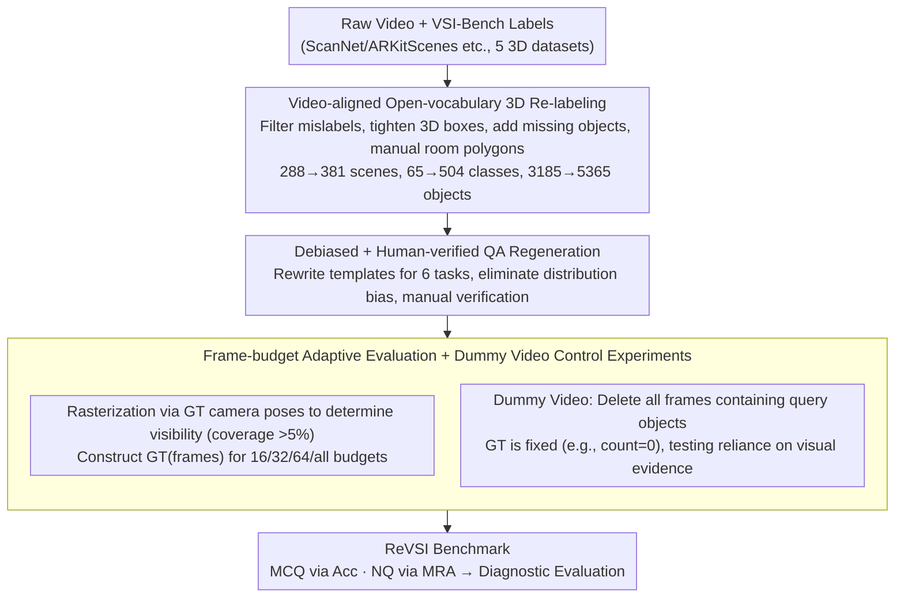

# ReVSI: Rebuilding Visual Spatial Intelligence Evaluation for Accurate Assessment of VLM 3D Reasoning

**Conference**: ICML 2026  
**arXiv**: [2604.24300](https://arxiv.org/abs/2604.24300)  
**Code**: Available (Project Page + GitHub + HuggingFace)  
**Area**: Multimodal VLM / Evaluation Benchmarks / Visual Spatial Intelligence  
**Keywords**: VSI-Bench, Spatial Reasoning, Frame Budget, Virtual Video, Hallucination

## TL;DR
This paper systematically reveals structural failures in the widely used VSI-Bench due to 3D label drift and frame sampling inconsistency. The authors re-label 381 scenes and 5365 objects, design frame-budget adaptive QA and "dummy video" (removing query object frames) stress tests to construct ReVSI, a high-fidelity spatial intelligence benchmark. Evaluations show that open-source VLMs drop by up to 40% on ReVSI and maintain high hallucination rates on dummy videos, exposing a systematic overestimation of existing spatial reasoning capabilities.

## Background & Motivation

**Background**: As VLMs expand toward embodied AI and 3D perception, VSI evaluation benchmarks like VSI-Bench, SPAR-Bench, and VSI-SUPER have become mainstream. These use 3D datasets such as ScanNet/ARKitScenes to automatically generate QA for testing spatial reasoning in object counting, relative orientation, and room area. VLM training (SpatialVLM, Cambrian-S, SpaceR) also optimizes around these benchmarks.

**Limitations of Prior Work**: Manual audits reveal two core defects. First, **Label-Video Drift**: VSI-Bench ground truth (GT) comes from point-cloud-based 3D reconstruction labels (intended for traditional 3D perception), but objects clearly visible in raw videos may be missing due to incomplete reconstruction, or mislabeled (e.g., a cup labeled as a notebook). Room areas are calculated via noisy Alpha Shapes, leading to many QA pairs that are incorrect or semantically ambiguous under video evidence—among 565 Object Counting questions, 27% were wrong and 11% were ambiguous. Second, **Frame Sampling Unobservability**: VLMs can only observe 16/32/64 frames, but VSI-Bench GT is labeled based on all frames. Figure 3 shows that at 16 frames, GT correctness drops to 67%, meaning many questions are unanswerable given the model's actual input.

**Key Challenge**: Benchmarks assume "full scene seen by the model = full scene seen during labeling." Modern VLM sparse-frame input breaks this assumption, making it impossible to distinguish whether an error stems from weak spatial reasoning or missing evidence. Furthermore, skewed answer distributions (e.g., "2" accounting for 53% of Object Counting) allow models to score high using priors rather than visual evidence.

**Goal**: While maintaining the VSI-Bench task paradigm, ensure (i) labels are strictly consistent with raw videos; (ii) QA is answerable and correct at every frame budget; (iii) provide controllable diagnostics to decouple visual evidence from reasoning ability.

**Key Insight**: Rather than training a new model, fix the evaluation—aligning "what the benchmark asks" strictly with "what the model sees" to restore diagnostic value.

**Core Idea**: Rebuild the first input-consistent VSI benchmark, ReVSI, through three components: video-aligned manual 3D re-labeling, frame-budget adaptive QA, and dummy video stress tests.

## Method

### Overall Architecture
The ReVSI pipeline consists of three stages: (1) Using a proprietary 3D web labeling interface to expand from 288 scenes/65 categories to 381 scenes/504 open-vocabulary categories across ScanNetv2/ScanNet++/ARKitScenes/3RScan/MultiScan, redrawing 5365 3D boxes; (2) Regenerating QA for 6 task types (object counting, size, absolute distance, room size, relative distance, and relative direction) using stricter templates and manual verification; (3) Constructing GT for the same video under 16/32/64/all-frame sampling budgets, and generating "dummy videos" by removing all frames containing the query object for visibility-guided control experiments.

### Key Designs

**1. Video-aligned Open-vocabulary 3D Re-labeling: Anchoring GT to raw video rather than noisy meshes**

ReVSI addresses the misalignment where GT was based on reconstructed meshes rather than raw video. Using a custom web labeler, the authors filtered mislabels, tightened 3D boxes, and added objects visible in video but missing in reconstruction. Physical sizes were extrapolated for geometrically broken objects using neighboring frames. Room areas were manually drawn via top-down polygons instead of using Alpha Shapes. Open-vocabulary labels (e.g., "Sony PlayStation") were manually written and verified by GPT-5.2. This expansion (381 scenes, 504 categories) prevents models from exploiting narrow category priors.

**2. Debiased + Human-verified QA Regeneration: Eliminating answer distribution bias**

VSI-Bench's skewed distribution (guessing "2" yields 62% in Counting) allows models to ignore visual evidence. ReVSI rewrites templates for all tasks: Object Counting introduces single-instance queries and "two-category sum" templates; Object Size removes categories with fixed sizes (like toilets) and performs OOD sampling for refrigerators; Absolute Distance replaces <1m samples with long-range pairs; Relative Direction adds "facing/backing" templates. Manual verification ensures every question is answerable, forcing the metric to reflect true spatial reasoning.

**3. Frame-budget Adaptive Evaluation + Dummy Video Experiments: Aligning observation and evaluation**

Modern VLMs typically process 16/32/64 frames, whereas old GT assumed all frames. ReVSI uses GT camera poses to rasterize sampled frames and determine object visibility (area > 5%). GT becomes a function $\text{GT}(\text{frames})$ tailored to the specific budget. Dummy videos—where evidence frames are deleted—provide a definitive GT (e.g., count is 0). For metrics, MCQ uses Accuracy, and NQ uses Mean Relative Accuracy:
$$\text{MRA}=\frac{1}{|C|}\sum_{\theta\in C}\mathbb{1}[|\hat y-y|/y<1-\theta]$$
where $C=\{0.5,0.55,\dots,0.95\}$. If a model answers correctly without visual evidence, it defines hallucination driven by priors.

### Loss & Training
ReVSI is an evaluation benchmark; no specific training is performed. Evaluation follows MRA (NQ) and Acc (MCQ).

## Key Experimental Results

### Main Results
Evaluations include general VLMs (Qwen3-VL, InternVL-3.5, LLaVA-Video, GPT-5.2, Gemini 3) and 3D expert models (SpatialVLM, Cambrian-S, SpaceR, VLM-3R, Spatial-MLLM).

| Dataset Statistics | VSI-Bench | ReVSI |
|--------------------|-----------|-------|
| Scenes | 288 | 381 |
| Objects | 3185 | 5365 |
| Categories | 65 | 504 |
| Open Vocabulary | ✗ | ✓ |
| Frame-adaptive GT | ✗ (All-frame only) | ✓ (16/32/64/all) |

| Model Category | VSI-Bench Performance | ReVSI Performance | Conclusion |
|----------------|-----------------------|-------------------|------------|
| Closed-source (GPT-5.2, Gemini 3) | Lower than open-source | Significantly outperforms open-source | VSI-Bench underestimates closed-source |
| Open-source VLM (Qwen3-VL, InternVL-3.5) | High | Drops up to 40% (Counting/Rel-Dist) | VSI-Bench overestimates open-source |
| 3D Finetuned Experts (SpaceR, 3D-R1) | Much higher than base | Gains sharply reduced | Gains were amplified by benchmark bias |

### Ablation Study

| Diagnostic Setting | Key Findings |
|--------------------|--------------|
| Guessing "2" in Counting | 62% on VSI-Bench vs <20% on ReVSI; verifies successful debiasing. |
| Absolute Distance | Some scores improved due to MRA's tolerance for long distances after removing "easy" <1m samples. |
| Dummy Video Counting | InternVL-3.5 still gives non-zero counts; proves output is driven by indoor priors. |
| Object Size (Black Frames) | Expert models still hit typical sizes, revealing reliance on category priors. |
| Frame Budget Sweep | GT correctness improved from 67% to 92% when going from 16 to 64 frames. |

### Key Findings
- The "Open > Closed source" conclusion from VSI-Bench is reversed on ReVSI, indicating previous SOTA claims were likely benchmark artifacts.
- Gains from 3D instruction finetuning diminish on a cleaner benchmark, suggesting current 3D experts are largely "overfitting noisy GT."
- Dummy videos expose that SOTA open-source VLM outputs are insensitive to the presence of visual evidence—a major bottleneck in spatial reasoning.

## Highlights & Insights
- **The importance of evaluation hygiene**: Auditing the 27% error rate in VSI-Bench demonstrates that fixing the evaluation is higher ROI than model architectural changes in current spatial AI research.
- **Dummy video protocol**: This visibility-controlled stress test can be extended to any video QA task to systematically quantify hallucination.
- **Frame-budget-aware GT**: GT is no longer treated as a constant but as a function $\text{GT}(\text{frames})$, a standard that future long-video benchmarks should adopt.

## Limitations & Future Work
- Re-labeling is high-quality but manually intensive, making it difficult to scale to in-the-wild videos without automation.
- Temporal reasoning was excluded by removing Object Appearance Order; spatial-temporal joint reasoning remains a future target.
- ReVSI retains the task definitions of VSI-Bench; future work should include new 3D tasks like multi-view registration or 6DoF manipulation.

## Related Work & Insights
- **vs VSI-Bench (Yang 2025a)**: Directly audited and corrected by this work; ReVSI is its more credible successor.
- **vs 3D Finetuned VLMs**: ReVSI reveals that post-training data scale is somewhat decoupled from performance on clean benchmarks, urging more rigorous evaluation.
- **Cross-task Inspiration**: The dummy video protocol can be generalized to medical VQA (removing critical anatomical areas) or robot perception tasks.

## Rating
- Novelty: ⭐⭐⭐⭐ Significant protocol innovation despite maintaining existing task archetypes.
- Experimental Thoroughness: ⭐⭐⭐⭐⭐ Comprehensive coverage of 10+ models across closed/open/expert categories with multi-dimensional diagnostics.
- Writing Quality: ⭐⭐⭐⭐⭐ Extremely clear argumentation from diagnosis to solution to verification.
- Value: ⭐⭐⭐⭐⭐ Strongly challenges existing SOTA claims and provides the standard for future spatial reasoning evaluation.

<!-- RELATED:START -->

## Related Papers

- [\[CVPR 2026\] SpatialScore: Towards Comprehensive Evaluation for Spatial Intelligence](../../CVPR2026/multimodal_vlm/spatialscore_towards_comprehensive_evaluation_for_spatial_intelligence.md)
- [\[ICML 2026\] R$^3$L: Reasoning 3D Layouts from Relative Spatial Relations](r3l_reasoning_3d_layouts_from_relative_spatial_relations.md)
- [\[ICML 2026\] Learning GUI Grounding with Spatial Reasoning from Visual Feedback](learning_gui_grounding_with_spatial_reasoning_from_visual_feedback.md)
- [\[CVPR 2026\] Abstract 3D Perception for Spatial Intelligence in Vision-Language Models](../../CVPR2026/multimodal_vlm/abstract_3d_perception_for_spatial_intelligence_in_vision-language_models.md)
- [\[CVPR 2026\] G$^2$VLM: Geometry Grounded Vision Language Model with Unified 3D Reconstruction and Spatial Reasoning](../../CVPR2026/multimodal_vlm/g2vlm_geometry_grounded_vision_language_model_with_unified_3d_reconstruction_and.md)

<!-- RELATED:END -->
