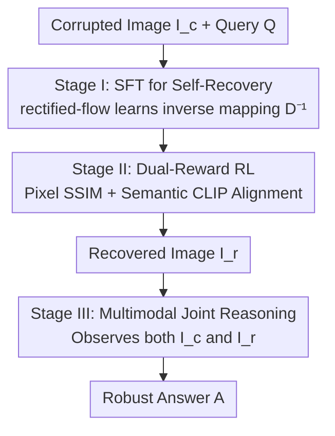

# Robust-U1: Can MLLMs Self-Recover Corrupted Visual Content for Robust Understanding?

**Conference**: ICML2026  
**arXiv**: [2606.08063](https://arxiv.org/abs/2606.08063)  
**Code**: https://github.com/jqtangust/Robust-U1  
**Area**: Multimodal VLM  
**Keywords**: Multimodal Large Language Models, Visual Robustness, Self-Recovery, Unified Models, RL Alignment

## TL;DR
Robust-U1 enables unified Multimodal Large Language Models (MLLMs) to first "self-recover" corrupted images at the pixel level and then perform joint reasoning using both original and recovered images, achieving SOTA in robust understanding under both real-world and adversarial degradations.

## Background & Motivation
**Background**: MLLMs demonstrate impressive visual understanding, but encounter various **visual corruptions** (system noise, compression artifacts, adverse weather) when deployed in the real world. These degradations severely disrupt visual features, leading to a significant drop in downstream performance.

**Limitations of Prior Work**: Existing anti-degradation methods follow two paradigms, both with fatal flaws. One is **black-box feature alignment** (e.g., TeCoA, Robust CLIP, Robust LLaVA), which uses adversarial fine-tuning in the visual encoder to pull features of "corrupted" and "clean" images closer. While effective for performance gains, it lacks interpretability, fails to explicitly model the degradation process, and generalizes poorly due to reliance on limited adversarial datasets. The other is **white-box text reasoning** (e.g., Robust-R1), which enhances interpretability using an explicit chain-of-thought describing degradation types and their semantic impact. However, it is trapped in the **text modality**; text cannot represent pixel-level details, and lost visual information remains unrecovered.

**Key Challenge**: The fundamental loss in corrupted images is **pixel-level visual information**. Existing methods either perform implicit alignment in feature space (unclear mechanism) or use text descriptions (cannot recover pixels)—neither "actually restores the missing visuals."

**Goal**: To answer a fundamental question—**Can MLLMs themselves recover corrupted visual content?** If so, a more intrinsic robustness can be established where the model actively restores information rather than applying textual patches post-hoc.

**Core Idea**: Utilize a **visual self-recovery module** $\mathcal{D}^{-1}$ to approximate the inverse mapping of the degradation process, restoring the corrupted image $\mathbf{I}_c$ into a recovered image $\mathbf{I}_r$. Subsequently, the MLLM performs joint reasoning by observing both $\mathbf{I}_c$ and $\mathbf{I}_r$.

## Method

### Overall Architecture
Formally, while the standard understanding process is $\mathbf{A}_o=\mathcal{F}_{\text{MLLM}}(\mathbf{I}_o,\mathbf{Q};\Theta)$, real-world images are corrupted by a degradation function $\mathbf{I}_c=\mathcal{D}(\mathbf{I}_o)$. The robust model in Robust-U1 reformulates the process into recovery followed by joint reasoning:

$$\mathbf{A}=\mathcal{F}_{\text{MLLM}}^{\text{(Robust)}}(\mathbf{I}_c,\mathbf{Q};\Theta)=\mathcal{F}_{\text{MLLM}}\big(\underbrace{\mathcal{D}^{-1}(\mathbf{I}_c)}_{\mathbf{I}_r},\,\mathbf{I}_c,\,\mathbf{Q};\Theta\big),$$

where $\mathcal{D}^{-1}$ is the self-recovery module. The framework is built upon the unified MLLM architecture **BAGEL** (inherently capable of both understanding and generation) and is trained in three serial stages: Stage I uses Supervised Fine-Tuning (SFT) to **specialize** BAGEL's general generative capability into a self-recovery module; Stage II uses Reinforcement Learning (RL) with dual rewards to further **align recovery quality**; Stage III trains the model to perform **multimodal joint reasoning** using both corrupted and recovered images.

### Key Designs

**1. Specializing the Unified Model as a Visual Self-Recovery Module via SFT**

Addressing the limitation that "existing methods cannot recover pixels," instead of training a separate restoration network, this work leverages BAGEL's existing generative capacity. By using a recovery prompt $\mathbf{P}_{\text{rec}}$ (e.g., "Recover the clean version of this corrupted image."), the model is **conditioned** as a dedicated inverse-degradation module. This is formalized using **rectified flow**: the image is first encoded into a latent representation $\mathbf{Z}_c$. The model learns to denoise a noisy version of the clean latent $\mathbf{Z}_o$ conditioned on $\mathbf{Z}_c$ and $\mathbf{P}_{\text{rec}}$, with the objective:

$$\mathcal{L}_{\text{SFT}}=\mathbb{E}_{t\sim\mathcal{U}(0,1),\,\epsilon\sim\mathcal{N}(0,\mathbf{I})}\big[\|\epsilon-\epsilon_\Theta(\mathbf{Z}_c,\mathbf{Z}_o(t),t,\mathbf{P}_{\text{rec}})\|^2\big],$$

where $\mathbf{Z}_o(t)=(1-t)\mathbf{Z}_o+t\epsilon$ is the noisy latent at time $t$. This objective enables the model to reverse degradation in latent space and learn the inverse mapping $\mathcal{D}^{-1}$. Training uses the large-scale ImageNet-C dataset. This stage transforms "general image generation" into "specialized visual self-recovery," forming the foundation of the pipeline.

**2. Aligning Recovery Quality via Pixel-Semantic Dual-Reward RL**

SFT alone is insufficient for precise structural and semantic fidelity in recovered images. This work employs **Flow-GRPO** for RL, modeling the denoising process as a Markov Decision Process using Group Relative Policy Optimization with **two complementary rewards**. The first is a **pixel-level structural reward**: using SSIM to compare luminance, contrast, and structure between the recovered image $\mathbf{I}_r$ and ground truth $\mathbf{I}_o$ over local patches, $\mathcal{R}_{\text{pix}}=\text{SSIM}(\mathbf{I}_r,\mathbf{I}_o)\in[0,1]$. The second is a **semantic consistency reward**: using a frozen TinyCLIP to extract image embeddings, calculating the cosine similarity $\text{Sim}$ between recovered and clean image embeddings, transformed as:

$$\mathcal{R}_{\text{sem}}(\mathbf{I}_r,\mathbf{I}_o)=\exp\big(-\alpha\cdot(1-\text{Sim}(\mathcal{M}_{\text{CLIP}}(\mathbf{I}_r),\mathcal{M}_{\text{CLIP}}(\mathbf{I}_o)))\big),$$

where the reward peaks at 1 when similarity is 1 and decays exponentially, with $\alpha$ controlling sensitivity. During optimization, $G$ trajectories are sampled for each corrupted image (converting the deterministic ODE to SDE for stochasticity), advantage is calculated via group normalization, and a KL penalty is added to prevent reward hacking. The two rewards are complementary: pixel rewards alone may sacrifice semantic richness for pixel perfection, while semantic rewards alone lack detail; combined, they achieve optimal balance.

**3. Multimodal Joint Reasoning: Observing Corrupted and Recovered Images**

Since recovered images are not ground truth and may introduce artifacts or semantic bias, the original corrupted image is not discarded. Both images are interleaved into a sequence followed by the text query $\mathbf{Q}$. The model is trained to generate an answer with a reasoning chain conditioned on both, maximizing the likelihood of target tokens:

$$\mathcal{L}_{\text{MLLM}}=-\mathbb{E}_{(\mathbf{I}_c,\mathbf{I}_r,\mathbf{Q},\mathbf{A}^*)}\sum_{t=1}^{L}\log P_\Theta(a_t^*\mid a_{<t}^*,\mathbf{I}_c,\mathbf{I}_r,\mathbf{Q}).$$

This allows the model to prioritize the recovered image for content understanding while referring back to the corrupted image to resolve ambiguities—closing the "perception $\rightarrow$ recovery $\rightarrow$ reasoning" loop. Ablations show that removing joint reasoning (not looking at the recovered image) drops the overall score from 0.7398 to 0.6623, proving that joint reasoning is the key to robust understanding.

### Loss & Training
The three stages utilize: Stage I's rectified-flow denoising loss $\mathcal{L}_{\text{SFT}}$ (on ImageNet-C); Stage II's Flow-GRPO with composite rewards $\mathcal{R}_{\text{pix}}+\mathcal{R}_{\text{sem}}$ (on Robust-R1 training data); and Stage III's multimodal autoregressive likelihood $\mathcal{L}_{\text{MLLM}}$ (using Robust-R1 reasoning chain data). The base MLLM is BAGEL; CLIP and SSIM in the rewards are frozen/parameter-free.

## Key Experimental Results

### Main Results
On the R-Bench benchmark (covering MCQ/VQA/CAP tasks across three degradation intensities), Robust-U1 achieves SOTA across all tasks and intensities, with the advantage becoming more pronounced as degradation increases.

| Category | Method | Overall (R-Bench) |
|------|------|---------|
| General MLLM | Qwen2.5-VL-3B | 0.4845 |
| General MLLM | InternVL-4B | 0.4706 |
| General MLLM | BAGEL (Base) | 0.5770 |
| Robust MLLM | Robust CLIP | 0.3718 |
| Robust MLLM | Robust-R1 (Prev. SOTA) | 0.5017 |
| **Ours** | **Robust-U1** | **0.7398** |

Under adversarial degradation (synthetic multi-level degradation on standard VQA benchmarks), Robust-U1 also leads comprehensively, with **minimal performance drop**: on MMMB, the score only drops by 1.57 from clean to 100% degradation, compared to 3.44 for BAGEL and 6.06 for Robust-R1.

| Benchmark | Clean | 100% Corruption | Drop |
|------|-------|---------|------|
| Robust-U1 @ MMMB | 84.75 | 83.18 | 1.57 |
| BAGEL @ MMMB | 81.92 | 78.48 | 3.44 |
| Robust-R1 @ MMMB | 81.41 | 75.35 | 6.06 |

### Ablation Study
Component-wise ablation on R-Bench overall:

| Configuration | Overall | Note |
|------|---------|------|
| Baseline (BAGEL) | 0.5770 | No recovery, no joint reasoning |
| **Robust-U1 (Full)** | **0.7398** | All components |
| w/o Multimodal Joint Reasoning | 0.6623 | No recovered image, -7.8 pts |
| w/o $\mathcal{R}_{\text{pix}}$ | 0.7257 | No pixel reward, lower structural fidelity |
| w/o $\mathcal{R}_{\text{sem}}$ | 0.7236 | No semantic reward, highest drop at high corruption |

Recovery quality (on Robust-R1 validation, PSNR↑/SSIM↑/LPIPS↓) improves progressively: BAGEL 14.37/0.4722/0.5092 $\rightarrow$ +SFT 20.88/0.6135/0.3444 $\rightarrow$ +$\mathcal{R}_{\text{pix}}$ 21.45/0.6311/0.3299 $\rightarrow$ Full 21.49/0.6314/0.3223.

### Key Findings
- **Multimodal joint reasoning is the biggest contributor**: Removing it drops the overall score by 7.8 points, far exceeding the removal of any single reward, proving that "reasoning with recovered images" is the primary source of performance.
- **Dual rewards have distinct roles**: $\mathcal{R}_{\text{pix}}$ primarily improves PSNR/SSIM (sharpening edges and text), while $\mathcal{R}_{\text{sem}}$ achieves the best LPIPS (preserving natural texture and color). Removing $\mathcal{R}_{\text{sem}}$ causes the most significant drop under high degradation, where semantic correctness is most critical.
- **Recovery quality directly drives reasoning performance**: High-fidelity recovery correlates strongly with better reasoning, validating that "self-recovery" is a core mechanism for robust visual understanding.

## Highlights & Insights
- **First framework to enable MLLM explicit "self-recovery" of visual content**: Transcending the "implicit feature alignment / pure text reasoning" paradigms by actually restoring lost pixels represents a qualitative shift in anti-degradation strategies.
- **Repurposing unified model generation for restoration**: Instead of training a separate restoration network, it uses prompts to specialize BAGEL's generation into $\mathcal{D}^{-1}$. This approach is simple, effective, and transferable to any unified understanding-generation model.
- **"Corrupted + Recovered" dual-view reasoning**: By referring back to the original image when recovery is imperfect, the "primary reference + fallback verification" dual-view design can be applied to any "enhance then understand" task.

## Limitations & Future Work
- **Dependency on unified architectures**: The method is built on models like BAGEL that possess both understanding and generation; purely discriminative MLLMs cannot directy apply it.
- **Heavy three-stage training pipeline**: SFT + Flow-GRPO RL + Multimodal Reasoning, combined with multiple datasets (ImageNet-C, Robust-R1), introduces significant training cost and engineering complexity.
- **Potential for new biases in recovered images**: The authors acknowledge a trade-off between pixel perfection and semantic richness; the reliability of the recovery module under extreme or out-of-distribution degradations still requires verification.

## Related Work & Insights
- **vs. Black-box Feature Alignment (TeCoA / Robust CLIP / Robust LLaVA)**: These methods implicitly align features in the visual encoder, lacking interpretability and generalizing poorly. Ours explicitly restores pixels, achieving 0.7398 on R-Bench vs. their 0.18–0.37.
- **vs. White-box Text Reasoning (Robust-R1)**: Robust-R1 uses text chains to describe degradation but cannot recover pixels (SOTA at 0.5017). Our method restores visual content directly, surpassing it comprehensively with smaller drops under degradation.
- **vs. Thinking with Generated Images**: While both use generation to aid vision, that line of work generates auxiliary representations for reasoning, whereas this work focuses on **reversing degradation and restoring corrupted content**.

## Rating
- Novelty: ⭐⭐⭐⭐⭐ Proposes the MLLM visual self-recovery paradigm for the first time.
- Experimental Thoroughness: ⭐⭐⭐⭐⭐ Extensive real and adversarial tests across tasks and intensities.
- Writing Quality: ⭐⭐⭐⭐ Clear three-stage motivation, complete formulas, and good alignment between text and figures.
- Value: ⭐⭐⭐⭐⭐ Provides a new, deployable mechanism for robust multimodal understanding in safety-critical scenarios.

<!-- RELATED:START -->

## Related Papers

- [\[ICLR 2026\] TABLET: A Large-Scale Dataset for Robust Visual Table Understanding](../../ICLR2026/multimodal_vlm/tablet_a_large-scale_dataset_for_robust_visual_table_understanding.md)
- [\[ICML 2026\] Self-Captioning Multimodal Interaction Tuning: Amplifying Exploitable Redundancies for Robust Vision Language Models](self-captioning_multimodal_interaction_tuning_amplifying_exploitable_redundancie.md)
- [\[ICML 2026\] VLANeXt: A Recipe for Building Robust VLA Models](vlanext_recipes_for_building_strong_vla_models.md)
- [\[AAAI 2026\] When Eyes and Ears Disagree: Can MLLMs Discern Audio-Visual Confusion?](../../AAAI2026/multimodal_vlm/when_eyes_and_ears_disagree_can_mllms_discern_audio-visual_confusion.md)
- [\[ICML 2026\] DCER: Robust Multimodal Fusion via Dual-Stage Compression and Energy-Based Reconstruction](dcer_dual-stage_compression_and_energy-based_reconstruction.md)

<!-- RELATED:END -->
