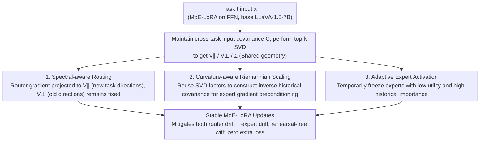

# SAME: Stabilized Mixture-of-Experts for Multimodal Continual Instruction Tuning

**Conference**: ICML2026  
**arXiv**: [2602.01990](https://arxiv.org/abs/2602.01990)  
**Code**: https://github.com/LAMDA-CL/Prism  
**Area**: Multimodal VLM / Continual Learning / MoE-LoRA  
**Keywords**: SAME, MCIT, router drift, expert drift, spectral-aware updates, curvature-aware Riemannian scaling, adaptive expert activation  

## TL;DR
SAME explicitly decomposes "catastrophic forgetting" in multimodal continual instruction tuning (MCIT) for MoE-LoRA into two independent sources: router drift and expert drift. It addresses these using spectral-aware subspace constrained updates for the router, Riemannian preconditioning with historical input covariance for experts, and an adaptive task-level freezing mechanism to eliminate redundant updates. Ours consistently outperforms existing MoE continual learning SOTAs on CoIN, UCIT, and the newly established TriGap long-sequence benchmarks.

## Background & Motivation

**Background**: MLLMs (e.g., LLaVA, Qwen-VL) perform remarkably on static multi-tasking via instruction tuning, but real-world deployment involves sequentially arriving tasks, known as Multimodal Continual Instruction Tuning (MCIT). Recent approaches integrate MoE + LoRA into FFN layers, leveraging "expert specialization" through sparse routing to mitigate forgetting (e.g., MoELoRA, CL-MoE, HiDe-LLaVA).

**Limitations of Prior Work**: The authors conduct diagnostic experiments (Fig. 1) by saving router and expert snapshots after each task in an 8-task sequence and back-testing on the Task 1 test set: (a) As new tasks arrive, the router's expert activation distribution for Task 1 inputs drifts significantly, meaning **identical inputs are routed to different experts**; (b) Even when retraining only the router on Task 1 data (with frozen experts), Task 1 accuracy still declines, and routing entropy decreases—indicating that **experts themselves drift**, losing their original functionality for Task 1.

**Key Challenge**: "Forgetting" in MoE continual learning is a superposition of two decoupled sources: (i) **router drift**—router updates cause old task samples to be misaligned with new experts; (ii) **expert drift**—shared experts are repeatedly overwritten by gradients from new tasks, erasing original functions. Previous methods failed to treat these separately, often resulting in an "addressing one but neglecting the other" situation.

**Goal**: Design independent stabilization mechanisms for both the router and experts, and introduce a training efficiency component to reduce redundant updates in an end-to-end, rehearsal-free framework.

**Key Insight**: The authors borrow two classical ideas from continual learning: "gradient subspace projection" and "natural gradient/Fisher metrics." The former stabilizes the router (preserving old task subspaces), while the latter protects experts (preconditioning based on historical input geometry).

**Core Idea**: Maintain an uncentered historical input covariance $\mathbf{C}^t$ as a unified proxy for "past geometry." Router gradients are projected only onto the high-energy subspace of this covariance. Expert gradients undergo Riemannian scaling using $(\mathbf{C}^{t-1})^{-1}$, supplemented by an adaptive task-level expert freezing mechanism.

## Method

### Overall Architecture
The base model is LLaVA-v1.5-7B + CLIP-L/14-336, with LoRA experts inserted only in the LLM FFN layers. Given input $\mathbf{x}\in\mathbb{R}^d$, the output is $\mathbf{h}=\mathbf{W}_0\mathbf{x}+\sum_{i=1}^n \omega_i \mathbf{B}_i\mathbf{A}_i\mathbf{x}$, where $\omega_i=\mathrm{Softmax}(\mathbf{W}_G\mathbf{x})_i$ is the router output. The framework revolves around a shared "past geometry"—the input covariance $\mathbf{C}^t$ accumulated across tasks. For task $t$ training, $\mathbf{C}^t$ is maintained online and decomposed via top-$k$ SVD into $\mathbf{V}_\parallel, \mathbf{V}_\perp, \boldsymbol{\Sigma}$. This decomposition feeds three stability mechanisms: spectral-aware routing constrains $\mathbf{W}_G$ updates (addressing router drift), curvature-aware Riemannian scaling uses the same factors to construct $(\mathbf{C}^{t-1})^{-1}$ for expert gradient preconditioning (addressing expert drift), and adaptive expert activation temporarily freezes experts based on utility-importance differentials (saving computation and reducing interference).

### Key Designs

**1. Spectral-aware Routing: Restricting router updates to new task input directions to preserve old task routing.**

To address router drift (where the same old task input is routed to different experts), the update is restricted to subspaces that do not affect old tasks. A sliding cross-task covariance $\mathbf{C}^t=(\alpha_{t-1}\mathbf{C}^{t-1}+n_t\hat{\mathbf{C}}^t)/\alpha_t$ is maintained, keeping top-$k$ principal components such that the cumulative energy $\sum_{i=1}^k\sigma_i^2/\sum_{i=1}^d\sigma_i^2\geq\delta$. After SVD, it is split into $\mathbf{V}_\parallel$ (key directions for new tasks) and $\mathbf{V}_\perp$ (old task space with near-zero variance). Router gradients are scaled in new directions as $\Delta\mathbf{W}_\parallel^t=\Delta\mathbf{W}_G^t\mathbf{V}_\parallel g(\boldsymbol{\Sigma})\mathbf{V}_\parallel^\top$ and projected in old directions as $\Delta\mathbf{W}_\perp^t=\Delta\mathbf{W}_G^t\mathbf{V}_\perp\mathbf{V}_\perp^\top$. Since $\mathbf{C}^t\propto\mathbf{X}\mathbf{X}^\top$, the property $\mathbf{V}_\perp^\top\mathbf{X}^{old}\approx\mathbf{0}$ mathematically guarantees that routing predictions for old tasks remain unchanged. In ablations, this single component improves CoIN average accuracy from 50.58 to 61.32 (+10.74).

**2. Curvature-aware Riemannian Scaling: Slower expert updates in "historically common directions" to prevent functional overwriting.**

To address expert drift (shared experts overwritten by new task gradients), SAME approximates functional degradation in a rehearsal-free setting as $\Delta_{degrad}=\mathbb{E}_{\mathbf{x}\sim\mathcal{D}_{<t}}[\|\Delta\mathbf{W}_i\mathbf{x}\|^2]=\mathrm{tr}(\Delta\mathbf{W}_i\mathbf{C}^{t-1}\Delta\mathbf{W}_i^\top)$. Optimizing $\min_{\Delta\mathbf{W}_i}\mathcal{L}+\lambda\max(0,\Delta_{degrad}-\epsilon)$ leads to the Riemannian update:

$$\Delta\mathbf{W}_i=-\eta\nabla_{\mathbf{W}_i}\mathcal{L}\,(\mathbf{C}^{t-1})^{-1}$$

$(\mathbf{C}^{t-1})^{-1}$ is approximated using the damped pseudo-inverse $(\mathbf{C}^{t-1})^{-1}\approx\mathbf{V}_k(\boldsymbol{\Sigma}_k+\mu\mathbf{I})^{-1}\mathbf{V}_k^\top+\frac{1}{\mu}(\mathbf{I}-\mathbf{V}_k\mathbf{V}_k^\top)$ from the SVD factors. High-variance directions (large $\sigma_i$) result in smaller updates, while low-variance or new directions revert to the default scale. This implements the spirit of natural gradients by automatically weighting "past usage" directions without expensive second-order calculations.

**3. Adaptive Expert Activation: Freezing experts that are irrelevant to current tasks but critical for history.**

Top-$k$ routing is sample-level, which can spread single-task gradients across many experts, causing waste and interference. SAME maintains two running averages: current task utilization $\mathcal{U}(i)$ (mean routing weights per batch) and historical importance $\mathcal{F}^{pre}(i)$ (approximated via routing-weighted input energy $\omega_i(\mathbf{x})\|\mathbf{x}\|^2$). The activation score is $\mathrm{Score}(i)=\tilde{\mathcal{U}}(i)-\tilde{\mathcal{F}}^{pre}(i)$. If $\mathrm{Score}(i)<\tau_{score}$ (low utility but high historical importance), the expert's forward and backward passes are frozen during the current task training. This concentrates updates on experts that truly need them, improving compartmentalization. It also yields engineering gains: saving 32.1 minutes of training and 2.3K MiB/GPU VRAM on average per task.

### Loss & Training
The objective is standard next-token cross-entropy (CE) for multimodal instruction tuning. LoRA rank=8, 1 epoch per task, bs=6, lr=2e-4 with cosine decay and 0.03 warmup, trained on 8×RTX 5090. All constraints are applied by modifying gradient update rules without extra loss terms, maintaining training costs similar to vanilla MoELoRA.

## Key Experimental Results

### Main Results

CoIN 8-task benchmark (aligned with original paper reports):

| Method | ScienceQA | ImageNet | REC | OCR-VQA | Average |
|---|---|---|---|---|---|
| MoELoRA (Chen 2024) | 62.02 | 37.21 | 33.22 | 65.75 | 50.58 |
| SEFE (Chen 2025) | 75.35 | 83.10 | 16.75 | 66.25 | 58.57 |
| HiDe-LLaVA (Guo 2025a) | 73.20 | 69.28 | 59.18 | 64.76 | 63.95 |
| **SAME (Ours)** | **78.35** | **90.21** | **59.87** | 63.59 | **66.82** |

TriGap (10-task) long-sequence benchmark established by the authors:

| Method | DocVQA | IconQA | FloodNet | Average |
|---|---|---|---|---|
| MoE-LoRA | 37.49 | 43.43 | 90.41 | 44.45 |
| CL-MoE | 36.79 | 52.70 | 80.09 | 44.11 |
| ModalPrompt | 38.23 | 44.73 | 71.52 | 40.15 |
| **SAME** | **43.87** | **64.03** | 81.09 | **46.53** |

On UCIT (6 tasks), SAME leads with an average accuracy of 67.12% (vs. 65.52% for ModalPrompt).

### Ablation Study

| Configuration | CoIN Average Acc | Description |
|---|---|---|
| Baseline (MoELoRA) | 50.58 | No router or expert constraints |
| + Spectral-aware Routing | 61.32 | Stable routing, Gain: +10.74 |
| + Curvature-aware Scaling | 65.89 | Expert functional protection, Gain: +4.57 |
| + Adaptive Expert Activation | 66.82 | Task-level freezing, Gain: +0.93 + efficiency |

### Key Findings
- **Router stability provides the largest single gain**: Fig. 3 shows that with spectral-aware routing, the expert activation distribution for Task 1 remains nearly constant throughout training, corresponding to the +10.74 jump in ablations.
- **Expert drift exists independently**: Fig. 4 uses a "re-routing protocol" (frozen experts + retrained router). Even when routing drift is isolated, older expert versions perform worse on Task 1; curvature scaling significantly slows this decay.
- **Format drift is a hidden killer**: In sequences like ScienceQA → TextVQA → ImageNet, 70.6% of "errors" were merely case changes (e.g., "a" vs "A"). Accuracy followed a non-monotonic drop-rebound curve; SAME successfully flattens this format drift.
- **Adaptive freezing is a "free lunch"**: It boosts accuracy by 0.93 while saving 32.1 minutes of training and 2.3 K MiB VRAM per task on average.

## Highlights & Insights
- **Microscopic decomposition of forgetting**: Instead of discussing "parameter drift" broadly, the authors use a re-routing control experiment to decouple router and expert drift as independent signals. This "diagnosis → decoupling → divide-and-conquer" paradigm is highly effective.
- **Data reuse of covariance $\mathbf{C}^t$**: The same accumulated covariance is used for router subspace partitioning, expert Riemannian metrics, and adaptive freezing energy approximation, making the storage overhead negligible.
- **Natural anti-forgetting from a Riemannian perspective**: Preconditioning with $(\mathbf{C}^{t-1})^{-1}$ allows directions frequently used in the past to automatically acquire anti-change properties, equivalent to natural gradient descent on historical input geometry.
- **Educational empirical evidence of format drift**: The case-sensitivity analysis suggests that much of LLM "forgetting" is superficial styling. Observing only numbers might lead to the false conclusion that knowledge is lost when only the output format has shifted.

## Limitations & Future Work
- **Requirement for known task boundaries**: Covariance updates and subspace partitioning assume task IDs are known, which requires adaptation for task-free or blurred boundary scenarios.
- **Covariance maintained only at routing layer**: The FFN input distribution and router input distribution might not fully overlap; using the same $\mathbf{C}^t$ for expert preconditioning may lead to slight mismatches.
- **Hyperparameter sensitivity**: Multiple parameters ($\delta, \rho, \mu, \lambda, \epsilon, \tau_{score}$) require tuning, presenting a barrier for adoption.
- **Scope limited to LoRA-on-FFN**: Extending the method to attention-layer LoRA, QKV projections, or vision encoders is necessary to verify generalizability.

## Related Work & Insights
- **vs MoELoRA / CL-MoE / HiDe-LLaVA**: Unlike methods relying solely on routing sparsity or hierarchical distillation, SAME intervenes directly in update rules with zero extra loss and zero rehearsal.
- **vs Replay-LoRA / SEFE**: While replay-based methods require storing or synthesizing old data, SAME is completely rehearsal-free, utilizing the covariance summary of past geometry.
- **vs O-LoRA / GEM / OGD**: SAME extends the spirit of orthogonal gradient projection to the MoE dimension, managing both parameter dimensionality and routing distribution stability.

## Rating
- Novelty: ⭐⭐⭐⭐ Effective decomposition of MoE forgetting into router/expert drift; complete three-component design.
- Experimental Thoroughness: ⭐⭐⭐⭐⭐ CoIN + UCIT + TriGap, plus diagnostic re-routing and format drift analysis.
- Writing Quality: ⭐⭐⭐⭐⭐ Extremely clear problem decomposition in Fig. 1; logical flow between formulas.
- Value: ⭐⭐⭐⭐ Rehearsal-free, low engineering overhead, and highly applicable to real-world MLLM deployment.

<!-- RELATED:START -->

- **MoELoRA**: [Chen et al., "MoELoRA: Contrastive Learning for Multi-task Multimodal Instruction Tuning", 2024]
- **HiDe-LLaVA**: [Guo et al., "HiDe-LLaVA: Hierarchical Decomposed Low-Rank Adaptation for Multimodal Continual Learning", 2025]
- **O-LoRA**: [Wang et al., "O-LoRA: Orthogonal Low-Rank Adaptation for Continual Learning", 2023]

<!-- RELATED:END -->

## Related Papers

- [\[ICML 2025\] Dynamic Mixture of Curriculum LoRA Experts for Continual Multimodal Instruction Tuning](../../ICML2025/multimodal_vlm/dynamic_mixture_of_curriculum_lora_experts_for_continual_multimodal_instruction_.md)
- [\[ICML 2026\] Toward Structural Multimodal Representations: Specialization, Selection, and Sparsification via Mixture-of-Experts](toward_structural_multimodal_representations_specialization_selection_and_sparsi.md)
- [\[CVPR 2026\] Multimodal Continual Instruction Tuning with Dynamic Gradient Guidance](../../CVPR2026/multimodal_vlm/multimodal_continual_instruction_tuning_with_dynamic_gradient_guidance.md)
- [\[ICML 2026\] Decentralized Instruction Tuning: Conflict-Aware Splitting and Weight Merging](decentralized_instruction_tuning_conflict-aware_splitting_and_weight_merging.md)
- [\[ACL 2025\] Enhancing Multimodal Continual Instruction Tuning with BranchLoRA](../../ACL2025/multimodal_vlm/branchlora_continual_instruction.md)

<!-- RELATED:END -->
