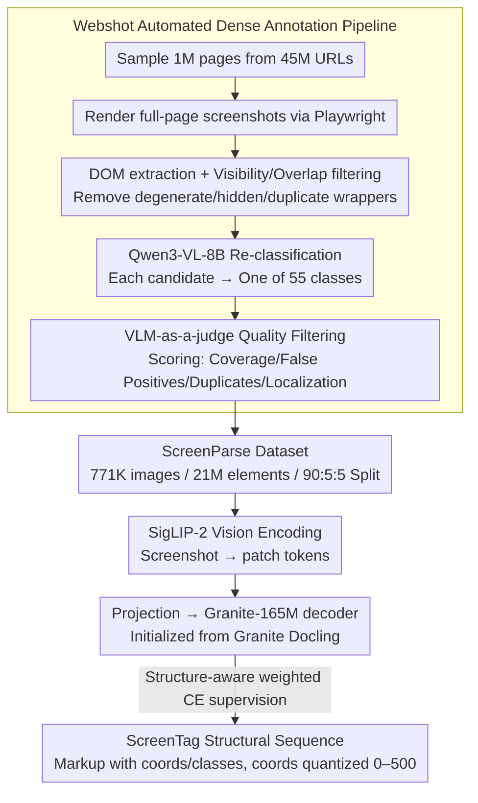

# ScreenParse: Moving Beyond Sparse Grounding with Complete Screen Parsing Supervision

**Conference**: ICML 2026  
**arXiv**: [2602.14276](https://arxiv.org/abs/2602.14276)  
**Code**: https://saidgurbuz.github.io/screenparse/  
**Area**: Multimodal VLM / GUI Agent / Datasets & Foundation Models  
**Keywords**: Screen Parsing, Computer-Use Agent, UI grounding, Compact VLM, Structure-aware loss

## TL;DR
Addressing the issue of "sparse grounding" annotations in GUI agents that lose full-screen structural information, this paper constructs a dense screen parsing dataset, ScreenParse (771K screenshots / 21M elements / 55 classes), via a fully automated Webshot pipeline. It trains ScreenVLM, a model with only 316M parameters, to parse full screens into ScreenTag structural sequences, outperforming 8B-tier foundation VLMs on dense parsing and sparse grounding benchmarks while reducing latency to $\sim 1/4$.

## Background & Motivation

**Background**: The core bottleneck for computer-use agents (CUA) is grounding—for an agent to correctly click or input, it must first identify what elements are on the screen, where they are, and what their text content is. Current mainstream CUA training datasets such as SeeClick, ScreenSpot, and Mind2Web use "action-driven" annotations: each step only labels the specific UI element being clicked, leaving all other elements on the screen unlabeled.

**Limitations of Prior Work**: Sparse annotations allow models to learn shortcuts from "instructions to a single element," leaving the overall screen structure implicit; this causes models to fail when encountering new layouts or applications. Meanwhile, relatively complete datasets like GroundCUA are small in scale (55k) and have few categories (8 classes). Conversely, foundation VLMs (Qwen3-VL-8B, InternVL3), while capable of zero-shot element extraction, are too large for edge device deployment.

**Key Challenge**: The goal is "full-screen dense structural understanding," but manual dense annotation is extremely expensive. Using DOM directly as ground truth is noisy (containing many hidden, duplicate, or invisible wrappers). Simultaneously, the model must be "small enough for edge devices." These three objectives constrain each other.

**Goal**: (1) Automatically construct dense UI annotations with high coverage and low noise; (2) Design a lightweight VLM architecture and sequence representation capable of consuming this dense supervision; (3) Ensure that "dense supervision" is transferable to external grounding tasks and existing VLMs.

**Key Insight**: The authors bet on a "structural inductive bias" often ignored by predecessors—treating the full screen as a structured document. Drawing on mature ideas from document-to-markup conversion (DocTags, OTSL), they compress the UI screen into a set of tag sequences containing coordinates and categories.

**Core Idea**: Use Playwright rendering + DOM extraction + VLM refinement to transform tens of thousands of web pages into dense screen supervision for 21M elements. Then, use a markup-style sequence (ScreenTag) and structure-aware weighted CE to enable a small VLM to learn to parse the full screen into structured output.

## Method

### Overall Architecture
The paper is divided into two parts: the **Webshot Pipeline** on the data side and **ScreenVLM** on the model side. Webshot samples 1M pages from 45M URLs → renders full-page screenshots via Playwright → extracts DOM trees and filters by visibility/overlap → uses Qwen3-VL-8B to classify each candidate element into one of 55 classes → uses VLM-as-a-judge to assign quality scores to the full page to remove low-quality samples → produces 771K images / 21M elements, split 90/5/5. On the model side, ScreenVLM uses SigLIP-2 as the vision backbone to encode image patch tokens. After projection, these are sent to a 165M Granite autoregressive decoder (initialized from the Granite Docling document-to-markup model), which outputs an XML-like ScreenTag sequence. Each element follows the format `<tag> <x1> <y1> <x2> <y2> [text] [children] </tag>`, with coordinates normalized and quantized to a 0–500 grid.

### Key Designs

**1. Webshot Automated Dense Annotation Pipeline: Approaching "Complete + Clean" labels with zero human labor**

The dilemma of dense annotation is that using DOM directly as ground truth provides wide coverage but is chaotic (including many hidden or duplicate boxes), while relying solely on VLM annotation is too expensive. Webshot combines the strengths of both via a cascade: first, use Playwright rendering + DOM extraction to obtain candidate boxes, actively rejecting degenerate, invisible, or near-duplicate nested wrappers while preserving the hierarchy of semantic containers like navbars, cards, and modals. Second, have Qwen3-VL-8B examine the "full image + element crop + attributes" to re-classify each candidate into one of 55 categories, correcting noisy DOM labels. Finally, use VLM-as-a-judge to score the full page based on coverage, false positives, duplicates, and localization, discarding any pages below a threshold.

**2. ScreenTag: Compressing a screenshot into an autoregressively generated structural sequence**

To enable a small VLM to output full-screen structures, a representation is needed that is compact, unambiguous, and compatible with token-by-token decoder generation. ScreenTag writes each element as a nested `<tag> <x1> <y1> <x2> <y2> [text] [children] </tag>`, with normalized coordinates quantized into discrete tokens on a 0–500 grid. This is much shorter than JSON and unambiguous for parsing. Crucially, it reuses the inductive bias of document-to-markup models—the ScreenVLM decoder is initialized from models like Granite Docling, which are pre-trained to be friendly to "markup with location tags." Since UI screens are essentially "structured rectangles + text," the transfer is nearly seamless.

**3. Structure-aware Weighted Cross-Entropy: Preventing long OCR text from drowning out structural tokens**

The tokens in a ScreenTag sequence are not equally important: a misplaced coordinate or an incorrect tag category invalidates the entire element, whereas a single incorrect text character is negligible. However, OCR text occupies the bulk of the sequence. Standard CE would push the model toward "reading text without knowing element locations." This paper assigns different weights to each token type:

$$\mathcal{L}(\theta) = -\sum_{t=1}^{T} w(y_t)\log p_\theta(y_t \mid y_{<t}, I)$$

where tag tokens ($y_t \in \mathcal{V}_{\text{tag}}$) have weight $\lambda_{\text{tag}}$, coordinate tokens ($y_t \in \mathcal{V}_{\text{loc}}$) have weight $\lambda_{\text{loc}}$, and others are 1. This aligns the optimization objective directly with structural fidelity.

### Loss & Training
ScreenVLM is fine-tuned on the ScreenParse training set for 287,500 steps using 16 H100 GPUs (2 nodes × 8 cards), with an effective batch size of 64 and a sequence length truncated at 8192 tokens. Grouped learning rates are used: $2.12\times 10^{-2}$ for the multimodal projection layer and $2\times 10^{-3}$ for the vision/language backbones.

## Key Experimental Results

### Main Results
Dense parsing comparison on the ScreenParse test set (PageIoU measures pixel-level coverage, Label PageIoU requires category matching).

| Model | Size | Page IoU | Label PageIoU | mAP@50 |
|-------|------|----------|---------------|--------|
| Qwen3-VL-8B-Instruct | 8B | 0.294 | – | – |
| InternVL3-2B | 2B | 0.111 | 0.030 | 0.000 |
| InternVL3-2B + ScreenParse | 2B | 0.509 (+0.398) | 0.174 | 0.072 |
| Qwen3-VL-2B + ScreenParse | 2B | 0.585 | 0.166 | 0.152 |
| **ScreenVLM (Ours)** | **316M** | **0.606** | **0.197** | **0.303** |
| RT-DETRv2 + ScreenParse | 43M | 0.600 | 0.172 | 0.362 |

### Ablation Study
Structure-aware weighted loss vs. standard CE.

| Setting | ScreenParse PageIoU | GroundCUA PageIoU | ScreenSpot-PC Recall |
|------|---------------------|---------------------|----------------------|
| Full (StructureAware) | 0.606 | 0.251 | 0.222 |
| w/ CE only | 0.592 | 0.226 | 0.129 |
| Gain | +2.4% | +11.1% | **+72.1%** |

Efficiency (H100 + vLLM, average of 128 samples):

| Model | Size (MB) | Latency (ms) | Throughput (s$^{-1}$) |
|-------|-----------|--------------|----------------------|
| Qwen3-VL-2B | 4300 | $1289.1 \pm 251.7$ | 0.78 |
| InternVL3-2B | 4178 | $1267.3 \pm 187.9$ | 0.79 |
| **ScreenVLM** | **632** | $\mathbf{276.4 \pm 139.0}$ | **3.62** |

### Key Findings
- Structure-aware loss provides the greatest gains in out-of-distribution and few-element grounding scenarios (ScreenSpot-PC Recall +72.1%), indicating it effectively resists the dilution of structural tokens by OCR text.
- ScreenParse supervision is "model-agnostic": fine-tuning different families like InternVL3, Qwen3-VL, and even YOLO/RT-DETR yields gains. This suggests dense screen supervision in UI understanding is analogous to ImageNet in computer vision.
- ScreenVLM achieves high PixCov (>0.83) on ScreenSpot-PC/Mobile but low Recall, suggesting it learns to "cover critical pixels" but has not yet mastered outputting very tight element-level bounding boxes—a distribution bias from web-only training.

## Highlights & Insights
- This is a critical step in shifting "computer-use data" from "action-driven sparse annotation" to "dense screen supervision." While GUI research has focused on grounding benchmarks, this work pivots to focus on the supervision itself.
- ScreenTag "documentizes" the GUI screen, reusing mature inductive biases from document parsing, which allows a 316M model to learn structure effectively from the start.
- Using a VLM as both a "label refiner" and a "judge," alongside DOM candidate extraction, creates an automated iterative process to bootstrap weak labels into strong ones.

## Limitations & Future Work
- Data is entirely sourced from the web. PC and Mobile UI conventions differ from the web; experiments show Recall on ScreenSpot-PC/Mobile is significantly lower than on Web.
- VLM-judge thresholds require manual calibration, and "high quality" judgments are still influenced by the backbone's biases.
- ScreenTag uses nested sequences with a maximum length of 8192 tokens, which may still be truncated on ultra-large screens (e.g., 4K long screenshots).
- The study has not yet integrated ScreenVLM into an end-to-end agent to demonstrate the downstream benefits of "dense parsing to action."

## Related Work & Insights
- **vs SeeClick / ScreenSpot**: These are sparse grounding datasets (one image, one instruction, one element). Ours pursues "full-screen dense" parsing and proves it benefits the former.
- **vs GroundCUA**: GroundCUA also uses dense annotation but is limited to 55k samples and 8 classes; ScreenParse is significantly larger at 771k and 55 classes.
- **vs OmniParser**: OmniParser is a detector-style YOLO parser with strong localization but lacks language-aligned structured output; ScreenVLM outputs markup structure directly consumable by LLM agents.
- **vs Granite Docling / SmolDocling**: These are document-to-markup VLMs; this work perform UI domain transfer, validating that "structured-markup pre-training" is a strong starting point for UI perception.

## Rating
- Novelty: ⭐⭐⭐⭐ Solidifies the "sparse to dense" paradigm in GUI data, though individual techniques are combinations of existing components.
- Experimental Thoroughness: ⭐⭐⭐⭐⭐ Covers multiple VLM families/detectors, 3 benchmarks, and comprehensive loss/efficiency ablations.
- Writing Quality: ⭐⭐⭐⭐ Clear motivation and supporting figures, though some key designs are in the appendix.
- Value: ⭐⭐⭐⭐⭐ Open-sourcing both the dataset and small model represents an infrastructure-level contribution to the GUI agent community.

<!-- RELATED:START -->

## Related Papers

- [\[CVPR 2026\] Beyond Weak Supervision: MLLMs-Guided Graded Knowledge Distillation for Unsupervised Camouflaged Object Detection](../../CVPR2026/multimodal_vlm/beyond_weak_supervision_mllms-guided_graded_knowledge_distillation_for_unsupervi.md)
- [\[CVPR 2026\] Sparse-LaViDa: Sparse Multimodal Discrete Diffusion Language Models](../../CVPR2026/multimodal_vlm/sparse-lavida_sparse_multimodal_discrete_diffusion_language_models.md)
- [\[ICML 2026\] Learning GUI Grounding with Spatial Reasoning from Visual Feedback](learning_gui_grounding_with_spatial_reasoning_from_visual_feedback.md)
- [\[CVPR 2026\] Efficient Document Parsing via Parallel Token Prediction](../../CVPR2026/multimodal_vlm/efficient_document_parsing_via_parallel_token_prediction.md)
- [\[ACL 2026\] What's Missing in Screen-to-Action? Towards a UI-in-the-Loop Paradigm for Multimodal GUI Reasoning](../../ACL2026/multimodal_vlm/what39s_missing_in_screen-to-action_towards_a_ui-in-the-loop_paradigm_for_multim.md)

<!-- RELATED:END -->
