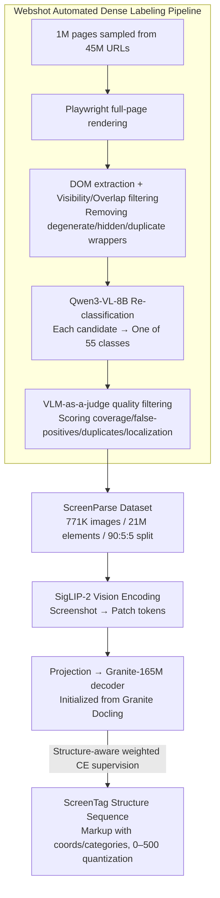

# ScreenParse: Moving Beyond Sparse Grounding with Complete Screen Parsing Supervision

**Conference**: ICML 2026  
**arXiv**: [2602.14276](https://arxiv.org/abs/2602.14276)  
**Code**: https://saidgurbuz.github.io/screenparse/  
**Area**: Multimodal VLM / GUI Agent / Datasets & Foundation Models  
**Keywords**: Screen Parsing, Computer-Use Agent, UI grounding, Compact VLM, Structure-aware loss

## TL;DR
To address the loss of full-screen structure in "sparse grounding" labels commonly used by GUI agents, this paper constructs ScreenParse, a dense screen parsing dataset with 771K screenshots, 21M elements, and 55 classes via an automated Webshot pipeline. The authors further train ScreenVLM (316M parameters) to parse entire screens into ScreenTag structural sequences, outperforming 8B-scale foundation VLMs on dense parsing and sparse grounding benchmarks while reducing latency to $\sim 1/4$.

## Background & Motivation

**Background**: The core bottleneck for computer-use agents (CUA) is grounding—to click or type correctly, an agent must first identify the elements, their locations, and their text. Current mainstream CUA training datasets like SeeClick, ScreenSpot, and Mind2Web use "action-driven" labeling: only the clicked UI element is labeled for each step, leaving all other on-screen elements blank.

**Limitations of Prior Work**: Sparse labels allow models to learn "instruction-to-single-element" shortcuts, keeping the overall screen structure implicit and causing failures on new layouts or applications. Meanwhile, datasets with relatively complete labeling, such as GroundCUA, are small (55k) and have few categories (8 classes). Conversely, foundation VLMs (Qwen3-VL-8B, InternVL3) can perform zero-shot element extraction but are too large for edge deployment.

**Key Challenge**: The goal is "full-screen dense structural understanding," but manual dense labeling is extremely expensive; using raw DOM as ground truth is noisy (containing many hidden/duplicate/invisible wrappers); and the model must be "small enough for edge devices." These three objectives conflict with each other.

**Goal**: (1) Automatically construct high-coverage, low-noise dense UI annotations; (2) Design a lightweight VLM architecture and sequence representation capable of consuming this dense supervision; (3) Ensure "dense supervision" is transferable to external grounding tasks and existing VLMs.

**Key Insight**: The authors leverage a previously overlooked "structural inductive bias"—treating the entire screen as a structured document. Borrowing from mature document-to-markup approaches (DocTags, OTSL), they compress the UI screen into a sequence of tags containing coordinates and categories.

**Core Idea**: Use Playwright rendering + DOM extraction + VLM refinement to transform millions of webpages into dense screen supervision for 21M elements. A markup-style sequence called ScreenTag combined with structure-aware weighted cross-entropy (CE) is used to enable a small VLM to parse full screens into structured outputs.

## Method

### Overall Architecture
The paper is divided into two parts: the **Webshot pipeline** (data) and **ScreenVLM** (model). Webshot samples 1M pages from 45M URLs -> renders full-page screenshots via Playwright -> extracts the DOM tree and filters by visibility/overlap -> re-classifies each candidate into one of 55 classes using Qwen3-VL-8B -> uses VLM-as-a-judge to filter low-quality samples based on quality scores -> produces 771K images / 21M elements split 90/5/5. On the model side, ScreenVLM uses SigLIP-2 as the vision backbone to encode image patch tokens, which are projected into a 165M Granite autoregressive decoder (initialized from the Granite Docling document-to-markup model). It outputs an XML-like ScreenTag sequence where each element follows the format `<tag> <x1> <y1> <x2> <y2> [text] [children] </tag>`, with coordinates normalized and quantized to a 0–500 grid.

### Key Designs

**1. Webshot Automated Dense Labeling Pipeline: Near-human quality at zero manual cost**

The dilemma of dense labeling is that raw DOM as ground truth provides wide coverage but is noisy, while pure VLM labeling is too expensive. Webshot combines their strengths: first, Playwright rendering + DOM extraction provides candidate boxes while actively rejecting degenerate, invisible, or near-duplicate nested wrappers, while preserving the hierarchy of semantic containers like nav-bars, cards, and modals. Next, Qwen3-VL-8B processes the "full image + element crop + attributes" to re-classify each candidate into 55 classes, correcting dirty labels from the DOM. Finally, VLM-as-a-judge scores the page based on coverage, false positives, duplicates, and localization, discarding entire pages below a threshold.

**2. ScreenTag: Compressing screenshots into autoregressive structural sequences**

To enable a small VLM to output full-screen structures, the representation must be compact, unambiguous, and suitable for token-by-token generation. ScreenTag writes each element as nested `<tag> <x1> <y1> <x2> <y2> [text] [children] </tag>`, where coordinates are discrete tokens quantized to a 0–500 grid. This is shorter than JSON and unambiguous for parsing. Crucially, it reuses inductive biases from document-to-markup; ScreenVLM’s decoder is initialized from Granite Docling, which is already optimized for "markup with positional tags."

**3. Structure-aware Weighted Cross-Entropy: Preventing OCR from drowning structure tokens**

Token importance in ScreenTag sequences is unequal: a misaligned coordinate or incorrect tag silences the entire element, whereas a wrong character in text is negligible. Since OCR text occupies the bulk of the sequence, standard CE tends to produce models that "read text but don't know where elements are." Ours assigns different weights to different token types:

$$\mathcal{L}(\theta) = -\sum_{t=1}^{T} w(y_t)\log p_\theta(y_t \mid y_{<t}, I)$$

where tag tokens ($y_t \in \mathcal{V}_{\text{tag}}$) have weight $\lambda_{\text{tag}}$, location tokens ($y_t \in \mathcal{V}_{\text{loc}}$) have weight $\lambda_{\text{loc}}$, and others are 1. This aligns the optimization directly with structural fidelity.

### Loss & Training
ScreenVLM is fine-tuned on the ScreenParse training set for 287,500 steps using 16 H100s (2 nodes × 8 GPUs), with an effective batch size of 64 and a sequence length capped at 8192 tokens. Grouped learning rates are used: $2.12\times 10^{-2}$ for the multimodal projection layer and $2\times 10^{-3}$ for the vision/language backbones.

## Key Experimental Results

### Main Results
Comparison of dense parsing on the ScreenParse test set (PageIoU measures pixel-level coverage; Label PageIoU requires matching categories).

| Model | Size | Page IoU | Label PageIoU | mAP@50 |
|-------|------|----------|---------------|--------|
| Qwen3-VL-8B-Instruct | 8B | 0.294 | – | – |
| InternVL3-2B | 2B | 0.111 | 0.030 | 0.000 |
| InternVL3-2B + ScreenParse | 2B | 0.509 (+0.398) | 0.174 | 0.072 |
| Qwen3-VL-2B + ScreenParse | 2B | 0.585 | 0.166 | 0.152 |
| **ScreenVLM (Ours)** | **316M** | **0.606** | **0.197** | **0.303** |
| RT-DETRv2 + ScreenParse | 43M | 0.600 | 0.172 | 0.362 |

ScreenVLM, with 1/25 of the parameters, doubles the PageIoU of Qwen3-VL-8B. Fine-tuning InternVL3-2B and Qwen3-VL-2B on ScreenParse also yields 0.36–0.40 PageIoU gains, proving the supervision itself is a transferable asset.

### Ablation Study
Structure-aware weighted loss vs. standard CE.

| Setup | ScreenParse PageIoU | GroundCUA PageIoU | ScreenSpot-PC Recall |
|------|---------------------|---------------------|----------------------|
| Full (StructureAware) | 0.606 | 0.251 | 0.222 |
| w/ CE only | 0.592 | 0.226 | 0.129 |
| Gain | +2.4% | +11.1% | **+72.1%** |

Efficiency (H100 + vLLM, average of 128 samples):

| Model | Size (MB) | Latency (ms) | Throughput (s$^{-1}$) |
|-------|-----------|--------------|----------------------|
| Qwen3-VL-2B | 4300 | $1289.1 \pm 251.7$ | 0.78 |
| InternVL3-2B | 4178 | $1267.3 \pm 187.9$ | 0.79 |
| **ScreenVLM** | **632** | $\mathbf{276.4 \pm 139.0}$ | **3.62** |

### Key Findings
- Structure-aware loss provides the largest gains in "out-of-distribution" and "few-element grounding" scenarios (ScreenSpot-PC Recall +72.1%), as it prevents OCR text from diluting structure tokens.
- ScreenParse supervision is "model-agnostic": fine-tuning different families like InternVL3, Qwen3-VL, and even YOLO/RT-DETR yields gains. This suggests dense screen supervision in UI understanding is analogous to ImageNet in vision.
- ScreenVLM achieves high PixCov (>0.83) on ScreenSpot-PC/Mobile but lower Recall, indicating it covers key pixels but has yet to learn tight, element-level bounding boxes—a distribution bias from web-only training.

## Highlights & Insights
- This is a critical step in shifting CUA data from "action-driven sparse labeling" to "dense screen supervision." While GUI research often chases grounding benchmarks, this work restarts from the supervision layer.
- By "documentizing" the GUI screen, ScreenTag reuses mature inductive biases from document parsing, allowing a 316M model to learn structure effectively. This "cross-domain markup representation transfer" provides a strong blueprint for tasks like circuit diagrams or maps.
- Using a VLM as both a "label refiner" and a "judge" alongside DOM-extracted candidates allows for iteratively bootstrapping weak labels into strong ones.

## Limitations & Future Work
- Data is entirely web-based. PC and Mobile UI conventions differ; experimental results on ScreenSpot-PC/Mobile show significantly lower Recall than on Web. Support for desktop/mobile rendering is required.
- The VLM-judge threshold requires manual calibration, and "high quality" judgment remains influenced by the backbone's biases.
- ScreenTag is a nested sequence with a current max length of 8192 tokens, which may still truncate for ultra-large (4K long) screenshots.
- The paper does not integrate ScreenVLM into an end-to-end agent to demonstrate downstream gains from "dense parsing → action."

## Related Work & Insights
- **vs SeeClick / ScreenSpot**: These use sparse grounding (one image, one instruction, one element). Ours pursues "full-screen dense" parsing and proves it transfers positively to the former.
- **vs GroundCUA**: GroundCUA is also dense but limited to 55k samples and 8 classes; ScreenParse is an order of magnitude larger (771k samples, 55 classes).
- **vs OmniParser**: OmniParser is a detector-style YOLO parser with strong localization but lacks language-aligned structural output; ScreenVLM outputs a markup structure directly consumable by LLM agents.
- **vs Granite Docling**: These are document-to-markup VLMs; this work performs UI-domain transfer, validating "structured-markup pre-training" as a good starting point for UI perception.

## Rating
- Novelty: ⭐⭐⭐⭐ Solidifies the "sparse to dense" paradigm in GUI data, though individual techniques are combinations of existing components.
- Experimental Thoroughness: ⭐⭐⭐⭐⭐ Covers multiple VLM/detector families, 3 benchmarks, and extensive loss/efficiency ablations.
- Writing Quality: ⭐⭐⭐⭐ Clear motivation and good visualization; some key designs are in the appendix.
- Value: ⭐⭐⭐⭐⭐ The simultaneous open-sourcing of the dataset and small model is an infrastructure-level contribution to the GUI agent community.

<!-- RELATED:START -->

## Related Papers

- [\[CVPR 2026\] Learning complete and explainable visual representations from itemized text supervision](../../CVPR2026/multimodal_vlm/learning_complete_and_explainable_visual_representations_from_itemized_text_supe.md)
- [\[CVPR 2026\] Beyond Weak Supervision: MLLMs-Guided Graded Knowledge Distillation for Unsupervised Camouflaged Object Detection](../../CVPR2026/multimodal_vlm/beyond_weak_supervision_mllms-guided_graded_knowledge_distillation_for_unsupervi.md)
- [\[CVPR 2026\] Sparse-LaViDa: Sparse Multimodal Discrete Diffusion Language Models](../../CVPR2026/multimodal_vlm/sparse-lavida_sparse_multimodal_discrete_diffusion_language_models.md)
- [\[ICLR 2026\] SigLIP-HD by Fine-to-Coarse Supervision](../../ICLR2026/multimodal_vlm/siglip-hd_by_fine-to-coarse_supervision.md)
- [\[ICML 2026\] Beyond VLM-Based Rewards: Diffusion-Native Latent Reward Modeling](beyond_vlm-based_rewards_diffusion-native_latent_reward_modeling.md)

<!-- RELATED:END -->
