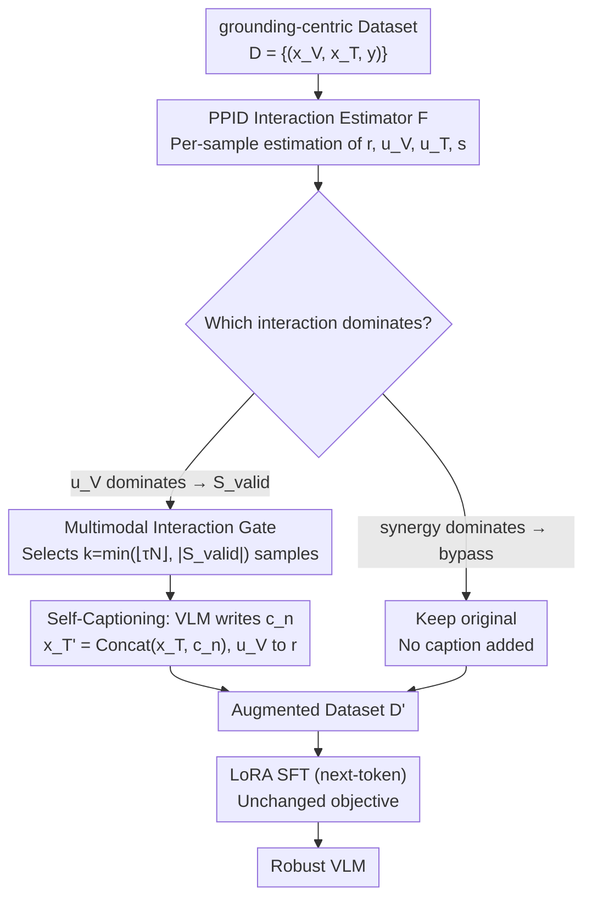

# Self-Captioning Multimodal Interaction Tuning: Amplifying Exploitable Redundancies for Robust Vision Language Models

**Conference**: ICML 2026  
**arXiv**: [2605.08145](https://arxiv.org/abs/2605.08145)  
**Code**: None  
**Area**: Multimodal VLM  
**Keywords**: Modality Redundancy, PID Decomposition, Self-Captioning, Robust Instruction Tuning, Modality Contamination

## TL;DR
This paper quantifies vision-text modality interactions using Pointwise Partial Information Decomposition and proposes the Multimodal Interaction Gate. It automatically selects samples where "unique visual information dominates" and allows the VLM to self-generate captions to populate the text side. This transforms unique visual signals into redundant shared signals, resulting in a 38.3% reduction in visual hallucinations and a 16.8% improvement in consistency for VLMs under blurred or contaminated inputs.

## Background & Motivation

**Background**: Current mainstream VLM instruction tuning (e.g., LLaVA, SmolVLM series) deliberately reduces text-image redundancy to concentrate task-relevant information solely on the image. This forces the model to perform "visual grounding" and suppress pure-text shortcuts.

**Limitations of Prior Work**: This excessive grounding strategy has counter-effects. Once the image is contaminated by noise or occlusion, or the text itself is ambiguous, the model lacks shared information to "compensate" across modalities. Consequently, hallucinations and inconsistent outputs are immediately exposed. Existing robustness solutions (e.g., objective functions based on redundancy by Wörtwein/Nguyen et al.) are only effective when "redundancy already exists in the data" and fail on grounding-centric datasets.

**Key Challenge**: Visual grounding and modality robustness are contradictory at the data level—reducing redundancy benefits grounding, while increasing redundancy benefits robustness. Currently, dataset curation relies entirely on intuition, lacking a quantifiable knob for redundancy adjustment.

**Goal**: (1) Propose a quantitative framework using PID to decompose modality interactions into redundant $R$, unique $U_V, U_T$, and synergistic $S$. (2) Design a systematic data augmentation algorithm to explicitly increase exploitable redundancy $R$ while ensuring the structure of synergy-dominant samples is not compromised.

**Key Insight**: The authors observe that grounding-centric datasets generally present a distribution where "visual unique $U_V$ dominates." By "translating" this exclusive visual information into text, it can be directly converted into a redundant signal while keeping the image side untouched and $I(X_V; Y)$ invariant.

**Core Idea**: Allow the VLM to "write captions" for its own selected samples, moving unique visual information to the text side to convert $U_V$ into $R$, thereby systematically improving modality redundancy without modifying the images.

## Method

### Overall Architecture
Input: A grounding-centric instruction dataset $\mathcal{D}=\{(x_V, x_T, y)\}$. The workflow consists of three steps: (1) Use the PPID estimator $\mathcal{F}$ to estimate four interaction metrics $r, u_V, u_T, s$ for each sample. (2) The Multimodal Interaction Gate selects a subset $S_{valid}$ where $u_V$ dominates based on a threshold $\tau$. These samples are sent to the VLM itself or a smaller caption model to generate descriptions $c_n$, which are concatenated with the original text as $x_T' = \text{Concat}(x_T, c_n)$, while synergy-dominant samples are explicitly bypassed. (3) Fine-tune the VLM (SmolVLM, LLaVA-OneVision-1.5) using the augmented $\mathcal{D}'$ via LoRA SFT with no changes to the training objective.

### Key Designs

**1. PPID-based Sample-level Interaction Estimator: Quantifying redundancy from an intuitive concept to a per-sample estimable scalar**

To "move unique visual information to the text side on demand," it is necessary to determine sample-by-sample which entries are dominated by $U_V$. This work utilizes Pointwise Partial Information Decomposition to approximate the four interaction quantities $r, u_V, u_T, s$ in the embedding space. For each sample, the point-wise specificity $i^+(x_m;y)=h(x_m)$ and ambiguity $i^-(x_m;y)=h(x_m|y)$ are calculated. Redundant specificity is defined as the minimum across modalities $r^+=\min_m i^+(x_m;y)$, and redundant ambiguity as $r^-=\min_m i^-(x_m;y)$, leading to $r=r^+-r^-$. Then, $u_V, u_T$ are derived from $i(x_m;y)=r+u_m$, and the synergistic component $s$ is obtained by subtracting these from the total multimodal information (entropy is estimated via a differentiable KNIFE Gaussian mixture, and the classifier is a 3-layer MLP). Sample-level estimation is preferred over global estimation because precisely identifying "which samples can be safely converted" allows the Gate to avoid harming synergy samples while correctly performing redundancy conversion. This transforms modality interaction from a "dataset-level label" into a "per-sample signal."

**2. Multimodal Interaction Gate: Selecting convertible samples, controlling injection ratios, and explicitly bypassing synergy samples**

With per-sample interaction metrics, the Gate decides "to whom captions should be added." First, the valid set is defined as $S_{valid}=\{n\mid u_{V,n}=\max(r_n, u_{V,n}, u_{T,n}, s_n)\}$, meaning a sample is eligible only if unique visual information $u_V$ is its primary interaction. Then, based on a global ratio $\tau$, $k=\min(\lfloor\tau N\rfloor, |S_{valid}|)$ samples are selected for the captioner to generate $c_n$ for text concatenation. A critical detail is that samples dominated by synergy (e.g., UR-FUNNY) are explicitly bypassed. Experiments confirm that forcibly adding captions to such samples causes $U_T$ to spike by +750%, replacing precious synergy with unique-text noise; thus, "refusing to convert certain samples" is an intentional design choice. The threshold $\tau$ serves as a "redundancy intensity" knob that corresponds monotonically to downstream robustness, providing a reproducible protocol for data curation instead of relying on trial-and-error ratios.

**3. Self-Captioning SFT Workflow: Using the VLM as its own captioner for closed-loop augmentation without external knowledge**

The final step involves passing selected samples to a captioner to generate descriptions, injecting them into the text side, and performing SFT. The authors intentionally use the VLM itself (or a smaller SmolVLM-2B) as the captioner rather than an external large model. This avoids confounding effects from external model knowledge and ensures that "redundancy $R$" is the sole independent variable in the experiment. Captions are generated for 25% or 50% of Cauldron samples and injected into the text before performing standard next-token SFT via LoRA. Caption generation is decoupled from training, making the cost amortizable. Even a 2B captioner is shown to be sufficient, increasing $R$ by 243% and decreasing $U_V$ by 43%, as caption errors are averaged out as the injection ratio increases—fitting the monotonic relationship observed across five model sizes from 256M to 8B.

### Loss & Training
The training loss is standard LoRA SFT next-token prediction with no new objectives; all robustness gains stem from the $R$ injection at the data level. During captioning, temperature is set to 0 and length is restricted to avoid irrelevant drift. Task-specific settings fully utilize the MI Gate, while open-ended general settings utilize a weakened version that randomly selects 25%/50% of samples for captioning since $y$ cannot be defined.

## Key Experimental Results

### Main Results

| Model Family | $\tau$ | $\Delta Acc \uparrow$ | $\Delta VI \downarrow$ | $\Delta LI$ | $\Delta Consist. \uparrow$ |
|--------------|--------|------------------------|--------------------------|-------------|------------------------------|
| SmolVLM (256M/500M/2B) | 25% | +2.7% | -23.6% | +9.5% | +8.5% |
| SmolVLM (256M/500M/2B) | 50% | +4.0% | **-38.3%** | +15.2% | **+16.8%** |
| LLaVA-OneVision (4B/8B) | 25% | +2.4% | -34.4% | +2.9% | +6.2% |
| LLaVA-OneVision (4B/8B) | 50% | +2.5% | -6.5% | -6.8% | +5.5% |

### Ablation Study

| Configuration | Change in $R$ | Change in $U_V$ | $U_T$ | Description |
|---------------|---------------|-----------------|-------|-------------|
| Baseline (Hateful Memes train) | $0.0553$ | $0.3465$ | $-0.0125$ | Original data |
| + Random text concat | +23% | -2% | $0$ | Proves adding text is insufficient without semantics |
| + SmolVLM-2B caption | **+243%** | **-43%** | $0$ | Smaller captioner is sufficient |
| + Qwen2.5-32B caption | **+319%** | **-51%** | $0$ | Larger captioner provides limited marginal gains |
| Synergy-dominated UR-FUNNY + caption | +0% | +0% | **+750%** | Failure case, validating Hypothesis 5 |

### Key Findings
- Larger $\tau$ (higher ratio of injected captions) correlates with higher performance stability $\Delta P$ under modality contamination. This monotonic relationship holds consistently across 5 sizes of SmolVLM/LLaVA (256M $\rightarrow$ 8B), proving that noise from smaller captioners is averaged out.
- There is a "trade-off" in redundancy enhancement: as visual hallucinations (VI) decrease, language-induced (LI) and mixed errors rise slightly because the model utilizes the text channel more frequently, validating Hypothesis 1.
- On general benchmarks (MMMU, MMStar, MathVista, TextVQA), redundancy enhancement often brings unexpected "positive side effects." For example, the 8B model's MMMU score rose from 41.4 to 49.9, which authors attribute to robust multimodal fusion also benefiting general grounding tasks.

## Highlights & Insights
- Utilizing PID's redundant specificity/ambiguity transforms "redundancy" from an intuitive concept into a sample-level estimable scalar, providing the first quantifiable target signal for data augmentation. This estimator is decoupled from the downstream model and can be applied to any pre-trained multimodal backbone.
- The MI Gate provides an elegant "single knob" ($\tau$) to slide continuously between robustness and grounding, offering a reproducible protocol for future dataset curation instead of arbitrary ratio tuning.
- The Synergy-bypass detail is critical. By validating "no captioning" as a design choice with UR-FUNNY, the authors show that "explicitly refusing to convert certain samples" can be transferred to any PID-driven augmentation method to avoid the "more-is-worse" pitfall.

## Limitations & Future Work
- The estimator relies on trained auxiliary classifiers and entropy estimators. In open-ended generation tasks (lacking discrete $y$), it degrades to "random captioning," losing the Gate's selection capability and decreasing consistency (e.g., $\Delta LI$ becomes positive for the 4B model at $\tau=50\%$).
- Analysis is limited to vision+text modalities and the image $\rightarrow$ text conversion direction. While proof-of-concept for reverse directions (text $\rightarrow$ image via diffusion) and other modalities (audio/video) are provided, costs and error control are not systematically quantified.
- The upper bound of caption quality determines the upper bound of $r$. For tasks involving fine-grained structures, spatial relations, or OCR, small captioners likely lose critical unique information, potentially causing $r$ and $u_V$ to increase simultaneously—requiring a captioner capability detector.

## Related Work & Insights
- **vs Wörtwein et al. 2024 / Nguyen et al. 2025**: These works integrate redundancy into training objective functions, which requires pre-existing redundancy in data. Ours actively creates redundancy from the data side, making them complementary.
- **vs LLaVA-1.5 / Cauldron-style grounding data**: These works deliberately reduce redundancy to enhance grounding. Ours does the opposite and proves that sacrificing some grounding for robustness is worthwhile in modality contamination scenarios.
- **vs Mixture-of-Interaction Experts (Xin et al. 2025)**: They use PID to guide expert division of labor ("using" interactions), while ours "modifies" interactions, providing a different algorithmic path.
- **vs HallusionBench / GQA-corruption protocols**: This paper is not a new benchmark but rather links existing robustness protocols systematically to PID metrics for the first time, providing interpretable information-theoretic indicators for robustness gains.
- **vs Simple caption data expansion**: Randomly adding captions without sample selection (the Random text control) only yields a +23% $R$ increase and introduces negative $U_T$, proving that the "sample selection" of the MI Gate is the true contribution.

## Rating
- Novelty: ⭐⭐⭐⭐⭐ First to apply sample-level PPID to data augmentation and systematically verify the feasibility of "converting unique to redundant."
- Experimental Thoroughness: ⭐⭐⭐⭐ Covered 5 sizes across 2 VLM families, modality contamination, general benchmarks, failure cases, and bi-directional proof-of-concept.
- Writing Quality: ⭐⭐⭐⭐ 5 hypotheses correspond directly to experiments; argument chain is clear; math is dense but figures are intuitive.
- Value: ⭐⭐⭐⭐ Provides a quantifiable dial for multimodal instruction data curation; engineering-ready with low overhead.

<!-- RELATED:START -->

## Related Papers

- [\[AAAI 2026\] Difference Vector Equalization for Robust Fine-tuning of Vision-Language Models](../../AAAI2026/multimodal_vlm/difference_vector_equalization_for_robust_fine-tuning_of_vis.md)
- [\[CVPR 2026\] MM-SeR: Multimodal Self-Refinement for Lightweight Image Captioning](../../CVPR2026/multimodal_vlm/mm-ser_multimodal_self-refinement_for_lightweight_image_captioning.md)
- [\[AAAI 2026\] Leveraging Textual Compositional Reasoning for Robust Change Captioning](../../AAAI2026/multimodal_vlm/leveraging_textual_compositional_reasoning_for_robust_change_captioning.md)
- [\[CVPR 2026\] TRivia: Self-supervised Fine-tuning of Vision-Language Models for Table Recognition](../../CVPR2026/multimodal_vlm/trivia_self-supervised_fine-tuning_of_vision-language_models_for_table_recogniti.md)
- [\[ICML 2026\] CG-MLLM: Captioning and Generating 3D Content via Multi-modal Large Language Models](cg-mllm_captioning_and_generating_3d_content_via_multi-modal_large_language_mode.md)

<!-- RELATED:END -->
