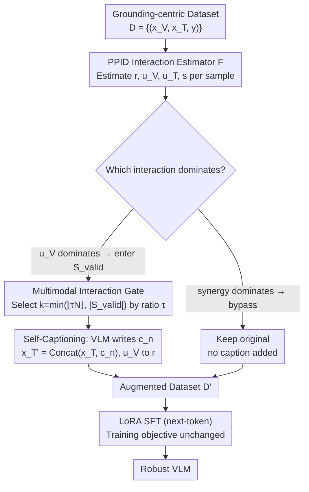

# Self-Captioning Multimodal Interaction Tuning: Amplifying Exploitable Redundancies for Robust Vision Language Models

**Conference**: ICML 2026  
**arXiv**: [2605.08145](https://arxiv.org/abs/2605.08145)  
**Code**: None  
**Area**: Multimodal VLM  
**Keywords**: Modality redundancy, PID decomposition, Self-captioning, Robust instruction tuning, Modality contamination

## TL;DR
This paper quantifies vision-text modality interactions using Pointwise Partial Information Decomposition and proposes a Multimodal Interaction Gate. By automatically selecting samples where "visual-unique information dominates" and letting the VLM generate self-captions to feed back into the text side, the method converts unique visual signals into redundant shared signals. This reduces visual hallucinations by 38.3% and improves consistency by 16.8% under blurred or contaminated inputs.

## Background & Motivation

**Background**: Current mainstream VLM instruction tuning (e.g., LLaVA, SmolVLM series) deliberately reduces text-image redundancy, concentrating task-relevant information solely on the image side to force the model to perform "visual grounding" and suppress text-only shortcuts.

**Limitations of Prior Work**: This excessive grounding strategy has counter-effects. Once images are contaminated by noise/occlusion or the text itself is ambiguous, the model lacks shared information to "mutually support" the modalities, exposing hallucinations and inconsistent outputs. Existing robustness solutions (e.g., objective functions based on redundancy like Wörtwein/Nguyen et al.) are only effective when "redundancy already exists in the data," failing on grounding-centric datasets.

**Key Challenge**: Visual grounding and modality robustness are contradictory at the data level—reducing redundancy benefits grounding, while increasing redundancy benefits robustness. Currently, dataset curation relies on intuition without a quantifiable knob for redundancy adjustment.

**Goal**: (1) Propose a quantification framework using PID to decompose modality interactions into redundant $R$, unique $U_V, U_T$, and synergistic $S$. (2) Design a systematic data augmentation algorithm to explicitly increase exploitable redundancy $R$ while ensuring the structure of synergy-dominated samples is not destroyed.

**Key Insight**: The authors observe that grounding-centric datasets generally exhibit a "visual unique $U_V$ dominated" distribution. Simply "translating" this exclusive visual information into text converts it directly into redundant signals, while the image side remains unchanged and $I(X_V; Y)$ stays constant.

**Core Idea**: Forcing the VLM to "write captions" for samples it selects for itself, moving unique visual information to the text side to convert $U_V$ into $R$, thereby systematically improving modality redundancy without modifying the images.

## Method

### Overall Architecture
Input: A grounding-centric instruction dataset $\mathcal{D}=\{(x_V, x_T, y)\}$. The process consists of three steps: (1) Using a PPID estimator $\mathcal{F}$ to estimate four interaction metrics ($r, u_V, u_T, s$) for each sample; (2) The Multimodal Interaction Gate selects a subset $S_{valid}$ where $u_V$ dominates based on a threshold $\tau$. These samples are sent to the VLM itself or a smaller caption model to generate descriptions $c_n$, which are concatenated with the original text as $x_T' = \text{Concat}(x_T, c_n)$, while synergy-dominated samples are explicitly bypassed; (3) Fine-tuning the VLM (SmolVLM, LLaVA-OneVision-1.5) using the augmented $\mathcal{D}'$ with LoRA SFT, keeping the training objective unchanged.

### Key Designs

**1. PPID-based Per-sample Interaction Estimator: Grounding "Redundancy" from an Intuitive Concept into Estimable Scalars**

To perform "on-demand migration of visual unique information to the text side," it is first necessary to judge per-sample which samples are $U_V$ dominated. This paper uses Pointwise Partial Information Decomposition to approximate $r, u_V, u_T, s$ in the embedding space: for each sample, calculate pointwise specificity $i^+(x_m;y)=h(x_m)$ and ambiguity $i^-(x_m;y)=h(x_m|y)$. Redundant specificity is the minimum of both modalities $r^+=\min_m i^+(x_m;y)$, and redundant ambiguity is $r^-=\min_m i^-(x_m;y)$, thus $r=r^+-r^-$. $u_V$ and $u_T$ are derived from $i(x_m;y)=r+u_m$, and the synergistic amount $s$ is obtained by subtracting the three from the total multimodal information (entropy is estimated differentiably using KNIFE Gaussian Mixture, and the classifier is a 3-layer MLP). Sample-level estimation is required because only by accurately identifying "which samples can be safely converted" can the subsequent Gate avoid damaging synergistic samples while performing correct redundancy conversion—transforming modality interaction from a "dataset-level label" to a "per-sample signal."

**2. Multimodal Interaction Gate: Selecting Convertible Samples, Controlling Injection Ratios, and Explicitly Bypassing Synergistic Samples**

With per-sample interaction metrics, the Gate determines "to whom to add captions." First, define the valid set $S_{valid}=\{n\mid u_{V,n}=\max(r_n,u_{V,n},u_{T,n},s_n)\}$, meaning a sample is valid only when unique visual information $u_V$ is its largest interaction. Then, $k=\min(\lfloor\tau N\rfloor,|S_{valid}|)$ samples are selected according to a global ratio $\tau$ to trigger the captioner. Crucially, samples where synergy dominates (e.g., UR-FUNNY) are explicitly bypassed—experiments confirm that forcing captions on such samples causes $U_T$ to spike +750%, replacing valuable synergy with unique-text noise. Thus, "refusing to convert certain categories" is part of the design. The threshold $\tau$ becomes a "redundancy strength" knob, monotonically corresponding to downstream robustness, providing a repeatable protocol for data curation instead of intuitive ratio tuning.

**3. Self-Captioning SFT Workflow: Letting VLM be its own Captioner for Closed-Loop Augmentation without External Knowledge**

The final step is to let a captioner write descriptions for selected samples and feed them back to the text side for SFT. The authors deliberately use the VLM itself (or a smaller SmolVLM-2B) as the captioner rather than an external large model—this avoids confounding factors from additional model knowledge, ensuring "Redundancy $R$" is the sole independent variable. Before training, captions are generated for 25% or 50% of Cauldron samples and written to the text side, followed by standard next-token SFT with LoRA. Caption generation is decoupled from training, making costs amortizable. Despite concerns about small captioners, experiments show that even a 2B model can increase $R$ by 243% and decrease $U_V$ by 43%, as caption errors are averaged out as the injection ratio increases—small models are sufficient, echoing the monotonic relationship across five sizes from 256M to 8B.

### Loss & Training
The training loss is standard LoRA SFT next-token prediction with no new objectives; all robustness gains stem from $R$ injection on the data side. Temperature is set to 0 and length is restricted during captioning to avoid irrelevant drift. Task-specific settings run the full MI Gate; open-ended general settings fallback to a weakened version that "randomly selects 25%/50% to add captions" due to the inability to define $y$.

## Key Experimental Results

### Main Results

| Model Family | $\tau$ | $\Delta Acc \uparrow$ | $\Delta VI \downarrow$ | $\Delta LI$ | $\Delta Consist. \uparrow$ |
|--------------|--------|------------------------|-------------------------|-------------|----------------------------|
| SmolVLM (256M/500M/2B) | 25% | +2.7% | -23.6% | +9.5% | +8.5% |
| SmolVLM (256M/500M/2B) | 50% | +4.0% | **-38.3%** | +15.2% | **+16.8%** |
| LLaVA-OneVision (4B/8B) | 25% | +2.4% | -34.4% | +2.9% | +6.2% |
| LLaVA-OneVision (4B/8B) | 50% | +2.5% | -6.5% | -6.8% | +5.5% |

### Ablation Study

| Configuration | $\Delta R$ | $\Delta U_V$ | $U_T$ | Description |
|---------------|------------|--------------|-------|-------------|
| Baseline (Hateful Memes train) | $0.0553$ | $0.3465$ | $-0.0125$ | Original data |
| + Random text concat | +23% | -2% | $0$ | Proves text alone isn't enough; needs semantics |
| + SmolVLM-2B caption | **+243%** | **-43%** | $0$ | Small captioner is sufficient |
| + Qwen2.5-32B caption | **+319%** | **-51%** | $0$ | Larger captioner has marginal gains |
| Synergy-dominated UR-FUNNY + caption | +0% | +0% | **+750%** | Failure case, verifying Hypothesis 5 |

### Key Findings
- Larger $\tau$ (higher caption injection ratio) leads to higher performance stability $\Delta P$ under modality contamination. This monotonic relationship holds consistently across five SmolVLM/LLaVA sizes (256M→8B), proving that noise from small captioners is averaged out.
- A "trade-off" exists in redundancy enhancement: as visual hallucinations (VI) decrease, language-induced (LI) and mixed errors rise slightly because the model utilizes the text channel more frequently—verifying Hypothesis 1.
- On general benchmarks (MMMU, MMStar, MathVista, TextVQA), redundancy enhancement often brings unexpected "positive side effects"; for example, the 8B model's MMMU score rose from 41.4 to 49.9, which the authors attribute to more robust multimodal fusion also benefiting general grounding tasks.

## Highlights & Insights
- Using redundant specificity/ambiguity from PID transforms "redundancy" from an intuitive concept into a sample-level estimable scalar, allowing data augmentation to have a quantifiable target signal for the first time. This estimator is decoupled from the downstream model and can be applied to any pre-trained multimodal backbone.
- The MI Gate provides an elegant "single knob": by shifting $\tau$ continuously between robustness and grounding, it provides a repeatable experimental protocol for future dataset curation instead of tuning ratios by feel.
- The Synergy-bypass detail is critical: authors used UR-FUNNY to verify that "not adding captions" is part of the design—the idea of "explicitly refusing to convert certain types of samples" can be transferred to any PID-driven data augmentation method to avoid "the more augmentation, the worse the result."

## Limitations & Future Work
- The estimator relies on trained auxiliary classifiers and entropy estimators; open-ended generation tasks (lacking discrete $y$) fallback to "random captioning," losing the Gate's selection capability and decreasing consistency (e.g., $\Delta LI$ becomes positive at $\tau=50\%$ for the 4B model).
- Currently limited to vision+text modalities and image→text conversion. While proof-of-concepts are provided for the reverse (text→image via diffusion) and audio/video, costs and error control have not been systematically quantified.
- The caption quality ceiling determines the $R$ ceiling. For fine-grained structures, spatial relations, or OCR tasks, 2B captioners likely lose critical unique info, causing $R$ to rise while $U_V$ also rises—requiring a captioner capability detector.

## Related Work & Insights
- **vs Wörtwein et al. 2024 / Nguyen et al. 2025**: They incorporate redundancy into the training loss, but only if the data itself is redundant. This work actively creates redundancy from the data side, making them complementary.
- **vs LLaVA-1.5 / Cauldron-style grounding data**: Such works deliberately reduce redundancy to enhance grounding. This work does the opposite and proves that sacrificing grounding for robustness is worthwhile in modality contamination scenarios.
- **vs Mixture-of-Interaction Experts (Xin et al. 2025)**: They use PID to guide expert division of labor, which is "using" interaction. This work "modifies" interaction, offering a different algorithmic path.
- **vs HallusionBench / GQA-corruption evaluation protocols**: This paper is not a new benchmark but links existing robustness protocols to PID measures for the first time, providing explainable information-theoretic metrics for "robustness improvement."
- **vs Simple caption data augmentation**: Randomly adding captions without sample selection (Random text control in the paper) only achieves a +23% increase in $R$ and introduces negative $U_T$, proving that the "sample selection" of MI Gate is the real contribution.

## Rating
- Novelty: ⭐⭐⭐⭐⭐ First to apply sample-level PPID to data augmentation and systematically verify the feasibility of "converting unique to redundant."
- Experimental Thoroughness: ⭐⭐⭐⭐ 5 sizes × 2 VLM families + modality contamination + general benchmarks + failure cases + bi-directional proof-of-concept.
- Writing Quality: ⭐⭐⭐⭐ 5 hypotheses correspond one-to-one with experiments, clear argumentation; formulas are somewhat dense but Figures are intuitive.
- Value: ⭐⭐⭐⭐ Provides a quantifiable dial for multimodal instruction data curation, engineering-ready with extremely low overhead.

<!-- RELATED:START -->

## Related Papers

- [\[AAAI 2026\] Difference Vector Equalization for Robust Fine-tuning of Vision-Language Models](../../AAAI2026/multimodal_vlm/difference_vector_equalization_for_robust_fine-tuning_of_vis.md)
- [\[CVPR 2026\] TRivia: Self-supervised Fine-tuning of Vision-Language Models for Table Recognition](../../CVPR2026/multimodal_vlm/trivia_self-supervised_fine-tuning_of_vision-language_models_for_table_recogniti.md)
- [\[ICML 2026\] CG-MLLM: Captioning and Generating 3D Content via Multi-modal Large Language Models](cg-mllm_captioning_and_generating_3d_content_via_multi-modal_large_language_mode.md)
- [\[ICML 2026\] Layer-Specific Fine-Tuning for Improved Negation Handling in Medical Vision-Language Models](layer-specific_fine-tuning_for_improved_negation_handling_in_medical_vision-lang.md)
- [\[ICML 2026\] Robust-U1: Can MLLMs Self-Recover Corrupted Visual Content for Robust Understanding?](robust-u1_can_mllms_self-recover_corrupted_visual_content_for_robust_understandi.md)

<!-- RELATED:END -->
