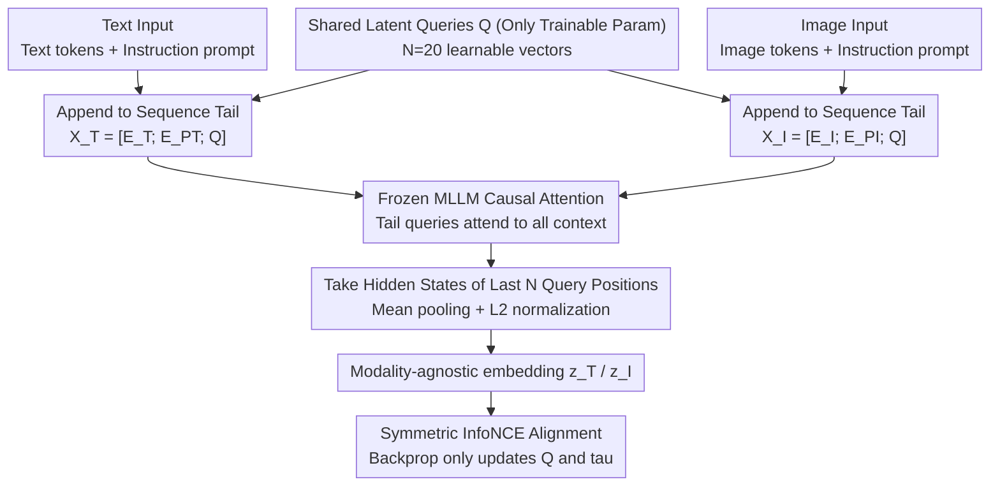

# SLQ: Bridging Modalities via Shared Latent Queries for Retrieval with Frozen MLLMs

**Conference**: ICML 2026  
**arXiv**: [2604.13710](https://arxiv.org/abs/2604.13710)  
**Code**: <https://github.com/CnFaker/SLQ>  
**Area**: Multimodal VLM / Cross-modal Retrieval / Parameter-Efficient Fine-Tuning  
**Keywords**: Frozen MLLM, Shared Latent Queries, Knowledge-Aware Reasoning Retrieval, Contrastive Learning, KARR-Bench

## TL;DR
SLQ appends a small set of "Shared Latent Queries" $\mathbf{Q}$ to the end of image/text token sequences. Utilizing the inherent causal attention of the MLLM to aggregate global context, it transforms a frozen MLLM into a retriever by **training only a few thousand query parameters**. It outperforms full fine-tuning and LoRA on COCO/Flickr30K and introduces KARR-Bench to evaluate "implicit knowledge reasoning" capabilities.

## Background & Motivation

**Background**: Multimodal Large Language Models (MLLM) such as InternVL3 and Qwen3-VL process interleaved image-text inputs through a unified Transformer, capturing richer cross-modal semantic interactions compared to the dual-tower architectures of CLIP/BLIP. Recent works (GME, MM-Embed, VLM2VEC, MMRet) attempt to convert MLLMs into retrievers to leverage their reasoning capabilities.

**Limitations of Prior Work**: (1) **Intrusive Fine-tuning**—Mainstream approaches use full fine-tuning or LoRA with contrastive objectives. However, this **generative alignment $\rightarrow$ discriminative alignment** objective mismatch distorts the pre-trained semantic space and causes catastrophic forgetting (semantic degradation). (2) **Training Inefficiency**—Contrastive learning requires massive batches for negative sample diversity; full fine-tuning of billion-parameter backbones under large batches is computationally prohibitive. (3) Most baselines use the hidden state of the last `<EOS>` token as the global embedding—but the last token acts as an "information bottleneck," struggling to compress complex semantics. The authors' diagnostic experiments (Figure 2) show it fails completely on implicit reasoning tasks (e.g., "the animal with 9 lives" implying a cat).

**Key Challenge**: Pre-trained MLLMs already align vision and language into the **same representation space** (enabling zero-shot VQA). The challenge is that they either lack retrieval performance without fine-tuning or suffer from destroyed pre-trained spaces with heavy parameter updates—there is a lack of a "lightweight yet effective" intermediate solution.

**Goal**: (1) **Keep the backbone frozen**—zero changes to pre-trained parameters; (2) Use a lightweight mechanism to **activate** the MLLM's implicit knowledge and reasoning for retrieval; (3) Solve the "embedding token" problem—avoiding both the last token and simple pooling of all tokens; (4) Provide a benchmark that distinguishes "pattern matching" from "knowledge reasoning."

**Key Insight**: The authors conducted a diagnostic experiment: feeding a **zero-initialized additional query token** at the end of the sequence to a frozen InternVL3-1B, allowing it to "see" all preceding tokens via causal attention. Using its final hidden state for retrieval showed that while both the query and last token succeed in "pattern matching," the last token provides low-discriminative scores for "basic associations" and fails completely on "logical reasoning." This indicates that MLLMs **already possess** reasoning-based retrieval capabilities, but the last token is trapped in an information bottleneck.

**Core Idea**: Use a small set of "shared learnable latent queries" as a **modality-agnostic global aggregator**. This extracts a unified retrieval embedding from image/text sequences via the MLLM's internal causal attention—**learning only the queries, keeping the backbone frozen**.

## Method

### Overall Architecture
The architecture consists of a frozen MLLM backbone and a small set of $N$ learnable Shared Latent Queries $\mathbf{Q} \in \mathbb{R}^{N \times D}$ (for InternVL3-8B, $N=20$, totaling only a few thousand parameters). Text input: $\mathbf{X}_T = [\mathbf{E}_T; \mathbf{E}_{P_T}; \mathbf{Q}]$ (text embeddings + instruction prompt + shared queries); Image input: $\mathbf{X}_I = [\mathbf{E}_I; \mathbf{E}_{P_I}; \mathbf{Q}]$. Both inputs are processed by the frozen MLLM $\mathcal{M}$ through causal attention. The hidden states at the **last $N$ positions** (corresponding to queries) are taken, followed by mean pooling and L2 normalization to obtain embeddings $\mathbf{z}_T, \mathbf{z}_I \in \mathbb{R}^D$. A symmetric InfoNCE loss aligns the two embedding spaces. During inference, the outputs of these query positions serve as modality-agnostic global embeddings for retrieval. Training updates only $\mathbf{Q}$ and the temperature $\tau$.

### Key Designs

**1. Appending Shared Latent Queries to Sequence Tail: Compressing variable sequences into fixed vectors via causal attention**

Diagnostic experiments identified the last token as an information bottleneck. SLQ introduces $N$ learnable queries $\mathbf{Q}$ appended to the sequence end—distinct from CoOp/VPT which prepend tokens. This choice is strategic: decoder-only MLLMs use causal attention, meaning only tokens at the end can attend to all preceding context. Thus, tail-appended queries naturally function as "global aggregators." Using $N=20$ queries instead of one provides broader information bandwidth. Sharing the same $\mathbf{Q}$ across modalities forces the backbone to project image and text into the same parameterized space, avoiding the alignment difficulties of training independent projectors.

**2. Frozen Backbone, Training Only Queries: Preserving the pre-trained aligned semantic space**

The retrieval task should activate existing capabilities rather than re-teaching the model. SLQ updates only $\mathbf{Q}$ and the temperature $\tau$, leaving attention, FFN, and embedding layers untouched. For InternVL3-8B, trainable parameters are only $N \times D \approx 20 \times D$, compared to millions in LoRA or billions in full FT. This prevents semantic degradation from objective mismatch and removes the dependency on massive batch sizes for contrastive learning.

**3. KARR-Bench: A benchmark for "Implicit Knowledge Reasoning" vs. pattern matching**

Existing captions in COCO/Flickr30K are descriptive (e.g., "a red car" matching a red car image), allowing retrievers to score high via surface features. KARR-Bench uses a three-stage pipeline: (1) Visual grounding filtering of 5,000 COCO images to ensure targets are visually verifiable; (2) Implicit reasoning query generation via GPT-5-mini, encoding identities without using target names (e.g., "the animal with 9 lives" for "cat"); (3) Cross-verification by four annotators to remove hallucinations. The final 2,915 pairs cover 6 dimensions: Tools/Appliances (18.8%), Contextual/Spatial (18.1%), Functional (17.4%), Cultural (19.4%), Encyclopedic (14.9%), and Logic/Math (11.4%).

### Loss & Training
The model uses a symmetric InfoNCE loss $\mathcal{L} = \frac{1}{2}(\mathcal{L}_{I2T} + \mathcal{L}_{T2I})$, where each direction is a standard in-batch contrastive softmax loss with a learnable temperature $\tau$. Experiments utilized InternVL3 (1B, 8B) and Qwen3-VL (2B, 4B) backbones. Training lasted 5 epochs on COCO/Flickr30K/KARR-Bench and 1 epoch on MMEB, with a global batch size of 1024 (512 for 8B) and $N=20$.

## Key Experimental Results

### Main Results
Comparison between dual-tower models (CLIP, BLIP, FLAME), MLLM-based full fine-tuning (E5-V-7B, VLM2VEC-7B, GME-7B), and SLQ variants.

| Dataset | Method | I→T R@5 | T→I R@5 | Params |
|---------|--------|---------|---------|--------|
| Flickr30K | CLIP ViT-L | 98.3 | 89.0 | Full |
| Flickr30K | VLM2VEC-7B (full FT) | **99.5** | 95.0 | 7B Tuned |
| Flickr30K | SLQ (InternVL3-8B) | 99.4 | **95.1** | **~K level** |
| COCO 5K | VLM2VEC-7B (full FT) | 88.4 | 73.8 | 7B Tuned |
| COCO 5K | SLQ (InternVL3-8B) | **89.1** | **79.7** | **~K level** |
| MMEB Overall | VLM2VEC-7B† | 62.9 | — | 7B Tuned |
| MMEB Overall | UniME-7B† | 66.6 | — | 7B Tuned |
| MMEB Overall | **SLQ-8B†** | **67.5** | — | **~K level** |

### Ablation Study

| Configuration | Key Metrics | Note |
|---------------|-------------|------|
| SLQ Full (Frozen backbone + $N$=20 queries) | Optimal | — |
| Last token baseline (Zero-shot) | Passed patterns, failed reasoning | Query outperforms last token |
| Single query (N=1) | Performance drop | Multiple queries provide more bandwidth |
| Full fine-tuning | Average or weaker, higher GPU hours | Non-intrusive is superior |
| LoRA | Between SLQ and Full FT | Still slightly distorts space |

### Key Findings
- **High Parameter Efficiency**: SLQ-8B achieves an average score of 67.5 on MMEB with only K-level parameters, outperforming 7B full fine-tuning models like VLM2VEC (62.9)—validating the "activation > retraining" perspective.
- **Shared Multimodal Queries are Critical**: Using the same $\mathbf{Q}$ for images and text forces the backbone into a unified latent space, achieving better alignment than separate projectors.
- **Tail Appending + Causal Attention**: Better suited for decoder-only MLLMs than prepend-style methods (CoOp/VPT) due to the causal mask.
- **KARR-Bench Validity**: SLQ shows substantial gains over last-token baselines on KARR-Bench, proving the benchmark effectively distinguishes reasoning from pattern matching.

## Highlights & Insights
- **Paradigm shift**: Demonstrates that MLLMs already contain aligned multimodal semantic spaces; retrieval requires an "interface" to expose these capabilities rather than intrusive modifications.
- **Effective Diagnostic Design**: Figure 2's three difficulty levels (Pattern, Association, Logic) provide a convincing argument for the query-based approach over the last-token bottleneck.
- **Tool for the Community**: KARR-Bench systematizes evaluation for "knowledge-aware implicit reasoning," preventing benchmark saturation via surface-level shortcuts.
- The "tail query + frozen backbone" PEFT strategy is transferable to RAG, vector indexing, cross-modal re-ranking, and multilingual alignment.

## Limitations & Future Work
- The number of queries $N$ is a hyperparameter; only $N=20$ was tested extensively.
- Evaluations are focused on COCO/Flickr30K/MMEB/KARR-Bench; performance in **long-document**, **video**, or **audio-text retrieval** remains to be verified.
- KARR-Bench relies on GPT-5-mini generation with human filtering; larger samples from diverse LLMs could increase robustness.
- Inference requires a full MLLM forward pass (despite frozen parameters), making it slower than CLIP-style dual towers. SLQ's advantage lies in **training cost** over **inference speed**.
- Frozen backbones may struggle to absorb brand-new domain knowledge (e.g., specialized medical imagery) compared to full fine-tuning.

## Related Work & Insights
- **vs. VLM2VEC / MMRet / GME (Full FT/LoRA + Last token)**: These modify parameters and use `<EOS>`; SLQ keeps parameters and uses queries. SLQ-8B (67.5) beats VLM2VEC-7B (62.9) on MMEB with significantly fewer trainable parameters.
- **vs. ColPali / VisRAG (Multi-vector)**: These use multi-vector representations (expensive storage); SLQ is single-vector (mean pooled) but multi-query aggregated, maintaining simplicity.
- **vs. CoOp / MaPLe / VPT (Prompt tuning)**: Those prepend tokens for CLIP-like encoder-only models; SLQ appends for decoder-only models to utilize causal attention.
- **vs. BLIP-2 Q-Former**: Q-Former adds a cross-attention module; SLQ uses only the MLLM's internal self-attention with zero extra modules.

## Rating
- Novelty: ⭐⭐⭐⭐ Tail-appended shared queries for frozen MLLMs is elegant; KARR-Bench is highly valuable.
- Experimental Thoroughness: ⭐⭐⭐⭐ Comprehensive testing across backbones and benchmarks; could use more $N$ scanning.
- Writing Quality: ⭐⭐⭐⭐⭐ Clear structure from diagnosis to method to benchmark; Figure 2 is highly persuasive.
- Value: ⭐⭐⭐⭐⭐ Drastically reduces training costs for MLLM-based retrieval; provides a necessary reasoning evaluation tool.

<!-- RELATED:START -->

<!-- RELATED:END -->

## Related Papers

- [\[AAAI 2026\] Bridging Modalities via Progressive Re-alignment for Multimodal Test-Time Adaptation (BriMPR)](../../AAAI2026/multimodal_vlm/bridging_modalities_via_progressive_re-alignment_for_multimo.md)
- [\[CVPR 2026\] CodeMMR: Bridging Natural Language, Code, and Image for Unified Retrieval](../../CVPR2026/multimodal_vlm/codemmr_bridging_natural_language_code_and_image_for_unified_retrieval.md)
- [\[ICML 2026\] Calibrated Multimodal Representation Learning with Missing Modalities](calibrated_multimodal_representation_learning_with_missing_modalities.md)
- [\[NeurIPS 2025\] CyIN: Cyclic Informative Latent Space for Bridging Complete and Incomplete Multimodal Learning](../../NeurIPS2025/multimodal_vlm/cyin_cyclic_informative_latent_space_for_bridging_complete_and_incomplete_multim.md)
- [\[ICML 2026\] Referring Multiple Regions with Large Multimodal Models via Contextual Latent Steering](referring_multiple_regions_with_large_multimodal_models_via_contextual_latent_st.md)

<!-- RELATED:END -->
