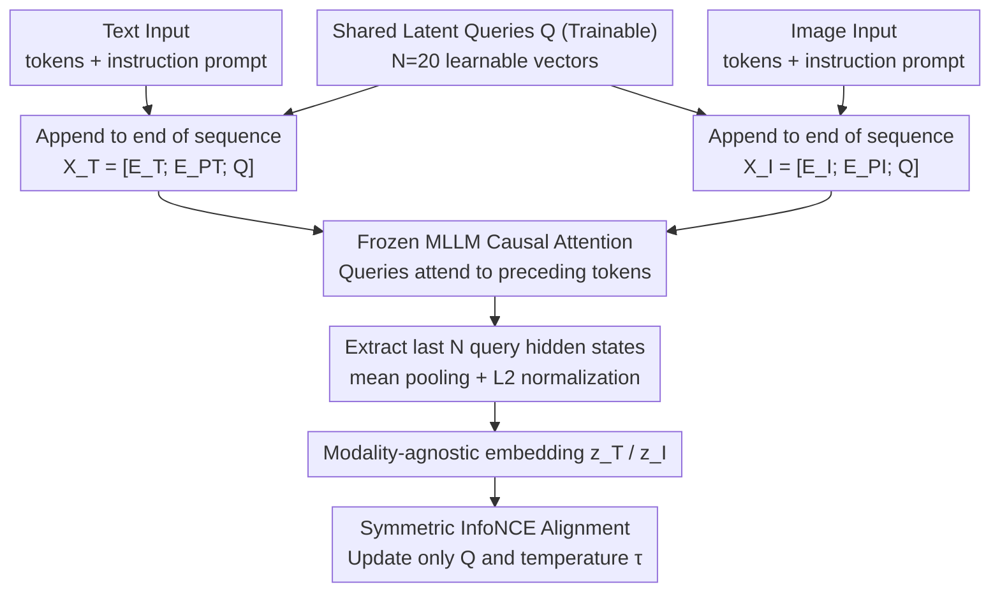

# SLQ: Bridging Modalities via Shared Latent Queries for Retrieval with Frozen MLLMs

**Conference**: ICML 2026  
**arXiv**: [2604.13710](https://arxiv.org/abs/2604.13710)  
**Code**: <https://github.com/CnFaker/SLQ>  
**Area**: Multimodal VLM / Cross-modal Retrieval / Parameter-Efficient Fine-Tuning  
**Keywords**: Frozen MLLM, Shared Latent Queries, Knowledge-Aware Reasoning Retrieval, Contrastive Learning, KARR-Bench

## TL;DR
SLQ appends a small set of "Shared Latent Queries" $\mathbf{Q}$ to the end of image/text token sequences, leveraging the causal attention of the MLLM to aggregate global context. By **training only a few thousand query parameters** while keeping the MLLM frozen, it transforms the model into a retriever. It outperforms full fine-tuning and LoRA on COCO/Flickr30K. The authors also release KARR-Bench to evaluate "implicit knowledge reasoning" capabilities.

## Background & Motivation

**Background**: Multimodal Large Language Models (MLLMs), such as InternVL3 and Qwen3-VL, process interleaved image-text inputs through a unified Transformer, capturing richer cross-modal semantic interactions compared to dual-tower architectures like CLIP/BLIP. Recent works (GME, MM-Embed, VLM2VEC, MMRet) attempt to convert MLLMs into retrievers to exploit their reasoning capabilities.

**Limitations of Prior Work**: (1) **Invasive Fine-tuning**—the standard approach uses full fine-tuning or LoRA with contrastive objectives, but this **generative-to-discriminative alignment** mismatch can distort the pre-trained semantic space and cause catastrophic forgetting (semantic degradation); (2) **Training Inefficiency**—contrastive learning requires large batches for negative sample diversity, making full fine-tuning of billion-parameter backbones prohibitively expensive; (3) Most baselines use the hidden state of the last `<EOS>` token as the global embedding—however, the last token acts as an "information bottleneck" and struggles to compress complex semantics. Diagnostic experiments (Figure 2) show it fails completely on implicit reasoning tasks (e.g., "animal with 9 lives" implying a cat).

**Key Challenge**: Pre-training has already aligned vision and language in a **unified representation space** (enabling zero-shot VQA). However, the choice is currently between no fine-tuning (poor zero-shot retrieval) or heavy parameter modification (destroying the pre-trained space)—lacking a "lightweight yet effective" intermediate solution.

**Goal**: (1) **Keep the backbone frozen**—no pre-trained parameters are modified; (2) Use a lightweight mechanism to **trigger** the MLLM's implicit knowledge and reasoning for retrieval; (3) Solve the "embedding token" problem—using neither the last token nor simple pooling of all tokens; (4) Provide a benchmark that distinguishes "pattern matching" from "knowledge reasoning."

**Key Insight**: The authors conducted a diagnostic experiment—feeding a **zero-initialized extra query token** at the end of a sequence to a frozen InternVL3-1B. Via causal attention, the query "observes" all preceding tokens. Using its final hidden state for retrieval shows that while both the query and the last token succeed in "pattern matching," the last token yields low-discriminative scores for "basic associations" and fails in "logical reasoning," whereas the query succeeds. This indicates MLLMs **already possess** reasoning-retrieval capabilities, but the last token is a bottleneck.

**Core Idea**: Use a small set of "shared learnable latent queries" as a **modality-agnostic global aggregator**. This extracts a unified retrieval embedding from image/text sequences via the MLLM’s own causal attention—**learning only the queries without touching the backbone**.

## Method

### Overall Architecture
The system consists of a frozen MLLM backbone and a small set of $N$ learnable Shared Latent Queries $\mathbf{Q} \in \mathbb{R}^{N \times D}$ (e.g., $N=20$ for InternVL3-8B, totaling only tens of thousands of parameters). Text input: $\mathbf{X}_T = [\mathbf{E}_T; \mathbf{E}_{P_T}; \mathbf{Q}]$ (text embeddings + instruction prompt + shared queries); Image input: $\mathbf{X}_I = [\mathbf{E}_I; \mathbf{E}_{P_I}; \mathbf{Q}]$. Both inputs are processed by the frozen MLLM $\mathcal{M}$ via causal attention. The hidden states at the **last $N$ positions** (corresponding to the queries) are extracted, followed by mean pooling and L2 normalization to obtain embeddings $\mathbf{z}_T, \mathbf{z}_I \in \mathbb{R}^D$. A symmetric InfoNCE loss aligns the two embedding spaces. During inference, the outputs at these query positions serve as the modality-agnostic global embeddings. Only $\mathbf{Q}$ and the temperature $\tau$ are updated during training.

### Key Designs

**1. Appending Shared Latent Queries to Sequence End: Compressing variable sequences into fixed-length retrieval vectors via causal attention**

Diagnostic experiments show the last token is an information bottleneck. SLQ introduces $N$ learnable queries $\mathbf{Q}$ at the end of the sequence (unlike CoOp/VPT which prepend). This is strategic: in a decoder-only MLLM with causal attention, only the final tokens can attend to the entire preceding sequence. Thus, appended queries naturally act as "global aggregators." Using $N=20$ queries provides significantly higher information bandwidth than a single last token. Sharing the same $\mathbf{Q}$ across modalities forces the backbone to project both into the same parameterized space, avoiding the alignment difficulties of dual-tower projections.

**2. Frozen Backbone, Query-only Training: Preserving pre-aligned semantic space**

The retrieval task should "trigger" existing capabilities rather than re-teach alignment. SLQ freezes all backbone parameters (attention, FFN, embeddings) and only updates $\mathbf{Q}$ and $\tau$. For InternVL3-8B, the trainable parameters are roughly $20 \times D$, whereas LoRA or full fine-tuning involves millions to billions. This prevents "semantic degradation" caused by objective mismatch and eliminates the need for massive batch sizes to maintain negative sample diversity.

**3. KARR-Bench: Evaluating "Implicit Knowledge Reasoning" vs. Pattern Matching**

Existing datasets like COCO/Flickr30K contain descriptive captions (e.g., "a red car") that allow models to succeed via surface-level matching. KARR-Bench uses a three-stage pipeline: (1) Visual anchor filtering from COCO to ensure verifiability; (2) Re-encoding targets into implicit reasoning queries using GPT-5-mini (e.g., replacing "cat" with "the animal with 9 lives"); (3) Cross-validation by four annotators to remove hallucinations. The final 2,915 pairs span 6 dimensions: Tool/Utensil Usage (18.8%), Spatial Relations (18.1%), Functional Relations (17.4%), Cultural Symbolism (19.4%), Encyclopedic Knowledge (14.9%), and Logic/Math (11.4%).

### Loss & Training
Symmetric InfoNCE loss $\mathcal{L} = \frac{1}{2}(\mathcal{L}_{I2T} + \mathcal{L}_{T2I})$ is used with a learnable temperature $\tau$. Backbones include InternVL3 (1B, 8B) and Qwen3-VL (2B, 4B). Models are trained on COCO for 5 epochs (Flickr30K/COCO/KARR-Bench evaluation) or MMEB-train for 1 epoch (MMEB evaluation). Global batch size is 1024 (512 for 8B) with $N = 20$.

## Key Experimental Results

### Main Results
Comparison between dual-tower models (CLIP, BLIP, FLAME), fine-tuned MLLM baselines (E5-V, VLM2VEC, GME), and SLQ variants.

| Dataset | Method | I→T R@5 | T→I R@5 | Params |
|---------|--------|---------|---------|--------|
| Flickr30K | CLIP ViT-L | 98.3 | 89.0 | Full |
| Flickr30K | VLM2VEC-7B (full FT) | **99.5** | 95.0 | 7B Fine-tuned |
| Flickr30K | SLQ (InternVL3-8B) | 99.4 | **95.1** | **~10k** |
| COCO 5K | VLM2VEC-7B (full FT) | 88.4 | 73.8 | 7B Fine-tuned |
| COCO 5K | SLQ (InternVL3-8B) | **89.1** | **79.7** | **~10k** |
| MMEB Overall | VLM2VEC-7B† | 62.9 | — | 7B Fine-tuned |
| MMEB Overall | UniME-7B† | 66.6 | — | 7B Fine-tuned |
| MMEB Overall | **SLQ-8B†** | **67.5** | — | **~10k** |

### Ablation Study

| Configuration | Metric | Description |
|---------------|--------|-------------|
| SLQ Full (Frozen backbone + $N$=20 queries) | Best | — |
| Last token baseline (Zero-shot) | Reasoning fails | Validates query over last token |
| Single query (N=1) | Performance drops | Multiple queries provide bandwidth |
| Full fine-tune | Equivalent or worse | Validates non-invasive approach |
| LoRA | Between SLQ and Full FT | Still slightly distorts pre-trained space |

### Key Findings
- **High Parameter Efficiency**: SLQ-8B achieves 67.5 on MMEB with ~10k parameters, outperforming full fine-tuned models like VLM2VEC (62.9) and UniME (66.6). This supports "triggering > retraining."
- **Shared Queries are Critical**: Using the same $\mathbf{Q}$ for both modalities forces them into the same latent space more effectively than separate projections.
- **Append + Causal Attention**: This is superior to "prepend" styles for decoder-only MLLMs, as it allows queries to attend to the full context.
- **Reasoning Advantage**: SLQ shows substantial gains on KARR-Bench compared to last-token baselines, proving its reasoning capability.

## Highlights & Insights
- **Triggering vs. Re-training Paradigm**: MLLMs already possess aligned multimodal semantics; they need an "interface" to expose them rather than invasive modifications.
- **Diagnostic Design**: The three difficulty levels (Pattern Match / Knowledge / Logic) in Figure 2 provide strong evidence for the query mechanism.
- **KARR-Bench Utility**: Systematic evaluation of "knowledge-aware reasoning" prevents "shortcut" scores from flattening benchmark results.
- **Versatility**: The strategy of appending queries to a frozen backbone is applicable to RAG, vector indexing, re-ranking, and multilingual alignment.

## Limitations & Future Work
- The number of queries $N$ is fixed at 20; different tasks might require different optimal $N$.
- Only validated on COCO/Flickr/MMEB/KARR; **Long-document**, **video**, and **audio-text** retrieval remain unexplored.
- KARR-Bench queries generated by GPT-5-mini may have stylistic biases; larger diversity in generator models is needed.
- **Inference Speed**: Each image/text still requires a full MLLM forward pass, making it slower than dual-tower models (training cost vs. inference speed trade-off).
- Frozen backbones cannot learn domain-specific knowledge (e.g., medical imaging) if the target distribution shifts significantly from the pre-training data.

## Related Work & Insights
- **vs. VLM2VEC / MMRet / GME / MM-Embed**: These modify parameters and use `<EOS>`. SLQ keeps the backbone frozen and uses queries, achieving better MMEB scores (67.5 vs 62.9/66.6) with orders of magnitude fewer parameters.
- **vs. ColPali / VisRAG**: These use multi-vector representations (heavy storage). SLQ uses a single pooled vector from multiple queries.
- **vs. CoOp / MaPLe / VPT**: These prepend tokens for encoder-only CLIP models. SLQ appends for decoder-only models.
- **vs. BLIP-2 Q-Former**: Q-Former adds a cross-attention module; SLQ uses the existing self-attention.
- **vs. E5-V**: E5-V uses the last token; SLQ solves the information bottleneck of that token.

## Rating
- Novelty: ⭐⭐⭐⭐ (Shared queries + frozen backbone is elegant; KARR-Bench is valuable)
- Experimental Thoroughness: ⭐⭐⭐⭐ (Extensive benchmarks; could use more $N$ ablation)
- Writing Quality: ⭐⭐⭐⭐⭐ (Strong logical structure from diagnostic to benchmark)
- Value: ⭐⭐⭐⭐⭐ (Significant reduction in training cost; immediately applicable for engineering)

<!-- RELATED:START -->

## Related Papers

- [\[AAAI 2026\] Bridging Modalities via Progressive Re-alignment for Multimodal Test-Time Adaptation (BriMPR)](../../AAAI2026/multimodal_vlm/bridging_modalities_via_progressive_re-alignment_for_multimo.md)
- [\[CVPR 2026\] CodeMMR: Bridging Natural Language, Code, and Image for Unified Retrieval](../../CVPR2026/multimodal_vlm/codemmr_bridging_natural_language_code_and_image_for_unified_retrieval.md)
- [\[NeurIPS 2025\] CyIN: Cyclic Informative Latent Space for Bridging Complete and Incomplete Multimodal Learning](../../NeurIPS2025/multimodal_vlm/cyin_cyclic_informative_latent_space_for_bridging_complete_and_incomplete_multim.md)
- [\[ICML 2026\] Calibrated Multimodal Representation Learning with Missing Modalities](calibrated_multimodal_representation_learning_with_missing_modalities.md)
- [\[ICML 2026\] Referring Multiple Regions with Large Multimodal Models via Contextual Latent Steering](referring_multiple_regions_with_large_multimodal_models_via_contextual_latent_st.md)

<!-- RELATED:END -->
## Related Papers

- [\[AAAI 2026\] Bridging Modalities via Progressive Re-alignment for Multimodal Test-Time Adaptation (BriMPR)](../../AAAI2026/multimodal_vlm/bridging_modalities_via_progressive_re-alignment_for_multimo.md)
- [\[CVPR 2026\] CodeMMR: Bridging Natural Language, Code, and Image for Unified Retrieval](../../CVPR2026/multimodal_vlm/codemmr_bridging_natural_language_code_and_image_for_unified_retrieval.md)
- [\[NeurIPS 2025\] CyIN: Cyclic Informative Latent Space for Bridging Complete and Incomplete Multimodal Learning](../../NeurIPS2025/multimodal_vlm/cyin_cyclic_informative_latent_space_for_bridging_complete_and_incomplete_multim.md)
- [\[ICML 2026\] Calibrated Multimodal Representation Learning with Missing Modalities](calibrated_multimodal_representation_learning_with_missing_modalities.md)
- [\[ICML 2026\] Referring Multiple Regions with Large Multimodal Models via Contextual Latent Steering](referring_multiple_regions_with_large_multimodal_models_via_contextual_latent_st.md)

<!-- RELATED:END -->
