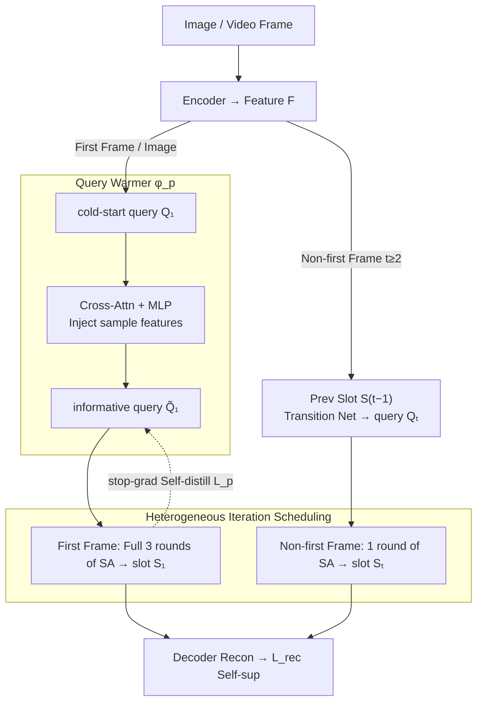

# Smoothing Slot Attention Iterations and Recurrences

**Conference**: ICML 2026  
**arXiv**: [2508.05417](https://arxiv.org/abs/2508.05417)  
**Code**: https://github.com/Genera1Z/SmoothSA (Available)  
**Area**: Multimodal VLM / Object-Centric Learning / Slot Attention  
**Keywords**: Object-Centric Learning, Slot Attention, Query Warm-up, Video OCL, Self-distillation

## TL;DR
Addressing the long-neglected pain points in Slot Attention for image and video object-centric learning—specifically the "insufficient information in cold-start queries" and the "forced unification of aggregation transformations for first vs. non-first frames"—the authors propose SmoothSA. It utilizes a small self-distilled warm-up module to inject sample information into queries while allowing the first frame to run three iterations and non-first frames to run only one. This approach sets new SOTA results on both image and video OCL benchmarks.

## Background & Motivation

**Background**: Object-Centric Learning (OCL) is a paradigm that represents visual scenes as a set of independent object/background vectors (slots). These structured, compact representations often outperform dense feature maps in downstream reasoning, video prediction, and synthetic generation. Most mainstream implementations are built on Slot Attention (SA), which treats image features as keys/values and $n$ query slots as "competitors." Through several rounds of iterative cross-attention, patches are assigned to different slots to learn object-level representations. The entire process is trained via reconstruction loss without external supervision. Standard video OCL (e.g., the STEVE family) recurrently calls the image-based SA across frames: the first-frame query matches the image case, while subsequent queries are predicted from the previous frame's slots via a Transformer encoder block.

**Limitations of Prior Work**: The authors identify two problems that have been almost universally accepted by existing methods but never directly addressed. First, "query cold-start": whether initialized from learnable Gaussians or positional priors, the initial query slots only contain dataset-level priors and lack clues about the current sample. This sample-independent starting point hinders aggregation quality on images or the first frame of a video, forcing the model to "guess" through more iterations. Second, "transformation homogenization": in video, the first-frame query is a cold start with scarce information, whereas subsequent queries are derived from previous slots and contain rich sample information. Nevertheless, most methods treat them identically, applying the same three SA iterations despite the significant information gap.

**Key Challenge**: Aggregation precision depends on the amount of sample information carried by the query. However, the SA framework is not naturally designed to differentiate processing paths for "queries with different prior information." Consequently, either all queries share a coarse cold-start point, or all frames share a fixed number of iterations that does not favor any specific informational state.

**Goal**: Without modifying the backbone OCL model, solve: (i) how to inject sample-level information into cold-start queries for images/video first frames; and (ii) how to allow SA to use different intensities of aggregation transformations between first and non-first video frames.

**Key Insight**: The authors observe that OCL models themselves output "good" slots after training. Thus, "ideal queries" can be supervised by existing slots—naturally supporting self-distillation. Furthermore, while three iterations are necessary for cold-start queries, they may excessively perturb non-first frame queries that are already close to the true distribution.

**Core Idea**: Insert a small module before SA to "warm up" cold-start queries into "approximate slots" (informative queries), and separate the "three iterations" for the first frame from the "single iteration" for non-first frames. By "symmetrizing information volume and transformation intensity," both problems are addressed simultaneously.

## Method

### Overall Architecture
SmoothSA maintains the classic OCL encode-aggregate-decode structure. The encoder maps image/video frames into features $F \in \mathbb{R}^{h\times w\times c}$. The aggregator $\phi_a$ (the SA module) aggregates features into $n$ slots $S \in \mathbb{R}^{n\times c}$, and the decoder reconstructs the input from the slots to provide self-supervision. SmoothSA introduces two minor modifications at the aggregator input and frame scheduling: (1) Before the cold-start query $Q_1$ enters SA iterations, it passes through a "warmer" $\phi_p$ to become an informative query $\tilde Q_1$; (2) For video, the standard 3 SA iterations are performed only on the first frame to obtain slot $S_1$, while non-first frames perform only 1 iteration, with their queries derived directly from the previous frame's slots via a transition module. These changes are minimal and can be integrated into any SA-based image/video OCL model.

### Key Designs

**1. Query Warmer $\phi_p$: Pushing cold-start queries toward slot distribution via self-distillation**

Regardless of initialization via learnable Gaussians or positional priors, initial query slots contain only dataset-level priors and no current sample information, forcing SA to "guess" over more iterations. $\phi_p$ is a lightweight module (one query-feature cross-attention + MLP) that maps the cold-start query $Q_1$ and input features $F_1$ into an informative query $\tilde Q_1 \in \mathbb{R}^{n\times c}$ that approximates the current sample's slot. The supervision signal comes directly from the slots $S_1$ produced by the OCL model on the current batch—letting $\tilde Q_1 \approx S_1$ via stop-gradient self-distillation with loss $\mathcal{L}_p = \|\tilde Q_1 - \text{sg}(S_1)\|^2$. This shifts the SA iteration curve forward: the starting point moves from a distant cold start to a warmed point close to the final slot, naturally reducing iteration error. Unlike BO-QSA or MetaSlot, which enrich "dataset-level" priors, $\phi_p$ is the first to inject "current sample" features into the query through a differentiable channel.

The stop-gradient is a critical detail for stable training. If $\phi_p$ were trained end-to-end as a standard prefix layer with SA, it would fall into an unstable loop where $\phi_p$ pulls the query toward unreliable slots, and SA is further disturbed by noisy queries. The stop-gradient breaks this loop, ensuring $\phi_p$ unidirectionally follows the OCL's current optimal slot distribution without backpropagating noise to the SA backbone, similar to frameworks like BYOL. Thus, the warmer and the backbone OCL are linked end-to-end under a joint self-supervised objective $\mathcal{L} = \mathcal{L}_{rec} + \lambda \mathcal{L}_p$ without requiring external labels or extra training stages.

**2. Heterogeneous Iteration Scheduling: Matching iteration intensity to information volume**

Methods in the STEVE family typically apply 3 SA iterations to all frames. However, the first-frame query is a cold start, while non-first queries already possess rich sample information from previous slots. This work matches "iteration intensity" to "query information volume": the first frame uses three full rounds $S_1^{(i)}, M_1^{(i)} = \phi_a(S_1^{(i-1)}, F_1)$ (for $i=1,2,3$, with $S_1 := S_1^{(3)}$), allowing multi-step alignment for cold starts. For non-first frames ($t \ge 2$), the query $Q_t$ comes from the previous slot $S_{t-1}$ and only runs SA once: $S_t, M_t = \phi_a(Q_t, F_t)$. Since the query is already close to the real slot, multiple rounds introduce redundant updates that dilute the temporal information. Visualizations confirm that multiple iterations on non-first frames cause unnecessary alignment oscillations for queries already near the true distribution. This follows the intuition: "do more computation when the input is harder."

### Loss & Training
During training, all modules are optimized simultaneously with the objective $\mathcal{L} = \mathcal{L}_{rec} + \lambda \mathcal{L}_p$. Applying a stop-gradient to the slot side of $\mathcal{L}_p$ ensures the warmer follows the backbone OCL's optimal slot distribution. In video training, the iteration difference is implemented directly via conditional branching in the forward pass, adding no memory overhead or extra stages.

## Key Experimental Results

### Main Results
The authors integrated SmoothSA into various backbones (DINOSAUR, STEVE, SAVi, RandSF.Q) across several image OCL (COCO, Movi-E) and video OCL (Movi-D, Movi-E, YT-VIS, Physion) benchmarks. They evaluated object discovery (mIoU/FG-ARI), object recognition, and visual reasoning.

| Task | Dataset | Metric | Backbone Baseline | + SmoothSA | Gain |
|------|---------|--------|-------------------|------------|------|
| Image Object Discovery | COCO | mIoU / FG-ARI | DINOSAUR | Improved | Consistent |
| Video Object Discovery | Movi-E | FG-ARI | STEVE / RandSF.Q | Improved | Surpasses SOTA|
| Visual Reasoning | Physion | Accuracy | SA Baseline | Improved | Significant |

(Detailed values are in the paper; the core conclusion is that SmoothSA consistently improves all three metric categories regardless of the backbone or dataset.)

### Ablation Study

| Configuration | FG-ARI / mIoU Trend | Explanation |
|---------------|---------------------|-------------|
| Full SmoothSA | Best | Warm-up + Heterogeneous Scheduling |
| w/o Warm-up $\phi_p$ | Significant Drop | Cold-start is the bottleneck for first-frame quality |
| w/o Heterog. (3 iters for all) | Drop | Multiple iterations for info-rich queries are harmful |
| $\phi_p$ w/o stop-gradient | Unstable / Lower | Validates necessity of broken gradient for distillation |
| Larger $\phi_p$ | Diminishing Returns | A small module (few thousand params) is sufficient |

### Key Findings
- The query warmer is extremely lightweight but provides stable gains, suggesting "starting point bias" accounts for a large portion of SA iteration error; much of the traditional three rounds compensates for a bad start rather than performing true aggregation.
- Single iterations for non-first frames are not only efficient but better, suggesting a universal law for SA: "more information requires fewer iterations." This provides direct insight for future adaptive SA designs.
- Improvements appear simultaneously in FG-ARI (discovery quality) and downstream reasoning, indicating that improving query information improves both segmentation and representation learning.

## Highlights & Insights
- The warmer uses OCL's own output for self-distillation, incurring negligible extra annotation or compute cost. It solves the long-neglected "query cold-start" problem with a conceptually simple yet theoretically sound approach.
- Treating "iteration count" as a flexible hyperparameter based on query information rather than a fixed value of 3 aligns "computation" with "information volume." This approach can be transferred to any iterative refinement framework.
- By unifying two seemingly independent issues (cold-start in the first frame and homogeneity across frames) under the abstraction of "smoothing SA iterations and recurrences," the paper provides a clear conceptual framework.

## Limitations & Future Work
- The warmer relies on the backbone OCL's ability to output "sufficiently good slots" as distillation targets. During early training phases when the backbone might collapse, the supervision signal for $\phi_p$ is noisy; a warm-up schedule might be required.
- The scheduling is hard-coded (3 for first, 1 for others) and does not account for scene cuts or sudden changes where a cold-start might be needed again. An extension could involve a lightweight signal to detect if a query needs to be re-initialized.
- Experiments focused on synthetic and medium-scale real-world data. Performance on large-scale long videos or open-world data remains to be observed, specifically whether queries degrade over long periods.

## Related Work & Insights
- **vs. Slot Attention / BO-QSA**: BO-QSA enriches queries via multi-Gaussians, but these remain "dataset-level" priors. SmoothSA injects "sample-level" features via self-distillation, which is a fundamental difference.
- **vs. MetaSlot**: MetaSlot performs a draft aggregation and then re-initializes queries using an object prototype codebook. It still uses "priors" to supplement queries rather than "current sample features" and involves higher complexity due to the codebook.
- **vs. STEVE / SAVi / RandSF.Q**: These focus on better inter-frame query transition but assume identical SA iterations for all frames. SmoothSA is the first to adjust "transformation intensity" and is orthogonal to transition mechanisms, allowing it to be layered on top of backbones like RandSF.Q.

## Rating
- Novelty: ⭐⭐⭐⭐ First to formally address "query cold-start" and "transformation homogeneity," though the solution (self-distill + scheduling) is simple.
- Experimental Thoroughness: ⭐⭐⭐⭐ Consistent validation across multiple backbones and tasks with complete ablations.
- Writing Quality: ⭐⭐⭐⭐ Clear narrative unifying two changes under the "smooth iterations/recurrences" concept.
- Value: ⭐⭐⭐⭐ High engineering value as it improves most SA-based OCL backbones with nearly zero cost.

<!-- RELATED:START -->

## Related Papers

- [\[ICML 2026\] Certified Robustness under Heterogeneous Perturbations via Hybrid Randomized Smoothing](certified_robustness_under_heterogeneous_perturbations_via_hybrid_randomized_smo.md)
- [\[ICML 2026\] Seeing is Understanding: Unlocking Causal Attention into Modality-Mutual Attention for Multimodal LLMs](seeing_is_understanding_unlocking_causal_attention_into_modality-mutual_attentio.md)
- [\[ICML 2026\] Large Vision-Language Models Get Lost in Attention](large_vision-language_models_get_lost_in_attention.md)
- [\[ICML 2026\] Hyper-ICL: Attention Calibration with Hyperbolic Anchor Distillation for Multimodal ICL](hyper-icl_attention_calibration_with_hyperbolic_anchor_distillation_for_multimod.md)
- [\[CVPR 2026\] Personalized Image Descriptions from Attention Sequences](../../CVPR2026/multimodal_vlm/personalized_image_descriptions_from_attention_sequences.md)

<!-- RELATED:END -->
