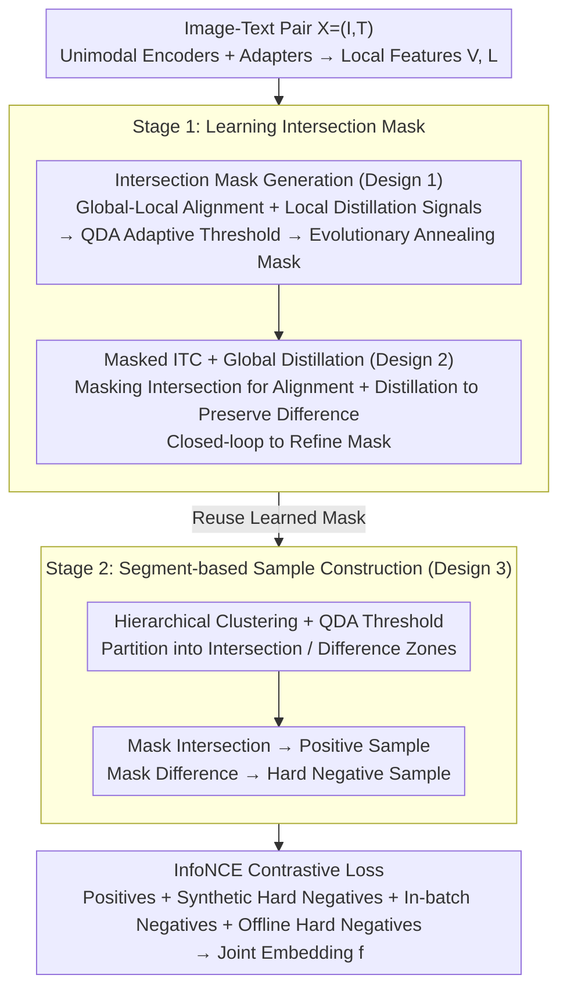

# SOLAR: Self-supervised Joint Learning for Symmetric Multimodal Retrieval

**Conference**: ICML2026  
**arXiv**: [2605.15868](https://arxiv.org/abs/2605.15868)  
**Code**: The paper states "Code and benchmark will be available soon"; not officially open-sourced yet.  
**Area**: Multimodal VLM  
**Keywords**: Symmetric Multimodal Retrieval, Self-supervised Joint Learning, Intersection-Difference Decoupling, Masked Contrastive Learning, Multimodal Embedding  

## TL;DR
SOLAR proposes the first two-stage self-supervised learning framework for "symmetric MM2MM retrieval" (where both query and document are image+text pairs and roles are interchangeable). The first stage learns an "intersection mask" via global-local alignment and QDA adaptive thresholds to decouple shared and unique information between images and text. The second stage utilizes this mask to construct positive and hard negative samples by masking different regions for contrastive learning. The authors also release a manually verified sym-MM2MM benchmark with 214 samples; the final model, with 0.2B parameters and 768-dimensional embeddings, outperforms the strongest 7.75B VLM baseline by 7.08 percentage points.

## Background & Motivation

**Background**: Multimodal retrieval is typically categorized into UM2MM, MM2UM, and MM2MM. Current general multimodal embedding models such as UniIR, VLM2Vec, MM-Embed, GME, and mmE5 default to an asymmetric paradigm where the "query is unimodal or follows a specific structure while the content follows another." These models rely on supervised learning using manually annotated query-document pairs.

**Limitations of Prior Work**: Many real-world scenarios involve "symmetric MM2MM (sym-MM2MM)" retrieval where the query and content are structurally symmetric and semantically interchangeable. For example, in e-commerce, a user might search with a "front view image + back view description" to retrieve a "back view image + front view description." Existing asymmetric models perform poorly on sym-MM2MM because they cannot be trained on "role reversal" and fail to treat the image-text pair as a unified semantic whole.

**Key Challenge**: The cost of natural annotation for sym-MM2MM is extremely high. Judging "semantic equivalence" is a subjective, fine-grained task, making large-scale manual labeling expensive and slow. Meanwhile, synthetic data is limited by the capabilities of generative models and suffers from low-quality samples. This creates a tension between the "data bottleneck" and the need for "web-scale self-supervision" to scale modern AI.

**Goal**: To enable models to learn the ability to discern whether an image and text constitute a unified semantic entity from readily available image-caption pairs, without relying on any manual sym-MM2MM annotations, while also releasing an evaluation benchmark for this task.

**Key Insight**: Any web image-text pair contains "shared concepts covered by both modalities (intersection)" and "unique details appearing in only one modality (difference)." If these can be automatically decoupled, samples can be constructed programmatically: masking the intersection still allows for mutual reconstruction (positive sample), whereas masking the difference results in the loss of unrecoverable information (hard negative sample).

**Core Idea**: Use the "intersection mask" as a pivot to transform the semantic equivalence problem of symmetric retrieval into two learnable tasks: alignment of shared content and preservation of modality-unique content.

## Method

### Overall Architecture
The encoder side of SOLAR consists of five components: a vision encoder $\mathcal{E}_V$ (e.g., DINOv2 or CLIP-vision), a language encoder $\mathcal{E}_L$ (e.g., BGE-m3 or CLIP-text), two two-layer MLP adapters $\mathcal{A}_V, \mathcal{A}_L$ to project unimodal features into a shared space, and a VL-encoder $\mathcal{E}_{VL}$ composed of three attention layers for cross-modal fusion. During inference, the input image-text pair $\mathbf{X}=(\mathbf{I}, \mathbf{T})$ is processed to obtain patch-level visual features $\mathbf{V}$ and token-level text features $\mathbf{L}$. Local features $\mathbf{V}', \mathbf{L}'$ are concatenated with a learnable `[CLS]` token and fed into $\mathcal{E}_{VL}$, where the output at the `[CLS]` position serves as the final joint embedding $\mathbf{f}$.

Training is divided into two stages: Stage 1 learns an intersection mask that reliably distinguishes between modality intersection and difference; Stage 2 uses this mask to automatically generate positive and hard negative samples for contrastive learning. The entire pipeline requires no manual annotation and consumes only 800,000 unlabeled image-text pairs from LAION-5B.

### Key Designs

**1. Intersection Mask Generation: Using Global-Local Alignment + QDA Adaptive Threshold (Core of Stage 1)**

The pivot of the method is a mask that distinguishes "intersection vs. difference." Since no sym-MM2MM labels exist, the mask must emerge by quantifying "where the image and text align." SOLAR uses Global-to-Local Alignment (GLA): for a positive pair, the average similarity between local features and the "partner modality's global representation" should be higher than for any in-batch negative sample, formulated as a hinge loss $\mathcal{L}_{L2V}=[\mathrm{mean}(\mathbb{S}_{L2V}^-)+\delta-\mathrm{mean}(\mathbb{S}_{L2V}^+)]_+$. To ensure the reliability of GLA signals, Local Distillation (LD) is added to force the student's local feature similarity rankings to match those of strong unimodal teachers (DINOv2, BGE-m3), $\mathcal{L}_\mathrm{LD}^L=1-\frac{1}{N}\sum_k\mathrm{corr}(\mathbf{S}_k^{\mathcal{T}},\mathbf{S}_k)$. After obtaining signals, MaskGen collects similarity scores for each patch/token relative to the partner's global vector. Positive and negative samples form two Gaussian distributions; a 1D Quadratic Discriminant Analysis (QDA) finds the intersection point $\tau$ where the densities are equal (solving $\mathcal{N}(\tau;\mu^+,(\sigma^+)^2)=\mathcal{N}(\tau;\mu^-,(\sigma^-)^2)$) to use as a threshold. An evolutionary mask $\mathbf{M}=\rho\mathbf{1}+(1-\rho)\hat{\mathbf{M}}$ is used, with $\rho$ annealing from 1 to 0 to prevent early-stage mask noise from destabilizing the model.

**2. Masked ITC + Global Distillation: Refining the Mask while Preserving Difference Information (Stage 1 Mechanism)**

Training goals must drive the mask's accuracy. SOLAR applies the evolutionary masks $\mathbf{M}_V, \mathbf{M}_L$ to the self-attention of $\mathcal{E}_{VL}$, allowing `[CLS]` to attend only to the intersection to obtain $\mathbf{f}_V, \mathbf{f}_L$, followed by a bidirectional InfoNCE Masked ITC loss $\mathcal{L}_\mathrm{ITC}$. This serves as a self-supervisory signal: "if the masked part is truly the intersection, the remaining content should still align the two modalities." This creates a closed loop where a more accurate mask leads to lower alignment loss. However, optimizing only ITC might cause the model to discard "difference" information (modality-unique details) to reach convergence. Thus, Global Distillation (GD) is introduced as a counter-force, requiring the student's "unmasked" global embeddings to match the teacher's in-batch similarity structure $\mathcal{L}_\mathrm{GD}^L=1-\mathrm{corr}(\mathbf{S}^\mathcal{T},\mathbf{S})$, preserving unique discriminative details like color or brand. The total Stage 1 objective is $\mathcal{L}=\mathcal{L}_\mathrm{ITC}+\lambda_1\mathcal{L}_\mathrm{GLA}+\lambda_2\mathcal{L}_\mathrm{GD}+\lambda_3\mathcal{L}_\mathrm{LD}$.

**3. Segment-based Positive/Hard Negative Construction: One Mask for Both (Core of Stage 2)**

With a reliable intersection mask, Stage 2 programmatically constructs contrastive samples. The key insight: masking the intersection leaves the partner modality's shared semantics reconstructible (Positive Sample); masking the difference removes unique identify details that cannot be recovered (Hard Negative). On the text side, tokens with similarity higher than $\tau_L$ (intersection) are randomly masked for positives, while those below (difference) are masked for negatives. On the image side, because single-patch masking is redundant, hierarchical clustering is applied to local visual features $\mathbf{V}'$ to obtain coarse semantic segments $\mathbf{R}_k$. Each segment is scored by $s_k=\sum_{p\in\mathbf{R}_k}\mathbf{S}_{L2V}(p)/|\mathbf{R}_k|$; those above $\tau_V$ are masked for positives, and those below for hard negatives. Finally, anchors, positives, and three types of negatives (synthetic difference-masked, in-batch, and offline mined) are fed into InfoNCE:

$$\mathcal{L}=\frac{1}{N}\sum_i\log\frac{\sum_{j\in\mathbb{D}^{+i}}\exp(\langle\mathbf{f}^i,\mathbf{f}^j\rangle/\eta)}{\sum_{k\in\mathbb{D}^{+i}\cup\mathbb{D}^{-i}}\exp(\langle\mathbf{f}^i,\mathbf{f}^k\rangle/\eta)}$$

This dual construction bypasses reliance on generative models and directly addresses the long-standing challenge of creating hard negatives in contrastive learning.

### Loss & Training
The total loss for Stage 1 is $\mathcal{L} = \mathcal{L}_\mathrm{ITC} + \lambda_1 \mathcal{L}_\mathrm{GLA} + \lambda_2 \mathcal{L}_\mathrm{GD} + \lambda_3 \mathcal{L}_\mathrm{LD}$, running masked alignment, global-local alignment, and dual distillation simultaneously while transitioning to hard masks via evolutionary annealing. Stage 2 uses an InfoNCE contrastive loss with three types of negatives for end-to-end training. All training is performed on 800,000 LAION-5B pairs. The backbone encoders are fine-tuned via LoRA, while the VL-encoder and adapters are trained from scratch without any sym-MM2MM labels.

## Key Experimental Results

### Main Results

On the newly released sym-MM2MM benchmark (214 triplets + 1 million LAION candidate pool), the authors evaluate Recall@1/5/10, mR, Precision, and their average (Avg). The following table summarizes representative results from the paper (R@1 / mR / Precision / Avg / Parameters / Dim):

| Method | Supervision | R@1 | mR | Precision | Avg | #Param | #Dim |
| :--- | :--- | :--- | :--- | :--- | :--- | :--- | :--- |
| CLIP-SF | Supervised, encoder | 55.61 | 82.55 | 73.36 | 77.96 | 0.43B | 768 |
| MM-Embed | Supervised, VLM | 55.61 | 82.09 | 75.70 | 78.89 | 7.75B | 4096 |
| GME | Supervised, VLM | 56.07 | 80.37 | 74.77 | 77.57 | 7.75B | 3584 |
| UniME | Supervised, VLM | 59.81 | 83.02 | 73.36 | 78.19 | 7.49B | 3584 |
| mmE5 | Supervised, VLM | 57.94 | 84.58 | 76.64 | **80.61** | 10.12B | 4096 |
| Qwen3-VL-Emb | Supervised, VLM | 56.54 | 81.15 | 74.77 | 77.96 | 7.75B | 4096 |
| CLIP-SF-ZS | Unsupervised, encoder | 53.27 | 80.22 | 71.03 | 75.62 | 0.15B | 512 |
| **SOLAR-B+D** (Ours) | Unsupervised, encoder | 72.90 | 87.54 | **85.51** | 86.53 | 0.71B | 768 |
| **SOLAR-C** (Ours) | Unsupervised, encoder | **77.57** | **90.81** | 84.58 | **87.69** | 0.20B | 768 |

SOLAR-C outperforms the strongest supervised VLM baseline, mmE5, by 7.08 percentage points in Avg, while utilizing ~50x fewer parameters and >5x smaller embedding dimensions. R@1 jumps from 59.81 (best supervised) to 77.57, a nearly 18-point increase.

### Ablation Study

Stage 1 ablations (selected from Table 2):

| Configuration | Stage 1 Avg | Stage 2 Avg | Gain/Gap |
| :--- | :--- | :--- | :--- |
| Full SOLAR | 85+ | 86.53 | — |
| Only $\mathcal{L}_\mathrm{ITC}$ | 79.5 | 81.5 | -5.0 |
| W/o $\mathcal{L}_\mathrm{ITC}$ | 83.3 | 82.6 | -3.9 |
| W/o $\mathcal{L}_\mathrm{GLA}$ | 80.8 | — | Significant Drop |

### Key Findings
- Even with Stage 2 reinforcement, the version using only $\mathcal{L}_\mathrm{ITC}$ remains 5 points lower than the full model, indicating that the GLA + LD + GD trio is essential for the mask to emerge correctly.
- Conversely, removing $\mathcal{L}_\mathrm{ITC}$ leads to a 3.9-point drop, suggesting alignment loss acts as an "amplifier" while GLA/LD act as "sensors" for signals; both are necessary.
- SOLAR's 0.15–0.71B small models successfully outperform 7.75B–10B VLMs in sym-MM2MM, strongly validating that "task-adapted data generation mechanisms > general large models + general data."
- The magnitude of improvement in Precision (85+ vs 73~76) exceeds that of Recall@k, indicating SOLAR's true advantage lies in distinguishing hard pairs—precisely the capability targeted by the "intersection vs. difference" paradigm.

## Highlights & Insights
- **Turning Geometry Intuition into Algorithms**: The authors transform the simple set-theory intuition (shared = intersection, unique = difference) into a differentiable mask learning objective via GLA + QDA. This makes "interchangeability" a concrete training signal rather than an abstract concept.
- **Using the Opponent as Training Data**: Masking the intersection for positives and the difference for hard negatives is a dual synthetic strategy. This solves the challenge of hard negative generation in contrastive learning without relying on generative models, showing high potential for other symmetric dual tasks.
- **QDA Adaptive Threshold + Evolutionary Annealing**: A practical combo where the former handles distribution shifts and the latter manages early mask unreliability. This recipe for "self-learned thresholds" is valuable for other self-supervised tasks.
- **Small Self-supervised Models Over Large Supervised VLMs**: This result has strong paradigmatic implications for tasks where labeling is expensive but web data is abundant. Aligning the data generation mechanism with the task structure is more cost-effective than scaling parameters.

## Limitations & Future Work
- The benchmark consists of only 214 triplets. While the authors emphasize quality through manual and generative pipelines, the scale is small. Verification on larger-scale (thousand- or myriad-level) benchmarks is needed.
- The mask generation assumes every pair contains both an intersection and a difference. In boundary cases (e.g., purely descriptive captions), the intersection might equal the whole, causing mask degradation; fallback strategies are not deeply discussed.
- The capability of unimodal teachers (DINOv2, BGE-m3) caps the LD signal. Whether SOLAR maintains its edge with weaker backbones remains to be seen.
- Stage 2 hard negatives rely on Stage 1 threshold stability; an end-to-end or alternating update version might offer further improvements.

## Related Work & Insights
- **Compared to UniIR/VLM2Vec/mmE5**: These models rely on asymmetric supervised data. Even with 10B parameters, they only reach Avg 78–80 on sym-MM2MM. SOLAR's <1B unsupervised model leads by 6–10 points, demonstrating a structural rather than engineering advantage.
- **Compared to CLIP/DINO**: CLIP's alignment is global-global and does not distinguish between intersection and difference. SOLAR introduces second-order structures to both "align shared" and "preserve unique" content—the core ability for sym-MM2MM.
- **Compared to MAE/SimMIM**: While MAE uses masking for representation pretraining, SOLAR uses masking for "semantic reconstructibility" as a contrastive signal. This reveals new uses for the masking primitive in multimodal alignment.
- **Compared to Synthesis-based sym-MM2MM**: Synthetic routes are limited by generator capacity and heavy filtering. SOLAR replaces synthesis with "masking web data," bypassing bottlenecks and scaling naturally to billion-scale datasets.

## Rating
- Novelty: ⭐⭐⭐⭐⭐ 
- Experimental Thoroughness: ⭐⭐⭐⭐ 
- Writing Quality: ⭐⭐⭐⭐ 
- Value: ⭐⭐⭐⭐⭐ 

<!-- RELATED:START -->

## Related Papers

- [\[ECCV 2024\] Decoupling Common and Unique Representations for Multimodal Self-supervised Learning](../../ECCV2024/multimodal_vlm/decoupling_common_and_unique_representations_for_multimodal_self-supervised_lear.md)
- [\[CVPR 2026\] Finding Distributed Object-Centric Properties in Self-Supervised Transformers](../../CVPR2026/multimodal_vlm/finding_distributed_object-centric_properties_in_self-supervised_transformers.md)
- [\[CVPR 2025\] Self-Supervised Spatial Correspondence Across Modalities](../../CVPR2025/multimodal_vlm/self-supervised_spatial_correspondence_across_modalities.md)
- [\[CVPR 2026\] TRivia: Self-supervised Fine-tuning of Vision-Language Models for Table Recognition](../../CVPR2026/multimodal_vlm/trivia_self-supervised_fine-tuning_of_vision-language_models_for_table_recogniti.md)
- [\[CVPR 2026\] EvoGraph-R1: Self-Evolving Multimodal Knowledge Hypergraphs for Agentic Retrieval](../../CVPR2026/multimodal_vlm/evograph-r1_self-evolving_multimodal_knowledge_hypergraphs_for_agentic_retrieval.md)

<!-- RELATED:END -->
