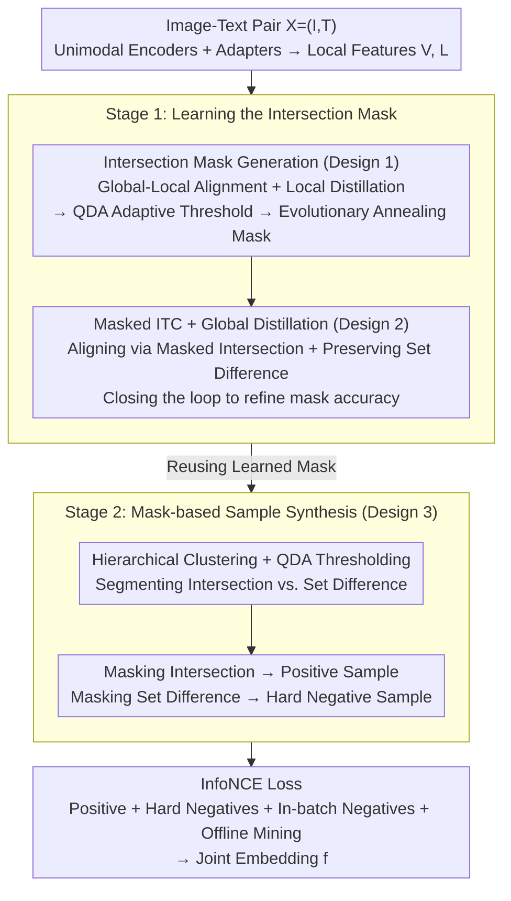

# SOLAR: Self-supervised Joint Learning for Symmetric Multimodal Retrieval

**Conference**: ICML2026  
**arXiv**: [2605.15868](https://arxiv.org/abs/2605.15868)  
**Code**: The paper states "Code and benchmark will be available soon," not yet officially open-sourced.  
**Area**: Multimodal VLM  
**Keywords**: Symmetric Multimodal Retrieval, Self-supervised Joint Learning, Intersection-Difference Decoupling, Masked Contrastive Learning, Multimodal Embedding  

## TL;DR
SOLAR introduces the first two-stage self-supervised learning framework for "symmetric MM2MM retrieval" (where both queries and documents are image-text pairs and roles are interchangeable). The first stage learns an "intersection mask" through global-local alignment and QDA adaptive thresholds to decouple shared and unique information. The second stage uses this mask to construct positive and hard negative samples via region-specific masking for contrastive learning. It also releases a benchmark of 214 manually verified sym-MM2MM cases, outperforming the strongest 7.75B VLM baseline by 7.08 percentage points with only 0.2B parameters and 768-dimensional embeddings.

## Background & Motivation

**Background**: Multimodal retrieval is typically categorized into UM2MM, MM2UM, and MM2MM. Current general multimodal embedding models such as UniIR, VLM2Vec, MM-Embed, GME, and mmE5 default to an asymmetric paradigm where the query is unimodal or follows a specific structure while the content follows another, largely relying on supervised learning with manually annotated query-document pairs.

**Limitations of Prior Work**: Real-world scenarios often involve "symmetric MM2MM (sym-MM2MM)" retrieval where the query and content are structurally identical and semantically interchangeable. For example, in e-commerce, a user might search with a "front T-shirt image + back description" to retrieve a "back image + front description." Existing asymmetric models perform poorly on sym-MM2MM because they cannot be trained on interchangeable roles and fail to treat image-text combinations as a unified semantic whole.

**Key Challenge**: The cost of natural labeling for sym-MM2MM is extremely high. Determining "semantic equivalence" is a subjective and fine-grained task, making large-scale manual annotation expensive and slow. Synthetic data is limited by the generative models' capabilities and the difficulty of filtering low-quality samples. This creates tension between the "data bottleneck" and the scale required by modern web-scale self-supervision.

**Goal**: To enable models to learn the ability to judge whether an image and text constitute the same semantic whole from readily available image-caption pairs, without relying on any manual sym-MM2MM annotations, and to release a benchmark for this task.

**Key Insight**: Any web-based image-text pair contains "shared concepts covered by both modalities (Intersection)" and "unique details appearing in only one modality (Set Difference)." If these can be automatically decoupled, samples can be generated programmatically: masking the intersection still allows reconstruction (positive sample), while masking the set difference loses irrecoverable information (hard negative).

**Core Idea**: Use an "intersection mask" as a pivot to transform the semantic equivalence problem of symmetric retrieval into two learnable tasks: alignment of shared multimodal content and preservation of modality-unique content.

## Method

### Overall Architecture
The encoder side of SOLAR consists of five components: a vision encoder $\mathcal{E}_V$ (e.g., DINOv2 or CLIP-vision), a language encoder $\mathcal{E}_L$ (e.g., BGE-m3 or CLIP-text), two-layer MLP adapters $\mathcal{A}_V, \mathcal{A}_L$ to project unimodal features into a shared space, and a three-layer attention-based VL-encoder $\mathcal{E}_{VL}$ for cross-modal fusion. During inference, the image-text input $\mathbf{X}=(\mathbf{I}, \mathbf{T})$ yields patch-level visual features $\mathbf{V}$ and token-level text features $\mathbf{L}$. The local features $\mathbf{V}', \mathbf{L}'$ plus a learnable `[CLS]` token are fed into $\mathcal{E}_{VL}$, and the output at the `[CLS]` position serves as the final joint embedding $\mathbf{f}$.

Training is split into two stages: Stage 1 learns an intersection mask that reliably distinguishes between intersection and set difference; Stage 2 uses this mask to automatically generate positive/hard negative samples for contrastive learning. The entire process requires no manual annotation, utilizing only 800,000 unlabeled image-text pairs from LAION-5B.

### Key Designs

**1. Intersection Mask Generation: Using global-local alignment and QDA adaptive thresholds to automatically label shared content (Core of Stage 1)**

The pivot of the method is a mask distinguishing "Intersection vs. Set Difference." Without sym-MM2MM labels, this is derived from a quantifiable alignment signal. SOLAR uses Global-to-Local Alignment (GLA): for a positive pair, the average similarity of local features to the "global representation of the partner modality" should be higher than for any in-batch negatives, formulated as a hinge loss $\mathcal{L}_{L2V}=[\mathrm{mean}(\mathbb{S}_{L2V}^-)+\delta-\mathrm{mean}(\mathbb{S}_{L2V}^+)]_+$. To ensure the reliability of the local features, Local Distillation (LD) forces the student's local features to maintain the same similarity ranking as strong unimodal teachers (DINOv2, BGE-m3), expressed as $\mathcal{L}_\mathrm{LD}^L=1-\frac{1}{N}\sum_k\mathrm{corr}(\mathbf{S}_k^{\mathcal{T}},\mathbf{S}_k)$. MaskGen then collects these similarities into Gaussian distributions for positive and negative samples, using one-dimensional Quadratic Discriminant Analysis (QDA) to find the intersection point $\tau$ (where $\mathcal{N}(\tau;\mu^+,(\sigma^+)^2)=\mathcal{N}(\tau;\mu^-,(\sigma^-)^2)$) as the threshold. An evolutionary mask $\mathbf{M}=\rho\mathbf{1}+(1-\rho)\hat{\mathbf{M}}$ anneals $\rho$ from 1 to 0 to prevent early-stage noise from destabilizing training.

**2. Masked ITC + Global Distillation: Refining the mask while preventing information loss (Mechanism of Stage 1)**

To drive mask refinement, evolutionary masks $\mathbf{M}_V, \mathbf{M}_L$ are applied to the self-attention of $\mathcal{E}_{VL}$, allowing `[CLS]` to only attend to the intersection parts to obtain $\mathbf{f}_V, \mathbf{f}_L$, followed by a bidirectional InfoNCE Masked ITC loss $\mathcal{L}_\mathrm{ITC}$. This creates a closed loop: if the intersection is correctly masked, remaining content still allows alignment, encouraging MaskGen to adjust the mask based on alignment effectiveness. Global Distillation (GD) is introduced to prevent the loss of modality-unique information (set difference) by ensuring the "unmasked" student global embeddings match the similarity structure of the teachers in-batch: $\mathcal{L}_\mathrm{GD}^L=1-\mathrm{corr}(\mathbf{S}^\mathcal{T},\mathbf{S})$. The total Stage 1 objective is $\mathcal{L}=\mathcal{L}_\mathrm{ITC}+\lambda_1\mathcal{L}_\mathrm{GLA}+\lambda_2\mathcal{L}_\mathrm{GD}+\lambda_3\mathcal{L}_\mathrm{LD}$.

**3. Segment-based Sample Construction: Using the same mask for both positives and hard negatives (Core of Stage 2)**

Stage 2 programmatically constructs samples: masking the intersection (shared part) creates a positive sample because the semantic whole can still be reconstructed from the partner modality; masking the set difference (unique part) creates a hard negative because unique identification details are lost. For text, tokens with similarity above $\tau_L$ are masked for positives and below $\tau_L$ for negatives. For images, due to patches being redundant, hierarchical clustering is applied to local features $\mathbf{V}'$ to obtain semantic segments $\mathbf{R}_k$. Segments are scored by $s_k=\sum_{p\in\mathbf{R}_k}\mathbf{S}_{L2V}(p)/|\mathbf{R}_k|$, where those above $\tau_V$ are used for positive masking and those below for negative masking. The InfoNCE loss then consumes anchors, positives, and three types of negatives (mask-constructed, in-batch, and offline mined):

$$\mathcal{L}=\frac{1}{N}\sum_i\log\frac{\sum_{j\in\mathbb{D}^{+i}}\exp(\langle\mathbf{f}^i,\mathbf{f}^j\rangle/\eta)}{\sum_{k\in\mathbb{D}^{+i}\cup\mathbb{D}^{-i}}\exp(\langle\mathbf{f}^i,\mathbf{f}^k\rangle/\eta)}$$

### Loss & Training
The total Stage 1 loss is $\mathcal{L} = \mathcal{L}_\mathrm{ITC} + \lambda_1 \mathcal{L}_\mathrm{GLA} + \lambda_2 \mathcal{L}_\mathrm{GD} + \lambda_3 \mathcal{L}_\mathrm{LD}$, performing masked alignment, global-local alignment, and dual-layer distillation while smoothing the mask transition via annealing. Stage 2 uses an InfoNCE contrastive loss with three negative types for end-to-end training. All training uses 800,000 LAION-5B pairs, with LoRA on the backbone and VL-encoder/adapters trained from scratch without any sym-MM2MM labels.

## Key Experimental Results

### Main Results

On the newly released sym-MM2MM benchmark (214 triplets + 1 million LAION candidate pool), the authors evaluated Recall@1/5/10, mR, Precision, and their average (Avg). Representative comparisons from Table 1 are listed below:

| Method | Type | R@1 | mR | Precision | Avg | #Param | #Dim |
|------|---------|------|------|------|------|------|------|
| CLIP-SF | Supervised, encoder | 55.61 | 82.55 | 73.36 | 77.96 | 0.43B | 768 |
| MM-Embed | Supervised, VLM | 55.61 | 82.09 | 75.70 | 78.89 | 7.75B | 4096 |
| GME | Supervised, VLM | 56.07 | 80.37 | 74.77 | 77.57 | 7.75B | 3584 |
| UniME | Supervised, VLM | 59.81 | 83.02 | 73.36 | 78.19 | 7.49B | 3584 |
| mmE5 | Supervised, VLM | 57.94 | 84.58 | 76.64 | **80.61** | 10.12B | 4096 |
| Qwen3-VL-Embedding | Supervised, VLM | 56.54 | 81.15 | 74.77 | 77.96 | 7.75B | 4096 |
| CLIP-SF-ZS | Unsupervised, encoder | 53.27 | 80.22 | 71.03 | 75.62 | 0.15B | 512 |
| **SOLAR-B+D** (Ours) | Unsupervised, encoder | 72.90 | 87.54 | **85.51** | 86.53 | 0.71B | 768 |
| **SOLAR-C** (Ours) | Unsupervised, encoder | **77.57** | **90.81** | 84.58 | **87.69** | 0.20B | 768 |

SOLAR-C outperforms the strongest supervised VLM baseline mmE5 by 7.08 points in Avg, with ~50x fewer parameters and >5x smaller embedding dimensions. R@1 jumped by nearly 18 percentage points from UniME's 59.81 to 77.57.

### Ablation Study

Stage 1 Ablation (selected from Table 2):

| Configuration | Avg after Stage 1 | Avg after Stage 2 | Gap vs Full |
|------|--------|--------|------|
| Full SOLAR | 85+ | 86.53 | — |
| Only $\mathcal{L}_\mathrm{ITC}$ | 79.5 | 81.5 | -5.0 |
| W/o $\mathcal{L}_\mathrm{ITC}$ | 83.3 | 82.6 | -3.9 |
| W/o $\mathcal{L}_\mathrm{GLA}$ | 80.8 | — | Dropped significantly |

### Key Findings
- Even after Stage 2 enhancement, the $\mathcal{L}_\mathrm{ITC}$-only version is 5 points lower than the full model. This proves GLA, LD, and GD are essential for the intersection mask to emerge correctly.
- Removing $\mathcal{L}_\mathrm{ITC}$ results in a 3.9-point drop, suggesting alignment loss acts as an "amplifier" while GLA/LD act as "sensors" for signal generation.
- SOLAR's success with small models (0.15-0.71B) on sym-MM2MM suggests that task-specific data generation outweighs general large models with generic data.
- The Precision metric (positive vs. hard negatives) showed the most significant gain (85+ vs. 73-76), confirming that the intersection/set difference paradigm excels at distinguishing hard pairs.

## Highlights & Insights
- **Operationalizing geometric intuition**: The authors converted set theory intuition (Intersection = Shared, Set Difference = Unique) into a differentiable mask learning objective via GLA and QDA, making "interchangeability" a concrete training signal.
- **Using opposites for synthesis**: Masking the intersection for positives and the set difference for hard negatives is a dual synthesis strategy. It solves the hard negative mining problem in contrastive learning without relying on generative models.
- **QDA adaptive thresholding and evolutionary annealing**: These are practical tricks. QDA handles distribution shift, while annealing handles early-stage mask instability, ensuring stable unsupervised convergence on only 800k samples.
- **Small Unsupervised Model > Large Supervised VLM**: This result is a paradigm shift for tasks with expensive labels. Task-specific data generation aligned with the task structure is more efficient than scaling parameters.

## Limitations & Future Work
- The benchmark contains only 214 triplets. While high quality, it is small, and verification on larger-scale (thousand or ten-thousand level) benchmarks is needed.
- The mask generation assumes every pair contains both an intersection and a set difference. In cases where they overlap entirely (e.g., highly descriptive captions), the mask may degenerate.
- The upper bound of the LD signal is limited by the unimodal teachers (DINOv2, BGE-m3).
- Stage 2 hard negatives rely on the stability of Stage 1 thresholds; an end-to-end or multi-round iterative update version might further improve performance.

## Related Work & Insights
- **Vs. General Multimodal Embeddings (UniIR, mmE5, etc.)**: These rely on asymmetric supervised data. SOLAR's <1B unsupervised model leads by 6-10 points, proving structural task specialization is a structural advantage.
- **Vs. CLIP/DINO**: CLIP focuses on global-to-global alignment. SOLAR adds an intersection/difference layer, ensuring embeddings align shared parts while preserving unique details—the core requirement for sym-MM2MM.
- **Vs. Masked SSL (MAE, SimMIM)**: MAE uses masks for reconstruction to learn representations. SOLAR uses masks as contrastive signals for "semantic reconstructability," revealing a new use for masking in multimodal alignment.
- **Vs. Synthetic Data (e.g., Zhang et al. 2024)**: Synthetic methods are limited by generation quality. SOLAR uses web-data masking, which scales more easily to billion-level datasets like LAION.

## Rating
- Novelty: ⭐⭐⭐⭐⭐ Formalizes the symmetric MM2MM retrieval task with a unique self-supervised decoupling framework.
- Experimental Thoroughness: ⭐⭐⭐⭐ Compared against 10 SOTA supervised baselines with two-stage ablation, though the benchmark size is small.
- Writing Quality: ⭐⭐⭐⭐ Clear task definition and mechanism flow, though some notation in long formulas is dense.
- Value: ⭐⭐⭐⭐⭐ High practical value for e-commerce and recommendation; demonstrates a new research path for multimodal embeddings.

<!-- RELATED:START -->

## Related Papers

- [\[ECCV 2024\] Decoupling Common and Unique Representations for Multimodal Self-supervised Learning](../../ECCV2024/multimodal_vlm/decoupling_common_and_unique_representations_for_multimodal_self-supervised_lear.md)
- [\[CVPR 2026\] EvoGraph-R1: Self-Evolving Multimodal Knowledge Hypergraphs for Agentic Retrieval](../../CVPR2026/multimodal_vlm/evograph-r1_self-evolving_multimodal_knowledge_hypergraphs_for_agentic_retrieval.md)
- [\[CVPR 2025\] Self-Supervised Spatial Correspondence Across Modalities](../../CVPR2025/multimodal_vlm/self-supervised_spatial_correspondence_across_modalities.md)
- [\[CVPR 2026\] Visual Reasoning through Tool-supervised Reinforcement Learning](../../CVPR2026/multimodal_vlm/visual_reasoning_through_tool-supervised_reinforcement_learning.md)
- [\[CVPR 2026\] TRivia: Self-supervised Fine-tuning of Vision-Language Models for Table Recognition](../../CVPR2026/multimodal_vlm/trivia_self-supervised_fine-tuning_of_vision-language_models_for_table_recogniti.md)

<!-- RELATED:END -->
