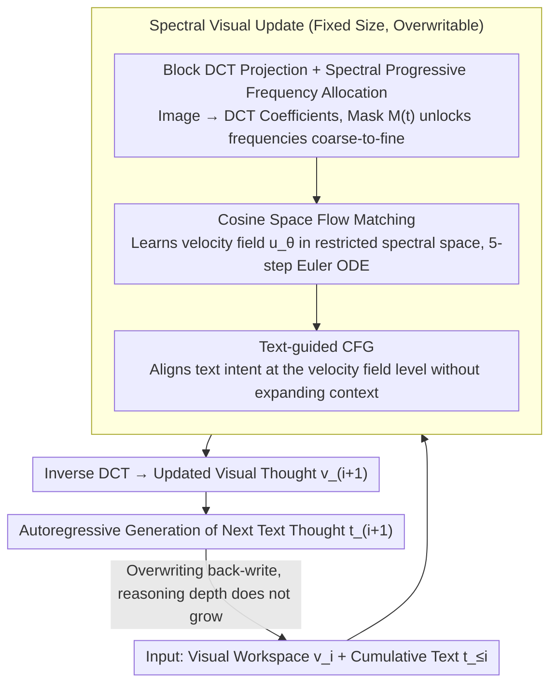

# Spectral-Progressive Thought Flow for Lightweight Multimodal Reasoning

**Conference**: ICML 2026  
**arXiv**: [2606.02842](https://arxiv.org/abs/2606.02842)  
**Code**: To be confirmed  
**Area**: Multimodal Reasoning / LLM Inference Efficiency  
**Keywords**: Multimodal Spatial Reasoning, Flow Matching, Spectral Methods, Progressive Frequency, Efficiency Optimization

## TL;DR
SpecFlow shifts multimodal spatial reasoning from "pixel-level thinking" to "spectral-level thinking"—utilizing Block Discrete Cosine Transform (BDCT) + Flow Matching + Progressive Frequency Activation to maintain visual intermediate thoughts in a fixed-size spectral workspace. Combined with Classifier-Free Guidance (CFG) for text-guided visual evolution, it reduces KV cache by 1.6–2.1× while maintaining spatial reasoning accuracy.

## Background & Motivation

**Background**: Multimodal spatial reasoning (path planning, object search, spatial relationship judgment) is a critical direction for evaluating VLM reasoning capabilities. The mainstream approach is "interleaved text-image chain-of-thought" (MVoT), where visual intermediate thoughts are autoregressively generated and accumulated at each step.

**Limitations of Prior Work**: The MVoT paradigm faces fundamental scalability issues. Each intermediate visual thought may consist of thousands of visual tokens ($O(10^3)$), far exceeding text tokens ($O(10^2)$). As reasoning steps increase, context length, KV cache, and memory bandwidth explode. Explicit token pruning relies on heuristic criteria that fail to adapt to multi-step reasoning dynamics, while implicit latent space reasoning lacks interpretability and explicit control over spatial states.

**Key Challenge**: Multimodal spatial reasoning must maintain precision while controlling the scale of intermediate representations. Existing methods either suffer from accuracy degradation or fail to reduce costs. The root cause is the misuse of dense representations in pixel space; intermediate thoughts only need to capture global layouts and geometric relationships.

**Goal**: Design a lightweight, scalable multimodal reasoning framework where memory footprint and computational cost do not grow with reasoning depth.

**Key Insight**: It is observed that Block Discrete Cosine Transform (BDCT) possesses strong energy compaction properties—most energy is concentrated in a few low-frequency coefficients. Intuition: Early stages of spatial reasoning only require global layouts (low frequencies), while details (high frequencies) can be activated later, inspiring a progressive frequency schedule.

**Core Idea**: Maintain a fixed-size visual workspace in the spectral domain (DCT space) rather than pixel space. Use flow matching for deterministic state transitions and CFG to align text intent with visual evolution, ensuring constant costs regardless of reasoning steps.

## Method

### Overall Architecture
The reasoning process consists of an alternating cycle of text generation and visual updates. At each step $i$, given the current visual workspace $\hat{v}_i$ and accumulated text $\hat{t}_{\leq i}$, the model first generates an updated visual thought $\hat{v}_{i+1}$ via flow matching, then autoregressively generates the next text thought $\hat{t}_{i+1}$ based on the new visual state. Crucially, the **visual state is of fixed size and overwritable**, unlike the cumulative growth in MVoT. The visual update occurs in the spectral domain through three integrated designs: projecting the visual state into a frequency-constrained DCT spectral space (Design 1), performing deterministic ODE generation in this space via flow matching (Design 2), and applying text guidance to the velocity field via CFG (Design 3).

### Key Designs

**1. Block DCT Projection + Spectral Progressive Frequency Allocation**

The fundamental problem of MVoT is the explosion of tokens as reasoning deepens. This work leverages the energy compaction of BDCT, where most energy resides in low-frequency coefficients. Images are decomposed into frequency components: low frequencies govern global layouts (position, spatial configuration), while high frequencies handle detailed textures. A time-dependent mask $M(t)$ controls the activation range. As $t$ moves from 0 to 1, the mask gradually releases higher frequencies, with the number of activated frequencies $m(t) = \sum_{u, v} M_t(u, v)$ being monotonically non-decreasing. This creates a coarse-to-fine curriculum. The rationale is that early spatial reasoning only requires global layouts; forcing the model to build fine-grained pixel representations initially is inefficient.

**2. Cosine Space Flow Matching**

Diffusion or autoregressive models require multiple samples per step, leading to high latency in multi-step reasoning. SpecFlow utilizes flow matching for deterministic, low-step (e.g., 5-step Euler) state transitions. The coefficient trajectory $X(t)$ follows the ODE $\frac{dX}{dt} = u_\theta(\tilde{X}(t), t, c)$, where $\tilde{X}(t) = M(t) \odot X(t)$ is the masked spectral coefficient. Training uses the standard flow matching loss:

$$\mathcal{L}_{FM} = \mathbb{E}\|u_\theta(M(t) \odot X_t, t, c) - (X_0 - X_1)\|_2^2$$

where $X_t = (1 - t) X_1 + t X_0$, $X_0 = D_b(x_0)$ are the DCT coefficients of the data, and $X_1 \sim \mathcal{N}(0, I)$. By ordering coefficients by frequency, the mask $M(t)$ naturally imposes a hierarchical dynamic of "low-frequency first, high-frequency later" into the flow matching process.

**3. Text-guided CFG**

In multi-step reasoning, visual updates must align with the current text intent. SpecFlow implements this via Classifier-Free Guidance. During training, the condition $c_i$ is randomly dropped with probability $p_{\text{drop}}$, allowing the model to learn both conditional $u_\theta(\cdot, t, c_i)$ and unconditional $u_\theta(\cdot, t, \emptyset)$ velocity fields. During inference, the guided velocity is constructed as:

$$u^{\text{guid}}_\theta = u_\theta(\tilde{X}, t, \emptyset) + w \cdot (u_\theta(\tilde{X}, t, c_i) - u_\theta(\tilde{X}, t, \emptyset))$$

The difference term isolates the direction of velocity change attributed to the text. The primary advantage is that guidance occurs at the velocity field level rather than the sample level, eliminating the need to accumulate visual tokens and avoiding context expansion.

## Key Experimental Results

### Main Results (Multimodal Spatial Reasoning Benchmarks)

| Benchmark | Method | Accuracy (%) ↑ | FLOPs (G) ↓ | Latency (s) ↓ | Memory (GB) ↓ |
|-----------|--------|----------------|-------------|---------------|---------------|
| VSR       | VoCoT  | 68.88          | 20342.4     | 0.65          | 56.37         |
| VSR       | Heima  | 51.69          | 10394.5     | 0.40          | 38.84         |
| VSR       | **Ours** | **70.14**      | 11169.7     | 0.41          | 39.53         |
| V-Star    | VoCoT  | 59.87          | 22334.0     | 0.71          | 59.28         |
| V-Star    | PCCoT  | 44.40          | 13963.5     | 0.50          | 42.31         |
| V-Star    | **Ours** | **61.28**      | 13985.5     | 0.45          | 41.22         |
| EmbSpatial| SparseVLM| 63.89        | 20785.2     | 0.74          | 51.93         |
| EmbSpatial| **Ours** | **67.79**      | 17731.5     | 0.44          | 42.57         |

On VSR, accuracy is 18.5% higher than Heima with comparable latency; on V-Star, it is 16.9% higher than PCCoT.

### Ablation Study: Spectral Scheduling (Maze & FrozenLake)

| Env        | Strategy | Accuracy (%) | Latency (ms) | FLOPs (G) |
|------------|----------|--------------|--------------|-----------|
| Maze       | Fixed    | 90.39        | 1.13         | 12723.3   |
| Maze       | Linear   | 94.37        | 1.96         | 16752.2   |
| Maze       | **Cosine**| 94.12       | 1.29         | 13976.7   |
| FrozenLake | Fixed    | 82.37        | 1.42         | 13672.5   |
| FrozenLake | Linear   | 87.79        | 2.97         | 18265.1   |
| FrozenLake | **Cosine**| 87.94       | 1.73         | 15991.1   |

### Key Findings
- KV cache reduced from 5.4–5.9 GB to 3.0–3.5 GB (1.6–1.8× reduction), reaching 2.1× in dynamic decision tasks.
- Fixed low-frequency schemes are fast but suffer a 3–5% accuracy drop, proving progressive activation is key to balancing coarse and fine details.
- Pure flow matching (DiffThinker) lacks accuracy in complex reasoning; SpecFlow achieves significant gains through CFG in long reasoning sequences.

## Highlights & Insights
- **From Pixel Thinking to Spectral Thinking**: The core insight is that intermediate visual thoughts do not require pixel-level detail. Breaking the "token accumulation" trap is generalizable to any task requiring multi-step visual reasoning.
- **Flow Matching in Restricted Spaces**: Using mask $M(t)$ to explicitly encode frequency constraints retains the advantage of deterministic low-step generation while inducing a coarse-to-fine reasoning strategy.
- **Smart Application of CFG**: Achieves text guidance **without expanding context** by combining conditional branches at the velocity field level.
- **Scalability of Fixed Workspace**: The Markovian assumption decouples memory footprint from reasoning depth, which is particularly effective for long sequences.

## Limitations & Future Work
- Experiments primarily utilize Qwen3-VL-8B; generalization to larger or smaller models is not fully explored.
- The frequency mask $M(t)$ is preset (Linear/Cosine); task-adaptive spectral budget strategies remain for further exploration.
- ODE solver steps are fixed ($T=5$); dynamic adjustment of steps was not systematically investigated.
- While interpretability is better than implicit latent spaces, the specific correspondence between frequency activation and reasoning steps requires further visualization.

## Related Work & Insights
- **vs MVoT / VoCoT**: MVoT accumulates visual tokens infinitely; VoCoT optimizes prompts but fails to solve the root problem. SpecFlow bypasses this via a fixed workspace and non-autoregressive generation.
- **vs FastV / LightFastV (Heuristic Pruning)**: Heuristic pruning is unfriendly to multi-step dynamics. SpecFlow avoids over-pruning through principle-driven spectral decomposition.
- **vs Heima / CODI (Implicit Latent Reasoning)**: Implicit methods lack explicit constraints and are harder to learn. SpecFlow injects hard spectral structural constraints into continuous latent spaces.
- **vs DiffThinker**: Pure flow matching lacks text guidance; SpecFlow significantly improves success rates in complex reasoning through CFG.

## Rating
- Novelty: ⭐⭐⭐⭐⭐ 
- Experimental Thoroughness: ⭐⭐⭐⭐⭐ 
- Writing Quality: ⭐⭐⭐⭐ 
- Value: ⭐⭐⭐⭐⭐

<!-- RELATED:START -->

## Related Papers

- [\[ACL 2025\] Progressive Multimodal Reasoning via Active Retrieval](../../ACL2025/multimodal_vlm/progressive_multimodal_reasoning_via_active_retrieval.md)
- [\[CVPR 2026\] ReaGEN: Adaptive Generation of Structured Chains-of-Thought for Efficient Multimodal Reasoning](../../CVPR2026/multimodal_vlm/reagen_adaptive_generation_of_structured_chains-of-thought_for_efficient_multimo.md)
- [\[CVPR 2026\] Can We Build Scene Graphs, Not Classify Them? FlowSG: Progressive Image-Conditioned Scene Graph Generation with Flow Matching](../../CVPR2026/multimodal_vlm/can_we_build_scene_graphs_not_classify_them_flowsg_progressive_image-conditioned.md)
- [\[CVPR 2026\] MM-SeR: Multimodal Self-Refinement for Lightweight Image Captioning](../../CVPR2026/multimodal_vlm/mm-ser_multimodal_self-refinement_for_lightweight_image_captioning.md)
- [\[ICML 2026\] VEENA: Interpreting and Enhancing Emotional Circuits in Large Vision-Language Models via Cross-Modal Information Flow](interpreting_and_enhancing_emotional_circuits_in_large_vision-language_models_vi.md)

<!-- RELATED:END -->
