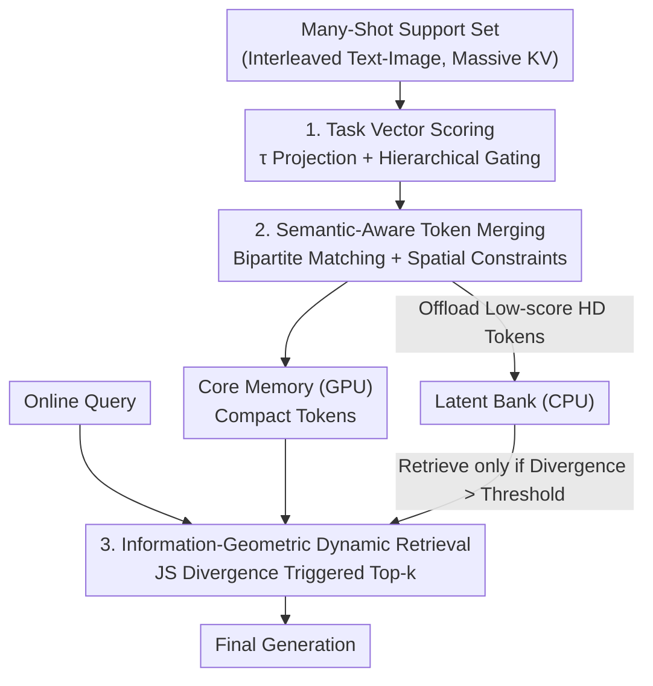

# Task-Aware Structured Memory for Dynamic Multi-modal In-Context Learning

**Conference**: ICML 2026  
**arXiv**: [2606.11853](https://arxiv.org/abs/2606.11853)  
**Code**: To be confirmed  
**Area**: Multi-modal VLM / KV Cache Compression / Multi-modal In-Context Learning  
**Keywords**: Multi-modal ICL, KV cache compression, Task vector, token merging, dynamic retrieval

## TL;DR
To address the KV cache explosion in multi-modal many-shot in-context learning, TASM proposes a training-free framework: using "task vectors" instead of sample-specific attention for scoring (de-biasing), bipartite graph matching for semantic-aware token merging rather than hard pruning (topology preservation), and hierarchical dynamic retrieval triggered by JS divergence (allowing compressed details to be recalled when needed). It reduces VRAM usage by up to 80% while maintaining performance close to full-context.

## Background & Motivation
**Background**: Multi-modal Large Language Models (MLLMs) adapt to new tasks rapidly through In-Context Learning (ICL). Since performance grows log-linearly with the number of examples, "Many-Shot" learning has become a powerful alternative to fine-tuning, particularly for data-scarce tasks.

**Limitations of Prior Work**: Many-shot ICL requires processing thousands of images, generating KV caches that exhaust GPU VRAM and cause latency spikes. Text-domain cache compression methods (H2O, SnapKV, PyramidKV) rely on hard pruning that discards low-attention tokens. When applied to multi-modal contexts, these methods fail; as shown in vision experiments, methods like EMLoC suffer significant performance drops in spatial localization and temporal reasoning tasks despite saving memory.

**Key Challenge**: Existing multi-modal compression methods have three structural flaws. ① **Sample-specific bias**: Scoring via attention from a specific example answer overfits to that example, often deleting context "useless for that example but critical for the test query." ② **Topological destruction**: Visual tokens possess intrinsic 2D spatial/semantic structures; Top-K hard pruning tears this information manifold, destroying spatial relationships required for localization tasks. ③ **Static memory rigidity**: Once compressed, the cache is fixed, making it impossible to retrieve discarded information for complex queries requiring fine-grained details.

**Goal**: Reconceptualize the KV cache from a "passive buffer" into a "structured representation of the task," achieving task-awareness (de-biasing), structure preservation (manifold maintenance), and dynamic accessibility (retrievability).

**Key Insight**: Importance is task-dependent and should be determined by the "transformation direction of the task itself" rather than specific example attention. Furthermore, compression should not be mere discarding but "merging information together while maintaining spatial locality."

**Core Idea**: Task vector scoring + Semantic-aware token merging + Information-geometric dynamic retrieval. This three-part suite is entirely training-free.

## Method

### Overall Architecture
TASM is a training-free framework divided into **offline compression** and **online inference**. In the offline phase, a frozen MLLM processes the support set. First, a global task vector $\boldsymbol{\tau}$ is extracted from few-shot examples to score the importance of each cached token. High-scoring tokens undergo semantic-aware merging (in latent KV space, not pixel space) into compact tokens stored in the GPU-resident Core Memory, while low-scoring high-resolution tokens are offloaded to the CPU-resident Latent Bank. In the online phase, when a new query arrives, a JS divergence-based dynamic gate determines if the model is "looking at a new subspace." If so, supplemental context is retrieved from the Latent Bank for final generation. No parameters are updated throughout the process. Formally, the goal is to find a compression operator $\Phi_t:\mathcal{C}_t\to\hat{\mathcal{C}}_t$ that minimizes the KL divergence between full and compressed context prediction distributions under the budget constraint $|\hat{\mathcal{C}}_t|\le B\ll T$.

### Key Designs

**1. Task Vector Guided Importance Estimation: Scoring by Task Direction rather than Sample Attention**

Attention-based importance measures (H2O, EMLoC) are easily deceived by "attention sinks"—tokens like punctuation that have high attention but are semantically empty. TASM argues that true semantic importance is determined by "alignment with the task transformation direction." It utilizes few-shot Q&A pairs $\mathcal{S}_{\text{few}}=\{(\mathbf{Q}^{(n)},\mathbf{A}^{(n)})\}$ in the ICL context to calculate semantic centroids $\boldsymbol{\mu}_{\mathbf{Q},l}$ and $\boldsymbol{\mu}_{\mathbf{A},l}$ at layer $l$. The normalized difference vector is treated as the task vector, encoding the reasoning direction "from question to answer":

$$\boldsymbol{\tau}_l=\frac{\boldsymbol{\mu}_{\mathbf{A},l}-\boldsymbol{\mu}_{\mathbf{Q},l}}{\|\boldsymbol{\mu}_{\mathbf{A},l}-\boldsymbol{\mu}_{\mathbf{Q},l}\|_2}$$

The task score of a token is obtained by projecting its key onto the task vector, combined with a value norm term to capture information quantity: $s_{i,l}^{\text{task}}=\text{ReLU}(\frac{\mathbf{k}_{i,l}^{\top}\boldsymbol{\tau}_l}{\|\mathbf{k}_{i,l}\|})+\gamma\frac{\|\mathbf{v}_{i,l}\|_2}{\max_j\|\mathbf{v}_{j,l}\|_2}$, where ReLU ensures priority for tokens positively aligned with the task. Since shallow layers process local high-frequency features (syntax, edges), relying solely on the task vector might lose local context. Thus, a layer-adaptive gate $\lambda(l)$ interpolates between local attention scores and global task scores: $\mathcal{S}_{i,l}=\lambda(l)\cdot s_{i,l}^{\text{task}}+(1-\lambda(l))\cdot s_{i,l}^{\text{attn}}$, where $\lambda(l)=\alpha+\beta\cdot\sigma(\kappa(\frac{l}{L}-0.5))$ is a shifted sigmoid. This allows weights to transition smoothly from "attention-dominant" in shallow layers ($\lambda\approx0.1$) to "task-vector-dominant" in deep layers ($\lambda\approx0.9$, with $\alpha{=}0.1,\beta{=}0.8,\kappa{=}10$). This scoring decodes "importance" from single examples into general reasoning patterns, fundamentally addressing sample bias.

**2. Semantic-Aware Token Merging: Replacing Hard Pruning with Topology-Preserving Graph Matching**

Traditional hard Top-K pruning $\hat{\mathcal{C}}=\{c_i\mid\text{rank}(S_i)\le K\}$ is destructive to visual representations, where information is distributed across adjacent patches. Deleting "redundant" background patches tears the 2D manifold that convolutional-style attention heads rely on. TASM treats compression as graph matching: tokens are divided into high-score Sink nodes $\mathcal{U}_{\text{sink}}$ and low-score Source nodes $\mathcal{U}_{\text{src}}$ to be merged. It solves for an optimal assignment matrix $\mathbf{M}$ under the objective $\max_{\mathbf{M}}\sum_{i,j}M_{ij}w_{ij}$, where each source maps to at most one sink. Crucially, edge weights include spatial constraints: for visual tokens with spatio-temporal coordinates $\mathbf{p}=(t,h,w)$, a spatial regularization $\Psi(i,j)$ is added (0 if $\|\mathbf{p}_i-\mathbf{p}_j\|_1\le\Delta_{\text{win}}$, else $-\infty$). Thus, the unified compatibility $w_{ij}=\cos(\mathbf{k}_i,\mathbf{k}_j)+\Psi(i,j)\cdot\mathbb{I}(i,j\in\mathcal{V}_{\text{visual}})$ forces visual tokens to merge only with spatial neighbors, preserving local geometry. Merging involves weighted aggregation: sink tokens are updated to the weighted centroids of their clusters $\hat{\mathbf{k}}_j=\frac{1}{Z_j}(\mathbf{k}_j+\sum_{i}M_{ij}e^{w_{ij}}\mathbf{k}_i)$, effectively acting as a dynamic pooling layer that concentrates information rather than deleting it.

**3. Information-Geometric Dynamic Retrieval: Recalling Discarded Details via JS Divergence**

To handle near-infinite context within a fixed budget $B$, TASM implements hierarchical memory: high-bandwidth Core Memory $\mathcal{M}_{\text{core}}$ (GPU) + high-capacity Latent Bank $\mathcal{M}_{\text{latent}}$ (CPU). Instead of wasteful static or periodic retrieval, TASM uses the stability of the attention distribution as a trigger. Let $P_{\text{ref}}$ be the attention distribution over Core Memory at step $t-1$ and $P_t$ at step $t$. Symmetrical JS divergence $D_{\text{JS}}(P_t\|P_{\text{ref}})=\frac{1}{2}D_{\text{KL}}(P_t\|\mathcal{D})+\frac{1}{2}D_{\text{KL}}(P_{\text{ref}}\|\mathcal{D})$ (where $\mathcal{D}$ is the mixture distribution) measures distribution drift. High divergence implies the current query is looking at a new subspace, necessitating retrieval from the Latent Bank. A binary retrieval gate $g_t=\mathbb{I}(D_{\text{JS}}>\epsilon)$ is defined; when triggered, top-$k$ retrieval targets relevant historical tokens from the Latent Bank, dynamically expanding the active cache to $\mathcal{C}_t=\mathcal{M}_{\text{core}}\cup\mathcal{K}_{\text{retrieved}}$. This ensures long-term history is accessed only when semantically necessary, maintaining $\mathcal{O}(1)$ average complexity for most steps and reducing overall attention complexity from $\mathcal{O}(T^2)$ to $\mathcal{O}(T\cdot(N_{\text{core}}+N_{\text{ret}}))$, which is quasi-linear expansion given bounded budgets.

## Key Experimental Results

### Main Results
Evaluated using Qwen2-VL-7B-Instruct as the base (with generalization verified on LLaVA-NeXT-Video and InternVL3) on 4×A800 (80GB), covering nine vision-language benchmarks. Key hyperparameters: interpolation weight $\alpha{=}0.3$; spatial window $3\times3$; similarity threshold 0.5; Core 20% / Latent Bank 40%; retrieval threshold $\delta{=}0.002$ with top-96. Comparison targets: Full-Context, EMLoC, SnapKV, FastV, SparseVLM.

| Task (200 Examples) | MLoC (Full Context) | EMLoC | TASM (Ours) |
|------|------|-------|------|
| ImageNet100 | 62.6 | 63.6 | **65.0** |
| ScreenSpot (Spatial) | 18.2 | 18.3 | **19.5** |
| MME-RealWorld | 41.1 | 42.2 | **43.5** |
| IllusionVQA | 40.9 | 40.9 | **42.0** |
| OK-VQA | 58.6 | 58.7 | **60.1** |
| YouCook2 (Temporal) | 108.8 | 102.0 | **109.5** |
| Avg. Context Length (ImageNet100) | 16264 | 3643 | 3485 |

On ImageNet100, TASM reduces average context from 16,264 to 3,485 (**78.6% reduction**). While EMLoC drops to 102.0 on the temporal task YouCook2, TASM recovers and exceeds full-context performance at 109.5 with lower GPU memory usage (6,060 vs EMLoC 6,218 tokens)—indicating that dynamic retrieval of fine-grained temporal details is more efficient than static pruning. The clear advantage on ScreenSpot (19.5 vs 18.3) validates the hypothesis that hard pruning destroys visual manifolds while semantic merging preserves topology.

### Ablation Study (V-NIAH Long-Context Stress Test)
Visual Needle-in-a-Haystack tests the ability to retrieve fine-grained visual details from massive contexts:

| Method | 10 Images | 50 Images | 100 Images | 200 Images | Average |
|------|------|------|-------|-------|------|
| Full Context | 96.5 | 94.2 | OOM | OOM | - |
| SparseVLM | 85.2 | 42.1 | 15.6 | 8.4 | 37.8 |
| FastV | 82.4 | 38.5 | 12.3 | 7.1 | 35.1 |
| EMLoC | 91.0 | 68.3 | 35.2 | 18.9 | 53.4 |
| TASM (Ours) | **95.8** | **80.4** | **49.1** | **45.5** | **67.7** |

Full context OOMs at 100 images. Hard pruning methods (SparseVLM/FastV) collapse as the haystack grows (dropping to single digits at 200 images), and EMLoC falls to 18.9. TASM maintains 45.5 at 200 images, with an average of 67.7, significantly outperforming all baselines. This reinforces the advantage of dynamic retrieval + topology-preserving merging in ultra-long contexts.

### Key Findings
- **Multi-modal Scaling Law (ImageNet-100, 0→300 Examples)**: EMLoC saturates or even declines between 200 and 300 examples (63.7%→62.6%), suggesting hard pruning mis-deletes critical semantics in ultra-long contexts. TASM maintains log-linear growth, peaking at 66.8% at 300 examples.
- **Synergy of the Trio**: Task vectors address sample bias; semantic merging preserves spatial topology (benefiting ScreenSpot); dynamic retrieval recovers temporal details (outperforming full context on YouCook2).
- **Training-free Convenience**: Enables long-context adaptation on consumer-grade or standard hardware without any training.

## Highlights & Insights
- **"Task Direction" over "Sample Attention"**: Using the centroid difference of Q&A pairs as a task vector to estimate KV importance is a novel and natural migration of task vectors from "steering weights" to "managing memory," fundamentally bypassing attention sinks and sample overfitting.
- **Compression as Merging, not Deletion**: Reformulating hard pruning as bipartite graph matching with spatial constraints ensures visual tokens merge only with spatial neighbors. This concentration of information rather than deletion is the key to maintaining performance in spatial and temporal tasks.
- **JS Divergence as a Retrieval Trigger**: Using shifts in attention distribution to decide when to consult long-term memory allows for an on-demand retrieval mechanism. Most steps maintain $\mathcal{O}(1)$ complexity, an information-geometric approach that is highly efficient.
- **Training-Free Deployment**: Since no parameters are updated, TASM can be directly applied to any frozen MLLM, lowering the barrier for deployment in various long-context multi-modal reasoning scenarios.

## Limitations & Future Work
- Task vector extraction relies on clear Q/A partitioning within the few-shot examples; its representativeness may be questionable in scenarios lacking clear structures or with high task direction drift.
- Numerous hyperparameters ($\alpha,\gamma,\kappa$, $\Delta_{\text{win}}$, similarity threshold, Core/Bank ratios, $\delta$, top-$k$) are determined through empirical ablation; robustness across tasks/models and tuning costs were not fully detailed.
- Offloading the Latent Bank to the CPU introduces CPU-GPU transfer latency during retrieval, which may become a bottleneck in high-frequency trigger scenarios. Analysis of end-to-end wall-clock latency is less detailed than context/VRAM analysis.
- Future Directions: Updating task vectors online during generation to adapt to task drift; making the JS trigger threshold adaptive to balance recall quality and transfer overhead.

## Related Work & Insights
- **vs EMLoC (Primary Multi-modal Baseline)**: EMLoC uses "answer-aware attention" for retrieval + hard pruning, which carries sample bias and severs visual dependencies. TASM dominates across the board—especially in spatial, temporal, and ultra-long contexts—due to task vectors (de-biasing) + semantic merging (topology preservation) + dynamic recall.
- **vs H2O / SnapKV / PyramidKV (Text KV Pruning)**: These are effective for text by discarding low-attention tokens, but hard pruning destroys visual 2D manifolds in multi-modal contexts. TASM specifically designs spatial constraint merging for visual manifolds.
- **vs Huang et al. (Task Vectors)**: While prior work used task vectors to steer model weights during inference, TASM is the first to apply the concept to memory management by estimating KV importance for cache compression without altering parameters.

## Rating
- Novelty: ⭐⭐⭐⭐⭐ Integration of task vectors for memory, topology-preserving merging, and JS-triggered retrieval is both novel and self-consistent.
- Experimental Thoroughness: ⭐⭐⭐⭐ Extensive benchmarks, V-NIAH stress tests, scaling laws, and cross-model validation. Detailed wall-clock latency analysis is a minor missing piece.
- Writing Quality: ⭐⭐⭐⭐ Clear logic from flaws to innovations, complete formulas, and good alignment between text and figures.
- Value: ⭐⭐⭐⭐⭐ High practical utility for many-shot multi-modal ICL, reducing VRAM by 80% while approaching full-context performance without training.

<!-- RELATED:START -->

## Related Papers

- [\[CVPR 2026\] TempR1: Improving Temporal Understanding of MLLMs via Temporal-Aware Multi-Task Reinforcement Learning](../../CVPR2026/multimodal_vlm/tempr1_improving_temporal_understanding_of_mllms_via_temporal-aware_multi-task_r.md)
- [\[ICLR 2026\] TableDART: Dynamic Adaptive Multi-Modal Routing for Table Understanding](../../ICLR2026/multimodal_vlm/tabledart_dynamic_adaptive_multi-modal_routing_for_table_understanding.md)
- [\[ICML 2026\] CyberJurors: A Multi-Agent Simulation Task for E-Commerce Disputes Verdict](cyberjurors_a_multi-agent_simulation_task_for_e-commerce_disputes_verdict.md)
- [\[CVPR 2026\] Cluster-aware Anchor Learning for Multi-View Clustering](../../CVPR2026/multimodal_vlm/cluster-aware_anchor_learning_for_multi-view_clustering.md)
- [\[ICLR 2026\] Multi-modal Data Spectrum: Multi-modal Datasets are Multi-dimensional](../../ICLR2026/multimodal_vlm/multi-modal_data_spectrum_multi-modal_datasets_are_multi-dimensional.md)

<!-- RELATED:END -->
