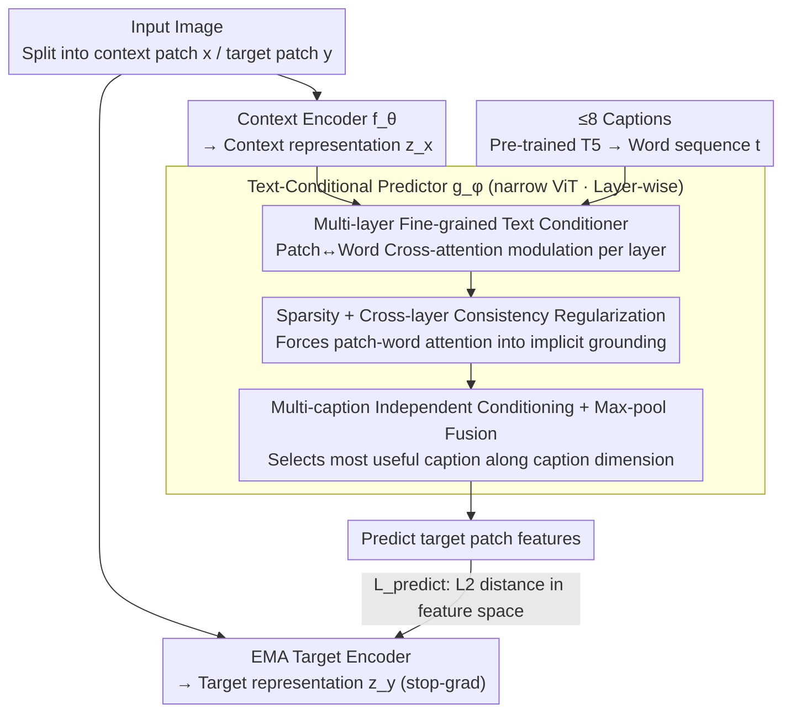

# Text-Conditional JEPA for Learning Semantically Rich Visual Representations

**Conference**: ICML 2026  
**arXiv**: [2605.03245](https://arxiv.org/abs/2605.03245)  
**Code**: None  
**Area**: Multimodal VLM / Self-Supervised Representation Learning  
**Keywords**: JEPA, text-conditional, feature prediction, fine-grained vision-language, cross-attention

## TL;DR
This paper proposes TC-JEPA, which additionally conditions the I-JEPA masked feature predictor on image captions. Through multi-layer sparse cross-attention, patch representations become predictable under text "prompts," thereby learning semantically richer visual representations that are particularly friendly to dense prediction tasks without using contrastive loss.

## Background & Motivation

**Background**: Visual self-supervised learning is currently dominated by two categories of methods. One is invariance-based methods (DINO, MoCo v3, iBOT, etc.), which learn high-level semantics by aligning representations of different augmented views of the same image. The other is Masked Image Modeling (MIM), represented by I-JEPA, which predicts masked patch features in the latent space; compared to pixel reconstruction methods like MAE, it better balances local structure with high-level semantics.

**Limitations of Prior Work**: The core pretext task of I-JEPA suffers from inherent uncertainty—given context patches to predict features at a masked location, there are many plausible answers (e.g., a masked area in a dog image could be a bookshelf or a clean wall). This ambiguity makes training highly sensitive to masking strategies. When mutual information between context and target is low, feature prediction degrades, or representation collapse may occur. Existing fixes like positional conditional encoders or stochastic positional encoding do not introduce new sources of information.

**Key Challenge**: JEPA aims to "replace alignment with prediction," but image signals alone cannot eliminate the multimodal ambiguity of masked regions. If ambiguity is not resolved, the prediction target will not converge to semantically meaningful representations.

**Goal**: (i) Inject an additional information source into the JEPA predictor to reduce prediction uncertainty; (ii) learn finer-grained vision-language alignment than CLIP/SigLIP without introducing contrastive loss or relying on grounding annotations.

**Key Insight**: Human-written or synthetic captions almost always describe scene composition ("dog + bookshelf"), which tells the model what the masked region "should be." Feeding this supervision to the predictor rather than the encoder allows the model to compress the prediction distribution while preserving the JEPA representation structure.

**Core Idea**: Replace the original JEPA predictor with a fine-grained "text-conditional predictor"—patch features are no longer unconditional feature vectors but predictable latent variables "modulated" by caption word sequences. Captions are used only during pre-training and discarded during downstream inference.

## Method

### Overall Architecture
TC-JEPA follows the structural framework of I-JEPA: an image is divided into context patches $x$ and target patches $y$. The context encoder $f_\theta$ and EMA target encoder $f_{\bar\theta}$ produce $z_x$ and $z_y$, respectively. A narrow ViT predictor $g_\phi$ predicts $\hat z_y$ at masked token positions. The training loss is $\mathcal{L}_{\text{predict}}=\frac{1}{|B_y|}\sum_j\|\hat z_{y_j}-z_{y_j}\|_2$. The key change is: $g_\phi$ simultaneously takes a set (up to $N=8$) of captions as input. A pre-trained T5 maps each caption into a word sequence $t\in\mathbb{R}^{d_t \times S}$. Cross-attention modulation on $t$ is added to the patch representations at every layer of the predictor. The entire pipeline is trained only with feature prediction loss, without contrastive loss or grounding boxes. The three core modifications are concentrated inside the predictor—layer-wise text conditioning, sparsity + consistency regularization, and multi-caption max-pool fusion—while the encoder and EMA target branch follow I-JEPA.

### Key Designs

**1. Multi-layer Fine-grained Text Conditioner: Allowing each patch to select relevant words for prediction**

The root cause of I-JEPA's issues is that "predicting masked features from context" is highly under-determined—a masked spot in a dog image could be a bookshelf or a wall. This ambiguity is so large that training is sensitive to masking or may collapse. Captions tell the model what that area "should be," so this work feeds text into the **predictor** rather than the encoder. Specifically, at each layer of the predictor, patch features $q \in \{\hat z_x^{(l)}, \hat z_y^{(l)}\}$ perform a lightweight cross-attention with the caption word sequence $t$: $q^{(l)}=W_Q^{(l)}q$, $K^{(l)}=W_K^{(l)}t$, $V^{(l)}=W_V^{(l)}t$, followed by a residual update $q \leftarrow q + \sum_s \text{softmax}(q^{(l)\top}K_{:,s}^{(l)})V_{:,s}^{(l)}$, and then an MLP + LayerNorm.

Compared to "sequence conditioning" (appending captions as tokens to the predictor input), layer-wise cross-attention does not lengthen the ViT sequence and continuously injects text signals across all layers rather than just the first. The core argument is to make patch representations "predictable under text prompts," so the condition must penetrate every layer to develop sparse correspondences between patches and words, which in turn constrains patch representations to align with language.

**2. Sparsity + Cross-layer Consistency Regularization: Forcing cross-attention into implicit visual grounding**

Without explicit grounding supervision, cross-attention can easily degenerate into a meaningless average across all words. This paper calculates patch-word cosine similarity $O_i^{(l)}=\max(\cos(q^{(l)},K^{(l)}),0)$ for each patch and applies two constraints: first, an $\ell_1$ sparsity penalty $\mathcal{L}_{\text{sparse}}=\frac{1}{|B_x|+|B_y|}\sum_i\frac{1}{L}\sum_l\|O_i^{(l)}\|_1$, forcing each patch to select only a few key words; second, cross-layer consistency $\mathcal{L}_{\text{consistency}}=\frac{1}{|B_x|+|B_y|}\sum_i\frac{1}{L}\sum_l\|O_i^{(l)}-\bar O_i\|_1$ (where $\bar O_i = \frac{1}{L}\sum_l O_i^{(l)}$), forcing the same patch to select stable words across layers.

Together, these constraints push training toward "each patch corresponding to stable relevant words," effectively constructing implicit visual grounding without labels, allowing text conditioning to truly assist the prediction task. Ablations show that removing these terms causes attention to degenerate into uniformity.

**3. Multi-caption Independent Conditioning + Feature-level Max-pool Fusion: Preserving perspectives and selecting the most useful one**

An image often has multiple captions. Concatenating them into a long sentence causes interference between different conditional signals for the same patch. Instead, this paper conditions the predictor on each caption independently: at layer $l$, $\hat z_{y_{j,n}}^{(l)}$ and $\hat z_{x_{i,n}}^{(l)}$ are calculated for the $n$-th caption $t^n$. Then, a max-pool is applied along the caption dimension $n$ to produce the layer output for the next layer. This preserves diverse perspectives from each caption while naturally selecting the "most useful" one for each patch.

The final training objective combines three terms ($N$ is the number of captions, $\lambda=0.1, \beta=0.5$):

$$\mathcal{L}=\mathcal{L}_{\text{predict}}+\frac{\lambda}{N}\sum_n\mathcal{L}_{\text{sparse}}^n+\frac{\beta}{N}\sum_n\mathcal{L}_{\text{consistency}}^n$$

Ablations show multi-caption max-pooling significantly outperforms a single caption ($N=1$) because one caption rarely covers all visual details.

### Loss & Training
The total loss includes feature prediction, sparsity, and consistency terms. The target encoder uses EMA + stop-gradient to prevent collapse. Pre-training datasets comprise IN-1k / IN-21k (with 8.3–8.7 captions/image synthesized via ShareGPT4V) and CC12M+YFCC15M image-text pairs. Backbones include ViT-B/16, ViT-L/16, and ViT-H/14. IN-21k is trained for 600–300 epochs. Hyperparameters for $\lambda, \beta$ are stable.

## Key Experimental Results

### Main Results

| Task | Model / Data | I-JEPA / StoP | TC-JEPA | Gain |
|------|------------|---------------|---------|------|
| IN-1k linear (ViT-H/14, IN-1k) | Top-1 | 79.3 / 79.6 | 80.4 | +1.1 |
| IN-1k linear (ViT-L/16, IN-21k) | Top-1 | 77.2 (I-JEPA) | 82.1 | +4.9 |
| ADE20k mIoU (linear, ViT-H/14) | mIoU | 36.9 / 36.6 | 39.5 | +2.6 |
| COCO det (ViT-H/14) | AP$^b$ | 53.7 / 53.5 | 55.2 | +1.5 |
| ADE20k mIoU (ViT-L/16, CC27M) | mIoU | – | 42.1 | New SOTA |
| vs SigLIP2 (ViT-L/16, ADE20k mIoU) | mIoU | 24.6 | 41.2 | +16.6 |

The second table compares image-text pre-training: TC-JEPA on IN-21k achieves ADE20k mIoU exceeding DINOv2 (41.8) which uses 5× more distillation data, and Web-DINO (40.3) with 75× more data. Using CC27M, it reaches 42.1, significantly better for dense tasks than same-data CLIP/SigLIP.

### Ablation Study

| Configuration | IN-1k Top-1 / ADE20k mIoU | Description |
|------|---------------------------|------|
| Full TC-JEPA (ViT-L/16, IN-21k) | 82.1 / 41.2 | Complete method |
| w/o sparse + consistency | Significant drop | Patch-word attention degenerates; text modulation fails |
| Sequence conditioning | Weaker than cross-attn | Conditioning only at shallow layers; sequence length overhead |
| Single caption ($N=1$) | Weaker than $N=8$ max-pool | Hard to cover all details; max-pool provides clear benefit |
| I-JEPA baseline | 77.2 / 38.2 | No text conditioning |

### Key Findings
- Text conditioning yields much higher gains for dense tasks (segmentation, detection) than classification, suggesting that reduced prediction uncertainty primarily improves local patch feature quality—addressing a weakness in contrastive methods like SigLIP.
- On IN-21k, TC-JEPA's ADE20k mIoU matches Franca (which combines invariance + MIM), proving fine-grained text conditioning can replace handcrafted invariance constraints.
- TC-JEPA's scaling curve consistently stays above I-JEPA as data increases. While I-JEPA lacks clear scaling on IN-1k classification, text signals provide the key to stable scaling.

## Highlights & Insights
- Placing "text" in the predictor instead of the encoder is a pivotal shift: the encoder is no longer compressed into a global abstraction like CLIP; patch features retain visual details but become latent variables "predictable under text prompts." At inference, the text is discarded, maintaining compatibility with pure visual backbones.
- Using gentle sparsity and consistency regularizations to push cross-attention toward implicit visual grounding avoids heavy reliance on grounding data. This idea of "driving attention toward semantic alignment via auxiliary losses" can be generalized to any cross-modal alignment pre-training.
- Multi-caption max-pool fusion is a practical trick: it avoids the problem of a patch being simultaneously interfered with by multiple captions, and performing fusion in the feature space rather than token space is low-cost and provides inherent sparse selection.

## Limitations & Future Work
- TC-JEPA requires 5–10 synthetic captions per image; it is sensitive to caption quality and quantity, and the LMM cost for synthetic captions can be significant for industrial deployment.
- Text conditioning exists only during pre-training. Downstream inference cannot explicitly use text prompts for zero-shot retrieval/classification, thus IN-1k zero-shot performance still lags behind dedicated contrastive methods.
- Multi-layer cross-attention and multiple captions increase predictor computation; stability and cost when scaling to ViT-G levels remain to be verified.
- The paper does not deeply discuss how biases or hallucinations in synthetic captions might pollute representations.

## Related Work & Insights
- **vs I-JEPA / StoP / CAPI**: All belong to latent MIM, but TC-JEPA shifts the "uncertainty" problem from architectural tricks (positional conditioning, cluster prediction) to "introducing a new information source (text)," which is more direct and effective.
- **vs CLIP / SigLIP**: Also uses image-caption pairs, but TC-JEPA uses no contrastive loss. The feature space is not flattened by global alignment, leading to significant leads in dense tasks, though it loses direct zero-shot retrieval capabilities.
- **vs DINOv2 / iBOT / Franca**: These rely on "invariance + MIM" and require carefully designed augmentations. TC-JEPA replaces augmentations with text conditioning, matching or exceeding Franca's mIoU on IN-21k, suggesting "language can be a form of data augmentation."
- **vs SPARC / DreamLIP**: These use fine-grained contrastive methods with synthetic captions. TC-JEPA treats captions as predictor conditions rather than contrastive targets, making it friendlier to dense tasks.

## Rating
- Novelty: ⭐⭐⭐⭐ Injecting captions into the JEPA predictor is a natural but previously under-explored direction. The combination of cross-attention, sparsity, and max-pool is a solid engineering contribution.
- Experimental Thoroughness: ⭐⭐⭐⭐ Covers 3 model scales, 3 data scales, and multiple tasks (classification/detection/segmentation) with systematic comparisons against MIM, invariance, and contrastive methods.
- Writing Quality: ⭐⭐⭐⭐ Clear motivation and well-integrated figures/formulas, though some sections are compressed to fit the 8-page limit.
- Value: ⭐⭐⭐⭐ Opens a "weakly-supervised text" scaling path for the JEPA family, holding high value for dense prediction and downstream applications of visual foundation models.

<!-- RELATED:START -->

## Related Papers

- [\[CVPR 2026\] Learning complete and explainable visual representations from itemized text supervision](../../CVPR2026/multimodal_vlm/learning_complete_and_explainable_visual_representations_from_itemized_text_supe.md)
- [\[ICML 2026\] CHARM: 用 Multimodal JEPA + 通道描述做时间序列 foundation embedding](giving_sensors_a_voice_multimodal_jepa_for_semantic_time-series_embeddings.md)
- [\[ICML 2026\] Conditional Diffusion Sampling](conditional_diffusion_sampling.md)
- [\[ICML 2025\] M3-JEPA: Multimodal Alignment via Multi-gate MoE based on JEPA](../../ICML2025/multimodal_vlm/m3-jepa_multimodal_alignment_via_multi-gate_moe_based_on_the_joint-embedding_pre.md)
- [\[ICML 2026\] Toward Structural Multimodal Representations: Specialization, Selection, and Sparsification via Mixture-of-Experts](toward_structural_multimodal_representations_specialization_selection_and_sparsi.md)

<!-- RELATED:END -->
