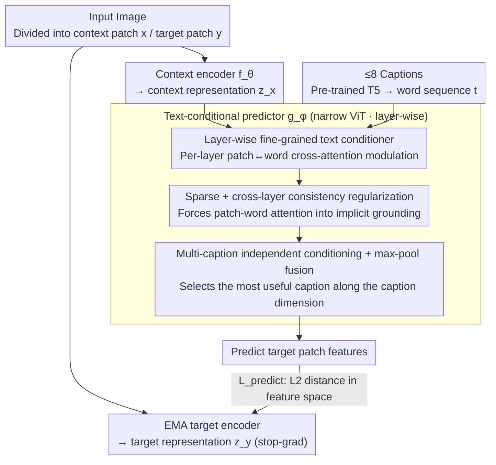

# Text-Conditional JEPA for Learning Semantically Rich Visual Representations

**Conference**: ICML 2026  
**arXiv**: [2605.03245](https://arxiv.org/abs/2605.03245)  
**Code**: None  
**Area**: Multimodal VLM / Self-supervised Representation Learning  
**Keywords**: JEPA, Text-conditional, Feature prediction, Fine-grained vision-language, Cross-attention

## TL;DR
This paper proposes TC-JEPA, which further conditions the I-JEPA mask feature predictor on image captions. Through multi-layer sparse cross-attention, patch representations become predictable under textual "prompts." This enables the learning of semantically richer visual representations particularly beneficial for dense prediction without using contrastive loss.

## Background & Motivation

**Background**: Visual self-supervised learning is currently dominated by two categories. One is invariance methods (DINO, MoCo v3, iBOT, etc.), which learn high-level semantics by making representations of different augmented views of the same image consistent. The other is Masked Image Modeling (MIM), represented by I-JEPA, which predicts features of masked patches in the feature space, balancing local structure and high-level semantics more effectively than pixel-reconstruction methods like MAE.

**Limitations of Prior Work**: The core pretext task of I-JEPA possesses inherent uncertainty—given context patches to predict features at a specific masked location, many reasonable answers exist (e.g., in an image of a dog, a masked region could be either a bookshelf or a clean wall). This ambiguity makes training extremely sensitive to masking strategies; when the mutual information between the context and target is low, feature prediction degrades or representation collapse occurs. Existing fixes such as positional conditioning encoders or random phase encoding do not introduce new information sources.

**Key Challenge**: JEPA aims to "replace alignment with prediction," but using only image signals cannot eliminate the multi-modal ambiguity of masked regions. Without resolving this ambiguity, the prediction target does not converge to semantically meaningful representations.

**Goal**: (i) Inject an additional information source into the JEPA predictor to reduce prediction uncertainty; (ii) learn finer-grained vision-language alignment than CLIP/SigLIP without introducing contrastive loss or relying on grounding annotations.

**Key Insight**: Human or synthetic image captions almost always describe scene composition ("dog + bookshelf"), which tells the model what the masked region "should be." Feeding this supervision to the predictor rather than the encoder preserves the structural properties of JEPA representations while significantly compressing the prediction distribution.

**Core Idea**: Replace the original JEPA predictor with a fine-grained "text-conditional predictor." Patch features are no longer unconditional feature vectors but predictable latent variables "modulated" by caption word sequences; captions are used only during the pre-training phase and discarded during downstream inference.

## Method

### Overall Architecture
TC-JEPA follows the I-JEPA architecture: an image is divided into context patches $x$ and target patches $y$. The context encoder $f_\theta$ and the EMA target encoder $f_{\bar\theta}$ produce $z_x$ and $z_y$, respectively. A narrow ViT predictor $g_\phi$ predicts $\hat z_y$ at the mask token positions. The training loss is $\mathcal{L}_{\text{predict}}=\frac{1}{|B_y|}\sum_j\|\hat z_{y_j}-z_{y_j}\|_2$. The key change is feeding a set (up to $N=8$) of captions into $g_\phi$, where each caption is mapped to a word sequence $t\in\mathbb{R}^{d_t\times S}$ via a pre-trained T5. Cross-attention modulation on $t$ is applied to the patch representations at every layer of the predictor. The entire pipeline is trained using only feature prediction loss, without contrastive loss or grounding boxes. The three core modifications are localized within the predictor: layer-wise text conditioning, sparse + consistency regularization, and multi-caption max-pool fusion. The encoder and EMA target branches remain identical to I-JEPA.

### Key Designs

**1. Layer-wise Fine-grained Text Conditioner: Allowing each patch to select relevant words for prediction**

The root problem of I-JEPA is that "predicting masked features given context patches" is inherently ill-posed. Captions specify what that region "should be," so this work feeds text into the **predictor** rather than the encoder. Specifically, at each layer of the predictor, patch features $q\in\{\hat z_x^{(l)}, \hat z_y^{(l)}\}$ perform a lightweight cross-attention with the caption word sequence $t$: $q^{(l)}=W_Q^{(l)}q$, $K^{(l)}=W_K^{(l)}t$, $V^{(l)}=W_V^{(l)}t$. Then, $q$ is updated residually: $q\leftarrow q+\sum_s\text{softmax}(q^{(l)\top}K_{:,s}^{(l)})V_{:,s}^{(l)}$, followed by an MLP + LayerNorm.

Compared to "sequence conditioning" (appending captions as tokens to the predictor input), layer-wise cross-attention neither extends the ViT sequence nor limits text signal injection to the initial layers. The authors argue that patch representations must become "predictable under text prompts," requiring text interaction at every layer to foster sparse correspondence between patches and words.

**2. Sparse + Cross-layer Consistency Regularization: Forcing cross-attention into implicit visual grounding**

Without explicit grounding supervision, cross-attention can easily degenerate into a meaningless average across all words. This work calculates patch-word cosine similarity $O_i^{(l)}=\max(\cos(q^{(l)},K^{(l)}),0)$ for each patch and applies two constraints: first, an $\ell_1$ sparsity penalty $\mathcal{L}_{\text{sparse}}=\frac{1}{|B_x|+|B_y|}\sum_i\frac{1}{L}\sum_l\|O_i^{(l)}\|_1$, forcing each patch to select a few key words; second, cross-layer consistency $\mathcal{L}_{\text{consistency}}=\frac{1}{|B_x|+|B_y|}\sum_i\frac{1}{L}\sum_l\|O_i^{(l)}-\bar O_i\|_1$ (where $\bar O_i=\frac{1}{L}\sum_l O_i^{(l)}$), ensuring word selection stability across layers.

Together, these constraints drive the model to associate each patch with stable words, effectively constructing implicit visual grounding without labels.

**3. Multi-caption Independent Conditioning + Feature-level Max-pool Fusion: Preserving perspectives and selecting the most useful**

Images often have multiple captions. Consolidating them into a single string can cause interference. Instead, this work conditions the predictor on each caption independently: at layer $l$, $\hat z_{y_{j,n}}^{(l)}$ and $\hat z_{x_{i,n}}^{(l)}$ are calculated for each caption $t^n$, followed by a max-pool operation across the caption dimension $n$. This preserves distinct perspectives while naturally selecting the most useful caption for each patch.

The final objective combines three terms ($N$ is the number of captions, $\lambda=0.1$, $\beta=0.5$):

$$\mathcal{L}=\mathcal{L}_{\text{predict}}+\frac{\lambda}{N}\sum_n\mathcal{L}_{\text{sparse}}^n+\frac{\beta}{N}\sum_n\mathcal{L}_{\text{consistency}}^n$$

### Loss & Training
The total loss includes feature prediction, sparsity, and consistency terms. The target encoder uses EMA and stop-gradient to prevent collapse. Pre-training datasets include IN-1k / IN-21k (with 8.3–8.7 synthetic captions per image via ShareGPT4V) and CC12M+YFCC15M image-text pairs. The architecture uses ViT-B/16, ViT-L/16, and ViT-H/14 backbones. IN-21k training lasts 600–300 epochs.

## Key Experimental Results

### Main Results

| Task | Model / Data | I-JEPA / StoP | Ours | Gain |
|------|------------|---------------|---------|------|
| IN-1k linear (ViT-H/14, IN-1k) | Top-1 | 79.3 / 79.6 | 80.4 | +1.1 |
| IN-1k linear (ViT-L/16, IN-21k) | Top-1 | 77.2 (I-JEPA) | 82.1 | +4.9 |
| ADE20k mIoU (linear, ViT-H/14) | mIoU | 36.9 / 36.6 | 39.5 | +2.6 |
| COCO det (ViT-H/14) | AP$^b$ | 53.7 / 53.5 | 55.2 | +1.5 |
| ADE20k mIoU (ViT-L/16, CC27M) | mIoU | – | 42.1 | New SOTA |
| vs SigLIP2 (ViT-L/16, ADE20k mIoU) | mIoU | 24.6 | 41.2 | +16.6 |

TC-JEPA on IN-21k surpasses DINOv2 (41.8, trained on 5× more data) and Web-DINO (40.3, trained on 75× more data) in ADE20k mIoU. Trained on CC27M, it yields 42.1, significantly outperforming CLIP/SigLIP for dense tasks on comparable data.

### Ablation Study

| Configuration | IN-1k Top-1 / ADE20k mIoU | Description |
|------|---------------------------|------|
| Full TC-JEPA (ViT-L/16, IN-21k) | 82.1 / 41.2 | Complete method |
| w/o sparse + consistency constraints | Significant Drop | Patch-word attention degenerates; text modulation fails |
| Sequence conditioning (concat caption) | Weaker than cross-attn | Conditioning only at shallow layers; high sequence overhead |
| Single caption ($N=1$) | Weaker than $N=8$ max-pool | Hard for a single caption to cover all visual details |
| I-JEPA baseline | 77.2 / 38.2 | No text conditioning |

### Key Findings
- Text conditioning provides higher gains for dense tasks (segmentation, detection) than classification, suggesting that reducing prediction uncertainty primarily improves local patch quality—addressing a weakness of contrastive methods like SigLIP.
- The ADE20k mIoU of TC-JEPA on IN-21k matches Franca (which combines invariance + MIM), proving that fine-grained text conditioning can replace manually designed invariance constraints.
- TC-JEPA consistently scales better than I-JEPA as data size increases, indicating that textual signals are key to stable scaling.

## Highlights & Insights
- Moving "text" to the predictor instead of the encoder is a key pivot: the encoder is no longer compressed into a CLIP-style global abstraction. Patch features retain visual detail but become latent variables "predictable under text prompts." At inference, the text is discarded, maintaining compatibility with existing vision-only backbones.
- Using mild sparse and consistency regularizations to drive cross-attention into implicit visual grounding avoids reliance on hard grounding data. This "using auxiliary loss to drive semantic attention alignment" is generalizable.
- Multi-caption max-pool fusion is a practical trick: it avoids interference between multiple captions at the same patch and is cost-effective by operating in the feature space.

## Limitations & Future Work
- TC-JEPA requires 5–10 synthetic captions per image; LMM costs for industrial-scale deployment are non-negligible.
- Text conditioning is limited to pre-training; the model cannot explicitly utilize text prompts for zero-shot retrieval/classification during inference, trailing behind contrastive methods in zero-shot tasks.
- Layer-wise cross-attention plus multi-caption processing adds significant computational load to the predictor; scaling to ViT-G levels requires further validation.

## Related Work & Insights
- **vs I-JEPA / StoP / CAPI**: Belongs to latent MIM, but TC-JEPA addresses "uncertainty" by introducing a new information source (text) rather than architectural tricks.
- **vs CLIP / SigLIP**: Uses image-caption pairs but avoids contrastive loss. Consequently, the feature space is not flattened by global alignment, leading to superior dense task performance.
- **vs DINOv2 / iBOT / Franca**: These rely on "invariance + MIM" and hand-crafted augmentation. TC-JEPA suggests that language can serve as a form of data augmentation.
- **vs SPARC / DreamLIP**: Uses synthetic captions for fine-grained contrastive learning, whereas TC-JEPA uses them as predictor conditions.

## Rating
- Novelty: ⭐⭐⭐⭐ Injecting captions into the JEPA predictor is a natural yet previously unexplored direction.
- Experimental Thoroughness: ⭐⭐⭐⭐ Covers 3 model sizes, 3 data scales, and multiple tasks (classification, detection, segmentation).
- Writing Quality: ⭐⭐⭐⭐ Clear motivation and well-integrated formulas/diagrams.
- Value: ⭐⭐⭐⭐ Opens a "weak text supervision" scaling path for the JEPA family.

<!-- RELATED:START -->

1. **V-JEPA**: Video Joint-Embedding Predictive Architecture. ICLR 2024.
2. **I-JEPA**: Self-Supervised Learning from Images with a Joint-Embedding Predictive Architecture. CVPR 2023.
3. **Franca**: Joint Training of Invariance and Masked Image Modeling. NeurIPS 2024.

<!-- RELATED:END -->

## Related Papers

- [\[ICML 2026\] CHARM: 用 Multimodal JEPA + 通道描述做时间序列 foundation embedding](giving_sensors_a_voice_multimodal_jepa_for_semantic_time-series_embeddings.md)
- [\[ICML 2026\] Conditional Diffusion Sampling](conditional_diffusion_sampling.md)
- [\[ICML 2025\] M3-JEPA: Multimodal Alignment via Multi-gate MoE based on JEPA](../../ICML2025/multimodal_vlm/m3-jepa_multimodal_alignment_via_multi-gate_moe_based_on_the_joint-embedding_pre.md)
- [\[CVPR 2026\] BiomedCCPL: Causal Conditional Prompt Learning for Biomedical Vision-Language Models](../../CVPR2026/multimodal_vlm/biomedccpl_causal_conditional_prompt_learning_for_biomedical_vision-language_mod.md)
- [\[AAAI 2026\] Conditional Information Bottleneck for Multimodal Fusion: Overcoming Shortcut Learning in Sarcasm Detection](../../AAAI2026/multimodal_vlm/conditional_information_bottleneck_for_multimodal_fusion_overcoming_shortcut_lea.md)

<!-- RELATED:END -->
