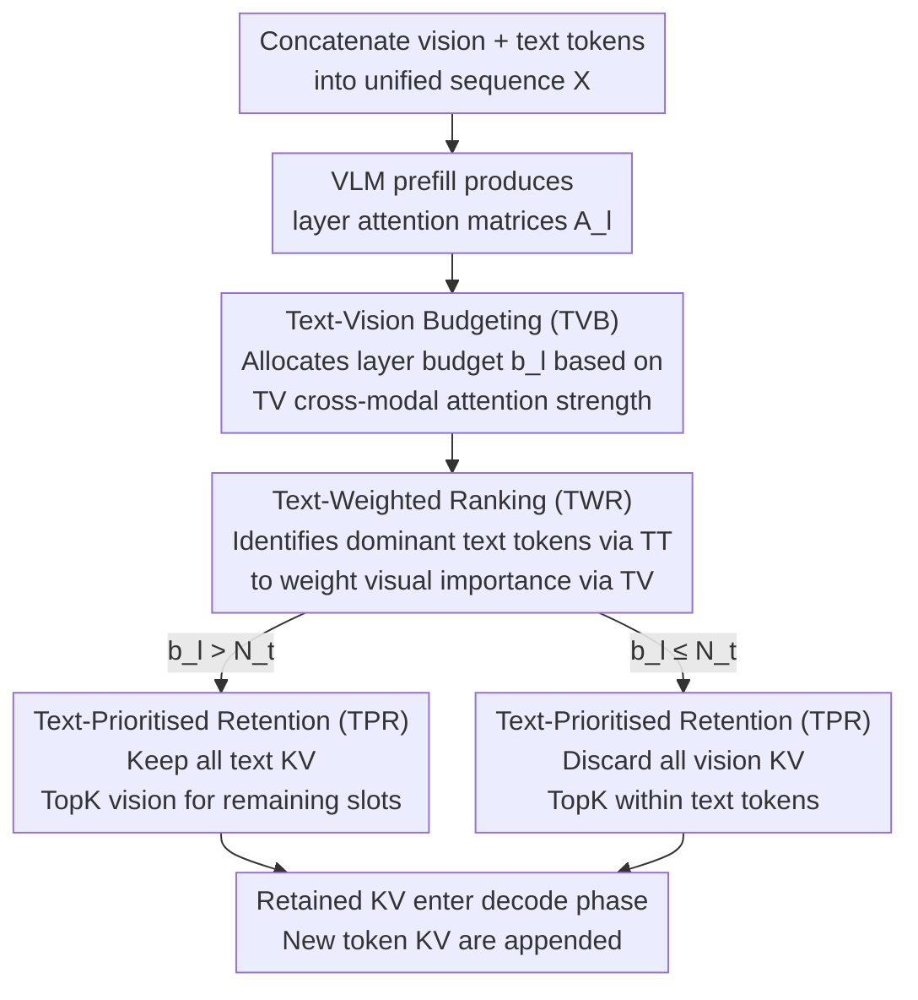

# TGV-KV: Text-Grounded KV Eviction for Vision-Language Models

**Conference**: ICML2026  
**arXiv**: [2606.03075](https://arxiv.org/abs/2606.03075)  
**Code**: "Code Link" provided in the paper, official repository pending open source  
**Area**: Multimodal VLM  
**Keywords**: VLM Inference Acceleration, KV cache eviction, Inter-modal Attention, Text-grounding, Budget Allocation  

## TL;DR
TGV-KV introduces a triplet of mechanisms—layer-wise budgeting based on text-vision attention, re-ranking visual importance using dominant text tokens, and prioritizing text KV during eviction—to successfully migrate KV eviction strategies from LLMs to VLMs. Under a 5% retention rate, it maintains performance near full KV levels on LLaVA-NeXT and Qwen3-VL, while achieving a 52.6% throughput increase.

## Background & Motivation

**Background**: VLMs follow the autoregressive generation paradigm of LLMs, caching K/V for all historical tokens to avoid recomputation. However, high-resolution images and long videos can occupy thousands or even tens of thousands of tokens. The KV cache memory grows linearly with context length, serving as the primary bottleneck in VLM inference. A suite of KV cache eviction methods has been developed for LLMs, such as H2O, SnapKV, PyramidKV, and Ada-KV, which decide which KV to discard based on attention scores or observation windows.

**Limitations of Prior Work**: Directly applying these LLM-verified eviction methods to VLMs leads to severe performance degradation. Experiments on LLaVA with a 5% retention rate show that SnapKV's performance on ChartQA drops from 18.0 to 0.4, becoming almost entirely ineffective. This indicates that importance metrics for LLMs are not applicable to VLMs.

**Key Challenge**: The authors attribute this collapse to the significant "modality gap" in VLMs, verified by three experimental observations: (1) Visual tokens are highly homogeneous, while text tokens are highly diverse; (2) The text-vision cross-modal attention region is a "low attention valley," with intra-modal attention being much stronger than cross-modal attention; (3) When cumulative attention across all layers is summed, sharp jumps occur at the text-vision boundary, causing most text KV to be evicted first when sorting by "cumulative attention"—despite text KV being the most fragile part of a VLM.

**Goal**: To design a "VLM-native" KV eviction pipeline without fine-tuning, simultaneously solving three sub-problems: how to allocate budgets across layers, how to measure cross-modal KV importance, and which modality to discard when budgets are tight.

**Key Insight**: Architectural deconstruction reveals three key observations: inter-layer budgets should be determined by text-vision (TV) cross-modal attention strength; KV importance should be governed by TV+TT rather than VV; and since text KV is sensitive while vision KV is redundant, text KV should be prioritized under tight budgets.

**Core Idea**: Use text to "ground" the entire eviction process—text is not just an object to be evicted but an anchor for determining "which visual tokens are important."

## Method

### Overall Architecture
TGV-KV is a plug-in KV cache controller deployed after the prefill phase and before the decode phase; it does not modify model weights or require calibration datasets. The input consists of $N_v$ visual tokens from the vision encoder concatenated with $N_t$ text tokens into a unified sequence $\mathbf{X} \in \mathbb{R}^{(N_v+N_t) \times d}$. After the VLM completes a prefill to obtain attention matrices $\mathbf{A}_l$ for each layer, TGV-KV triggers three sub-modules: (1) TVB partitions the total budget $B$ into layer budgets $b_l$ using the inter-layer distribution of TV attention; (2) TWR calculates "text-weighted" importance scores for all KV within each layer; (3) TPR selects the retention set based on TopK importance while mandating that all text KV be prioritized. The retained KV are accessed during the decoding phase, and new token KV are simply appended.

### Key Designs

**1. Text-Vision Budgeting (TVB): Using Cross-Modal Attention Strength as a Budget Barometer**

The first step in KV eviction is determining how many KV to retain per layer. The authors found that the intensity of "cross-modal information fusion" varies significantly across layers; layers with higher fusion deserve larger budgets. TVB extracts the text-to-vision sub-block $\mathbf{A}_l^{(TV)} = \mathrm{softmax}(\mathbf{Q}_l^{(T)} [\mathbf{K}_l^{(V)}]^{\mathsf T}) \in \mathbb{R}^{N_t \times N_v}$ from the $l$-th layer's attention and sums it to find the "total intensity of text requesting information from vision." This is normalized across layers as $b_l^{(TV)} = \sum_{i,j} [\mathbf{A}_l^{(TV)}]_{ij} / \sum_{l'} \sum_{i,j} [\mathbf{A}_{l'}^{(TV)}]_{ij}$. Multiplying this by the global budget $B$ gives the layer's KV quota. Comparative experiments show that swapping this with VV, TT, or uniform allocation under 5% retention leads to inferior performance. TV intensity directly corresponds to "fusion intensity," allowing the budget to naturally shift toward layers with high integration, proving more robust than the fixed pyramid allocation in PyramidKV.

**2. Text-Weighted Ranking (TWR): Re-weighting Visual KV via Dominant Text Tokens**

Within a layer, each KV needs an importance score. A key challenge is that visual importance must change according to user instructions—"describe this image" vs. "is there a taxi next to the streetlight" require different visual regions. TWR first identifies "dominant text tokens" (vertical lines in the attention map) that are persistently attended to. For the TT sub-block, the attention received by each text token is averaged over its subsequent tokens: $w_{l,j} = \sum_{i \ge j} [\mathbf{A}_l^{(TT)}]_{ij} / (N_t - j + 1)$, and normalized to $\tilde w_{l,i}$. These weights are used to re-weight each row of $\mathbf{A}_l^{(TV)}$ to obtain the final visual token score $s_{l,j}^{(V)} = \sum_i \tilde w_{l,i} [\mathbf{A}_l^{(TV)}]_{ij}$. For text tokens, the column sum is taken directly: $s_{l,j}^{(T)} = \sum_{i \ge j} [\mathbf{A}_l^{(TT)}]_{ij}$. Ablations show that using pure self-attention or VV+TT as metrics leads to collapse (ChartQA drops to ~4 at 5% budget), while TV+TT weighting ensures visual retention aligns with the query.

**3. Text-Prioritised Retention (TPR): Filling Text Budget Before Vision**

The final retention set is selected based on budget and scores. Simple random eviction experiments show that prioritize-evicting vision maintains scores of 10–46, while prioritize-evicting text drops performance to 0.2. This proves text KV is extremely sensitive while vision KV is redundant, making any "fair score-based sorting" for text risky. TPR uses a piecewise rule: if the layer budget $b_l > N_t$, all text KV are unconditionally retained, and the remaining $b_l - N_t$ slots are allocated to visual TopK via $s_{l,j}^{(V)}$. If $b_l \le N_t$, no visual KV are kept, and TopK text tokens are selected via $s_{l,j}^{(T)}$. This asymmetric strategy embeds the "text cannot be lost" constraint directly into the algorithm.

### Loss & Training
TGV-KV is a pure inference-time algorithm. It introduces no additional training or fine-tuning and requires no calibration datasets. All budget and importance calculations are based on the attention matrix produced during a single prefill pass, enabling plug-and-play deployment on any standard self-attention-based VLM.

## Key Experimental Results

### Main Results

Evaluated on LLaVA-1.5-7B, LLaVA-NeXT-7B, LLaVA-OV, and Qwen3-VL-4B/8B across tasks including ChartQA, DocVQA, VizWiz, TextVQA, TextCaps, COCO-Caption, and Video-TT. Baseline comparisons include StreamingLLM, SnapKV, H2O, ElasticCache, and PrefixKV. Representative results for LLaVA at a 5% retention rate (data from abstract and Table 2):

| Model / Task | Metric | Full KV (Vanilla) | Ours (5%) | Delta vs Full KV |
|--------|------|------|------|------|
| LLaVA-NeXT / VizWiz-VQA | Acc. | 100% | 99.2% | -0.8 pt |
| Qwen3-VL-8B / DocVQA | ANLS | 100% | 92.5% | -7.5 pt |
| LLaVA-1.5 / ChartQA (vs best baseline) | Relaxed Acc. | 18.0 | Significantly Leaps (+33.0 pt relative to best baseline) | / |
| LLaVA-NeXT End-to-End | Throughput | 1.0× | 1.526× | +52.6% |
| All Models | KV Memory | 1.0× | 0.05× | -95% |

TGV-KV approaches Full KV accuracy even under extreme compression, particularly for LLaVA series. On DocVQA, a dense text OCR task, it maintains over 90% ANLS at a 5% budget.

### Ablation Study

Summary of three key controls from Table 1 (LLaVA, 5% retention) to verify module necessity:

| Setting | ChartQA ↑ | TextVQA-lite ↑ | Mechanism |
|------|---------|---------|------|
| Vanilla | 18.0 | 47.9 | Full KV |
| Uniform layer budget + TV+TT Importance | 14.3 | 36.4 | No TVB |
| TV layer budget + TV+TT Importance (≈TVB) | 14.3 | 36.4 | TVB provides superior inter-layer structure |
| Uniform + Observation Window | 0.4 | 8.7 | Importance metric swap leads to collapse |
| Uniform + Pure self-attention | 4.8 | 23.5 | LLM-style failure |
| Uniform + VV+TT Importance | 4.6 | 22.8 | Fails without TV |
| Uniform + TV+TT Importance | 11.0 | 37.3 | TWR effectiveness |
| Uniform + Prioritize evicting text | 0.2 | 4.4 | Verifies TPR importance |
| Uniform + Prioritize evicting vision | 10.0 | 31.0 | Text protection is critical |

### Key Findings
- **Importance Metric is Decisive**: Importance metrics are more critical than layer budgets. Using observation windows or pure self-attention at 5% leads to single-digit scores, whereas introducing text-vision attention restores scores to double digits.
- **Text as Anchor**: Prioritizing text eviction causes ChartQA to drop to 0.2. The 99.2% retention on VizWiz tasks is only possible through TPR.
- **Robust TVB Signaling**: The TV intensity signal naturally shifts budget to middle layers where information fusion is most intense, proving more robust than the fixed pyramid allocation of PyramidKV across different architectures.
- **Throughput Gain (+52.6%)**: The throughput gain stems from 95% memory compression, enabling larger batches and longer sequences. TGV-KV's own overhead is minimal as it reuses the prefill attention matrix.

## Highlights & Insights
- **Turning Modality Gaps into Signals**: Unlike prior works that view the TV "attention valley" as a defect, this work uses the relative intensity of this valley per layer as a core signal for budget allocation.
- **Instruction-Sensitive Importance**: TWR ensures that for the same image, different prompts (e.g., "describe this" vs. "is there a taxi") result in different visual KV subsets being retained, correcting a major flaw in prompt-agnostic methods like SnapKV/H2O.
- **Asymmetric Protection Strategy**: By identifying the sensitivity of text KV vs. the redundancy of vision KV through random eviction tests, the authors gracefully codified a "text-first" hard constraint into a simple algorithm.
- **Zero Training/Calibration**: The method is highly engineering-friendly, requiring only a single prefill pass to deploy on any standard self-attention VLM.

## Limitations & Future Work
- **Parallelism Constraints**: To maintain parallelism, head-wise budget allocation was omitted. If future kernels (e.g., PagedAttention) permit head-level granularity without overhead, TGV-KV could be refined further.
- **Attention Materialization**: Both TVB and TWR rely on materializing the attention matrix. For deployment chains like FlashAttention that do not explicitly store these, a "light attention recomputation" might be needed.
- **Extreme Compression Trade-offs**: While throughput is +52.6% at 5% budget, the latency breakdown for Qwen3-VL-8B remains to be detailed. For video-dominant contexts, combinations with token pruning (e.g., FastV) warrant investigation.
- **Hard Rule for Text**: TPR's mandatory text preservation might over-protect text in "image-heavy, text-light" captioning scenarios. Task-adaptive priority could be a future improvement.

## Related Work & Insights
- **vs H2O / SnapKV / StreamingLLM**: These are designed for LLMs and rely on self-attention or windows. TGV-KV proves these fail in VLMs due to text KV being incorrectly evicted; TV+TT weighting is the remedy.
- **vs PyramidKV / Ada-KV**: These use fixed rules or extra calibration for layer budgets; TVB uses dynamic TV intensity from a single prefill pass, decoupling it from specific architectures.
- **vs AirCache**: Both recognize text importance, but AirCache requires extra computation to identify key text tokens. TGV-KV reuses the TT sub-block and information flow analysis for lower overhead.
- **vs FastV / VisionZip / CDPruner**: These prune vision tokens permanently before/during prefill. TGV-KV works on the KV cache level and can be concatenated with pruning for a "prune then compress" strategy.

## Rating
- **Novelty**: ⭐⭐⭐⭐ Inverting the "modality gap" from a failure source to a budget signal is a refreshing insight.
- **Experimental Thoroughness**: ⭐⭐⭐⭐⭐ Covers 5 VLM architectures, image/video tasks, 5 baselines, and multiple retention ratios (5%-50%).
- **Writing Quality**: ⭐⭐⭐⭐ Logical progression from observations to modules is clear; formulas are well-notated.
- **Value**: ⭐⭐⭐⭐⭐ A zero-training, plug-and-play inference compression solution with 95% memory savings and 52.6% throughput gain has high industrial utility.

<!-- RELATED:START -->

## Related Papers

- [\[ICML 2026\] MedSIGHT: Towards Grounded Visual Comprehension in Medical Large Vision-Language Models](medsight_towards_grounded_visual_comprehension_in_medical_large_vision-language_.md)
- [\[ACL 2026\] VIGNETTE: Socially Grounded Bias Evaluation for Vision-Language Models](../../ACL2026/multimodal_vlm/vignette_socially_grounded_bias_evaluation_for_vision-language_models.md)
- [\[CVPR 2026\] Mostly Text, Smart Visuals: Asymmetric Text-Visual Pruning for Large Vision-Language Models](../../CVPR2026/multimodal_vlm/mostly_text_smart_visuals_asymmetric_text-visual_pruning_for_large_vision-langua.md)
- [\[CVPR 2026\] Grounded 3D-Aware Spatial Vision-Language Modeling](../../CVPR2026/multimodal_vlm/grounded_3d-aware_spatial_vision-language_modeling.md)
- [\[NeurIPS 2025\] Praxis-VLM: Vision-Grounded Decision Making via Text-Driven Reinforcement Learning](../../NeurIPS2025/multimodal_vlm/praxisvlm_visiongrounded_decision_making_via_textdriven_rein.md)

<!-- RELATED:END -->
