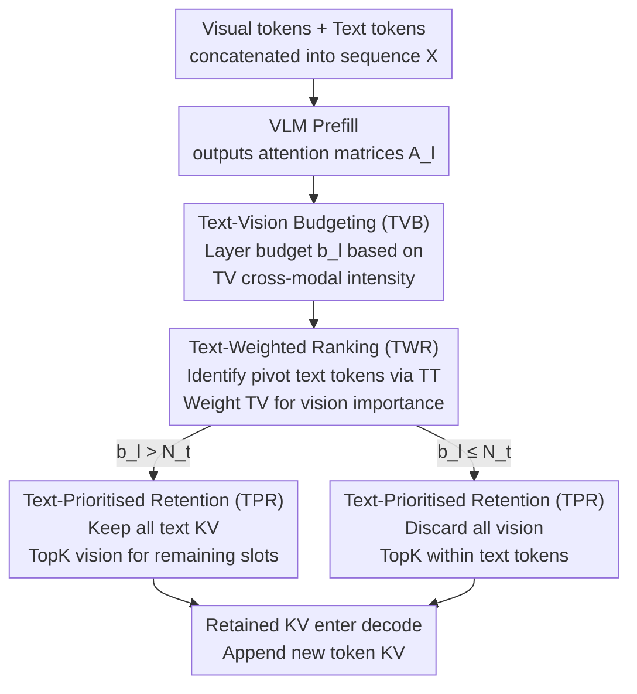

# TGV-KV: Text-Grounded KV Eviction for Vision-Language Models

**Conference**: ICML2026  
**arXiv**: [2606.03075](https://arxiv.org/abs/2606.03075)  
**Code**: "Code Link" provided in the paper, official repository pending open source  
**Area**: Multimodal VLM  
**Keywords**: VLM Inference Acceleration, KV cache eviction, Inter-modal Attention, Text-grounded, Budget Allocation  

## TL;DR
TGV-KV migrates KV eviction strategies designed for text-only LLMs to VLMs through a "text-grounded vision KV" trio: per-layer budgeting based on text-vision attention, re-ranking visual importance using anchor text tokens, and prioritizing text KV during eviction. At a 5% retention rate on LLaVA-NeXT/Qwen3-VL, it maintains accuracy close to full KV while increasing throughput by 52.6%.

## Background & Motivation

**Background**: VLMs adopt the autoregressive generation paradigm of LLMs, caching K/V for all historical tokens to avoid recomputation. However, high-resolution images and long videos occupy thousands or tens of thousands of tokens. KV cache memory grows linearly with context, forming the primary bottleneck in VLM inference. A complete set of KV cache eviction methods has been developed for LLMs, such as H2O, SnapKV, PyramidKV, and Ada-KV, which decide which KV to discard based on attention scores or observation windows.

**Limitations of Prior Work**: Directly applying these LLM-validated eviction methods to VLMs results in severe performance degradation. Experiments on LLaVA with a 5% retention rate show that SnapKV's performance on ChartQA drops from 18.0 to 0.4, rendering it almost entirely ineffective. This indicates that LLM-based KV importance metrics are unsuitable for VLMs.

**Key Challenge**: The authors attribute this collapse to the significant "modality gap" in VLMs, verified by three experimental observations: (1) Visual tokens are highly homogeneous, while text tokens are highly diverse; (2) Text-vision cross-modal attention regions are "low-attention troughs," with intra-modal attention being much stronger; (3) When calculating cumulative attention across all layers, sharp jumps appear at the text-visual boundary, causing most text KV to be evicted first when sorted by "cumulative attention"—yet text KV is the most fragile part of a VLM.

**Goal**: Design a "VLM-native" KV eviction pipeline without fine-tuning the model, simultaneously solving three sub-problems: how to allocate budgets across layers, how to measure cross-modal KV importance, and which modality to sacrifice when budgets are extremely tight.

**Key Insight**: Systematic attention deconstruction yields three key observations: inter-layer budgets should be determined by text-vision (TV) cross-modal attention intensity; KV importance should be determined by TV+TT rather than VV; and text KV is extremely sensitive while vision KV is highly redundant. Thus, text KV should be prioritized when budgets are limited.

**Core Idea**: Use text to "ground" the entire eviction process—text is not just an object to be evicted, but rather the anchor for judging "which visual KV are important."

## Method

### Overall Architecture
TGV-KV is a plug-in KV cache controller deployed after prefill and before the decoding stage; it does not modify model weights or require calibration datasets. The inference flow takes a unified sequence $\mathbf{X} \in \mathbb{R}^{(N_v+N_t) \times d}$ concatenated from $N_v$ visual tokens and $N_t$ text tokens. After the VLM completes a prefill to obtain the attention matrix $\mathbf{A}_l$ for each layer, TGV-KV triggers three sub-modules sequentially: (1) TVB slices the total budget $B$ into $b_l$ per layer according to TV attention distribution; (2) TWR calculates a "text-weighted" importance score for all KV within each layer; (3) TPR selects the retention set based on TopK importance while mandating that text KV be prioritized. The retained KV are accessed during decoding, and KV for newly generated tokens are directly appended.

### Key Designs

**1. Text-Vision Budgeting (TVB): Using cross-modal intensity as a "barometer" for layer budgets**

The first step in KV eviction is deciding how much to retain per layer. The authors found that the intensity of "cross-modal information fusion" varies significantly across layers; layers with more intense fusion deserve more KV. TVB extracts the text-to-vision sub-block $\mathbf{A}_l^{(TV)} = \mathrm{softmax}(\mathbf{Q}_l^{(T)} [\mathbf{K}_l^{(V)}]^{\mathsf T}) \in \mathbb{R}^{N_t \times N_v}$ from the $l$-th layer's attention, calculates the "total intensity of text requesting information from vision," and normalizes this into a budget ratio $b_l^{(TV)} = \sum_{i,j} [\mathbf{A}_l^{(TV)}]_{ij} / \sum_{l'} \sum_{i,j} [\mathbf{A}_{l'}^{(TV)}]_{ij}$. Multiplying this by the global budget $B$ gives the KV capacity for that layer. Comparative experiments show that using VV, TT, or uniform allocation at a 5% retention rate lags behind TV—only TV intensity directly corresponds to "cross-modal fusion intensity," allowing budgets to naturally lean toward layers with the heaviest fusion, making it more robust than the regularized pyramid of PyramidKV.

**2. Text-Weighted Ranking (TWR): Letting "pivot text tokens" weight and re-rank visual KV**

Each KV within a layer needs an importance score. The challenge is that visual importance must change with user instructions—the visual regions retained for "describe this image" versus "is there a taxi by the streetlight" should be completely different. TWR first identifies "pivot text tokens" (vertical bright lines in the attention map) that are consistently attended to: it calculates the attention level for each text token via the TT sub-block, averaged by the number of subsequent tokens $w_{l,j} = \sum_{i \ge j} [\mathbf{A}_l^{(TT)}]_{ij} / (N_t - j + 1)$, and normalizes it to $\tilde w_{l,i}$. These weights re-weight each row of $\mathbf{A}_l^{(TV)}$ to get the final visual token score $s_{l,j}^{(V)} = \sum_i \tilde w_{l,i} [\mathbf{A}_l^{(TV)}]_{ij}$. For the text side, the column sum is taken directly $s_{l,j}^{(T)} = \sum_{i \ge j} [\mathbf{A}_l^{(TT)}]_{ij}$. Ablations show that using pure self-attention or VV+TT as importance metrics leads to collapse (ChartQA @ 5% drops to ~4 points), whereas TV+TT weighting ensures visual KV retention aligns with the current query.

**3. Text-Prioritised Retention (TPR): Filling budgets with text first, then vision**

The retention set is selected based on budget and scores. A minimal random eviction experiment established a hard constraint—at a 5% retention rate, randomly prioritizing vision eviction maintains 10–46 points, while randomly prioritizing text eviction causes a drop to 0.2 points. This indicates that text KV is extremely sensitive while vision KV is redundant; any "fair sorting by score" for text is unsafe. TPR thus uses a piecewise rule: if the layer budget $b_l > N_t$, all text KV are unconditionally retained, and the remaining $b_l - N_t$ slots are filled by visual TopK based on $s_{l,j}^{(V)}$. If $b_l \le N_t$, vision is discarded entirely, and TopK is selected only within the text tokens based on $s_{l,j}^{(T)}$. This asymmetric strategy bakes the "text must not be lost" constraint directly into the algorithm.

### Loss & Training
TGV-KV is a pure inference-time algorithm. It introduces no additional training or fine-tuning and requires no calibration datasets. All budget and importance calculations are based on the attention matrices produced during a single prefill pass, allowing it to be deployed as a plug-and-play solution for any VLM based on standard self-attention.

## Key Experimental Results

### Main Results

The authors evaluated TGV-KV on LLaVA-1.5-7B / LLaVA-NeXT-7B / LLaVA-OV / Qwen3-VL-4B/8B across tasks including ChartQA, DocVQA, VizWiz, TextVQA, TextCaps, COCO-Caption, and Video-TT, comparing it with baselines like StreamingLLM, SnapKV, H2O, ElasticCache, and PrefixKV. The table below extracts representative LLaVA results at a 5% extreme retention rate:

| Model / Task | Metric | Vanilla | TGV-KV (5%) | vs. Vanilla |
|--------|------|------|------|------|
| LLaVA-NeXT / VizWiz-VQA | Acc. | 100% | 99.2% | -0.8 pt |
| Qwen3-VL-8B / DocVQA | ANLS | 100% | 92.5% | -7.5 pt |
| LLaVA-1.5 / ChartQA (vs best baseline) | Relaxed Acc. | 18.0 | Significantly leads (+33.0 pt relative to best baseline) | / |
| LLaVA-NeXT End-to-End | Throughput | 1.0× | 1.526× | +52.6% |
| All Models | KV Memory | 1.0× | 0.05× | -95% |

TGV-KV approaches full KV accuracy even under extreme compression, showing particular stability on the LLaVA series. On dense text OCR tasks like DocVQA, it retains over 90% ANLS with only 5% budget.

### Ablation Study

The table below summarizes three key comparisons from Table 1 of the paper (LLaVA, 5% retention rate), verifying the necessity of each TGV-KV module:

| Setting | ChartQA ↑ | TextVQA-lite ↑ | Description |
|------|---------|---------|------|
| Vanilla | 18.0 | 47.9 | Full KV |
| Uniform layer budget + TV+TT importance | 14.3 | 36.4 | Without TVB |
| TV layer budget + TV+TT importance (≈TVB) | 14.3 | 36.4 | TVB provides superior layer structure |
| Uniform + Observation Window | 0.4 | 8.7 | Collapses if importance metric is replaced |
| Uniform + Pure self-attention | 4.8 | 23.5 | LLM-based methods fail |
| Uniform + VV+TT importance | 4.6 | 22.8 | Fails without TV |
| Uniform + TV+TT importance | 11.0 | 37.3 | TWR prototype works effectively |
| Uniform + Prioritize text eviction | 0.2 | 4.4 | Verifies the lower bound for TPR |
| Uniform + Prioritize vision eviction | 10.0 | 31.0 | Text protection is key |

### Key Findings
- The "importance metric," rather than the "layer budget," is the primary factor determining collapse—observation windows or pure self-attention drop performance to single digits at 5%, while introducing text-vision attention immediately restores it to double digits.
- "Using text as an anchor" is a mandatory conclusion for VLM KV eviction: random prioritization of text eviction drops ChartQA to 0.2, and the 99.2% retention on VizWiz tasks can only be stabilized with the help of TPR.
- The TV intensity signal in TVB allows layer budgets to naturally shift toward middle layers where "information fusion is most intense," proving more robust than the fixed pyramid allocation of PyramidKV.
- The +52.6% throughput gain primarily stems from the 95% memory compression, enabling larger batch sizes and longer sequences. The overhead of TGV-KV's budget/scoring is negligible as it reuses the prefill attention matrix.

## Highlights & Insights
- **Turning the Modality Gap from Problem to Signal**: Previous works viewed the "low-attention troughs" in TV regions as a defect. This paper uses the relative intensity of these troughs (which layer is higher) as the core signal for budget allocation, effectively turning a "lesion" into a "diagnostic tool."
- **Instruction-Sensitive Visual Importance**: Through "pivot text token" weighting, visual KV importance becomes sensitive to the user's prompt. Visual KV are preserved differently for "describe the image" versus "is there a taxi," a feat prompt-agnostic methods like H2O/SnapKV cannot achieve.
- **Asymmetric Protection Strategy**: The authors used a minimal random experiment to pin down the hard constraint that "text must not be lost," and then elegantly implemented this via the piecewise formula in TPR. This method of finding bounds empirically and then enforcing them simply is highly effective.
- The method requires zero training, zero fine-tuning, and zero calibration data. It can be deployed on any standard self-attention VLM just by looking at the prefill attention matrix, offering high engineering feasibility.

## Limitations & Future Work
- To maintain parallelism, the paper explicitly avoids head-wise budget allocation. If future attention kernels (e.g., PagedAttention, FlashDecoding-v2) allow fine-grained head budgets without breaking parallelism, TGV-KV could be extended.
- TVB/TWR rely on attention matrices from the prefill stage. For deployment pipelines using FlashAttention (which does not materialize full attention), an additional "light attention recomputation" pass is needed to obtain TV/TT sub-blocks, which must be accounted for.
- While throughput increases by 52.6% at 5% budget, the specific latency breakdown on Qwen3-VL-8B remains unclear. Combinatory strategies of TGV-KV with token pruning (FastV, VisionZip) for long video contexts merit further study.
- TPR currently uses a hard rule (prioritize full text). For "image-heavy, text-light" captioning scenarios, this might over-protect text. Introducing learnable modality weights or task-adaptive priorities could provide further improvement.

## Related Work & Insights
- **vs. H2O / SnapKV / StreamingLLM**: These are designed for LLMs, measuring importance via self-attention or windows. This paper proves these fail on VLMs due to the modality gap causing text KV to be erroneously evicted; TGV-KV's TV+TT weighting restores utility.
- **vs. PyramidKV / Ada-KV**: These use fixed rules or calibration for layer budgets; TVB uses dynamic allocation based on a single prefill's TV attention intensity, requiring no calibration set.
- **vs. AirCache**: Also recognizes that "text is important," but AirCache requires extra computation for text token identification and lacks inter-layer mutual information analysis. TGV-KV reuses TT sub-blocks for anchor identification and TV intensity for budget analysis, offering lower overhead.
- **vs. FastV / VisionZip / CDPruner (token pruning)**: These discard visual tokens before/during prefill; the tokens are lost forever. TGV-KV performs eviction at the KV level and allows subsequent layers to retain more visual information based on budget, offering higher flexibility and compatibility for serial use with pruning.

## Rating
- Novelty: ⭐⭐⭐⭐ Reversing the "modality gap" from a failure source into a budget signal is a refreshing perspective, supported by strong ablations.
- Experimental Thoroughness: ⭐⭐⭐⭐⭐ Covers five VLMs of various sizes and architectures, image + video tasks, 5 baselines, and multiple retention tiers (5%/10%/20%/50%).
- Writing Quality: ⭐⭐⭐⭐ Clear logical progression through three Observations; formula notation is standardized.
- Value: ⭐⭐⭐⭐⭐ Provides a 0-training plug-and-play VLM inference compression solution. 95% memory savings and +52.6% throughput translate to direct deployment benefits.

<!-- RELATED:START -->

## Related Papers

- [\[ACL 2025\] MadaKV: Adaptive Modality-Perception KV Cache Eviction for Efficient Multimodal Long-Context Inference](../../ACL2025/multimodal_vlm/madakv_adaptive_modality-perception_kv_cache_eviction_for_efficient_multimodal_l.md)
- [\[CVPR 2026\] FlashCache: Frequency-Domain-Guided Outlier-KV-Aware Multimodal KV Cache Compression](../../CVPR2026/multimodal_vlm/flashcache_frequency_kv_cache_compression.md)
- [\[ICLR 2026\] Mixing Importance with Diversity: Joint Optimization for KV Cache Compression in Large Vision-Language Models](../../ICLR2026/multimodal_vlm/mixing_importance_with_diversity_joint_optimization_for_kv_cache_compression_in_.md)
- [\[NeurIPS 2025\] PrefixKV: Adaptive Prefix KV Cache is What Vision Instruction-Following Models Need for Efficient Generation](../../NeurIPS2025/multimodal_vlm/prefixkv_adaptive_prefix_kv_cache_is_what_vision_instruction.md)
- [\[ICML 2026\] Contextualized Visual Personalization in Vision-Language Models](contextualized_visual_personalization_in_vision-language_models.md)

<!-- RELATED:END -->
