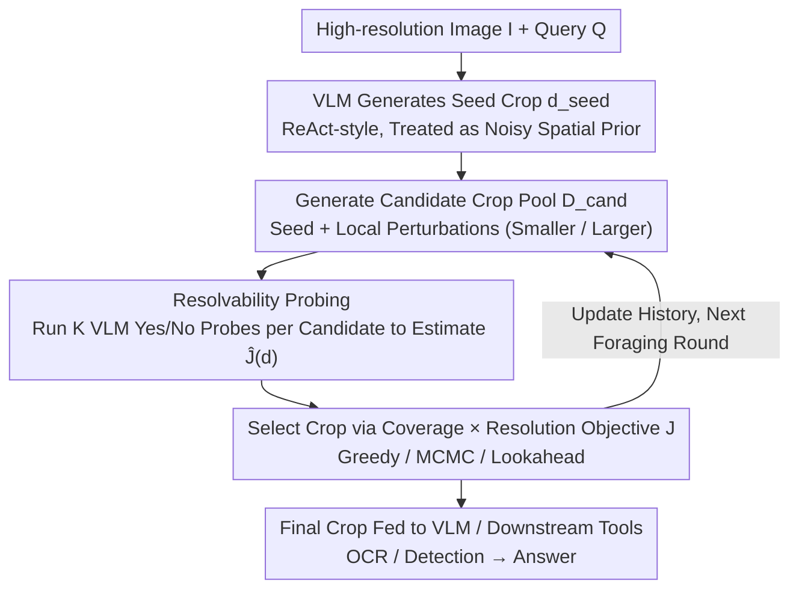

# The Perceptual Bandwidth Bottleneck in Vision-Language Models: Active Visual Reasoning via Sequential Experimental Design

**Conference**: ICML 2026  
**arXiv**: [2605.01345](https://arxiv.org/abs/2605.01345)  
**Code**: None  
**Area**: Multimodal VLM / Active Vision / Visual Agent  
**Keywords**: Perceptual Bandwidth Bottleneck, Bayesian Experimental Design, Active Visual Reasoning, High Resolution, Training-free  

## TL;DR
This paper formalizes "VLM inability to see details" as a Sequential Bayesian Optimal Experimental Design (S-BOED) problem. It proposes the training-free FOVEA module based on a computable proxy objective of "coverage $\times$ resolution," consistently outperforming Direct and ReAct-style baselines on high-resolution and remote sensing benchmarks.

## Background & Motivation

**Background**: Modern VLMs (Qwen3-VL, GPT-5, Gemini 2.5, etc.) are proficient in global scene understanding. Mainstream high-resolution processing follows two paths: 1) downsampling the entire image into a fixed number of ViT tokens, or 2) using tool-calling where the VLM issues crop commands via ReAct or latent CoT to invoke expert tools like OCR/detection.

**Limitations of Prior Work**: Existing VLMs exhibit "perceptual blindness" in fine-grained tasks such as small object counting, OCR, and precise spatial localization—errors occur even when reasoning logic is simple. Downsampling causes small objects to "disappear" before encoding; ReAct-style cropping is heuristic and often targets wrong areas; sliding window approaches are expensive and introduce significant noise.

**Key Challenge**: The authors identify a **perceptual bandwidth bottleneck**—ViT compresses arbitrary resolution images into fixed tokens, creating an inevitable "field-of-view vs. resolution" trade-off: seeing wide sacrifices detail, while seeing detail sacrifices context. This is not a failure of semantic reasoning but a failure to acquire task-relevant evidence under limited bandwidth.

**Goal**: Transform the "where to look" decision from an ad-hoc heuristic into a decision-theoretic optimal experimental design problem with a computable proxy objective in gigapixel continuous space.

**Key Insight**: Analogous to scientific experimentation: each selection of a foveation (crop) is an experimental design $\mathbf{d}$ aimed at reducing uncertainty about latent variables $\boldsymbol{\theta}=\{\ell, y\}$ (target location + semantic answer). The BOED framework is naturally suited for this "active information foraging" process.

**Core Idea**: Use the product of "coverage $\times$ resolution" as a computable proxy for Expected Information Gain (EIG) and package it as a plug-in module to refine crops proposed by the VLM.

## Method

### Overall Architecture
Input consists of a high-resolution image $I$ and a query $Q$. The VLM first generates a seed crop $\mathbf{d}_{\text{seed}}$ in a ReAct style, which FOVEA treats as a noisy spatial prior rather than trusting directly. A candidate crop pool $\mathcal{D}_{\text{cand}}=\{\mathbf{d}_{\text{seed}}, \mathbf{d}_{\text{small}}, \mathbf{d}_{\text{large}}\}$ is generated around it. For each candidate, a utility score $\hat{\mathcal{J}}$ is estimated via resolvability probes. An optimizer (Greedy / MCMC / Lookahead) then selects the optimal crop. The selected view updates the interaction history $\mathcal{H}_t$ as the search state for the next round. FOVEA is a sequential refinement process utilizing both positive and negative evidence. The final crop is fed back to the VLM or downstream tools (OCR/Detection) for the answer. The process is **completely training-free**, requiring only extra VLM calls as a scorer during inference.

### Key Designs

**1. S-BOED Formalization and Three-Layer Probabilistic Model**: Reconceptualizes "where to look" as optimal experimental design. Addressing the ad-hoc nature of existing crop decisions, this paper reformulates active vision as S-BOED: selecting a foveation $\mathbf{d}$ is like selecting an experiment to reduce uncertainty about $\boldsymbol{\theta}=\{\ell, y\}$. The model defines three layers: **Physical Layer** (defining bandwidth $\mathcal{B}$, information density $\rho(\mathbf{d})=\mathcal{B}/A(\mathbf{d})$, and resolution probability $\phi(\mathbf{d})$), **Generative Layer** (binary visibility event $\mathcal{S}$ where observation $\mathbf{z}$ carries semantic information only if the target is both spatially covered and resolution-resolved), and **Decision Layer** (maximizing EIG). The authors note this violates submodularity—"Information Cliffs" exist where individual steps yield near-zero gain, necessitating look-ahead over pure greed.

**2. Computable Coverage-Resolution Objective**: Simplifies EIG into a scalar objective using three progressive assumptions: Factorized Belief ($p_t(\ell, y)\approx p_t(\ell)\cdot p_t(y)$), Calibrated Visibility ($H(\mathcal{S}|\mathbf{z},\mathbf{d})\approx 0$), and Ideal Observer ($H(y|\mathbf{z},\mathcal{S}=1)\approx 0$). This derives $U_t(\mathbf{d})\approx H_t(y)\cdot\mathcal{J}_t(\mathbf{d})$, where $\mathcal{J}_t(\mathbf{d})=\left(\int_{\mathbf{x}\in\mathbf{d}}p_t(\mathbf{x})d\mathbf{x}\right)\cdot \phi(\mathbf{d})$ is the "coverage $\times$ resolution" product. Maximizing EIG becomes equivalent to maximizing $\mathcal{J}_t$. This reduces complex semantic reasoning to geometric visibility maximization, separating "understanding" (VLM backbone) from "search" (FOVEA).

**3. Resolvability Probing and Three Optimizers**: Since the ground-truth belief map is unknown, FOVEA introduces a binary resolvability signal $r\in\{0,1\}$. $\hat{\mathcal{J}}(\mathbf{d})\approx P(\text{VLM}(I_\mathbf{d}, Q)=\text{"Yes"})$ represents the probability that a crop contains sufficient evidence. FOVEA uses the VLM as its own critic through $K$ random probes (default $K=3$). It supports three optimizers: **Greedy** (selects max $\hat{\mathcal{J}}$), **MCMC-style** (local refinement via iterative perturbation), and **Lookahead** (uses simulated next-state $\hat{V}(\mathbf{d}, \mathcal{H}_{t-1})$ to counter information cliffs).

### Loss & Training
**Entirely training-free** with no parameter updates. FOVEA is inserted into the VLM crop pipeline during inference. The cost involves $|\mathcal{D}_{\text{cand}}|\times K$ additional VLM probes, trading token usage for crop quality.

## Key Experimental Results

### Main Results

| Method | Backbone | MME-RealW | CV-Bench | V* | HR-4K | HR-8K | Mean |
|------|----------|-----------|----------|-----|-------|-------|------|
| GPT-5 | Closed | 55.0 | 84.9 | 77.0 | 78.1 | 75.5 | 74.1 |
| Gemini 2.5 Flash | Closed | 58.5 | 87.3 | 80.1 | 83.4 | 80.9 | 78.0 |
| Direct | Qwen3-VL-30B | 48.2 | 81.2 | 81.2 | 80.0 | 75.9 | 73.3 |
| ReAct | Qwen3-VL-30B | 51.1 | 81.3 | 83.8 | 80.8 | 78.3 | 75.1 |
| RAP | Qwen3-VL-30B | 40.8 | 72.2 | 86.4 | 79.6 | 80.6 | 71.9 |
| **FOVEA** | Qwen3-VL-30B | **54.6** | **84.8** | **85.3** | **84.5** | 79.2 | **77.7** |
| Direct | Qwen3-VL-8B | 47.6 | 84.5 | 76.9 | 74.5 | 70.9 | 70.9 |
| ReAct | Qwen3-VL-8B | 48.1 | 83.9 | 78.8 | 77.7 | 73.8 | 72.5 |
| **FOVEA** | Qwen3-VL-8B | **49.9** | **84.7** | **83.6** | **80.9** | **75.4** | **74.9** |

FOVEA improves Qwen3-VL-30B from 75.1 (ReAct) to 77.7, approaching Gemini 2.5 Flash performance.

### Ablation Study (Remote Sensing Subset, search-dominated)

| Configuration | Accuracy | Description |
|------|--------|------|
| Direct (30B) | ~35% | Single global image, no active search |
| ReAct | 45.1% | Heuristic cropping |
| FOVEA-Greedy | ~48% | With resolvability probe |
| FOVEA-MCMC | ~50% | Iterative refinement |
| **FOVEA-Lookahead** | **54.7%** | Explicit look-ahead for Information Cliff |
| Oracle Crop | ~65% | Upper bound using ground-truth crops |

### Key Findings
- FOVEA yields the highest gain in search-dominated scenarios (remote sensing). Lookahead provides a +6 point boost over Greedy, validating the "Information Cliff" hypothesis where immediate signals are insufficient.
- A ~10 point gap remains between Oracle crop and FOVEA-Lookahead, attributed to "recognition bottlenecks" where the VLM fails even with perfect crops.
- The three optimizers form a compute-accuracy spectrum, representing a new axis for "inference-time scaling": spending tokens to acquire visual evidence rather than just textual reasoning.

## Highlights & Insights
- **Grounding active vision in BOED theory**: Unlike previous RL-trained agents (Thyme, RAP), FOVEA offers a training-free solution anchored in decision theory using the "coverage $\times$ resolution" proxy.
- **The "Information Cliff" observation**: Critically explains why greedy strategies fail in high-resolution tasks: submodularity does not hold, making look-ahead theoretical necessity.
- **Portable resolvability probing**: Using $P(\text{VLM}=\text{Yes})$ as a utility critic is applicable to web agents, tool calling, and RAG ranking where binary verification is possible.

## Limitations & Future Work
- Relies on the Ideal Observer assumption; FOVEA cannot correct hallucinations inherent in the backbone VLM.
- "Cold-start" problem: if the seed crop is completely off-target, local refinement cannot recover.
- Increased inference latency due to multiple VLM probes; FOVEA is not suitable for all latency-sensitive applications.
- Future work: Training an amortized lightweight policy for crop prediction or a meta-policy to decide when to trigger FOVEA.

## Related Work & Insights
- **vs ReAct / Thyme / RAP**: These use RL or heuristics for cropping. FOVEA uses zero-shot BOED optimization during inference, outperforming RAP at the 30B scale.
- **vs BED-LLM**: While BED-LLM applies BOED to discrete question selection, FOVEA extends it to continuous gigapixel space.
- **vs Visual CoT**: While textual CoT spends tokens on "thinking," FOVEA spends tokens on "looking," providing an orthogonal axis for inference scaling.

## Rating
- Novelty: ⭐⭐⭐⭐⭐ S-BOED + Information Cliff + Proxy objective.
- Experimental Thoroughness: ⭐⭐⭐⭐ Strong benchmarks and optimizer analysis, though limited to Qwen3 family.
- Writing Quality: ⭐⭐⭐⭐⭐ Clear organization of the probabilistic model and assumptions.
- Value: ⭐⭐⭐⭐ Training-free and easy to deploy, though probe overhead and cold-start issues remain.

<!-- RELATED:START -->

## Related Papers

- [\[ICML 2026\] Active Exploring like a Pigeon: Reinforcing Spatial Reasoning via Agentic Vision-Language Models](active_exploring_like_a_pigeon_reinforcing_spatial_reasoning_via_agentic_vision-.md)
- [\[NeurIPS 2025\] PhysVLM-AVR: Active Visual Reasoning for Multimodal Large Language Models in Physical Environments](../../NeurIPS2025/multimodal_vlm/physvlm-avr_active_visual_reasoning_for_multimodal_large_language_models_in_phys.md)
- [\[ICML 2026\] Mitigating Perceptual Judgment Bias in Multimodal LLM-as-a-Judge via Perceptual Perturbation and Reward Modeling](mitigating_perceptual_judgment_bias_in_multimodal_llm-as-a-judge_via_perceptual_.md)
- [\[CVPR 2026\] Act2See: Emergent Active Visual Perception for Video Reasoning](../../CVPR2026/multimodal_vlm/act2see_emergent_active_visual_perception_for_video_reasoning.md)
- [\[CVPR 2026\] VGent: Visual Grounding via Modular Design for Disentangling Reasoning and Prediction](../../CVPR2026/multimodal_vlm/vgent_visual_grounding_via_modular_design_for_disentangling_reasoning_and_predic.md)

<!-- RELATED:END -->
