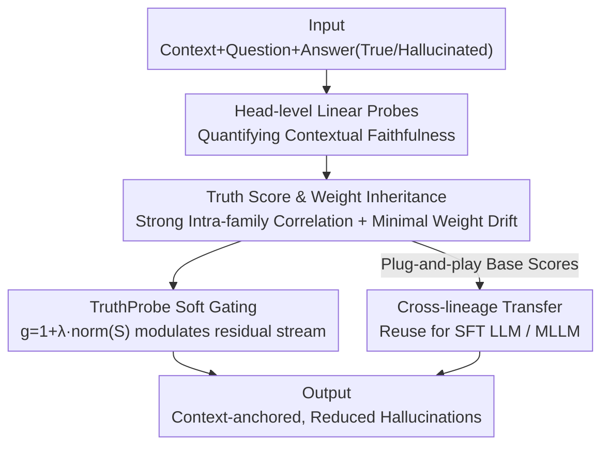

# The Truth Stays in the Family: Enhancing Contextual Truthfulness via Inherited Heads in Model Lineages

**Conference**: ICML2026  
**arXiv**: [2606.15821](https://arxiv.org/abs/2606.15821)  
**Code**: https://github.com/miso-choi/TruthProbe  
**Area**: Multimodal VLM  
**Keywords**: Hallucination Mitigation, Attention Head Probes, Model Lineages, Soft Gating, Contextual Faithfulness

## TL;DR
The authors discovered that "attention heads encoding contextual faithfulness" are **inherited** across LLMs/MLLMs derived from the same base model. They propose TruthProbe—a plug-and-play mechanism using head-level Truth Scores for soft gating. Scores probed from a base LLM can be directly transferred to its fine-tuned LLM and multimodal descendants, simultaneously reducing hallucinations in HaluEval, POPE, and CHAIR.

## Background & Motivation
**Background**: Modern Multimodal Large Language Models (MLLMs) are rarely trained from scratch. Instead, they are developed via instruction tuning or multimodal extension on a shared base LLM (e.g., Vicuna, Qwen2.5, LLaMA2, Mistral), forming "model lineage trees" (e.g., LLaVA-1.5 and LLaVA-NEXT both originate from Vicuna-7B; Qwen2.5-VL-Instruct and Omni both originate from Qwen2.5).

**Limitations of Prior Work**: Hallucination—generating content inconsistent with the context or factually incorrect—remains the major bottleneck for deployment. Existing mitigation methods (Contrastive Decoding, representation intervention, ITI, etc.) treat each model as an **isolated individual**. They require re-analysis and re-tuning for every descendant model, making them expensive and unsystematic.

**Key Challenge**: No prior work has explored a more fundamental question: Is there a **persistent, inheritable behavioral link** between a base LLM and its downstream variants? If certain attention heads are responsible for "anchoring answers in context" in the base model, is this function preserved after fine-tuning? If so, reliability could be addressed for an entire family at once rather than through individual patches.

**Key Insight**: The authors hypothesize that a specific subset of attention heads encodes "contextual faithfulness information" and that this "truthful trait" is preserved within a lineage. They validate this by borrowing the linear probe approach from ITI to quantify the contextual faithfulness of each head.

**Core Idea**: First, a Truth Score is assigned to each head using linear probes to demonstrate strong intra-family correlation (heritability), explained by minimal parameter weight drift. Second, TruthProbe is introduced to use these scores as soft gates to amplify faithful heads and suppress unreliable ones, allowing base model scores to be transferred as "plug-and-play" gates for descendants.

## Method

### Overall Architecture
The workflow consists of three steps: **Quantification, Discovery of Inheritance, and Intervention via Inheritance**. First, Truth Scores are assigned to attention heads using linear probes (measuring how well a head anchors answers to the given context). Second, these scores are compared across families, revealing high correlation within lineages explained by "minimal weight drift." Third, TruthProbe utilizes these scores as soft-gating coefficients on the residual stream, where base LLM scores can be directly reused for descendants without re-probing.

### Key Designs

**1. Truth Score: Quantifying Head-level Faithfulness via Linear Probes**

The challenge lies in quantifying which heads are responsible for contextual faithfulness. The authors structure inputs as $x=\{x_{\text{context}}, x_{\text{question}}, x_{\text{answer}}\}$, where $x_{\text{context}}$ can be textual world knowledge or an image, and $x_{\text{answer}}$ provides pairs of **ground-truth** and **hallucinated** answers. Since the last answer token accumulates all prior information, activations are extracted at this position for each head. A binary linear probe is trained to determine if a head reliably incorporates context or provides misleading information. The probe's validation accuracy is defined as the Truth Score. A high score indicates that the head's output carries **linearly decodable** signals distinguishing true from false answers. Unlike ITI, which focuses on "parametric knowledge retrieval," this metric specifically measures grounding to the **provided context**, which is crucial for MLLMs relying on visual evidence.

**2. Lineage Inheritance of Truthful Heads explained by Minimal Weight Drift**

This is the core discovery of the paper. Comparing head-level Truth Score distributions in the Vicuna family (Vicuna-7B → LLaVA-1.5 / LLaVA-NeXT) and the Qwen2.5 family, the authors conclude: scores are highly correlated within the same lineage. For single-dataset probes, the correlation between base and multimodal descendants ranges from $0.77$ to $0.98$. Even with **entirely different data sources and modalities** (cross-dataset probes), intra-family correlation remains $0.51$–$0.64$, while unrelated lineages (Vicuna vs. Mistral-7B) show near-zero correlation ($0.04$–$0.08$). This suggests truthful heads are **lineage-specific** rather than universal across all pretrained models. Mechanism: Layer-wise weight drift (Frobenius norm) shows that average drift during intra-family fine-tuning is minimal ($\approx 0.03$), whereas cross-family drift is much higher ($\approx 1.01$). Furthermore, drift occurs primarily in shallow layers, while truthful heads are predominantly in middle-to-deep layers (e.g., 80% of top-20 heads in LLaVA-1.5 are in layers 10–31), explaining why scores are inherited. This aligns with findings that fine-tuning (LoRA, BitFit) involves low-rank or sparse updates.

**3. TruthProbe Soft Gating and Cross-lineage Transfer**

To mitigate hallucinations, the authors avoid hard masking (which loses representation power) and instead use soft gating. At layer $l$, the attention output $o_l$ is split into head-level components $o_l^h \in \mathbb{R}^{n_h \times d_h}$. Each component is multiplied by a gating coefficient before being concatenated back to the residual stream:

$$x_{l+1} = x_l + \text{Concat}_{h=1}^{H}\left(g_l^h \cdot o_l^h\right), \qquad g_l^h = 1 + \lambda \cdot \text{norm}(S)$$

where $S$ is the normalized Truth Score and $\lambda$ controls intensity. Heads with higher scores are amplified above the baseline (coefficient 1), while lower-scoring heads are relatively suppressed. **All heads remain active**, but their contributions are modulated by faithfulness, pushing the residual stream toward contextually faithful signals. The key "transfer" benefit is that Truth Scores probed from the base LLM (e.g., Vicuna-7B) can be used as plug-and-play gates for its MLLM descendants. Experiments show $\text{TruthProbe}_{\text{LLM}}$ (using base scores) performs comparably to $\text{TruthProbe}_{\text{MLLM}}$ (probing the descendant directly).

### Loss & Training
TruthProbe **requires no parameter training**. Truth Scores are obtained from lightweight linear probes (requiring small samples—292 for HaluEval, 2726 for RLHF-V subsets, all via 5-fold cross-validation). Gating is a multiplicative scaling during inference. Normalization follows the benchmark: centering for HaluEval/CHAIR and min-max for POPE; outputs use greedy decoding.

## Key Experimental Results

### Main Results
LLM self-gating confirms that Truth Scores capture faithfulness, significantly improving HaluEval F1:

| Model | Metric | Baseline | + TruthProbe$_{\text{LLM}}$ |
|------|------|----------|------------------------------|
| Vicuna-7B | F1 | 13.37 | 29.15 |
| Vicuna-7B | Recall | 9.44 | 25.30 |
| Qwen2.5 | F1 | 36.69 | 46.54 |
| Qwen2.5 | Recall | 41.96 | 56.59 |

Transferring **base scores** to MLLMs (POPE measures Acc/Recall; CHAIR measures hallucination rate, lower is better):

| Model | Benchmark | Metric | Baseline | + TruthProbe$_{\text{LLM}}$ (Base Transfer) |
|------|------|------|----------|------------------------------------------|
| LLaVA-1.5 | POPE(COCO) | Recall | 79.1 | 80.1 |
| LLaVA-1.5 | CHAIR | CHAIR$_I$ ↓ | 6.99 | 5.36 |
| LLaVA-1.5 | CHAIR | CHAIR$_S$ ↓ | 23.00 | 17.40 |
| LLaVA-NeXT | POPE(COCO) | Acc | 87.7 | 88.3 |
| LLaVA-NeXT | CHAIR | CHAIR$_I$ ↓ | 6.91 | 4.94 |
| Qwen2.5-VL-Omni | POPE(COCO) | Acc | 85.1 | 87.3 |

### Ablation Study

| Configuration | Key Observation | Explanation |
|------|---------|------|
| Soft Gating vs. Hard Mask | Soft gating is superior | Hard masks lose info; soft gating preserves representation diversity |
| TruthProbe$_{\text{LLM}}$ vs. TruthProbe$_{\text{MLLM}}$ | Comparable performance | Validates that base scores are transferable without re-probing |
| Cross-family Correlation | Near zero (0.04–0.08) | Faithful heads are lineage-specific, not universal |
| Weight Drift | Intra: 0.03 / Inter: 1.01 | Mechanistically explains why scores are inherited |

### Key Findings
- Improvements in POPE are mainly seen in **Recall**: Soft gating amplifies faithful heads, making the model more likely to acknowledge existing objects in the image rather than conservatively denying them.
- Heritability + Minimal Weight Drift forms a clean causal chain: Faithful heads reside in mid-deep layers → Fine-tuning barely modifies these layers → Scores are inherited → Base scores can be reused.
- Attention maps show that heads with high Truth Scores focus on **query-relevant visual evidence**, while low-score heads show weak semantic attention, indicating the score captures functional grounding behavior.

## Highlights & Insights
- **Lineage as a First-class Citizen**: While most hallucination mitigation is model-specific, this work is the first to prove that "reliability mechanisms are inherited," shifting the focus from per-model patches to family-level solutions.
- **Mechanistic Evidence for Heritability**: By combining Frobenius weight drift and vertical layer distributions, the authors provide a parametric explanation for *why* inheritance occurs, rather than just showing correlation heatmaps.
- **Plug-and-play & Training-free**: The method is extremely lightweight—requiring only small-sample probes and inference-time scaling ($g_l^h = 1+\lambda\cdot\text{norm}(S)$)—making it highly practical for engineering.

## Limitations & Future Work
- The gating intensity $\lambda$ and normalization method must be selected manually per benchmark (e.g., centering for CHAIR, min-max for POPE); automated scaling remains unsolved.
- Inheritance findings rely on the premise that "fine-tuning is low-rank/local." If a descendant undergoes heavy continued pre-training or architectural changes, transferability may degrade.
- Validation focused on 7B-scale models. Absolute accuracy on HaluEval remains low (Vicuna ~38), suggesting soft gating is a "relative improvement" rather than a complete solution.
- Future work: Extending probes to MLPs/residual streams and standardizing the one-probe-multi-generation workflow.

## Related Work & Insights
- **vs. ITI (Inference-Time Intervention)**: ITI also uses linear probes to find "truthful directions," but it focuses on parametric knowledge and is model-specific. This work targets "contextual faithfulness" and enables "cross-lineage transfer."
- **vs. Contrastive Decoding**: Those methods adjust logits during decoding and require per-model adaptation. TruthProbe operates at the head level in the residual stream and allows base-to-descendant reuse.
- **vs. PEFT (LoRA, BitFit)**: This work leverages the observation that PEFT only modifies local/low-rank parameters to explain why faithful heads are preserved, applying PEFT insights to interpretability and reliability.

## Rating
- Novelty: ⭐⭐⭐⭐⭐ "Inheritance of truthful heads" is a fresh and validated perspective.
- Experimental Thoroughness: ⭐⭐⭐⭐ Broad coverage of families and benchmarks with mechanistic evidence, though absolute metrics remain modest.
- Writing Quality: ⭐⭐⭐⭐ Clear logic: Quantify → Discover Inheritance → Intervene.
- Value: ⭐⭐⭐⭐⭐ Plug-and-play, training-free, and reusable across lineages—high practical value.

<!-- RELATED:START -->

## Related Papers

- [\[ICML 2026\] Referring Multiple Regions with Large Multimodal Models via Contextual Latent Steering](referring_multiple_regions_with_large_multimodal_models_via_contextual_latent_st.md)
- [\[CVPR 2025\] Your Large Vision-Language Model Only Needs a Few Attention Heads for Visual Grounding](../../CVPR2025/multimodal_vlm/your_large_vision-language_model_only_needs_a_few_attention_heads_for_visual_gro.md)
- [\[ECCV 2024\] The Hard Positive Truth About Vision-Language Compositionality](../../ECCV2024/multimodal_vlm/the_hard_positive_truth_about_visionlanguage_compositionalit.md)
- [\[ACL 2026\] From Heads to Neurons: Causal Attribution and Steering in Multi-Task Vision-Language Models](../../ACL2026/multimodal_vlm/from_heads_to_neurons_causal_attribution_and_steering_in_multi-task_vision-langu.md)
- [\[CVPR 2026\] VLM4RSDet: Collaborative Optimization with Vision-Language Model for Enhancing Remote Sensing Object Detection](../../CVPR2026/multimodal_vlm/vlm4rsdet_collaborative_optimization_with_vision-language_model_for_enhancing_re.md)

<!-- RELATED:END -->
