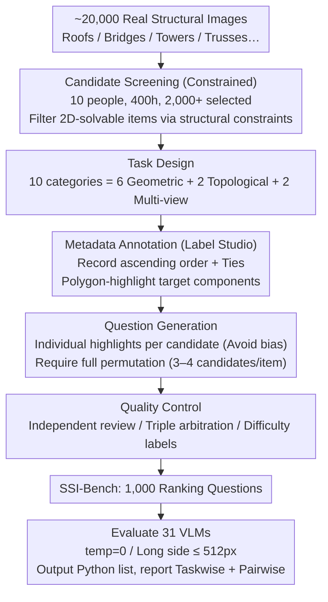

# Thinking in Structures: Evaluating Spatial Intelligence in Constraint-Governed Spaces

**Conference**: ICML 2026  
**arXiv**: [2602.07864](https://arxiv.org/abs/2602.07864)  
**Code**: https://ssi-bench.github.io  
**Area**: Multimodal VLM  
**Keywords**: Spatial Intelligence, Structured Reasoning, Ranking Q&A, VLM Benchmark, 3D Constraints

## TL;DR
Authors construct SSI-Bench, a benchmark consisting of 1,000 ranking-style VQA items focusing on "constrained structured spaces" (real 3D structures like roofs, bridges, towers), requiring VLMs to provide a complete permutation of 3-4 candidate components according to geometric or topological criteria. Evaluation of 31 VLMs reveals that the strongest closed-source model, Gemini-3-Flash, achieves only 33.6%, and the best open-source model, GLM-4.6V, reaches 22.2%, compared to a human performance of 91.6%. This highlights a lack of consistent spatial reasoning capabilities in current VLMs when facing real-world 3D scenes jointly constrained by geometry, connectivity, and physical feasibility.

## Background & Motivation

**Background**: Spatial intelligence benchmarks are expanding along multiple axes—single-view vs. multi-view (SpatialRGPT, ViewSpatial-Bench), image vs. video (VSI-Bench, STI-Bench), manual vs. automatic annotation (MMSI-Bench, Spatial457), etc. These works typically model spatial reasoning as "scene-centric," measuring distance and orientation based on unconstrained indoor/outdoor daily environments.

**Limitations of Prior Work**: Scene-centric benchmarks suffer from fundamental ambiguity—3D relationships are often underdetermined in a single image (the same object could be smaller or further away). Multiple 3D configurations can explain the same 2D observation. Consequently, models can "guess" correctly based on appearance priors or dataset biases, failing to distinguish whether they truly recover 3D structures.

**Key Challenge**: Reliable spatial reasoning in the real world often occurs in *structure-constrained* scenes (bridges, roofs, towers), where geometric laws, connectivity constraints, and physical feasibility strictly narrow down candidate 3D states. However, existing benchmarks either use completely unconstrained daily scenes or simplistic synthetic shapes (CLEVR, Spatial457), failing to preserve the combination of "real visual complexity + strong structural constraints."

**Goal**: (i) Formally define Structure-Centric Spatial Reasoning (SCSR); (ii) construct a VQA benchmark that preserves real 3D complexity while making candidate relations uniquely determinable; (iii) use ranking questions as the evaluation format to force models to parse relative 3D relationships between all candidates; (iv) systematically evaluate 31 VLMs and diagnose typical failure modes.

**Key Insight**: Represent the scene as a node-component graph $\mathbf{s}=(V,E,\mathbf{G},\mathbf{A})$, where geometric degrees of freedom $\mathbf{G}$ and discrete attributes $\mathbf{A}$ are restricted by *explicit equality constraints* $\mathbf{c}(\mathbf{s})=\mathbf{0}$ and *inequality constraints* $\mathbf{h}(\mathbf{s})\leq\mathbf{0}$. These constraints are not directly fed to the model but are used to *construct* samples where candidate rankings are uniquely determinable. This preserves real visual complexity while strictly defining ground truth.

**Core Idea**: Elevate spatial intelligence evaluation from "measuring distance/direction" to "ranking all candidate 3D relationships," using structural constraints to make the ranking unique, thus decoupling the model's spatial reasoning capability from 2D pixel shortcuts.

## Method

### Overall Architecture
The construction and evaluation of SSI-Bench follow a human-centric pipeline: (1) Candidate Screening—scanning ~20,000 structural images from copyright-free libraries like Unsplash/Pexels/Pixabay and author-taken photos, where 10 researchers spent 400+ hours filtering 2,000+ candidates covering common structures like space trusses, steel towers, cable-stayed bridges, timber trusses, reinforced frames, and piping systems, while deliberately filtering out questions solvable by 2D pixel cues; (2) Task Design—10 categories divided into geometric and topological families, plus a multi-view subset; (3) Metadata Annotation—using Label Studio to record ascending orders, mark ties, and use polygon highlights for target components; (4) Question Generation—rendering a separate highlighted image for each candidate to avoid occlusion and color bias, then instantiating into full-permutation VQA; (5) Quality Control—independent reviewers re-examine samples, resolving disagreements through triple-blind review and assigning difficulty labels; finally, zero-shot evaluation of 31 VLMs under a unified protocol. This pipeline is supported by three key designs: constrained candidate screening for unique ground truth, a 10-task taxonomy for capability diagnosis, and a ranking-style VQA protocol forcing full candidate relationship parsing.

### Key Designs

**1. SCSR Formalization + Three Types of Structural Constraints: Unique Ground Truth via Constraints**

The fatal flaw of scene-centric benchmarks is ambiguity—in a single image, "smaller object" and "further object" can explain the same observation. SSI-Bench models each image as a structural state $\mathbf{s}=(V,E,\mathbf{G},\mathbf{A})$, where the feasible set $\mathcal{M}=\{\mathbf{s}:\mathbf{c}(\mathbf{s})=\mathbf{0},\,\mathbf{h}(\mathbf{s})\leq\mathbf{0}\}$ is defined by three types of constraints: geometric laws (symmetry, etc.), topological connectivity (graph $\mathcal{G}=(V,E)$ determining collinearity/coplanarity), and physical feasibility (non-intersection, support conditions). These constraints are **not fed to the model** but used during construction to filter ambiguous cases. This forces models to truly recover 3D structures as the only way to answer correctly, blocking 2D appearance shortcuts.

**2. Ranking-style VQA Evaluation Protocol: Full Parsing via Permutation**

To measure "global relationship understanding" rather than "lucky guesses," this work uses full ranking questions with $K \in \{3,4\}$ candidates instead of binary/multiple choice. For a candidate set $\mathcal{C}=\{c_i\}_{i=1}^K$ and criterion $f_\tau(\mathbf{s}, c)$ (e.g., centroid height, angle with ground), the ground truth is $\pi^\star=\arg\mathrm{sort}_{\pi\in S_K}(f_\tau(\mathbf{s}, c_{\pi(1)}), \dots, f_\tau(\mathbf{s}, c_{\pi(K)}))$. Models must output a parseable Python list. The metrics include Taskwise Accuracy (exact match of full permutation) and Pairwise Accuracy (consistency across pairs). The random baseline for $K=4$ is only $1/4!\approx 4.2\%$, making the task significantly harder and minimizing the impact of "guessing some parts correctly."

**3. 10 Task Categories Covering Geometry + Topology + Multi-view: Capability Diagnosis**

The benchmark spans 10 categories. Geometric family (6): Ground Height, Ground Angle, Dimension (length), Relative Distance, Area (2D convex hull), and Volume (3D convex hull). Topological family (2): Hop Distance and Cycle Length. Two Multi-View subsets require cross-view correspondence between highlighted reference and target components. This combination forces models to employ mental rotation, cross-section reasoning, occlusion reasoning, and load-path reasoning, allowing fine-grained diagnosis of where models fail.

### Loss & Training
The benchmark is for evaluation only and does not train any models. All 31 VLMs were evaluated zero-shot at temperature=0, with image long-sides resized to 512 pixels, using task-specific prompt templates.

## Key Experimental Results

### Main Results
Table 2 excerpts Taskwise Accuracy for representative models (Geometric mean, Topological mean, and Total mean).

| Model | Geo. Mean | Topo. Mean | Total Mean | vs Random (12.85%) |
|------|----------|----------|--------|--------------------|
| Human (Average) | ~91 | ~89 | **91.60** | +78.75 |
| Gemini-3-Flash (proprietary) | ~33 | ~32 | **33.60** | +20.75 |
| GPT-5.2 | ~30 | ~26 | 29.10 | +16.25 |
| Gemini-3-Pro | ~29 | ~29 | 29.50 | +16.65 |
| Seed-1.8 | ~25 | ~29 | 25.90 | +13.05 |
| GLM-4.6V (best open-source) | ~22 | ~23 | 22.20 | +9.35 |
| Qwen3-VL-235B-A22B | ~21 | ~24 | 21.90 | +9.05 |
| InternVL3.5-2B (worst large) | ~12 | ~7 | 11.10 | −1.75 |
| Random Guessing | 12.85 | 12.85 | 12.85 | 0 |

### Thinking Influence Analysis
Comparison between Gemini-3-Pro (high vs. low thinking) and Qwen3-VL-30B-A3B (Thinking vs. Instruct).

| Setting | w/o Thinking | w/ Thinking | Gain |
|------|--------------|-------------|------|
| Gemini-3-Pro (low → high) | 27.1% | 29.5% | +2.4 |
| Qwen3-VL-30B-A3B (Instruct → Thinking) | 20.6% | 22.5% | +1.9 |

### Key Findings
- Huge gap between VLMs and humans: Strongest model Gemini-3-Flash @ 33.60% vs. Human @ 91.60% shows a 60+ point chasm; many open-source models hover near the 12.85% random baseline, proving SCSR cannot be bypassed by 2D heuristics.
- Significant closed vs. open source rift: Open-source models cap near 22%, trailing Gemini-3 series by 10+ points; scale-up (GLM 4.5V → 4.6V) shows marginal gains (+0.8), suggesting *scaling alone is insufficient*.
- Limited and non-monotonic thinking gains: Thinking token usage vs. accuracy is not monotonically increasing; it peaks at moderate usage and declines with more tokens. Excess tokens often involve "ruminating on incorrect 3D assumptions."
- Thinking often hurts Multi-view and Volume tasks: Longer reasoning can amplify errors in tasks requiring global 3D consistency.

### Error Analysis (Human Diagnosis of 100 Gemini-3-Pro items)
Four typical failure modes: Component grouping errors (treating visible segments as whole parts), Object Identification errors (confusing stair treads with diagonal braces), Calculation/Logic errors (optimizing projected area instead of 3D volume), and View Fusion errors (failing to find correspondences across views).

## Highlights & Insights
- Using "structural constraints" as an implicit prior for sample construction—rather than explicit input—turns the benchmark into a probe for 3D grounding. Models must infer 3D from images, while ground truth uniqueness is guaranteed. This approach is transferable to fields like robotic grasping or medical anatomy reasoning.
- Ranking protocol is an underrated choice: low random baseline, prevents lucky guesses, and forces global relationship parsing—making it superior to binary or multiple-choice for measuring "true understanding."
- The finding that thinking provides only marginal, non-monotonic gains is crucial—it suggests the bottleneck for current reasoning-enhanced VLMs is 3D representation, not reasoning length. Simple chain-of-thought does not solve SCSR.
- Error taxonomy provides a roadmap for targeted improvements (e.g., part-segmentation assistance for grouping errors).

## Limitations & Future Work
- The 1,000-question scale is relatively small, with geometric tasks dominating; topological samples (Hop Distance, Cycle Length) number only in the hundreds, making trend statistics within small families less robust.
- Source images are mostly "aesthetic" structures (bridges, towers), leaving industrial CAD/BIM scenarios (pipe routing, load paths) largely uncovered.
- Multi-view subsets rely on some author-taken photos with viewpoint biases; expansion to 6-views or NeRF/3DGS renderings would offer more comprehensive diagnosis.
- Evaluation was zero-shot; exploring whether auxiliary inputs like sketches or point clouds can cross the 33% threshold remains a future direction.

## Related Work & Insights
- Complementary to *scene-centric* spatial benchmarks (VSI-Bench, SpatialVLM): Those evaluate unconstrained environments; SSI-Bench evaluates constrained rankings. Cross-diagnosis reveals the full spectrum of VLM spatial ability.
- Linkage with multi-view benchmarks (MMSI-Bench, ViewSpatial-Bench): The Multi-View subset directly addresses this direction, reporting performance gaps vs. single-view tasks.
- Comparison with structural benchmarks (PartNet, ABC): Those provide explicit labels/outputs, while SSI-Bench serves as an implicit probe, requiring models to reconstruct structures internally to answer correctly.
- Implications for VLM training: Component-level segmentation supervision, cross-view correspondence learning, and explicit 3D intermediate representations (e.g., NeRF/3DGS distillation) might be more effective than adding chain-of-thought.

## Rating
- Novelty: TBD
- Experimental Thoroughness: TBD
- Writing Quality: TBD
- Value: TBD

<!-- RELATED:START -->

## Related Papers

- [\[CVPR 2026\] SpatialScore: Towards Comprehensive Evaluation for Spatial Intelligence](../../CVPR2026/multimodal_vlm/spatialscore_towards_comprehensive_evaluation_for_spatial_intelligence.md)
- [\[ICLR 2026\] On the Generalization Capacities of MLLMs for Spatial Intelligence](../../ICLR2026/multimodal_vlm/on_the_generalization_capacities_of_mllms_for_spatial_intelligence.md)
- [\[CVPR 2026\] Scaling Spatial Intelligence with Multimodal Foundation Models](../../CVPR2026/multimodal_vlm/scaling_spatial_intelligence_with_multimodal_foundation_models.md)
- [\[CVPR 2026\] SpatialTree: How Spatial Intelligence Branches Out in MLLMs](../../CVPR2026/multimodal_vlm/spatialtree_how_spatial_intelligence_branches_out_in_mllms.md)
- [\[ICML 2026\] ReVSI: Rebuilding Visual Spatial Intelligence Evaluation for Accurate Assessment of VLM 3D Reasoning](revsi_rebuilding_visual_spatial_intelligence_evaluation_for_accurate_assessment_.md)

<!-- RELATED:END -->
