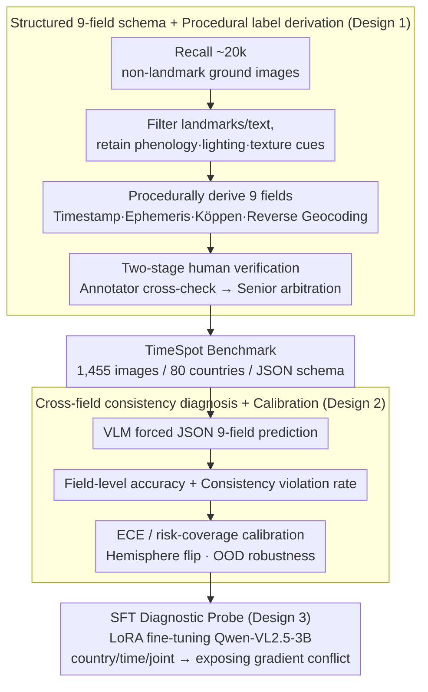

# TimeSpot: Benchmarking Geo-Temporal Understanding in Vision-Language Models in Real-World Settings

**Conference**: ICML 2026  
**arXiv**: [2603.06687](https://arxiv.org/abs/2603.06687)  
**Code**: https://TimeSpot-GT.github.io  
**Area**: Multi-modal VLM  
**Keywords**: Geo-temporal reasoning, VLM benchmark, Physical consistency, Calibration, SFT

## TL;DR
The authors construct the TimeSpot benchmark, covering 1,455 real-world ground-level images from 80 countries. It mandates VLMs to provide structured nine-field predictions covering both "When" (season, month, minute-level local time, day phase) and "Where" (continent, country, climate zone, environment type, coordinates). Results indicate that even the strongest model, Gemini-2.5-Flash-Thinking, achieves only 77.59% country accuracy and a median geographic distance error of 892.54 km, with minute-level time accuracy below 34%, revealing a significant lack of joint geo-temporal reasoning based on physical cues.

## Background & Motivation

**Background**: Recent years have seen significant progress in VLM-based image geolocalization. Mainstream approaches include cross-view retrieval (VIGOR, OpenStreetView-5M), unified embedding (GeoCLIP), and chain-of-thought enhanced benchmarks like LLMGeo or IMAGEO-Bench. These works typically model the task as spatial retrieval from "Image → Coordinates."

**Limitations of Prior Work**: Existing benchmarks evaluate "Where" almost exclusively, reporting either retrieval rank or coordinate error. The "When" aspect is largely ignored; models are not required to predict season, month, local time, or day phase, nor are they constrained by cross-field consistency (e.g., "no snow in July in the Northern Hemisphere"). Consequently, high spatial accuracy can coexist with physically impossible outputs.

**Key Challenge**: Real-world deployment (disaster response, traffic planning, embodied navigation, world models) requires models to provide *verifiable* spatio-temporal predictions while ensuring internal consistency. However, current VLMs lack explicit temporal physical supervision in training objectives and evaluation protocols, causing them to rely on coarse-grained memorization of surface semantics (landmarks, text) rather than long-tail physical cues like solar geometry and vegetation phenology.

**Goal**: (i) Construct a non-landmark-oriented benchmark that forces VLMs to jointly predict nine spatio-temporal fields with machine-auditable consistency; (ii) systematically evaluate the limits of current open-source, closed-source, and reasoning-enhanced VLMs; (iii) examine whether explicit supervision can bridge this gap via SFT.

**Key Insight**: Utilize "non-landmark ground-level photos + procedurally derived labels + human secondary verification" as the data backbone. Procedural labels derive solar elevation, Köppen climate, month, and season from timestamps and coordinates, naturally ensuring physical consistency. Humans act as auditors only in boundary cases. This approach ensures scalability while providing ground truth with verifiable semantics.

**Core Idea**: Redefine "When and Where" as a *constrained structured prediction* problem and treat cross-field consistency as a first-class evaluation metric to expose systematic failures in physical grounding.

## Method

### Overall Architecture
TimeSpot maps each image $x$ to structured labels $y=(y^{\mathrm{temp}}, y^{\mathrm{geo}})$, where $y^{\mathrm{temp}}=(s, m, \tau, \phi)$ represents season, month, local time HH:MM, and day phase, while $y^{\mathrm{geo}}=(C, \kappa, z, e, (\lambda,\varphi))$ represents continent, country, climate zone, environment type, and coordinates. Dataset construction follows four steps: (1) Recalling ~20,000 candidate ground-level images from the web and author-captured photos; (2) filtering samples dominated by landmarks and text to retain fine-grained physical cues (phenology, lighting, textures); (3) *procedurally* deriving nine fields from EXIF and geographic coordinates; (4) two-stage human verification involving 3 primary annotators and 2 senior auditors (~600 hours). The final product includes 1,455 images covering 80 countries stored in a unified JSON schema. During evaluation, VLMs are forced to output nine-field JSON. In addition to field-level accuracy, audits for cross-field consistency (month-season-hemisphere alignment, day phase-time-longitude compatibility, climate-coordinate rationality) are performed, supplemented by ECE/risk-coverage calibration and hemisphere-flip/OOD robustness tests. Finally, LoRA SFT is used as a diagnostic probe on Qwen-VL2.5-3B to investigate whether explicit supervision can rectify physical grounding issues.

### Key Designs

**1. Structured nine-field schema + Procedural label derivation: Grounding GT in physical formulas rather than crowdsourced guesses**  
Retrieval-based benchmarks suffer when ground truth lacks cross-field semantics—if a model hits top-k, it "wins," even if a "snowy scene in July" is physically contradictory. TimeSpot decomposes "When and Where" into 9 fields that are scored independently but must remain mutually consistent. GT is derived via deterministic physics: Month from EXIF; Season using meteorological definitions with hemisphere correction (June-August is summer in the North, winter in the South); Day phase by comparing solar elevation $\theta_\odot$ with civil/nautical/astronomical thresholds (e.g., $\theta_\odot < -6^\circ$ for civil twilight); Local time from timezone and ephemeris; Climate zone via Köppen-Geiger lookup from $(\lambda, \varphi)$; Continent/Country/Coordinates via reverse geocoding.

**2. Cross-field consistency diagnostics + Calibration metrics: Isolating failures that are "seemingly accurate but physically contradictory"**  
High field-level accuracy does not imply self-consistent output. TimeSpot defines a set of consistency violation rates: month-season inconsistency (predicted month not belonging to predicted season for the predicted hemisphere), day phase-time misalignment ($|\Delta t| > 1\text{h}$), and continent-country inconsistency. Expected Calibration Error $\mathrm{ECE}=\sum_b \frac{|B_b|}{N}|\mathrm{acc}(B_b)-\mathrm{conf}(B_b)|$ and risk-coverage curves measure confidence reliability, while robustness is tested via hemisphere flips and hard OOD splits.

**3. SFT intervention experiments as diagnostic tools: Addressing whether explicit supervision bridges the physical grounding gap**  
Instead of leaderboard chasing, SFT serves as a probe. The authors perform country-only, time-only, and joint fine-tuning on Qwen-VL2.5-3B using LoRA. They observe the improvement of each task and its impact on others, interpreting training objectives as a gradient competition between "illumination-invariant features" (beneficial for countries) and "illumination-sensitive features" (beneficial for time).

### Loss & Training
The benchmark itself is for evaluation. The SFT diagnostic uses standard instruction-tuning cross-entropy loss with LoRA adapters on Qwen-VL2.5-3B-Instruct for 5 epochs. During evaluation, all models use temperature=0, outputs are forced into JSON, and normalized parsing is applied.

## Key Experimental Results

### Main Results
Evaluation covers 31 VLMs (closed-source, open-source ≤11B, open-source >11B, reasoning-enhanced) compared against human baselines (undergraduates and domain experts). Table 1 summarizes key metrics.

| Model | Country Acc↑ | MD (km)↓ | Season Acc↑ | Time ±1h Acc↑ | Time MAE↓ |
|------|----------|----------|----------|---------------|-----------|
| Gemini-2.5-Flash-Thinking | **77.59** | **892.54** | 51.13 | 22.19 | 4:03 |
| Gemini-2.5-Flash | 77.25 | 917.61 | 50.92 | 25.15 | 3:56 |
| GPT-5-mini | 68.27 | 1389.79 | 58.43 | 21.55 | 4:10 |
| GLM-4.5V-106B-MoE | 69.68 | 1280.87 | 57.55 | 30.51 | 4:09 |
| Qwen-VL2.5-7B | 73.96 | 4719.95 | 61.46 | 25.68 | 3:47 |
| GLM-4.1V-9B-Thinking | 68.34 | 1788.77 | 58.02 | **33.74** | 3:58 |
| o4-mini | 71.82 | 1359.96 | **65.81** | 23.91 | 4:04 |
| Human (Expert) | 67.89 | 1040.42 | 86.56 | 57.89 | **1:36** |
| Human (Undergrad) | 45.98 | 2800.49 | 68.89 | 41.92 | 2:41 |

### Ablation Study (Consistency Diagnostics)
Strong models still exhibit significant cross-field contradictions; "low violation ≠ high accuracy."

| Model | Phase-Time Misalign (>1h) ↓ | Month-Season Inconsistent ↓ | Country-MD>200 km Clash ↓ | MD>1000 km Ratio ↓ |
|------|------------------------|---------------|--------------------|--------------------|
| GPT-5-mini | 15.95% | 0.89% | 16.98% | 17.25% |
| InternVL3-78B | 11.82% | 0.62% | 27.42% | 37.73% |
| QwenVL-3B | 0.21% | 0.82% | 12.78% | **95.19%** |

### Key Findings
- Top VLMs outperform undergraduates in country accuracy, but minute-level time prediction lags behind experts by ~2.5 hours, indicating VLMs memorize *geographic stereotypes* rather than possessing a continuous 4D physical world model.
- Reasoning enhancement (thinking) consistently provides small gains, suggesting that multi-step explicit reasoning better integrates low-saliency lighting cues.
- Autumn classification failed across almost all models, reflecting that VLMs rely on strong color cues (greenery/snow) for seasons and lack grounding in phenological transitions.
- GPT-5-mini achieves 60.5% season accuracy from sun/shadow cues, yet time ±1h remains <25%, showing models treat lighting as a *semantic correlate* rather than a *physical inference input*.

## Highlights & Insights
- Reframing geolocalization as "structured prediction + consistency auditing" exposes "physical contradictions" in seemingly powerful VLMs—a paradigm transferable to any multi-variable joint reasoning task.
- The hybrid *procedural derivation + human auditing* approach ensures both scale and physical correctness for future verifiable benchmarks.
- Using SFT as a diagnostic tool clearly demonstrates gradient conflicts in single-task LoRA, providing motivation for "illumination-sensitive vs. invariant feature decoupling."
- The orthogonal nature of consistency and accuracy metrics (e.g., QwenVL-3B having the best phase-time consistency despite a 95% error rate for MD>1000 km) cautions researchers against being misled by single-dimension scores.

## Limitations & Future Work
- The scale of 1,455 images is relatively small; statistical stability for low-frequency regions relies on stratified sampling. Scaling to ≥10k images while maintaining auditing quality is a challenge.
- Evaluation relies on OpenRouter APIs (~$1,450 USD), making it sensitive to version drift and pricing of closed-source models.
- SFT experiments were limited to Qwen-VL2.5-3B; whether larger architectures (e.g., Qwen3-VL-235B) exhibit similar gradient conflicts remains unverified.
- Data sources (web/personal) result in oversampling of Europe/North America, with weak statistical estimates for Southern Hemisphere Summer (56 samples).

## Related Work & Insights
- Orthogonal to cross-view localization (VIGOR, GeoCLIP): While those optimize "Where" retrieval, this work focuses on "When" and "Cross-field consistency."
- Complementary to LLM-geolocation benchmarks (LLMGeo, IMAGEO-Bench) that introduce CoT and fairness but lack temporal fields.
- Different from Remote Sensing VQA (EarthVQA): Those emphasize aerial/satellite imagery and classification/segmentation, whereas TimeSpot emphasizes ground-level physical grounding.
- Implications for world models: "Soft constraints" like temperature, lighting, and phenology are essential priors. VLM pretraining should include solar geometry or Köppen climate heads as multi-task losses.

## Rating
- Novelty: TBD
- Experimental Thoroughness: TBD
- Writing Quality: TBD
- Value: TBD

<!-- RELATED:START -->

## Related Papers

- [\[ICLR 2026\] Can Vision-Language Models Answer Face to Face Questions in the Real-World?](../../ICLR2026/multimodal_vlm/can_vision-language_models_answer_face_to_face_questions_in_the_real-world.md)
- [\[ICLR 2026\] WorldSense: Evaluating Real-World Omnimodal Understanding for Multimodal LLMs](../../ICLR2026/multimodal_vlm/worldsense_evaluating_real-world_omnimodal_understanding_for_multimodal_llms.md)
- [\[ICML 2026\] Benchmarking and Enhancing VLM for Compressed Image Understanding](benchmarking_and_enhancing_vlm_for_compressed_image_understanding.md)
- [\[ICLR 2026\] Bongard-RWR+: Real-World Representations of Fine-Grained Concepts in Bongard Problems](../../ICLR2026/multimodal_vlm/bongard-rwr_real-world_representations_of_fine-grained_concepts_in_bongard_probl.md)
- [\[ICML 2026\] Immuno-VLM: Immunizing Large Vision-Language Models via Generative Semantic Antibodies for Open-World Trustworthiness](immuno-vlm_immunizing_large_vision-language_models_via_generative_semantic_antib.md)

<!-- RELATED:END -->
