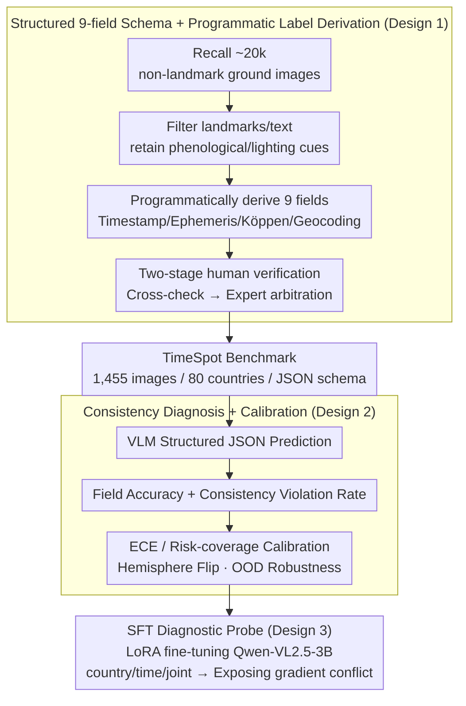

# TimeSpot: Benchmarking Geo-Temporal Understanding in Vision-Language Models in Real-World Settings

**Conference**: ICML 2026  
**arXiv**: [2603.06687](https://arxiv.org/abs/2603.06687)  
**Code**: https://TimeSpot-GT.github.io  
**Area**: Multimodal VLM  
**Keywords**: Geo-temporal Reasoning, VLM Benchmark, Physical Consistency, Calibration, SFT  

## TL;DR
The authors construct the TimeSpot benchmark, comprising 1,455 real-world ground-level images from 80 countries. It mandates structured 9-field predictions for "when" (season/month/minute-level local time/diurnal phase) and "where" (continent/country/climate zone/environment/coordinates). Results show that even Gemini-2.5-Flash-Thinking achieves only 77.59% country accuracy and a median error of 892.54 km, with minute-level time accuracy below 34%, indicating a systematic lack of joint geo-temporal reasoning based on physical cues in VLMs.

## Background & Motivation

**Background**: Recent VLMs have made significant progress in image geolocation. Prevailing approaches include cross-view retrieval (VIGOR, OpenStreetView-5M), unified embeddings (GeoCLIP), and reasoning-enhanced frameworks like LLMGeo or IMAGEO-Bench. These works primarily model the task as spatial retrieval: "image $\rightarrow$ coordinates".

**Limitations of Prior Work**: Existing benchmarks focus almost exclusively on "where", reporting retrieval rank or coordinate error. "When" is neglected; models are not required to predict season, month, or local time, nor are they constrained by cross-field consistency (e.g., "no snow in July in the Northern Hemisphere"). Consequently, high spatial accuracy can coexist with physically impossible outputs.

**Key Challenge**: Real-world deployment (disaster response, traffic planning, embodied navigation, world models) requires *verifiable* spatiotemporal predictions with internal consistency. Current VLMs lack explicit temporal-physical supervision in training and evaluation, leading models to rely on surface semantics (landmarks, text) rather than regressing from physical cues like solar geometry and vegetation phenology.

**Goal**: (i) Construct a non-landmark-oriented benchmark mandating joint 9-field spatiotemporal prediction with machine-auditable consistency; (ii) Systematically evaluate the limits of open-source, proprietary, and reasoning-enhanced VLMs; (iii) Test whether explicit supervision can bridge this gap via SFT.

**Key Insight**: Utilize "non-landmark ground photos + programmatically derived labels + human verification" as the data skeleton. Programmatic labels derive solar elevation, Köppen climate, and season from timestamps and coordinates, ensuring physical consistency by design.

**Core Idea**: Redefine "when and where" as a *constrained structured prediction* problem, treating cross-field consistency as a first-class evaluation metric to expose failures in physical grounding.

## Method

### Overall Architecture
TimeSpot maps each image $x$ to a structured label $y=(y^{\mathrm{temp}}, y^{\mathrm{geo}})$, where $y^{\mathrm{temp}}=(s, m, \tau, \phi)$ denotes season, month, local time (HH:MM), and diurnal phase; and $y^{\mathrm{geo}}=(C, \kappa, z, e, (\lambda,\varphi))$ denotes continent, country, climate zone, environment type, and coordinates. Dataset construction involves: (1) Recalling ~20,000 candidate images; (2) Filtering landmarks/text to retain phenological/lighting/material cues; (3) *Programmatically* deriving 9 fields from EXIF and coordinates; (4) Two-stage human verification (~600 hours). The evaluation enforces JSON output, auditing field accuracy alongside cross-field alignment (e.g., month-season-hemisphere). LoRA SFT on Qwen-VL2.5-3B serves as a diagnostic probe to test if supervision compensates for grounding deficiencies.

### Key Designs

**1. Structured 9-field Schema + Programmatic Derivation: Ground Truth from Physics**
Retrieval benchmarks often lack cross-field semantics. TimeSpot decomposes "when and where" into 9 interdependent fields. Ground truth (GT) is derived via deterministic physics: month from EXIF; season via meteorological definitions with hemisphere correction; diurnal phase by comparing solar elevation $\theta_\odot$ against twilight thresholds (e.g., $\theta_\odot < -6^\circ$ for civil twilight); and climate zones via Köppen-Geiger lookups. This ensures "physically impossible" outputs can be flagged automatically.

**2. Cross-field Consistency Diagnostics & Calibration: Exposing "Accurate but Impossible" Failures**
Beyond field-level accuracy, TimeSpot introduces consistency violation rates: month-season mismatch (given the predicted hemisphere), phase-time misalignment ($|\Delta t| > 1\text{h}$), and continent-country mismatch. It employs Expected Calibration Error $\mathrm{ECE}=\sum_b \frac{|B_b|}{N}|\mathrm{acc}(B_b)-\mathrm{conf}(B_b)|$ and risk-coverage curves to assess confidence reliability.

**3. SFT Intervention as a Diagnostic Tool**
The authors apply LoRA SFT on Qwen-VL2.5-3B for country-only, time-only, and joint tasks. This observes how individual task improvements affect others, identifying gradient competition between "lighting-invariant features" (beneficial for countries) and "lighting-sensitive features" (beneficial for time).

### Loss & Training
The benchmark is for evaluation. SFT diagnostics use standard instruction-tuning cross-entropy loss with LoRA adapters on Qwen-VL2.5-3B-Instruct for 5 epochs. During inference, models use temperature=0 with forced JSON formatting and normalized parsing.

## Key Experimental Results

### Main Results
Evaluation of 31 VLMs against undergraduate and expert human baselines.

| Model | Country Acc↑ | MD (km)↓ | Season Acc↑ | Time ±1h Acc↑ | Time MAE↓ |
|------|----------|----------|----------|---------------|-----------|
| Gemini-2.5-Flash-Thinking | **77.59** | **892.54** | 51.13 | 22.19 | 4:03 |
| Gemini-2.5-Flash | 77.25 | 917.61 | 50.92 | 25.15 | 3:56 |
| GPT-5-mini | 68.27 | 1389.79 | 58.43 | 21.55 | 4:10 |
| GLM-4.5V-106B-MoE | 69.68 | 1280.87 | 57.55 | 30.51 | 4:09 |
| Qwen-VL2.5-7B | 73.96 | 4719.95 | 61.46 | 25.68 | 3:47 |
| GLM-4.1V-9B-Thinking | 68.34 | 1788.77 | 58.02 | **33.74** | 3:58 |
| o4-mini | 71.82 | 1359.96 | **65.81** | 23.91 | 4:04 |
| Human (Expert) | 67.89 | 1040.42 | 86.56 | 57.89 | **1:36** |
| Human (Undergrad) | 45.98 | 2800.49 | 68.89 | 41.92 | 2:41 |

### Consistency Diagnostics
Even SOTA models exhibit physical contradictions; "low violation $\neq$ high accuracy".

| Model | Phase-Time Mismatch (>1h) ↓ | Month-Season Inconsistent ↓ | Country-MD>200 km Conflict ↓ | MD>1000 km Ratio ↓ |
|------|------------------------|---------------|--------------------|--------------------|
| GPT-5-mini | 15.95% | 0.89% | 16.98% | 17.25% |
| InternVL3-78B | 11.82% | 0.62% | 27.42% | 37.73% |
| QwenVL-3B | 0.21% | 0.82% | 12.78% | **95.19%** |

### Key Findings
- Top VLMs exceed undergraduates in country accuracy but lag experts in time prediction by ~2.5 hours, indicating they memorize *geographical stereotypes* rather than possessing continuous 4D world models.
- "Thinking" mechanisms consistently provide gains (Gemini-2.5-Flash $\rightarrow$ Flash-Thinking: country +0.34%, MD −25 km).
- Models struggle with autumn, relying on strong color cues (green/snow) rather than subtle phenological grounding.
- GPT-5-mini handles sun/shadow cues for seasonal accuracy (60.5%) but fails time prediction (±1h < 25%), treating lighting as semantic context rather than physical input.

## Highlights & Insights
- Reframing geolocation as structured prediction with consistency auditing exposes "physical contradictions" that accuracy metrics hide.
- Programmatic derivation combined with human auditing provides a scalable paradigm for verifiable benchmarks.
- SFT as a diagnostic tool reveals gradient conflicts in shared parameters, suggesting a need for lighting-sensitive vs. lighting-invariant feature decoupling.

## Limitations & Future Work
- The 1,455-image scale is relatively small; scaling to $\geq$ 10k while maintaining auditing quality is a challenge.
- Dependency on proprietary APIs (OpenRouter) complicates reproducibility due to version drift and cost.
- SFT experiments were limited to Qwen-VL2.5-3B; verification on larger architectures is required.
- Sampling bias persists in some regions (e.g., Southern Hemisphere Summer has only 56 samples).

## Related Work & Insights
- Complements cross-view localization (VIGOR, GeoCLIP) by focusing on "when" and internal consistency once a spatial prior is established.
- Extends LLM-geolocation benchmarks (LLMGeo, IMAGEO-Bench) by introducing the temporal dimension and a reusable 9-field schema.
- Unlike remote sensing VQA, TimeSpot emphasizes ground-level physical grounding.
- Suggests that 4D world models should incorporate solar geometry and climate heads as auxiliary losses in VLM pretraining rather than relying solely on image-text alignment.

## Rating
- Novelty: TBD
- Experimental Thoroughness: TBD
- Writing Quality: TBD
- Value: TBD

<!-- RELATED:START -->

## Related Papers

- [\[ICLR 2026\] GTR-Bench: Evaluating Geo-Temporal Reasoning in Vision-Language Models](../../ICLR2026/multimodal_vlm/gtr-bench_evaluating_geo-temporal_reasoning_in_vision-language_mod.md)
- [\[ICLR 2026\] Can Vision-Language Models Answer Face to Face Questions in the Real-World?](../../ICLR2026/multimodal_vlm/can_vision-language_models_answer_face_to_face_questions_in_the_real-world.md)
- [\[ICML 2026\] Benchmarking and Enhancing VLM for Compressed Image Understanding](benchmarking_and_enhancing_vlm_for_compressed_image_understanding.md)
- [\[ICML 2026\] Immuno-VLM: Immunizing Large Vision-Language Models via Generative Semantic Antibodies for Open-World Trustworthiness](immuno-vlm_immunizing_large_vision-language_models_via_generative_semantic_antib.md)
- [\[CVPR 2026\] World in a Frame: Understanding Culture Mixing as a New Challenge for Vision-Language Models](../../CVPR2026/multimodal_vlm/world_in_a_frame_understanding_culture_mixing_as_a_new_challenge_for_vision-lang.md)

<!-- RELATED:END -->
