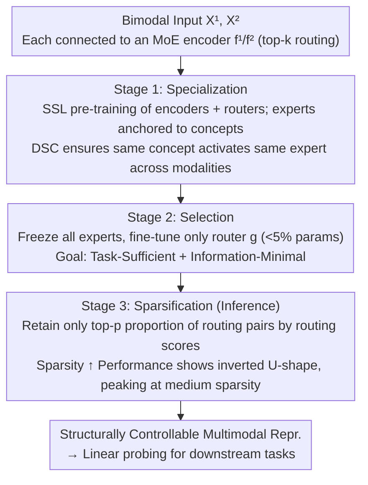

# Toward Structural Multimodal Representations: Specialization, Selection, and Sparsification via Mixture-of-Experts

**Conference**: ICML 2026  
**arXiv**: [2605.03348](https://arxiv.org/abs/2605.03348)  
**Code**: None  
**Area**: Multimodal VLM / MoE / Representation Learning  
**Keywords**: Multimodal representation, MoE, Task-sufficiency, Information-minimality, Inference-time pruning

## TL;DR
Ours proposes the S3 framework, which decomposes multimodal representations into concept-level experts (Specialization) using MoE, activates relevant experts via task-based routing (Selection), and prunes low-contribution paths by routing scores during inference (Sparsification). Across four MultiBench benchmarks, it reveals an inverted U-curve where "performance peaks at intermediate sparsity," presenting a third paradigm for multimodal representation beyond contrastive learning and InfoMax.

## Background & Motivation

**Background**: Two mainstream paradigms dominate multimodal representation learning: contrastive learning (e.g., CLIP, AudioCLIP) maps paired modalities to a shared space to maximize cross-modal mutual information; InfoMax-style methods (FOCAL, DisentangledSSL, JointOpt) aim to preserve both shared and modality-specific information. Both target learning a "monolithic fixed embedding."

**Limitations of Prior Work**: Contrastive learning has a theoretical upper bound—the mutual information of its optimal solution is only related to the entropy $H(X_S)$ of the shared factors $X_S$ (Proposition 2.3). Once a task depends on modality-specific factors $X_U^m$, contrastive representations cannot reach Bayes optimality. Although InfoMax can achieve task-sufficiency, it simultaneously maximizes $I(Z^m;X^m|Y)$, retaining substantial task-irrelevant information. This violates the InfoMin principle and hampers downstream classification performance.

**Key Challenge**: A single monolithic embedding must simultaneously handle "alignment," "preserving differences," and "adapting to task variations," which are mutually conflicting requirements. While the combination of factors relevant to samples and tasks is highly variable, fixed representations cannot be selected on demand.

**Goal**: To construct multimodal representations that are both **Task-Sufficient** ($I(Z_Y^{1*},Z_Y^{2*};Y)=I(X^1,X^2;Y)$) and **Information-Minimal** ($I(Z_Y^{1*},Z_Y^{2*};X^1,X^2|Y)=0$), while being adjustable and controllable at the sample and task levels.

**Key Insight**: Shifting focus from "fine-tuning objective functions" to "incorporating structural inductive biases"—explicitly decomposing the representation space into a set of conceptual subspaces $\mathcal{Z}=\bigoplus_{c\in\mathcal{C}}\mathcal{Z}_c$, where each subspace is implemented by an MoE expert. The same latent concept across different modalities should activate the same experts (proposing Distributional Semantic Coherence), achieving concept-level rather than instance-level cross-modal alignment.

**Core Idea**: Reinterpreting MoE as a tool for semantic specialization (rather than mere parameter scaling). A three-stage pipeline (Specialization → Selection → Sparsification) is utilized to address "how to construct semantic expert spaces," "how to activate relevant experts per task," and "how to prune redundant paths during inference," achieving structurally controllable Task-Sufficient + Information-Minimal multimodal representations.

## Method

### Overall Architecture
MoE encoders $f^1, f^2$ are used for the two modalities respectively. Each MoE layer contains $N_{\mathrm{expert}}=\chi\cdot\rho$ experts (granularity $\chi$ + expansion ratio $\rho$). The router $g$ uses top-$k$ softmax to determine which experts each token traverses: $g(\mathbf{x})=\mathrm{TOP}_k(\mathrm{softmax}(\mathbf{W}_g\mathbf{x}))$, with output $\mathrm{MoE}(\mathbf{x})=\sum_i g(\mathbf{x})_i e_i(\mathbf{x})$. The three stages are connected in series: Stage 1 involves SSL pre-training of the encoder and router; Stage 2 fine-tunes only the router; Stage 3 involves inference-time pruning.

### Key Designs

**1. Specialization: Pre-training the representation space into a set of "conceptual experts" and aligning modalities at the expert level.**

A monolithic embedding conflicts when attempting to align, preserve differences, and adapt to tasks simultaneously. Ours explicitly splits the representation space into conceptual subspaces via MoE, anchoring each expert to a semantic concept. The training objective is $\max_{f^1,f^2}[I(Z^1;X^1)+I(Z^2;X^2)]$ subject to DSC constraints (Proposition 3.4: for all shareable concepts $c$, $p(\pi_c(Z^1)|c\in C^1)=p(\pi_c(Z^2)|c\in C^2)$). Mutual information is estimated using the InfoNCE lower bound. The loss consists of three parts: intra-modal $\mathcal{L}_{\mathrm{rep}}=\tfrac12(\mathcal{L}_{\mathrm{InfoNCE}}^{[1\to1]}+\mathcal{L}_{\mathrm{InfoNCE}}^{[2\to2]})$ for diversity, cross-modal $\mathcal{L}_{\mathrm{dsc}}=\tfrac12(\mathcal{L}_{\mathrm{InfoNCE}}^{[1\to2]}+\mathcal{L}_{\mathrm{InfoNCE}}^{[2\to1]})$ to implicitly align concept activation patterns, and auxiliary routing loss $\mathcal{L}_{\mathrm{aux}}$ to prevent expert collapse and encourage balanced, confident activations. While InfoNCE is instance-level, its contrastive signal implicitly shapes expert activation distributions, clustering synonymous concepts into the same expert. Explicit concept decomposition + DSC ensures alignment occurs at the "expert level" rather than "feature vector level," allowing modality-specific parts to naturally traverse modality-exclusive experts.

**2. Selection: Freezing all experts and fine-tuning only the router for task adaptation.**

Conventional fine-tuning modifies the encoder, destroying the semantic expert structure learned in Stage 1. Ours adjusts only the router $g$, which accounts for a minimal fraction of total parameters (<5%), aiming for $\max_g[I(Z_Y^1,Z_Y^2;Y)-\alpha\cdot I(Z_Y^1,Z_Y^2;X^1,X^2|Y)]$ to satisfy both Task-Sufficiency and Information-Minimality. The first term (sufficiency) is approximated using SupCon loss, which draws samples with the same label closer together; Proposition E.2 proves it is a valid lower bound for task-conditioned MI: $\mathcal{L}_{\mathrm{SupCon}}^{[m\to\bar m]}=-\mathbb{E}_{i,s\in\mathcal{S}_{y_i}}\log\frac{\exp(\langle z_i^m,z_s^{\bar m}\rangle/\tau)}{\sum_j\exp(\langle z_i^m,z_j^{\bar m}\rangle/\tau)}$. The second term (minimality) $I(Z;X|Y)=\mathbb{E}_{p(x,y)}[D_{KL}(p(z|x)\|p(z|y))]$ is approximated using vMF when features reside on a sphere after InfoNCE, simplifying to a dot-product compactness loss $\mathcal{L}_{\mathrm{Comp}}^{[m\to\bar m]}=-\mathbb{E}[\langle\mu_x^m,\hat\mu_y^{\bar m}\rangle]$, pulling samples toward the spherical mean of their class. This strictly decouples "what is learned" (fixed semantic basis) and "what is used for the task" (task-dependent selector), yielding an effect similar to prompt tuning but with more structured objectives.

**3. Sparsification: Pruning via routing scores during inference, treating information minimization as a "knob."**

After Stage 2 training, router scores represent an estimate of "input-expert contribution to the task." Standard MoE uses a fixed top-$k$ regardless of actual utility, potentially activating unnecessary experts. Without further training, Ours sorts top-$k$ routing pairs within each batch by score, retaining only the top-$p$ proportion and pruning the rest. This pruning process exhibits an inverted U-curve: as $p$ decreases from 1, irrelevant paths are pruned first (performance increases or stabilizes); reaching a sweet spot provides a minimal sufficient representation (peak performance); further reduction in $p$ begins to prune critical paths (performance decreases). Since residual connections remain, pruning a single routing path does not sever the information flow. This extends "information minimization" from training to inference, acting as a real-time knob for the efficiency-accuracy tradeoff and providing diagnostic visualization of how many task-relevant routes actually exist.

### Loss & Training
- Stage 1: $\mathcal{L}_{\mathrm{special}}=\lambda_{\mathrm{rep}}\mathcal{L}_{\mathrm{rep}}+\lambda_{\mathrm{dsc}}\mathcal{L}_{\mathrm{dsc}}+\lambda_{\mathrm{aux}}\mathcal{L}_{\mathrm{aux}}$ (including expert balancing regularization).
- Stage 2: $\mathcal{L}_{\mathrm{select}}=\lambda_{\mathrm{suff}}\mathcal{L}_{\mathrm{suff}}+\lambda_{\mathrm{min}}\mathcal{L}_{\mathrm{min}}$ (excluding balancing regularization, as the goal is unbalanced activation of task-relevant experts).
- Fair Comparison: Setting $k=\chi$ ensures the active expert parameters per token are equivalent to a dense FFN (not relying on total parameter count).

## Key Experimental Results

### Main Results
Linear probing accuracy on four MultiBench benchmarks (MOSEI / MOSI / UR-FUNNY / MUStARD). The table below shows the best results for S3 under different granularities $\chi$ compared to baselines with equivalent active parameters on MOSEI (data extracted from original MOSEI detailed tables at best $p$):

| Dataset | Method | Best Acc (%) | Remarks |
| :--- | :--- | :--- | :--- |
| MOSEI | CLIP (Contrastive) | ~74.5 | shared-only |
| MOSEI | FactorCL / DisentSSL (InfoMax-based) | 74-76 | Preserves all info |
| MOSEI | **S3 (χ=8, sweet spot)** | **77.95** | $p\approx 0.3$ |
| MOSI | InfoMax Baseline | ~63 | |
| MOSI | **S3 (χ=8)** | **66.13** | $p\approx 0.6$ |
| UR-FUNNY | InfoMax Baseline | ~63 | |
| UR-FUNNY | **S3 (χ=4)** | **64.74** | $p\approx 0.4$ |

Ours consistently outperforms contrastive and InfoMax baselines across four benchmarks, with the peak occurring at intermediate sparsity rather than $p=1$.

### Ablation Study

| Configuration | MOSEI Accuracy (%) | Trend Shape |
| :--- | :--- | :--- |
| χ=2 (Coarse) | 77.25 (Peak at $p=0.1$) | Delayed U-shape—routing ambiguity causes early drops |
| χ=4 (Medium) | 77.18 (Peak at $p=0.1$) | Smooth transition |
| χ=8 (Fine) | **77.95** (Peak at $p=0.3$) | Classic inverted U-shape |
| χ=8, p=1.0 (No pruning) | 75.78 | 2 points lower than pruning peak |
| Specialization only (Skip Selection) | < 75 | Router not adapted to task |

### Key Findings
- **Granularity determines pruning curve shape**: At low granularity ($\chi=2$), each expert encapsulates multiple concepts, leading to routing ambiguity where early pruning harms performance—improvements only appear with aggressive pruning to $p=0.1$ (delayed U-shape). At high granularity ($\chi=8$), experts are specialized to single concepts with high routing confidence, and pruning benefits performance immediately from $p=0.9$, with a sweet spot around $p=0.3$. This pattern is consistent across all benchmarks.
- **Inverted U-shape as empirical proof of InfoMin**: Peak performance at intermediate sparsity strongly supports the claim that task-irrelevant information hinders downstream tasks—providing direct experimental validation of the InfoMin principle in multimodal scenarios.
- **Router accounts for < 5% of total parameters**, yet sustains task adaptation. This suggests that once a structured latent space is established, "which part to use" is more critical than "what to learn."
- **Robustness across batch sizes**: The trend remains invariant across batch sizes from 64 to 512, indicating that pruning behavior is determined by structural properties rather than training artifacts.

## Highlights & Insights
- **Paradigm shift from "loss tuning" to "structural engineering"**: The authors explicitly note that the failure of contrastive learning and InfoMax is not merely a choice of loss, but a lack of structural inductive bias. This shift from "objective-centric" to "structure-centric" views is instructive for representation learning and applicable to areas beyond SSL (e.g., few-shot, transfer learning).
- **Semantic interpretation of MoE**: Reinterpreting MoE as a "conceptual expert" tool rather than a "parameter scaling tool" is a novel, theoretically-supported perspective. Combined with DSC, it provides a new mathematical language for cross-modal alignment ("expert activation distribution alignment" replacing "feature alignment").
- **Inference-time pruning knob**: Turning Information-Minimality into a zero-training inference-time hyperparameter allows the sweet spot to be read directly from the inverted U-curve. This is highly valuable for engineering—permitting real-time efficiency/accuracy tradeoffs without retraining.
- **Theoretical + Empirical loop**: Ours proves contrastive learning is strictly sub-optimal when tasks depend on modality-exclusive factors (Prop 2.5), characterizes limitations via task-irrelevant information decomposition (Eq 12) under InfoMax, and uses the inverted U-curve in S3 to echo theoretical predictions. The logical chain is exceptionally complete.

## Limitations & Future Work
- Experiments were conducted on relatively small-scale MultiBench tasks (mostly text-audio/vision vectors); the stability, training cost, and convergence in large-scale vision-language (COCO/LAION) or multi-modal scenarios (>2 modalities) remain unknown.
- DSC assumes "shareable concepts activate the same expert across modalities," but multimodal representation spaces might not naturally align this way in practice—can "timbre" in audio and "texture" in vision truly map to the same expert? Lack of interpretability analysis or visual evidence.
- The vMF approximation in Stage 2 requires features to lie on a unit sphere (standard after InfoNCE), but the KL derivation fails if the backbone uses non-normalized outputs.
- The sweet spot $p$ for Sparsification must currently be swept on a validation set; there is no theoretical guidance or automated method for determining $p$ across different tasks/data scales.
- While the fair comparison with FFNs of equal active parameters is logical, the total parameters of MoE still imply higher storage and loading costs, limiting deployment on edge devices.

## Related Work & Insights
- **vs CLIP/ImageBind (Contrastive Learning)**: CLIP compresses all information into a monolithic embedding, theoretically bounded by $H(X_S)$; S3 uses expert subspaces to carry shared and specific information separately, theoretically achieving task-sufficiency.
- **vs FOCAL/JointOpt/DisentangledSSL (InfoMax)**: These methods explicitly split $Z_S+Z_U^m$ but remain fixed vectors incapable of task-based selection; S3 delegates "selection" to a trainable router and allows further inference-time pruning.
- **vs FactorCL (Enhanced Contrastive)**: FactorCL uses augmentation to indirectly expand shared factors but is still limited by the nature of contrastive objectives; S3 escapes the contrastive vs. InfoMax dichotomy via structure.
- **vs Prompt Tuning / LoRA**: While all involve "lightweight fine-tuning for downstream adaptation," prompt/LoRA tunes backbone inputs or low-rank increments. S3 tunes the router—the semantic meaning of selecting experts is closer to a "controller," requiring no extra parameters beyond the inherent MoE router.
- **vs Switch Transformer/MoE**: Conventional MoE focuses on computational scaling and load balancing. S3 reverses this, using MoE to represent the semantic structure of "concept decomposition," pointing MoE research toward a new direction: "semantic specialization."

## Rating
- Novelty: ⭐⭐⭐⭐⭐ The triad of "structural inductive bias + MoE conceptual experts + inference-time pruning knob" is highly cohesive and provides a clear contrast to existing paradigms; DSC formalization is also a significant contribution.
- Experimental Thoroughness: ⭐⭐⭐⭐ Four benchmarks + three granularities + three batch sizes + full pruning curves provide clear structural conclusions; however, the task scale is small and lacks large-scale vision-language validation.
- Writing Quality: ⭐⭐⭐⭐⭐ Theoretical derivations (Props 2.3/2.5, Defs 3.1-3.4) are clean and self-consistent, with every theoretical proposition echoed by experimental results. The logic chain is very precise.
- Value: ⭐⭐⭐⭐ Points toward a third way for multimodal representation learning; the inference-time pruning knob has high engineering value, though deployment costs and large-scale scalability require further verification.

<!-- RELATED:START -->

## Related Papers

- [\[ICML 2026\] SAME: Stabilized Mixture-of-Experts for Multimodal Continual Instruction Tuning](same_stabilized_mixture-of-experts_for_multimodal_continual_instruction_tuning.md)
- [\[ICLR 2026\] Capacity-Aware Inference: Mitigating the Straggler Effect in Mixture of Experts](../../ICLR2026/multimodal_vlm/capacity-aware_inference_mitigating_the_straggler_effect_in_mixture_of_experts.md)
- [\[AAAI 2026\] MCMoE: Completing Missing Modalities with Mixture of Experts for Incomplete Multimodal Action Quality Assessment](../../AAAI2026/multimodal_vlm/mcmoe_completing_missing_modalities_with_mixture_of_experts_for_incomplete_multi.md)
- [\[ICML 2025\] Dynamic Mixture of Curriculum LoRA Experts for Continual Multimodal Instruction Tuning](../../ICML2025/multimodal_vlm/dynamic_mixture_of_curriculum_lora_experts_for_continual_multimodal_instruction_.md)
- [\[ICCV 2025\] A Quality-Guided Mixture of Score-Fusion Experts Framework for Human Recognition](../../ICCV2025/multimodal_vlm/a_qualityguided_mixture_of_scorefusion_experts_framework_for.md)

<!-- RELATED:END -->
